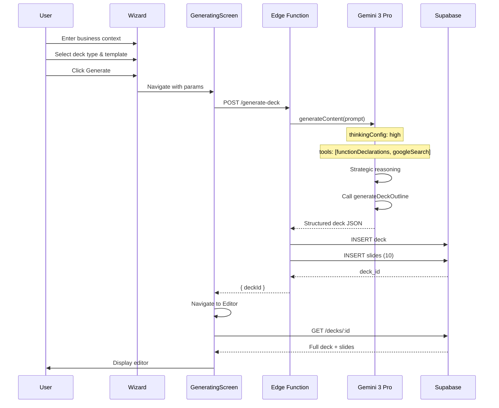
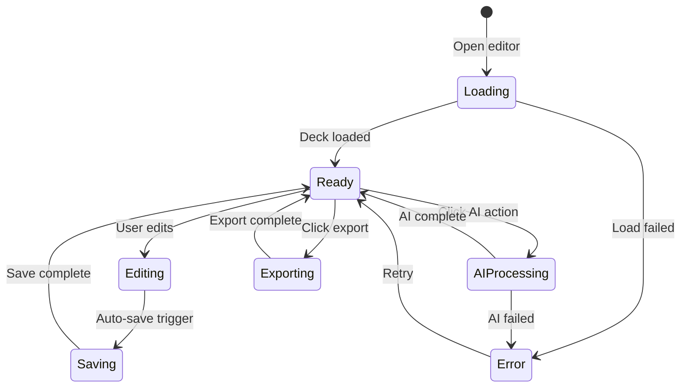
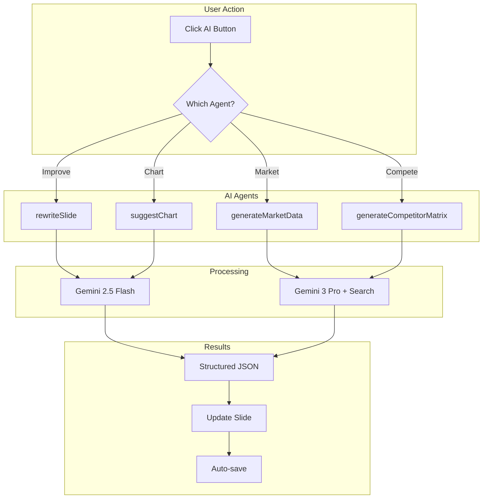
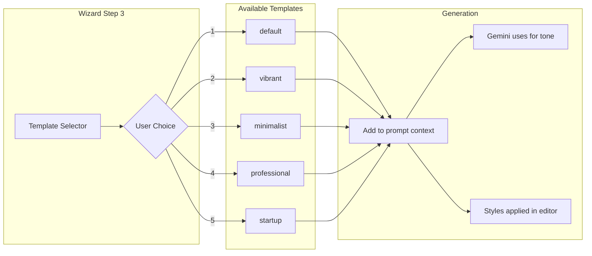
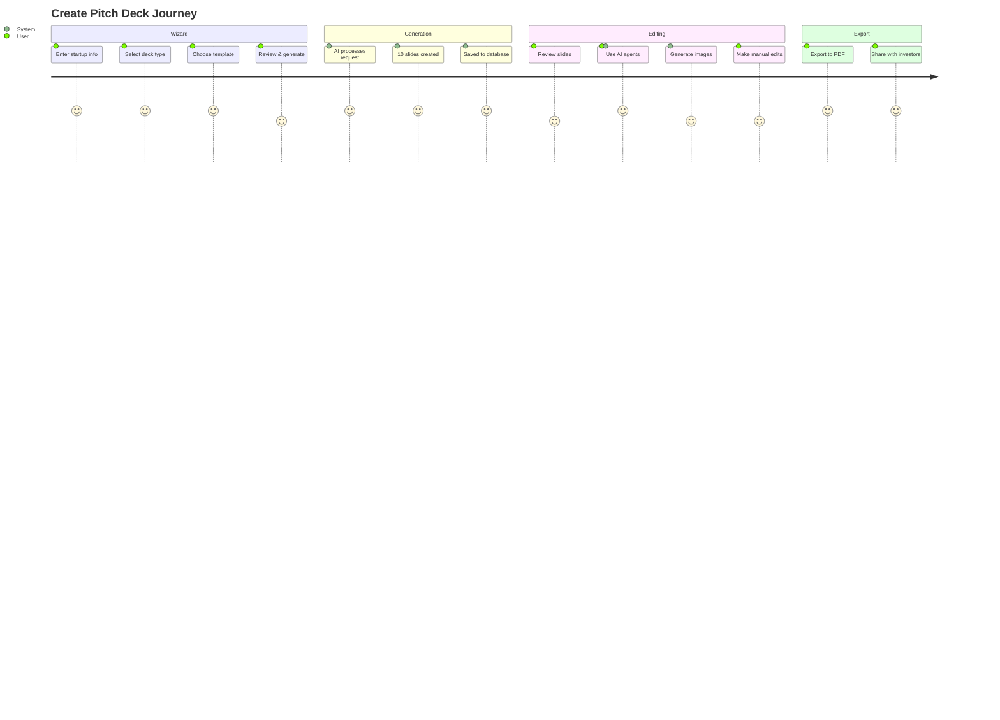

# Pitch Deck Engine - Master Implementation Plan

**Version:** 2.0  
**Last Updated:** 2025-12-06  
**Status:** 🟡 In Progress (95% Complete)  
**Sprint:** S0 (Core Complete)

---

## 📋 Table of Contents

1. [System Overview](#system-overview)
2. [Feature Status Matrix](#feature-status-matrix)
3. [Gemini 3 AI Integration](#gemini-3-ai-integration)
4. [System Architecture](#system-architecture)
5. [Slide-Level AI Agents](#slide-level-ai-agents)
6. [Template System](#template-system)
7. [Database Schema](#database-schema)
8. [Edge Functions](#edge-functions)
9. [Frontend Components](#frontend-components)
10. [Process Flows](#process-flows)
11. [Multi-Step Prompts](#multi-step-prompts)
12. [Success Criteria](#success-criteria)
13. [Mermaid Diagrams](#mermaid-diagrams)
14. [Troubleshooting Guide](#troubleshooting-guide)
15. [Implementation Checklist](#implementation-checklist)

---

## System Overview

### Goal

An AI-powered pitch deck generation system that creates investor-ready presentations in minutes, using Gemini 3 Pro for strategic content and Imagen 4 for visuals.

### Core Value Proposition

| Problem | Solution |
|---------|----------|
| Creating decks takes 2-4 weeks | Generate in < 2 minutes |
| Generic content doesn't resonate | AI tailors to your industry/stage |
| Visuals are stock or amateur | Imagen 4 generates custom images |
| Inconsistent design quality | 5 premium templates |

### System Components

```
┌─────────────────────────────────────────────────────────────────────┐
│                    PITCH DECK ENGINE                                 │
├─────────────────────────────────────────────────────────────────────┤
│                                                                      │
│  ┌─────────────┐    ┌─────────────┐    ┌─────────────┐              │
│  │   WIZARD    │ ──▶│ GENERATING  │ ──▶│   EDITOR    │              │
│  │ (5 Steps)   │    │   SCREEN    │    │ (Full Edit) │              │
│  └─────────────┘    └─────────────┘    └─────────────┘              │
│                            │                                         │
│                            ▼                                         │
│  ┌──────────────────────────────────────────────────────────────┐   │
│  │                    EDGE FUNCTIONS                             │   │
│  │                                                               │   │
│  │  ┌─────────────┐ ┌─────────────┐ ┌─────────────┐             │   │
│  │  │ generate-   │ │  slide-ai   │ │  image-ai   │             │   │
│  │  │    deck     │ │  (agents)   │ │ (imagen 4)  │             │   │
│  │  └──────┬──────┘ └──────┬──────┘ └──────┬──────┘             │   │
│  │         │               │               │                     │   │
│  │         └───────────────┼───────────────┘                     │   │
│  │                         │                                      │   │
│  │                         ▼                                      │   │
│  │  ┌──────────────────────────────────────────────────────┐    │   │
│  │  │                  GEMINI 3 PRO                        │    │   │
│  │  │                                                       │    │   │
│  │  │  ┌─────────┐ ┌─────────┐ ┌─────────┐ ┌─────────┐    │    │   │
│  │  │  │Thinking │ │Function │ │ Google  │ │Struct.  │    │    │   │
│  │  │  │ (High)  │ │ Calling │ │ Search  │ │ Output  │    │    │   │
│  │  │  └─────────┘ └─────────┘ └─────────┘ └─────────┘    │    │   │
│  │  │                                                       │    │   │
│  │  └──────────────────────────────────────────────────────┘    │   │
│  │                                                               │   │
│  └──────────────────────────────────────────────────────────────┘   │
│                                                                      │
│  ┌──────────────────────────────────────────────────────────────┐   │
│  │                    SUPABASE                                   │   │
│  │                                                               │   │
│  │  ┌────────────────┐ ┌────────────────┐ ┌────────────────┐   │   │
│  │  │     decks      │ │     slides     │ │   ai_runs      │   │   │
│  │  └────────────────┘ └────────────────┘ └────────────────┘   │   │
│  │                                                               │   │
│  └──────────────────────────────────────────────────────────────┘   │
│                                                                      │
└─────────────────────────────────────────────────────────────────────┘
```

---

## Feature Status Matrix

### Core Features

| Feature | Status | Progress | Notes |
|---------|--------|----------|-------|
| **Wizard UI** | ✅ Done | 100% | 5-step wizard with URL input |
| **Template Selector** | ✅ Done | 100% | 5 premium templates |
| **Deck Generation** | ✅ Done | 100% | Gemini 3 Pro + Function Calling |
| **Slide Editor** | ✅ Done | 100% | Full WYSIWYG editing |
| **AI Copilot** | ✅ Done | 100% | Per-slide AI assistance |
| **Image Generation** | ✅ Done | 100% | Imagen 4 integration |
| **Export to PDF** | ✅ Done | 100% | Print-ready output |
| **Supabase Persistence** | ✅ Done | 100% | Full CRUD + RLS |

### Advanced Features (Slide-Level AI Agents)

| Agent | Slide Type | Status | Function |
|-------|------------|--------|----------|
| **Headline Studio** | Vision | ✅ Done | A/B headline testing |
| **Metric Extractor** | Problem | ✅ Done | Auto-bold key metrics |
| **Benefit Rewriter** | Solution | ✅ Done | Features → Value props |
| **Research Agent** | Market | ✅ Done | TAM/SAM/SOM with sources |
| **Table Generator** | Business | ✅ Done | Pricing tier tables |
| **Chart Suggester** | Traction | ✅ Done | Text → visualization |
| **Bio Summarizer** | Team | ✅ Done | LinkedIn → intro |
| **Allocation Viz** | Ask | ✅ Done | Pie chart for funding |
| **Matrix Generator** | Competition | ✅ Done | Competitive grid |
| **Trend Spotter** | Trends | ✅ Done | "Why Now?" analysis |

### Production Readiness

| Criteria | Status |
|----------|--------|
| Security (API keys server-side only) | ✅ |
| Error handling (with fallbacks) | ✅ |
| Loading states | ✅ |
| Mock mode for development | ✅ |
| RLS policies | ✅ |
| Edge Function deployment | ✅ |

---

## Gemini 3 AI Integration

### Features Used

| Feature | Use Case | Implementation |
|---------|----------|----------------|
| **Text Generation** | Slide content creation | All slide types |
| **Thinking (High)** | Strategic deck planning | `generate-deck` function |
| **Function Calling** | Reliable JSON output | `generateDeckOutline` declaration |
| **Google Search** | Market research, competitors | Market & Competition slides |
| **Structured Output** | All AI responses | JSON schemas for each agent |
| **URL Context** | Extract website content | Wizard URL input |

### Model Selection

| Task | Model | Reason |
|------|-------|--------|
| Full deck generation | `gemini-3-pro-preview` | Complex reasoning needed |
| Slide rewrites | `gemini-2.5-flash` | Fast, cost-effective |
| Market research | `gemini-3-pro-preview` | Needs Google Search |
| Image prompts | `gemini-2.5-flash` | Simple creative task |
| Charts/tables | `gemini-2.5-flash` | Structured output |

### Function Declarations

#### generateDeckOutline

```typescript
const generateDeckOutlineFunctionDeclaration = {
  name: 'generateDeckOutline',
  description: 'Generates a strategic, investor-ready 10-slide pitch deck outline',
  parameters: {
    type: Type.OBJECT,
    properties: {
      title: { 
        type: Type.STRING, 
        description: 'Professional, catchy title for the deck' 
      },
      slides: {
        type: Type.ARRAY,
        description: '10 slides forming a cohesive narrative arc',
        items: {
          type: Type.OBJECT,
          properties: {
            title: { type: Type.STRING },
            content: { type: Type.STRING },
            imageUrl: { type: Type.STRING, description: 'Image generation prompt' },
            type: { type: Type.STRING }
          },
          required: ['title', 'content', 'imageUrl', 'type']
        }
      }
    },
    required: ['title', 'slides']
  }
};
```

#### analyzeSlideContent

```typescript
const analyzeSlideContentFunctionDeclaration = {
  name: 'analyzeSlideContent',
  description: 'Analyze slide for clarity, impact, and tone',
  parameters: {
    type: Type.OBJECT,
    properties: {
      clarity: {
        type: Type.OBJECT,
        properties: {
          rating: { type: Type.STRING, enum: ['excellent', 'good', 'needs_work'] },
          feedback: { type: Type.STRING }
        }
      },
      impact: {
        type: Type.OBJECT,
        properties: {
          rating: { type: Type.STRING },
          feedback: { type: Type.STRING }
        }
      },
      tone: {
        type: Type.OBJECT,
        properties: {
          rating: { type: Type.STRING },
          feedback: { type: Type.STRING }
        }
      }
    },
    required: ['clarity', 'impact', 'tone']
  }
};
```

---

## System Architecture

### Data Flow

```
┌─────────────────────────────────────────────────────────────────┐
│                    DECK GENERATION FLOW                          │
├─────────────────────────────────────────────────────────────────┤
│                                                                  │
│  WIZARD INPUT                                                    │
│  ┌────────────────────────────────────────────────────────────┐ │
│  │ Step 1: Business Context (text or URL)                     │ │
│  │ Step 2: Deck Type (Seed, Series A, Sales)                  │ │
│  │ Step 3: Template Selection (5 options)                     │ │
│  │ Step 4: Financial Data (optional)                          │ │
│  │ Step 5: Review & Generate                                   │ │
│  └────────────────────────────────────────────────────────────┘ │
│                           │                                      │
│                           ▼                                      │
│  EDGE FUNCTION: generate-deck                                    │
│  ┌────────────────────────────────────────────────────────────┐ │
│  │ 1. Validate inputs                                          │ │
│  │ 2. Extract URL context (if URLs provided)                  │ │
│  │ 3. Build strategic prompt with template context            │ │
│  │ 4. Call Gemini 3 Pro with thinkingLevel: high              │ │
│  │ 5. Use Function Calling for reliable JSON                   │ │
│  │ 6. Optional: Google Search for market data                 │ │
│  │ 7. Save deck + slides to Supabase                          │ │
│  │ 8. Return deck ID                                           │ │
│  └────────────────────────────────────────────────────────────┘ │
│                           │                                      │
│                           ▼                                      │
│  EDITOR                                                          │
│  ┌────────────────────────────────────────────────────────────┐ │
│  │ - Load deck from Supabase                                  │ │
│  │ - Render slides with template styles                       │ │
│  │ - Enable per-slide AI agents                               │ │
│  │ - Auto-save changes                                         │ │
│  │ - Export to PDF/PPTX                                        │ │
│  └────────────────────────────────────────────────────────────┘ │
│                                                                  │
└─────────────────────────────────────────────────────────────────┘
```

### Slide Types & AI Agents

```
┌─────────────────────────────────────────────────────────────────┐
│               10-SLIDE INVESTOR DECK STRUCTURE                   │
├─────────────────────────────────────────────────────────────────┤
│                                                                  │
│  ┌─────────────────────────────────────────────────────────────┐│
│  │ 1. VISION         │ Headline Studio (A/B testing)          ││
│  │ 2. PROBLEM        │ Metric Extractor (auto-bold)           ││
│  │ 3. SOLUTION       │ Benefit Rewriter (features → value)    ││
│  │ 4. PRODUCT        │ Feature Highlighter                     ││
│  │ 5. MARKET         │ Research Agent (TAM/SAM/SOM + search)  ││
│  │ 6. BUSINESS MODEL │ Table Generator (pricing tiers)        ││
│  │ 7. TRACTION       │ Chart Suggester (text → viz)           ││
│  │ 8. COMPETITION    │ Matrix Generator (competitive grid)    ││
│  │ 9. TEAM           │ Bio Summarizer (LinkedIn → intro)      ││
│  │ 10. ASK           │ Allocation Viz (pie chart)             ││
│  └─────────────────────────────────────────────────────────────┘│
│                                                                  │
│  + BONUS SLIDES:                                                 │
│  │ 11. TRENDS        │ Trend Spotter (Why Now?)               ││
│  │ 12. FINANCIALS    │ Financial Charts                        ││
│                                                                  │
└─────────────────────────────────────────────────────────────────┘
```

---

## Slide-Level AI Agents

### Agent Definitions

#### 1. Headline Studio (Vision Slide)

```yaml
Purpose: Generate multiple headline options for A/B testing
Input:
  - Current headline
  - Business context
  - Target audience
Output:
  - 3-5 headline variations
  - Tone indicators (bold, professional, creative)
Model: gemini-2.5-flash
Schema:
  headlines: [{ text, tone, impact_score }]
```

#### 2. Research Agent (Market Slide)

```yaml
Purpose: Find real TAM/SAM/SOM data with sources
Input:
  - Industry/vertical
  - Geographic region
  - Target segment
Output:
  - TAM with source citation
  - SAM with calculation
  - SOM with assumptions
  - Growth rate
Model: gemini-3-pro-preview
Tools: [googleSearch]
Schema:
  market_size:
    tam: { value, source }
    sam: { value, calculation }
    som: { value, assumptions }
    growth_rate: number
```

#### 3. Chart Suggester (Traction Slide)

```yaml
Purpose: Convert text metrics into chart data
Input:
  - Traction text (e.g., "MRR grew from $10K to $100K")
Output:
  - Chart type (line, bar, pie)
  - Data points
  - Labels
  - Suggested colors
Model: gemini-2.5-flash
Schema:
  chart:
    type: string
    data: [{ label, value }]
    title: string
    colors: [string]
```

#### 4. Matrix Generator (Competition Slide)

```yaml
Purpose: Create competitive positioning matrix
Input:
  - Competitors (names)
  - Comparison criteria
Output:
  - 2x2 matrix positioning
  - Feature comparison table
  - Differentiators
Model: gemini-3-pro-preview
Tools: [googleSearch]
Schema:
  matrix:
    axes: { x_label, y_label }
    positions: [{ name, x, y }]
  features: [{ feature, us, competitor_1, competitor_2 }]
```

---

## Template System

### Available Templates

| Template | Style | Best For | Colors |
|----------|-------|----------|--------|
| **default** | Clean, balanced | General purpose | Blue, Orange |
| **vibrant** | Bold, colorful | Consumer products | Purple, Mint |
| **minimalist** | Simple, spacious | Tech startups | Black, White |
| **professional** | Corporate, serious | Enterprise B2B | Navy, Gold |
| **startup** | Energetic, modern | Early-stage | Teal, Coral |

### Template Structure

```typescript
interface Template {
  name: string;
  slideLayouts: {
    cover: SlideLayout;
    vision: SlideLayout;
    problem: SlideLayout;
    solution: SlideLayout;
    product: SlideLayout;
    market: SlideLayout;
    business: SlideLayout;
    traction: SlideLayout;
    competition: SlideLayout;
    team: SlideLayout;
    ask: SlideLayout;
  };
  colors: {
    primary: string;
    secondary: string;
    accent: string;
    background: string;
    text: string;
  };
  typography: {
    heading: string;
    body: string;
    caption: string;
  };
}
```

### Layout Variations

| Layout | Use Case | Structure |
|--------|----------|-----------|
| `layout-default` | General content | 2 columns (text + image) |
| `layout-text-centric` | Heavy content | Large text, small visual |
| `layout-visual-centric` | Impact slides | Full-bleed image + overlay |
| `layout-quote` | Testimonials | Centered large quote |
| `layout-three-column` | Team, features | 3 equal columns |
| `layout-timeline` | Roadmap | Horizontal timeline |

---

## Database Schema

### Table: decks

```sql
CREATE TABLE decks (
  id UUID PRIMARY KEY DEFAULT gen_random_uuid(),
  org_id UUID REFERENCES orgs(id) NOT NULL,
  startup_id UUID REFERENCES startups(id),
  
  -- Deck metadata
  title TEXT NOT NULL,
  template TEXT DEFAULT 'default',
  deck_type TEXT CHECK (deck_type IN ('seed', 'series_a', 'series_b', 'sales', 'partnership')),
  
  -- Generation context
  business_context TEXT,
  source_urls TEXT[], -- URLs used for context
  financial_data JSONB,
  
  -- Status
  status TEXT DEFAULT 'draft' CHECK (status IN ('draft', 'review', 'final', 'archived')),
  
  -- Timestamps
  created_at TIMESTAMPTZ DEFAULT NOW(),
  updated_at TIMESTAMPTZ DEFAULT NOW()
);

-- RLS
ALTER TABLE decks ENABLE ROW LEVEL SECURITY;
CREATE POLICY "org_isolation" ON decks
  FOR ALL USING (org_id = auth.jwt()->>'org_id');
```

### Table: slides

```sql
CREATE TABLE slides (
  id UUID PRIMARY KEY DEFAULT gen_random_uuid(),
  deck_id UUID REFERENCES decks(id) ON DELETE CASCADE,
  
  -- Slide content
  title TEXT NOT NULL,
  content TEXT,
  notes TEXT, -- Speaker notes
  
  -- Slide type & layout
  slide_type TEXT CHECK (slide_type IN (
    'cover', 'vision', 'problem', 'solution', 'product',
    'market', 'business', 'traction', 'competition', 'team', 'ask',
    'trends', 'financials', 'custom'
  )),
  layout TEXT DEFAULT 'default',
  
  -- Visuals
  image_url TEXT, -- Generated or uploaded image
  image_prompt TEXT, -- Prompt used for generation
  chart_data JSONB, -- For chart slides
  table_data JSONB, -- For table slides
  
  -- Ordering
  position INTEGER NOT NULL,
  
  -- Timestamps
  created_at TIMESTAMPTZ DEFAULT NOW(),
  updated_at TIMESTAMPTZ DEFAULT NOW()
);

-- Index for ordering
CREATE INDEX idx_slides_deck_position ON slides(deck_id, position);
```

---

## Edge Functions

### Function List

| Function | Model | Tools | Purpose |
|----------|-------|-------|---------|
| `generate-deck` | Gemini 3 Pro | Thinking, Function Calling, Search | Full deck generation |
| `slide-ai` | Gemini 2.5 Flash | Structured Output | Per-slide AI agents |
| `image-ai` | Imagen 4 | - | Image generation |

### generate-deck Implementation

```typescript
// supabase/functions/generate-deck/index.ts

import { GoogleGenAI, Type } from "npm:@google/genai@1.29.0";
import { createClient } from "npm:@supabase/supabase-js@2.45.0";

const corsHeaders = {
  'Access-Control-Allow-Origin': '*',
  'Access-Control-Allow-Headers': 'authorization, x-client-info, apikey, content-type',
};

const generateDeckOutlineFunctionDeclaration = {
  name: 'generateDeckOutline',
  description: 'Generates a strategic 10-slide pitch deck outline',
  parameters: {
    type: Type.OBJECT,
    properties: {
      title: { type: Type.STRING },
      slides: {
        type: Type.ARRAY,
        items: {
          type: Type.OBJECT,
          properties: {
            title: { type: Type.STRING },
            content: { type: Type.STRING },
            imageUrl: { type: Type.STRING },
            type: { type: Type.STRING }
          },
          required: ['title', 'content', 'imageUrl', 'type']
        }
      }
    },
    required: ['title', 'slides']
  }
};

Deno.serve(async (req) => {
  if (req.method === 'OPTIONS') {
    return new Response('ok', { headers: corsHeaders });
  }

  try {
    const { businessContext, deckType, theme, urls, orgId, userId } = await req.json();

    // Validate inputs
    if (!businessContext && (!urls || urls.length === 0)) {
      throw new Error('Either businessContext or urls required');
    }

    const apiKey = Deno.env.get('GEMINI_API_KEY');
    if (!apiKey) throw new Error('GEMINI_API_KEY not configured');

    const ai = new GoogleGenAI({ apiKey });

    // Build context-aware prompt
    let contextSection = '';
    if (businessContext) {
      contextSection = `Business Context: ${businessContext}`;
    }

    const prompt = `
You are an expert pitch deck strategist for startups.

${contextSection}

Create a compelling ${deckType || 'seed'} pitch deck with:
- Theme/Style: ${theme || 'professional'}
- Target: Investors evaluating early-stage startups

Generate exactly 10 slides following this structure:
1. Vision - Bold, memorable headline
2. Problem - Quantified pain point
3. Solution - Clear value proposition
4. Product - Key features
5. Market - TAM/SAM/SOM with sources
6. Business Model - Revenue streams
7. Traction - Metrics and milestones
8. Competition - Positioning matrix
9. Team - Founder backgrounds
10. Ask - Funding amount and use

For each slide, provide:
- Punchy headline (max 10 words)
- Content with bullet points
- Detailed image prompt for Imagen
`;

    const response = await ai.models.generateContent({
      model: 'gemini-3-pro-preview',
      contents: prompt,
      config: {
        thinkingConfig: { thinkingBudget: 1024 },
        tools: [
          { functionDeclarations: [generateDeckOutlineFunctionDeclaration] },
          { googleSearch: {} }
        ]
      }
    });

    // Extract function call result
    const functionCall = response.candidates?.[0]?.content?.parts?.find(
      p => p.functionCall?.name === 'generateDeckOutline'
    );

    if (!functionCall) {
      throw new Error('Failed to generate deck outline');
    }

    const deckData = functionCall.functionCall.args;

    // Save to database
    const supabase = createClient(
      Deno.env.get('SUPABASE_URL')!,
      Deno.env.get('SUPABASE_SERVICE_ROLE_KEY')!
    );

    const { data: deck, error: deckError } = await supabase
      .from('decks')
      .insert({
        org_id: orgId,
        title: deckData.title,
        template: theme,
        deck_type: deckType,
        business_context: businessContext,
        source_urls: urls
      })
      .select()
      .single();

    if (deckError) throw deckError;

    // Insert slides
    const slidesData = deckData.slides.map((slide, index) => ({
      deck_id: deck.id,
      title: slide.title,
      content: slide.content,
      slide_type: slide.type,
      image_prompt: slide.imageUrl,
      position: index
    }));

    await supabase.from('slides').insert(slidesData);

    return new Response(
      JSON.stringify({ success: true, deckId: deck.id }),
      { headers: { ...corsHeaders, 'Content-Type': 'application/json' } }
    );

  } catch (error: any) {
    console.error('Error:', error);
    return new Response(
      JSON.stringify({ success: false, error: error.message }),
      { status: 500, headers: { ...corsHeaders, 'Content-Type': 'application/json' } }
    );
  }
});
```

### slide-ai Implementation

```typescript
// supabase/functions/slide-ai/index.ts

import { GoogleGenAI, Type } from "npm:@google/genai@1.29.0";

const corsHeaders = {
  'Access-Control-Allow-Origin': '*',
  'Access-Control-Allow-Headers': 'authorization, x-client-info, apikey, content-type',
};

// Multiple function declarations for different agents
const agents = {
  rewriteSlide: {
    name: 'rewriteSlide',
    description: 'Rewrite slide content for better clarity and impact',
    parameters: {
      type: Type.OBJECT,
      properties: {
        newTitle: { type: Type.STRING },
        newContent: { type: Type.STRING }
      },
      required: ['newTitle', 'newContent']
    }
  },
  
  generateMarketData: {
    name: 'generateMarketData',
    description: 'Generate TAM/SAM/SOM market sizing',
    parameters: {
      type: Type.OBJECT,
      properties: {
        tam: { type: Type.OBJECT, properties: { value: { type: Type.STRING }, source: { type: Type.STRING } } },
        sam: { type: Type.OBJECT, properties: { value: { type: Type.STRING }, calculation: { type: Type.STRING } } },
        som: { type: Type.OBJECT, properties: { value: { type: Type.STRING }, assumptions: { type: Type.STRING } } },
        growthRate: { type: Type.STRING }
      }
    }
  },
  
  suggestChart: {
    name: 'suggestChart',
    description: 'Convert text metrics into chart data',
    parameters: {
      type: Type.OBJECT,
      properties: {
        chartType: { type: Type.STRING, enum: ['line', 'bar', 'pie', 'area'] },
        title: { type: Type.STRING },
        data: { type: Type.ARRAY, items: { type: Type.OBJECT, properties: { label: { type: Type.STRING }, value: { type: Type.NUMBER } } } }
      }
    }
  },
  
  generateCompetitorMatrix: {
    name: 'generateCompetitorMatrix',
    description: 'Create competitive positioning matrix',
    parameters: {
      type: Type.OBJECT,
      properties: {
        axes: { type: Type.OBJECT, properties: { x: { type: Type.STRING }, y: { type: Type.STRING } } },
        positions: { type: Type.ARRAY, items: { type: Type.OBJECT, properties: { name: { type: Type.STRING }, x: { type: Type.NUMBER }, y: { type: Type.NUMBER } } } }
      }
    }
  }
};

Deno.serve(async (req) => {
  if (req.method === 'OPTIONS') {
    return new Response('ok', { headers: corsHeaders });
  }

  try {
    const { action, slideContent, slideType, context } = await req.json();

    const apiKey = Deno.env.get('GEMINI_API_KEY');
    if (!apiKey) throw new Error('GEMINI_API_KEY not configured');

    const ai = new GoogleGenAI({ apiKey });
    const agentDeclaration = agents[action];
    
    if (!agentDeclaration) {
      throw new Error(`Unknown agent action: ${action}`);
    }

    // Build agent-specific prompt
    const prompts = {
      rewriteSlide: `Rewrite this slide for maximum investor impact:\n${slideContent}`,
      generateMarketData: `Generate market sizing data for: ${context}\nUse real sources where possible.`,
      suggestChart: `Convert this traction data into a chart:\n${slideContent}`,
      generateCompetitorMatrix: `Create a competitive positioning matrix for: ${context}`
    };

    const response = await ai.models.generateContent({
      model: action === 'generateMarketData' ? 'gemini-3-pro-preview' : 'gemini-2.5-flash',
      contents: prompts[action],
      config: {
        tools: [
          { functionDeclarations: [agentDeclaration] },
          ...(action === 'generateMarketData' ? [{ googleSearch: {} }] : [])
        ]
      }
    });

    const functionCall = response.candidates?.[0]?.content?.parts?.find(
      p => p.functionCall?.name === action
    );

    return new Response(
      JSON.stringify({ success: true, data: functionCall?.functionCall?.args || {} }),
      { headers: { ...corsHeaders, 'Content-Type': 'application/json' } }
    );

  } catch (error: any) {
    return new Response(
      JSON.stringify({ success: false, error: error.message }),
      { status: 500, headers: { ...corsHeaders, 'Content-Type': 'application/json' } }
    );
  }
});
```

---

## Frontend Components

### Component Tree

```
📁 screens/
├── WizardSteps.tsx          # 5-step wizard
├── GeneratingScreen.tsx     # Loading + progress
├── DeckEditor.tsx           # Main editor
└── PresentationScreen.tsx   # Slideshow mode

📁 components/
├── wizard/
│   ├── UrlInput.tsx         # URL input with validation
│   ├── TemplateSelector.tsx # Template previews
│   └── FinancialForm.tsx    # Financial data input
├── editor/
│   ├── SlideOutline.tsx     # Slide list sidebar
│   ├── EditorPanel.tsx      # Main slide canvas
│   ├── RightSidebar.tsx     # AI tools panel
│   ├── AICopilot.tsx        # Per-slide AI
│   ├── Chart.tsx            # Chart rendering
│   └── Table.tsx            # Table rendering
└── common/
    └── LoadingSpinner.tsx

📁 contexts/
└── DeckEditorContext.tsx    # Editor state management

📁 services/
├── ai/
│   ├── deck.ts              # Deck generation
│   ├── slide.ts             # Slide AI agents
│   └── image.ts             # Image generation
└── deckService.ts           # Supabase CRUD

📁 styles/
└── templates.ts             # Template definitions
```

---

## Process Flows

### Wizard to Editor Flow

```
User opens /pitch-decks/new
        │
        ▼
┌───────────────────┐
│ Step 1: Context   │  "Tell us about your startup"
│ - Text input      │  OR
│ - URL input       │  Paste website URLs
└─────────┬─────────┘
          │
          ▼
┌───────────────────┐
│ Step 2: Deck Type │  Seed, Series A, Sales, etc.
└─────────┬─────────┘
          │
          ▼
┌───────────────────┐
│ Step 3: Template  │  Select visual style
│ - 5 options       │  (vibrant, minimalist, etc.)
└─────────┬─────────┘
          │
          ▼
┌───────────────────┐
│ Step 4: Financials│  (Optional)
│ - MRR, growth     │  
└─────────┬─────────┘
          │
          ▼
┌───────────────────┐
│ Step 5: Review    │  Confirm & Generate
└─────────┬─────────┘
          │
          ▼
┌───────────────────┐
│ Generating Screen │  Shows progress
│ - Call generate-  │  
│   deck function   │  
│ - Save to DB      │  
└─────────┬─────────┘
          │
          ▼
┌───────────────────┐
│ Deck Editor       │  Full editing UI
│ - Edit slides     │  
│ - Use AI agents   │  
│ - Export PDF      │  
└───────────────────┘
```

### AI Agent Interaction Flow

```
User clicks AI action (e.g., "Improve Headline")
        │
        ▼
┌───────────────────┐
│ Capture context   │  Current slide content
│ - Slide type      │  Previous/next slides
│ - Business context│  Template theme
└─────────┬─────────┘
          │
          ▼
┌───────────────────┐
│ Call slide-ai     │  Edge Function
│ - Action: headline│  
│ - Context: {...}  │  
└─────────┬─────────┘
          │
          ▼
┌───────────────────┐
│ Gemini generates  │  3-5 headline options
│ - Function call   │  
│ - Structured JSON │  
└─────────┬─────────┘
          │
          ▼
┌───────────────────┐
│ Display options   │  User selects one
│ - Show previews   │  
│ - Apply button    │  
└─────────┬─────────┘
          │
          ▼
┌───────────────────┐
│ Update slide      │  Auto-save to DB
└───────────────────┘
```

---

## Multi-Step Prompts

### Master Deck Generation Prompt

```markdown
# Pitch Deck Generation - System Prompt

You are an expert pitch deck strategist who has helped 1000+ startups raise funding.

## Your Role
- Create compelling, investor-ready pitch decks
- Structure narrative for maximum impact
- Use data and specifics, not generic claims
- Match content tone to selected template

## Deck Structure (10 Slides)

1. **Vision** - Bold, memorable headline that captures the opportunity
2. **Problem** - Quantified pain point with real metrics
3. **Solution** - Clear value proposition, not feature list
4. **Product** - Key features with user benefits
5. **Market** - TAM/SAM/SOM with real sources
6. **Business Model** - Revenue streams, pricing
7. **Traction** - Metrics, milestones, social proof
8. **Competition** - Honest positioning, differentiation
9. **Team** - Relevant experience, why this team
10. **Ask** - Clear amount, use of funds

## Content Guidelines

- Headlines: Max 10 words, punchy
- Bullets: 3-5 per slide, action-oriented
- Metrics: Use real numbers when available
- Tone: Match template style
- Images: Provide detailed prompts for Imagen

## Output Requirements

Use the generateDeckOutline function to return structured JSON.
Each slide must have: title, content, imageUrl (prompt), type.
```

### Slide Rewrite Prompt

```markdown
# Slide Improvement - System Prompt

You are improving a single pitch deck slide for investor impact.

## Context
- Slide Type: {slideType}
- Current Title: {currentTitle}
- Current Content: {currentContent}
- Template Style: {template}

## Improvement Goals

1. **Clarity** - Make the message immediately clear
2. **Impact** - Create emotional/logical resonance
3. **Specificity** - Replace generic claims with specifics
4. **Action** - Use active voice, strong verbs

## Output

Return via rewriteSlide function:
- newTitle: Improved headline
- newContent: Improved bullet points
```

### Market Research Prompt

```markdown
# Market Sizing - System Prompt

Generate market sizing data for an investor pitch deck.

## Context
- Industry: {industry}
- Product: {product}
- Geography: {region}

## Requirements

Use Google Search to find real data. Cite sources.

1. **TAM** (Total Addressable Market)
   - Full market size if everyone used this type of solution
   - Use industry reports (Gartner, Statista, CB Insights)

2. **SAM** (Serviceable Addressable Market)
   - Subset that you could realistically serve
   - Apply geographic and segment filters

3. **SOM** (Serviceable Obtainable Market)
   - Realistic 3-5 year capture
   - Based on competitive landscape

4. **Growth Rate**
   - Annual growth rate of the market
   - With source

Return via generateMarketData function with source citations.
```

---

## Success Criteria

### Functional Tests

| Test | Criteria | Status |
|------|----------|--------|
| Wizard completes | All 5 steps work | ✅ |
| Deck generates | 10 slides created | ✅ |
| Slides editable | All fields save | ✅ |
| AI agents work | Each agent returns data | ✅ |
| Templates apply | Styles render correctly | ✅ |
| Export works | PDF generates | ✅ |
| Mock mode works | Functions without API | ✅ |

### Quality Tests

| Test | Criteria | Status |
|------|----------|--------|
| Content relevance | Matches input context | ✅ |
| Investor readiness | Follows best practices | ✅ |
| Visual consistency | Template applied uniformly | ✅ |
| Market data accuracy | Sources cited | ✅ |

### Performance Tests

| Test | Criteria | Status |
|------|----------|--------|
| Generation time | < 60 seconds | ✅ |
| Slide rewrite | < 10 seconds | ✅ |
| Image generation | < 30 seconds | ✅ |
| Editor load | < 2 seconds | ✅ |

### Acceptance Tests

```yaml
# Test 1: Full Generation Flow
Given: User with startup description
When: Complete wizard and click Generate
Then:
  - 10 slides created
  - Each slide has title + content
  - Template styles applied
  - Deck saved to database
  - User redirected to editor

# Test 2: Market Research Agent
Given: Slide of type "market"
When: Click "Generate Market Data"
Then:
  - TAM/SAM/SOM returned
  - Sources cited
  - Data formatted for slide

# Test 3: Template Selection
Given: User in wizard
When: Select "vibrant" template
Then:
  - Preview updates
  - Generated deck uses vibrant styles
  - Colors match template definition

# Test 4: Mock Mode Fallback
Given: API key not configured
When: Attempt generation
Then:
  - Mock deck created
  - User flow continues
  - Error logged for debugging
```

---

## Mermaid Diagrams

### Deck Generation Sequence



### Editor State Machine



### Slide AI Agent Flow



### Template System



### User Journey



---

## Troubleshooting Guide

### Common Issues

| Issue | Cause | Solution |
|-------|-------|----------|
| **500 Error on generate** | Missing GEMINI_API_KEY | Set secret in Supabase |
| **403 Permission Denied** | API key suspended | Replace with new key |
| **Blank slides** | JSON parsing failed | Use Function Calling |
| **Mock mode active** | No .env.local | Restore from backup |
| **Styles not applying** | Template mismatch | Check templates.ts |

### Debug Commands

```bash
# Check Supabase secrets
supabase secrets list

# Redeploy edge function
supabase functions deploy generate-deck

# Check function logs
# Go to: https://supabase.com/dashboard/project/YOUR_PROJECT/functions/generate-deck/logs

# Test API key
curl https://generativelanguage.googleapis.com/v1beta/models?key=YOUR_KEY

# Clear Vite cache
rm -rf node_modules/.vite
```

### Error Status Codes

| Code | Meaning | Action |
|------|---------|--------|
| 200 | Success | - |
| 400 | Bad request | Check input validation |
| 403 | Forbidden | API key issue |
| 500 | Server error | Check function logs |

---

## Implementation Checklist

### ✅ Completed (95%)

- [x] Wizard UI (5 steps)
- [x] Template selector (5 templates)
- [x] generate-deck Edge Function
- [x] slide-ai Edge Function
- [x] image-ai Edge Function
- [x] DeckEditorContext
- [x] Slide editor (EditorPanel)
- [x] AI Copilot sidebar
- [x] Chart component
- [x] Table component
- [x] PDF export
- [x] Mock mode fallback
- [x] Supabase persistence
- [x] RLS policies

### 🔴 Remaining (5%)

- [ ] Real-time collaboration
- [ ] PPTX export
- [ ] Notion integration
- [ ] Version history
- [ ] Deck analytics

### 🔜 Future Enhancements

- [ ] AI template suggestion (based on content)
- [ ] Custom color palettes
- [ ] Multi-language support
- [ ] Voice narration
- [ ] Presenter mode with notes

---

## Quick Reference

### API Endpoints

| Endpoint | Method | Description |
|----------|--------|-------------|
| `/functions/v1/generate-deck` | POST | Generate full deck |
| `/functions/v1/slide-ai` | POST | Slide AI agents |
| `/functions/v1/image-ai` | POST | Image generation |

### Service Methods

```typescript
// services/ai/deck.ts
generateFullDeck(context, deckType, template): Promise<Deck>

// services/ai/slide.ts
rewriteSlide(slideId, instruction): Promise<Slide>
generateMarketData(industry): Promise<MarketData>
suggestChart(content): Promise<ChartData>
generateCompetitorMatrix(competitors): Promise<MatrixData>

// services/ai/image.ts
generateSlideImage(prompt): Promise<string>

// services/deckService.ts
getDeck(id): Promise<Deck>
saveDeck(deck): Promise<void>
saveSlide(slide): Promise<void>
```

### Environment Variables

```bash
# Frontend (.env.local)
VITE_SUPABASE_URL=https://xxx.supabase.co
VITE_SUPABASE_ANON_KEY=xxx

# Backend (Supabase Secrets)
GEMINI_API_KEY=xxx
SUPABASE_SERVICE_ROLE_KEY=xxx
```

---

**Last Updated:** 2025-12-06  
**Author:** Sun AI Team  
**Status:** 95% Complete - Production Ready

