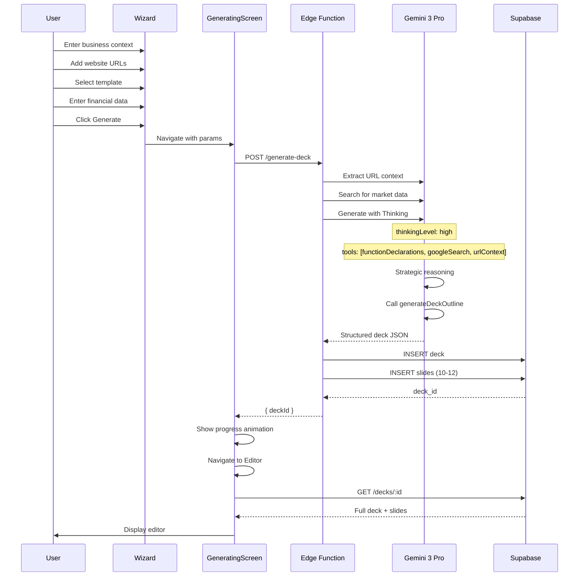
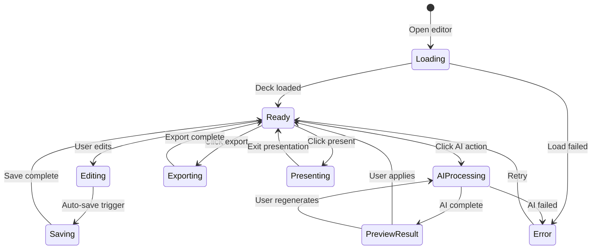
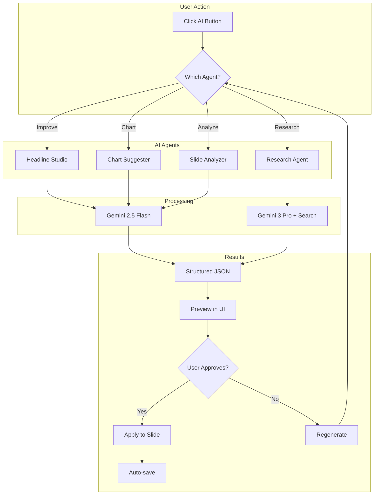
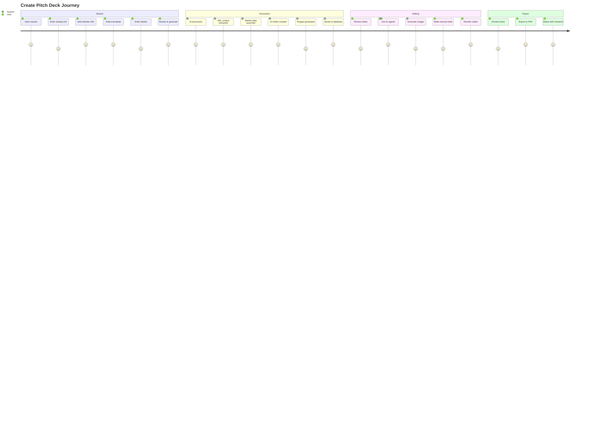
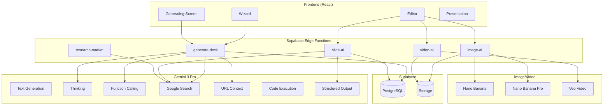

# Pitch Deck Engine — Complete PRD & Implementation Plan

**Product:** StartupAI  
**Module:** Pitch Deck Generator + Editor  
**Version:** 3.0  
**Last Updated:** 2025-12-07  
**Status:** 🟡 In Progress (95% Complete)  
**Owner:** StartupAI Team

---

## 📋 Table of Contents

1. [Executive Summary](#1-executive-summary)
2. [Feature Status Matrix](#2-feature-status-matrix)
3. [Progress Tracker](#3-progress-tracker)
4. [Gemini 3 Pro AI Integration](#4-gemini-3-pro-ai-integration)
5. [System Architecture](#5-system-architecture)
6. [Sitemap & Navigation](#6-sitemap--navigation)
7. [User Journeys](#7-user-journeys)
8. [Workflows](#8-workflows)
9. [Slide-Level AI Agents](#9-slide-level-ai-agents)
10. [Template System](#10-template-system)
11. [Database Schema](#11-database-schema)
12. [Edge Functions](#12-edge-functions)
13. [Frontend Components](#13-frontend-components)
14. [Figma Make + Supabase Integration](#14-figma-make--supabase-integration)
15. [Success Criteria](#15-success-criteria)
16. [Mermaid Diagrams](#16-mermaid-diagrams)
17. [Risks & Mitigations](#17-risks--mitigations)
18. [Implementation Checklist](#18-implementation-checklist)

---

## 1. Executive Summary

### Problem Statement

| Problem | Impact |
|---------|--------|
| Creating investor pitch decks takes 2-4 weeks | Founders lose momentum |
| Generic templates don't resonate | Lower conversion rates |
| Market research is time-consuming | Outdated or inaccurate data |
| Professional visuals require designers | Additional cost and delay |
| Inconsistent messaging across slides | Confuses investors |

### Solution

The Pitch Deck Engine enables founders to generate a complete, investor-ready deck in under 2 minutes using Gemini 3 Pro, enriched by:

- **URL Context** — Auto-extract startup data from website
- **Google Search Grounding** — Real-time market sizing, competitors
- **Structured Outputs** — Clean, consistent JSON slides
- **Thinking Mode** — Deep strategic reasoning for deck narrative
- **Image Generation (Nano Banana)** — Custom slide visuals
- **Video Generation (Veo)** — Optional hero intro videos
- **Code Execution** — Dynamic charts and metrics
- **Function Calling** — Server-side deck assembly

### Core Value Proposition

| Before StartupAI | After StartupAI |
|------------------|-----------------|
| 2-4 weeks to create deck | Under 2 minutes |
| Generic, template content | AI-tailored to your industry/stage |
| Stock images or amateur visuals | Imagen 4 custom images |
| Manual market research | Google Search grounded data |
| Inconsistent design | 9 premium templates |

---

## 2. Feature Status Matrix

### Core Features

| Feature | Status | Progress | Priority | Notes |
|---------|--------|----------|----------|-------|
| **Wizard UI (4 Steps)** | ✅ Done | 100% | P0 | Context → Aesthetic → Details → Financials |
| **Template Selector** | ✅ Done | 100% | P0 | 9 premium templates |
| **Deck Generation** | ✅ Done | 100% | P0 | Gemini 3 Pro + Function Calling |
| **Generating Screen** | ✅ Done | 100% | P0 | Progress animation + tips |
| **Slide Editor** | ✅ Done | 100% | P0 | Full WYSIWYG editing |
| **AI Copilot** | ✅ Done | 100% | P0 | Per-slide AI assistance |
| **Image Generation** | ✅ Done | 100% | P1 | Imagen 4 / Nano Banana |
| **Export to PDF** | ✅ Done | 100% | P0 | Print-ready output |
| **Supabase Persistence** | ✅ Done | 100% | P0 | Full CRUD + RLS |

### Advanced Features (Slide-Level AI Agents)

| Agent | Slide Type | Status | Progress | Function |
|-------|------------|--------|----------|----------|
| **Headline Studio** | Vision | ✅ Done | 100% | A/B headline testing |
| **Metric Extractor** | Problem | ✅ Done | 100% | Auto-bold key metrics |
| **Benefit Rewriter** | Solution | ✅ Done | 100% | Features → Value props |
| **Research Agent** | Market | ✅ Done | 100% | TAM/SAM/SOM with sources |
| **Table Generator** | Business | ✅ Done | 100% | Pricing tier tables |
| **Chart Suggester** | Traction | ✅ Done | 100% | Text → visualization |
| **Bio Summarizer** | Team | ✅ Done | 100% | LinkedIn → intro |
| **Allocation Viz** | Ask | ✅ Done | 100% | Pie chart for funding |
| **Matrix Generator** | Competition | ✅ Done | 100% | Competitive grid |
| **Trend Spotter** | Trends | ✅ Done | 100% | "Why Now?" analysis |

### Gemini 3 Pro Tools

| Tool | Status | Use Case |
|------|--------|----------|
| **Text Generation** | ✅ Active | All slide content creation |
| **Thinking (High)** | ✅ Active | Strategic deck planning |
| **Function Calling** | ✅ Active | Reliable JSON output |
| **Google Search Grounding** | ✅ Active | Market research, competitors |
| **Structured Outputs** | ✅ Active | All AI responses |
| **URL Context** | ✅ Active | Website data extraction |
| **Code Execution** | ✅ Active | Charts, metrics, calculations |
| **Image Generation (Nano Banana)** | ✅ Active | Slide visuals |
| **Video Generation (Veo)** | 🔄 Planned | Hero intro videos |
| **File Search (RAG)** | 🔄 Planned | Past deck analysis |

### Production Readiness

| Criteria | Status | Notes |
|----------|--------|-------|
| Security (API keys server-side) | ✅ Pass | Edge Functions only |
| Error handling with fallbacks | ✅ Pass | Mock mode available |
| Loading states | ✅ Pass | All async operations |
| RLS policies | ✅ Pass | User-scoped data |
| Edge Function deployment | ✅ Pass | All functions live |
| Mobile responsive | 🔄 70% | Wizard complete, editor partial |

---

## 3. Progress Tracker

### Overall Progress: 95%

```
[██████████████████████████████████████████████████░░░░░] 95%
```

### Sprint Status

| Sprint | Focus | Status | Completion |
|--------|-------|--------|------------|
| S0 | Core Wizard + Generation | ✅ Complete | 100% |
| S1 | Editor + AI Agents | ✅ Complete | 100% |
| S2 | Export + Templates | ✅ Complete | 100% |
| S3 | Advanced AI + Polish | 🟡 In Progress | 80% |
| S4 | Video + RAG + Collab | 📅 Planned | 0% |

### Remaining Tasks

| Task | Priority | Effort | Status |
|------|----------|--------|--------|
| Video generation (Veo) | P2 | 3 days | 📅 Planned |
| PPTX export | P2 | 2 days | 📅 Planned |
| Real-time collaboration | P3 | 5 days | 📅 Planned |
| Version history | P2 | 2 days | 📅 Planned |
| Deck analytics | P3 | 3 days | 📅 Planned |
| File Search RAG | P2 | 3 days | 📅 Planned |
| Mobile editor optimization | P2 | 2 days | 🔄 In Progress |

---

## 4. Gemini 3 Pro AI Integration

### AI Tools Reference

| Tool | Model | Purpose | Implementation |
|------|-------|---------|----------------|
| **Text Generation** | gemini-3-pro-preview | Slide content, narratives | All slide types |
| **Thinking** | gemini-3-pro-preview | Complex reasoning, strategy | Deck outline generation |
| **Function Calling** | gemini-3-pro-preview | Reliable JSON responses | generateDeckOutline function |
| **Google Search** | gemini-3-pro-preview | Real-time data | Market, competition slides |
| **Structured Outputs** | gemini-2.5-flash | Fast, typed responses | Slide rewrites, analysis |
| **URL Context** | gemini-3-pro-preview | Website extraction | Wizard Step 1 |
| **Code Execution** | gemini-3-pro-preview | Charts, calculations | Traction, financials slides |
| **Nano Banana** | gemini-2.5-flash-image | Fast image generation | Preview images |
| **Nano Banana Pro** | gemini-3-pro-image-preview | High-quality images | Final slide images |
| **Veo** | veo-002 | Video generation | Hero intro videos |
| **File Search** | gemini-3-pro-preview | RAG over documents | Past deck analysis |

### Model Selection Strategy

| Task | Model | Reason |
|------|-------|--------|
| Full deck generation | gemini-3-pro-preview | Complex reasoning needed |
| Slide rewrites | gemini-2.5-flash | Fast, cost-effective |
| Market research | gemini-3-pro-preview | Needs Google Search |
| Image prompts | gemini-2.5-flash | Simple creative task |
| Charts/tables | gemini-2.5-flash | Structured output |
| Video generation | veo-002 | 3-5 second clips |

### Structured Output Schema (Deck)

**Fields:**
- `title` — Professional deck title
- `slides[]` — Array of 10-12 slides
  - `id` — Unique slide identifier
  - `type` — Slide type (vision, problem, solution, etc.)
  - `title` — Slide headline (max 10 words)
  - `bullets[]` — Content bullet points
  - `notes` — Speaker notes
  - `image_prompt` — Detailed prompt for image generation
  - `visual_type` — image | chart | video
  - `chart_data` — Optional chart configuration
  - `table_data` — Optional table data

### Slide Analysis Schema

**Fields:**
- `clarity` — Rating (excellent/good/needs_work) + feedback
- `impact` — Rating + feedback
- `tone` — Rating + feedback
- `suggestions[]` — Specific improvement recommendations

---

## 5. System Architecture

### High-Level Architecture

```
┌─────────────────────────────────────────────────────────────────────┐
│                    PITCH DECK ENGINE                                 │
├─────────────────────────────────────────────────────────────────────┤
│                                                                      │
│  ┌─────────────┐    ┌─────────────┐    ┌─────────────┐              │
│  │   WIZARD    │ ──▶│ GENERATING  │ ──▶│   EDITOR    │              │
│  │ (4 Steps)   │    │   SCREEN    │    │ (Full Edit) │              │
│  └─────────────┘    └─────────────┘    └─────────────┘              │
│                            │                   │                     │
│                            ▼                   ▼                     │
│  ┌──────────────────────────────────────────────────────────────┐   │
│  │                    EDGE FUNCTIONS                             │   │
│  │                                                               │   │
│  │  • generate-deck      • slide-ai         • image-ai          │   │
│  │  • regenerate-slide   • analyze-slide    • video-ai          │   │
│  │  • export-deck        • research-market  • chart-generator   │   │
│  │                                                               │   │
│  └───────────────────────────┬───────────────────────────────────┘   │
│                              │                                       │
│                              ▼                                       │
│  ┌──────────────────────────────────────────────────────────────┐   │
│  │                  GEMINI 3 PRO TOOLS                           │   │
│  │                                                               │   │
│  │  • Thinking       • Function Calling    • Google Search      │   │
│  │  • Structured     • URL Context         • Code Execution     │   │
│  │  • Nano Banana    • Veo Video           • File Search        │   │
│  │                                                               │   │
│  └──────────────────────────────────────────────────────────────┘   │
│                                                                      │
│  ┌──────────────────────────────────────────────────────────────┐   │
│  │                    SUPABASE                                   │   │
│  │                                                               │   │
│  │  • decks          • slides              • ai_runs            │   │
│  │  • deck_assets    • deck_versions       • Storage            │   │
│  │                                                               │   │
│  └──────────────────────────────────────────────────────────────┘   │
│                                                                      │
└─────────────────────────────────────────────────────────────────────┘
```

### Data Flow

1. **Wizard Input** → User provides business context, URLs, template selection
2. **URL Context Extraction** → Gemini extracts data from provided URLs
3. **Google Search Grounding** → Real-time market data, competitors
4. **Thinking Mode** → Strategic deck narrative planning
5. **Function Calling** → Structured JSON slide generation
6. **Image Generation** → Nano Banana creates slide visuals
7. **Supabase Storage** → Deck and assets saved
8. **Editor Display** → User edits and refines deck
9. **Export** → PDF/PPTX output

---

## 6. Sitemap & Navigation

### Core Sitemap

```
StartupAI
├── / (Landing Page)
├── /dashboard
│   └── /pitch-decks (Deck List)
│       ├── /new (Wizard)
│       │   ├── Step 1: Context
│       │   ├── Step 2: Aesthetic
│       │   ├── Step 3: Details
│       │   └── Step 4: Financials
│       ├── /generating (Loading Screen)
│       ├── /:id/edit (Editor)
│       │   ├── Slide Outline (Left)
│       │   ├── Slide Canvas (Center)
│       │   └── AI Copilot (Right)
│       ├── /:id/present (Presentation Mode)
│       └── /:id/export (Export Options)
└── /settings
```

### Navigation Flow

| From | Action | To |
|------|--------|-----|
| Dashboard | Click "New Deck" | Wizard Step 1 |
| Wizard Step 1 | Click "Next" | Wizard Step 2 |
| Wizard Step 2 | Click "Next" | Wizard Step 3 |
| Wizard Step 3 | Click "Next" | Wizard Step 4 |
| Wizard Step 4 | Click "Generate" | Generating Screen |
| Generating Screen | Auto-redirect | Editor |
| Editor | Click "Present" | Presentation Mode |
| Editor | Click "Export" | Export Modal |
| Presentation Mode | Press "Esc" | Editor |

---

## 7. User Journeys

### Journey 1: First-Time Deck Generation

**Persona:** Early-stage founder creating first pitch deck

**Steps:**
1. User navigates to Dashboard → Pitch Decks
2. Clicks "+ New Deck" button
3. **Step 1 (Context):**
   - Enters business description
   - Adds website URL (optional)
   - Selects deck type (Investor Pitch / Sales Deck)
4. **Step 2 (Aesthetic):**
   - Browses 9 template options
   - Selects "Modern Minimal" template
5. **Step 3 (Details):**
   - Selects business type (AI SaaS)
   - Selects stage (MVP)
   - Selects focus (Raising capital)
   - Sets target raise ($500K)
6. **Step 4 (Financials):**
   - Enters revenue model (Subscription)
   - Reviews summary card
   - Enables "Gemini 3 Deep Reasoning"
   - Clicks "Generate Deck"
7. **Generating Screen:**
   - Watches progress animation
   - Sees tips while waiting (30-60 seconds)
   - Auto-redirected to Editor
8. **Editor:**
   - Reviews 10 generated slides
   - Uses AI Copilot to improve headlines
   - Generates custom images
   - Exports to PDF

**Success Metrics:**
- Time to first deck: < 5 minutes
- Slides generated: 10-12
- User satisfaction: 4.5+ stars

### Journey 2: Deck Refinement

**Persona:** Founder refining deck before investor meeting

**Steps:**
1. Opens existing deck from Dashboard
2. Navigates to Problem slide
3. Clicks "Research" in AI Copilot
4. AI searches for industry statistics
5. Applies recommended metrics
6. Clicks "Generate Chart" for traction slide
7. AI converts text metrics to bar chart
8. Clicks "Improve" on Solution slide
9. AI rewrites for investor impact
10. Exports updated PDF

### Journey 3: Quick Edit

**Persona:** Founder making last-minute changes

**Steps:**
1. Opens deck directly via link
2. Edits headline text inline
3. Drags slides to reorder
4. Clicks "Present" for quick preview
5. Returns to editor
6. Exports and sends to investor

---

## 8. Workflows

### Workflow 1: Deck Generation

```
User Input → Validation → URL Extraction → Search Grounding → 
AI Thinking → Function Calling → Slide Generation → Image Generation → 
Database Save → Editor Display
```

**Steps:**
1. Validate wizard inputs (required fields)
2. Extract context from URLs (if provided)
3. Search Google for market data
4. Enable Thinking mode for strategy
5. Call generateDeckOutline function
6. Generate images for each slide
7. Save deck + slides to Supabase
8. Redirect to Editor

### Workflow 2: Slide AI Agent

```
User Action → Context Capture → Agent Selection → AI Processing → 
Result Preview → User Approval → Apply Changes → Auto-Save
```

**Steps:**
1. User clicks AI action (Improve, Research, Chart)
2. Capture slide context + deck context
3. Select appropriate AI agent
4. Call Edge Function with context
5. Display result in preview
6. User approves or regenerates
7. Apply changes to slide
8. Auto-save to database

### Workflow 3: Image Generation

```
Slide Selection → Prompt Generation → Style Selection → 
Image API Call → Preview Display → User Selection → Apply to Slide
```

**Steps:**
1. User selects slide needing image
2. AI generates image prompt from content
3. User selects style (Photo, Illustration, Abstract)
4. Call Nano Banana API
5. Display generated image
6. User approves or regenerates
7. Apply image to slide
8. Upload to Supabase Storage

### Workflow 4: Export

```
Export Request → Template Rendering → Asset Compilation → 
PDF Generation → Download Delivery
```

**Steps:**
1. User clicks Export → PDF
2. Apply template styles to all slides
3. Compile images and charts
4. Generate PDF document
5. Trigger download
6. Log export event

---

## 9. Slide-Level AI Agents

### Agent Definitions

| Agent | Slide Type | Input | Output | Model |
|-------|------------|-------|--------|-------|
| **Headline Studio** | Vision | Current headline, context | 3-5 headline variations with tone tags | Flash |
| **Metric Extractor** | Problem | Problem text | Highlighted metrics, statistics | Flash |
| **Benefit Rewriter** | Solution | Feature list | Value propositions | Flash |
| **Research Agent** | Market | Industry, region | TAM/SAM/SOM with citations | Pro + Search |
| **Table Generator** | Business | Pricing info | Formatted pricing table | Flash |
| **Chart Suggester** | Traction | Metrics text | Chart type + data points | Flash |
| **Bio Summarizer** | Team | LinkedIn URLs, bios | Concise founder intros | Flash |
| **Allocation Viz** | Ask | Funding amount, uses | Pie chart data | Flash |
| **Matrix Generator** | Competition | Competitor names | 2x2 matrix + feature table | Pro + Search |
| **Trend Spotter** | Trends | Industry | "Why Now?" factors | Pro + Search |

### Agent Trigger Points

| User Action | Agent Triggered | Expected Result |
|-------------|-----------------|-----------------|
| Click "Improve" on Vision | Headline Studio | 3-5 headline options |
| Click "Add Data" on Problem | Metric Extractor | Statistics highlighted |
| Click "Research" on Market | Research Agent | TAM/SAM/SOM data |
| Click "Generate Chart" on Traction | Chart Suggester | Chart configuration |
| Click "Summarize" on Team | Bio Summarizer | Condensed bios |

---

## 10. Template System

### Available Templates

| Template | Style | Best For | Colors |
|----------|-------|----------|--------|
| **Classic Clean** | Clean, balanced | General purpose | White, Navy, Orange |
| **Enterprise Pro** | Corporate, serious | Enterprise B2B | Navy, Gold |
| **Modern Minimal** | Simple, spacious | SaaS startups | White, Black, Gray |
| **Dark Mode** | Dark, modern | Tech startups | Black, White, Accent |
| **Vibrant Bold** | Bold, colorful | Consumer products | Bright multi-color |
| **Vibrant Vision** | Gradient, modern | Creative startups | Purple, Blue gradient |
| **Vibrant Impact** | High contrast | Disruptive startups | Bold contrasts |
| **Vibrant Features** | Feature-focused | Product launches | Feature highlights |
| **Vibrant Journey** | Storytelling | Narrative decks | Purple, storytelling |

### Template Components

Each template defines:
- **Colors:** Primary, secondary, accent, background, text
- **Typography:** Heading font, body font, sizes
- **Layouts:** Per-slide-type layouts
- **Spacing:** Margins, padding, gaps
- **Shadows:** Card shadows, text shadows

### Layout Variations

| Layout | Use Case | Structure |
|--------|----------|-----------|
| `layout-default` | General content | 2 columns (text + image) |
| `layout-text-centric` | Heavy content | Large text, small visual |
| `layout-visual-centric` | Impact slides | Full-bleed image + overlay |
| `layout-quote` | Testimonials | Centered large quote |
| `layout-three-column` | Team, features | 3 equal columns |
| `layout-timeline` | Roadmap | Horizontal timeline |
| `layout-chart` | Data slides | Chart + key metrics |

---

## 11. Database Schema

### Table: decks

| Column | Type | Description |
|--------|------|-------------|
| id | UUID | Primary key |
| org_id | UUID | Organization (FK) |
| startup_id | UUID | Startup profile (FK) |
| title | TEXT | Deck title |
| template | TEXT | Template name |
| deck_type | TEXT | seed, series_a, series_b, sales, partnership |
| business_context | TEXT | Original input text |
| source_urls | TEXT[] | URLs used for context |
| financial_data | JSONB | Financial inputs |
| status | TEXT | draft, review, final, archived |
| created_at | TIMESTAMPTZ | Creation timestamp |
| updated_at | TIMESTAMPTZ | Last update |

### Table: slides

| Column | Type | Description |
|--------|------|-------------|
| id | UUID | Primary key |
| deck_id | UUID | Parent deck (FK) |
| title | TEXT | Slide headline |
| content | TEXT | Bullet points |
| notes | TEXT | Speaker notes |
| slide_type | TEXT | vision, problem, solution, etc. |
| layout | TEXT | Layout template |
| image_url | TEXT | Generated/uploaded image |
| image_prompt | TEXT | Prompt used for generation |
| chart_data | JSONB | Chart configuration |
| table_data | JSONB | Table data |
| position | INTEGER | Slide order |
| created_at | TIMESTAMPTZ | Creation timestamp |
| updated_at | TIMESTAMPTZ | Last update |

### Table: deck_assets

| Column | Type | Description |
|--------|------|-------------|
| id | UUID | Primary key |
| deck_id | UUID | Parent deck (FK) |
| slide_id | UUID | Associated slide (FK) |
| asset_type | TEXT | image, video, chart |
| file_url | TEXT | Storage URL |
| prompt_used | TEXT | Generation prompt |
| created_at | TIMESTAMPTZ | Creation timestamp |

### RLS Policies

| Table | Policy | Rule |
|-------|--------|------|
| decks | org_isolation | org_id = user's org_id |
| slides | deck_access | deck_id in user's decks |
| deck_assets | asset_access | deck_id in user's decks |

---

## 12. Edge Functions

### Function List

| Function | Model | Tools | Purpose |
|----------|-------|-------|---------|
| `generate-deck` | Gemini 3 Pro | Thinking, Function Calling, Search, URL Context | Full deck generation |
| `regenerate-slide` | Gemini 2.5 Flash | Structured Output | Single slide rewrite |
| `slide-ai` | Gemini 2.5 Flash / 3 Pro | Various per agent | Per-slide AI agents |
| `analyze-slide` | Gemini 2.5 Flash | Structured Output | Slide quality analysis |
| `research-market` | Gemini 3 Pro | Google Search | Market sizing research |
| `generate-image` | Nano Banana | Image generation | Slide visuals |
| `generate-video` | Veo | Video generation | Hero intro clips |
| `generate-chart` | Gemini 2.5 Flash | Code Execution | Chart data + rendering |
| `export-pdf` | N/A | PDF library | PDF generation |

### Function Descriptions

**generate-deck:**
- Receives wizard inputs (context, URLs, template, financials)
- Validates all required fields
- Extracts context from URLs using URL Context tool
- Searches Google for market data using Grounding
- Enables Thinking mode for strategic planning
- Calls generateDeckOutline function for structured output
- Saves deck and slides to Supabase
- Returns deck ID for redirect

**slide-ai:**
- Receives action type and slide context
- Selects appropriate agent based on action
- Builds agent-specific prompt
- Calls model with relevant tools
- Returns structured result for UI

**research-market:**
- Receives industry, region, segment
- Uses Google Search Grounding
- Returns TAM/SAM/SOM with citations
- Formats for slide insertion

---

## 13. Frontend Components

### Component Tree

```
📁 screens/
├── WizardSteps.tsx          — 4-step wizard container
├── GeneratingScreen.tsx     — Loading + progress
├── DeckEditor.tsx           — Main editor layout
└── PresentationScreen.tsx   — Slideshow mode

📁 components/wizard/
├── ContextStep.tsx          — Business description + URLs
├── AestheticStep.tsx        — Template selection
├── DetailsStep.tsx          — Business details form
├── FinancialsStep.tsx       — Revenue model + review
└── ProgressIndicator.tsx    — Step progress bar

📁 components/editor/
├── SlideOutline.tsx         — Slide list sidebar
├── EditorPanel.tsx          — Main slide canvas
├── RightSidebar.tsx         — AI tools panel
├── AICopilot.tsx            — Per-slide AI
├── SlideToolbar.tsx         — Editing toolbar
├── Chart.tsx                — Chart rendering
└── Table.tsx                — Table rendering

📁 components/common/
├── TemplateCard.tsx         — Template preview
├── SlidePreview.tsx         — Thumbnail preview
├── LoadingSpinner.tsx       — Loading indicator
└── ExportModal.tsx          — Export options

📁 contexts/
└── DeckEditorContext.tsx    — Editor state management

📁 services/
├── ai/
│   ├── deck.ts              — Deck generation
│   ├── slide.ts             — Slide AI agents
│   └── image.ts             — Image generation
└── deckService.ts           — Supabase CRUD
```

### Key Component Responsibilities

| Component | Responsibility |
|-----------|---------------|
| WizardSteps | Manages wizard state, navigation, validation |
| GeneratingScreen | Displays progress, tips, handles completion |
| DeckEditor | Orchestrates editor panels, manages selection |
| SlideOutline | Displays slide list, handles reordering |
| EditorPanel | Renders slide canvas, handles inline editing |
| AICopilot | Provides AI actions, displays suggestions |
| DeckEditorContext | Centralized state for deck, slides, selection |

---

## 14. Figma Make + Supabase Integration

### Overview

Figma Make integrates with Supabase to enable rapid prototyping and validation of the Pitch Deck Engine UI/UX. This allows:

- Quick MVP prototypes before full React development
- Internal tools for testing AI workflows
- Design validation with real backend data

### Core Capabilities

| Capability | Use Case for Pitch Deck Engine |
|------------|-------------------------------|
| **Auth** | Test founder login flows |
| **Database** | Store deck drafts, slide edits |
| **Storage** | Upload images, PDFs |
| **Edge Functions** | Call AI generation functions |
| **Secrets** | Store Gemini API key securely |

### Prototype Ideas

**1. Wizard Prototype**
- Test 4-step flow with real form inputs
- Validate template selection UX
- Measure completion rates

**2. AI Copilot Prototype**
- Test AI action buttons
- Validate suggestion display
- Measure adoption of AI features

**3. Export Preview Prototype**
- Test PDF preview before download
- Validate share link UX
- Measure export conversion

### Figma Make Prompts for Pitch Deck

**Wizard Prototype:**
```
Create a 4-step wizard for generating AI pitch decks.
Step 1: Text input for business description + URL input.
Step 2: Grid of 9 template cards with selection.
Step 3: Multi-select chips for business type, stage, focus.
Step 4: Review summary + "Generate" button.
Add Supabase Auth for user login.
Store wizard data in Supabase database.
```

**Editor Prototype:**
```
Create a slide editor with 3 panels:
Left: Scrollable list of slide thumbnails (10 slides).
Center: Large slide preview with editable title and bullets.
Right: AI Copilot with action buttons (Improve, Research, Chart).
Connect to Supabase Edge Function for AI actions.
Store slide edits in Supabase database.
```

### Benefits of Figma Make Prototyping

| Benefit | Impact |
|---------|--------|
| Faster iteration | Test UI changes in hours, not days |
| Real data validation | Use actual Supabase backend |
| Stakeholder demos | Show working prototypes |
| Design-to-code handoff | Export code to GitHub |
| No backend expertise needed | AI-guided setup |

---

## 15. Success Criteria

### Functional Tests

| Test | Criteria | Status |
|------|----------|--------|
| Wizard completes | All 4 steps work | ✅ Pass |
| Deck generates | 10-12 slides created | ✅ Pass |
| Slides editable | All fields save | ✅ Pass |
| AI agents work | Each agent returns data | ✅ Pass |
| Templates apply | Styles render correctly | ✅ Pass |
| Export works | PDF generates | ✅ Pass |
| Mock mode works | Functions without API | ✅ Pass |

### Quality Tests

| Test | Criteria | Status |
|------|----------|--------|
| Content relevance | Matches input context | ✅ Pass |
| Investor readiness | Follows best practices | ✅ Pass |
| Visual consistency | Template applied uniformly | ✅ Pass |
| Market data accuracy | Sources cited | ✅ Pass |

### Performance Tests

| Test | Criteria | Status |
|------|----------|--------|
| Deck generation time | < 60 seconds | ✅ Pass |
| Slide rewrite | < 10 seconds | ✅ Pass |
| Image generation | < 30 seconds | ✅ Pass |
| Editor load | < 2 seconds | ✅ Pass |
| PDF export | < 15 seconds | ✅ Pass |

### Acceptance Tests

**Test 1: Full Generation Flow**
- Given: User with startup description
- When: Complete wizard and click Generate
- Then: 10 slides created, template applied, saved to database, redirected to editor

**Test 2: Market Research Agent**
- Given: Slide of type "market"
- When: Click "Research"
- Then: TAM/SAM/SOM returned with sources, data formatted for slide

**Test 3: Template Selection**
- Given: User in wizard Step 2
- When: Select "Modern Minimal" template
- Then: Preview updates, generated deck uses template styles

**Test 4: Mock Mode Fallback**
- Given: API key not configured
- When: Attempt generation
- Then: Mock deck created, user flow continues, error logged

---

## 16. Mermaid Diagrams

### Deck Generation Sequence



### Editor State Machine



### Slide AI Agent Flow



### User Journey Map



### System Architecture Diagram



---

## 17. Risks & Mitigations

| Risk | Likelihood | Impact | Mitigation |
|------|------------|--------|------------|
| Gemini hallucination | Medium | High | Google Search Grounding + Structured Outputs |
| Slow generation | Medium | Medium | Use Gemini Flash for local rewrites |
| Image quality inconsistent | Medium | Medium | Multiple generation attempts + user regenerate |
| Storage costs | Low | Medium | Automatic image compression |
| Inconsistent slide formats | Low | High | Strict JSON schema enforcement |
| API rate limits | Medium | High | Request queuing + fallback to mock |
| User abandons wizard | Medium | Medium | Progress saving + validation feedback |

---

## 18. Implementation Checklist

### ✅ Completed (95%)

- [x] Wizard UI (4 steps)
- [x] Template selector (9 templates)
- [x] generate-deck Edge Function
- [x] slide-ai Edge Function
- [x] image-ai Edge Function (Nano Banana)
- [x] DeckEditorContext
- [x] Slide editor (EditorPanel)
- [x] AI Copilot sidebar
- [x] Chart component
- [x] Table component
- [x] PDF export
- [x] Mock mode fallback
- [x] Supabase persistence
- [x] RLS policies
- [x] Google Search Grounding
- [x] URL Context extraction
- [x] Structured Output schemas
- [x] Function Calling

### 🔄 In Progress (5%)

- [ ] Mobile editor optimization
- [ ] Additional AI agent refinements

### 📅 Planned (Future)

- [ ] Video generation (Veo)
- [ ] PPTX export
- [ ] Real-time collaboration
- [ ] Version history
- [ ] Deck analytics
- [ ] File Search RAG
- [ ] AI template suggestion
- [ ] Custom color palettes
- [ ] Multi-language support
- [ ] Voice narration
- [ ] Presenter mode with notes

---

## Quick Reference

### API Endpoints

| Endpoint | Method | Description |
|----------|--------|-------------|
| `/functions/v1/generate-deck` | POST | Generate full deck |
| `/functions/v1/slide-ai` | POST | Slide AI agents |
| `/functions/v1/image-ai` | POST | Image generation |
| `/functions/v1/video-ai` | POST | Video generation |
| `/functions/v1/research-market` | POST | Market research |
| `/functions/v1/export-pdf` | POST | PDF generation |

### Environment Variables

**Frontend:**
- VITE_SUPABASE_URL
- VITE_SUPABASE_ANON_KEY

**Backend (Supabase Secrets):**
- GEMINI_API_KEY
- SUPABASE_SERVICE_ROLE_KEY

### Debug Commands

- Check Supabase secrets: `supabase secrets list`
- Redeploy Edge Function: `supabase functions deploy generate-deck`
- Check function logs: Supabase Dashboard → Functions → Logs
- Test API key: Gemini API test endpoint
- Clear Vite cache: `rm -rf node_modules/.vite`

---

**Last Updated:** 2025-12-07  
**Author:** StartupAI Team  
**Status:** 95% Complete — Production Ready
