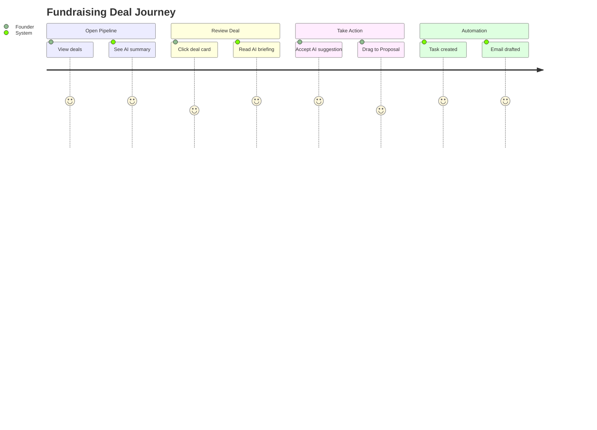
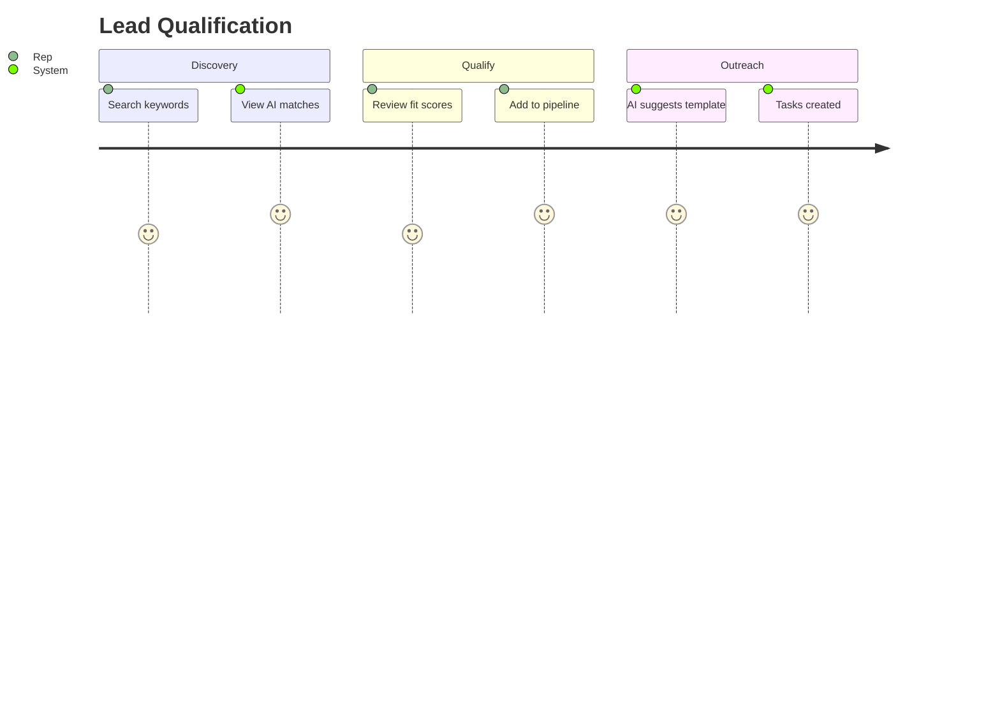
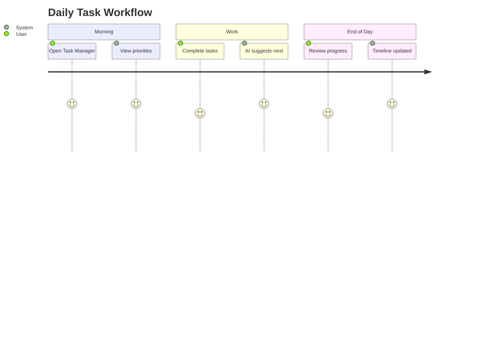
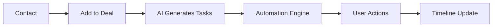
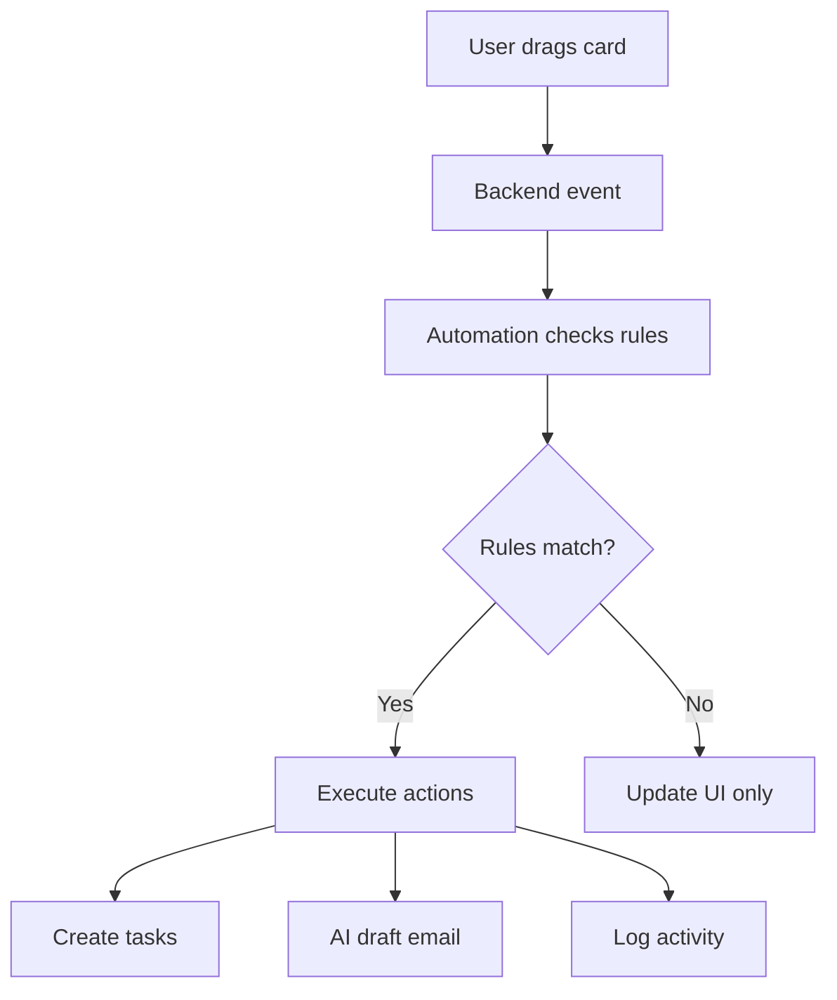
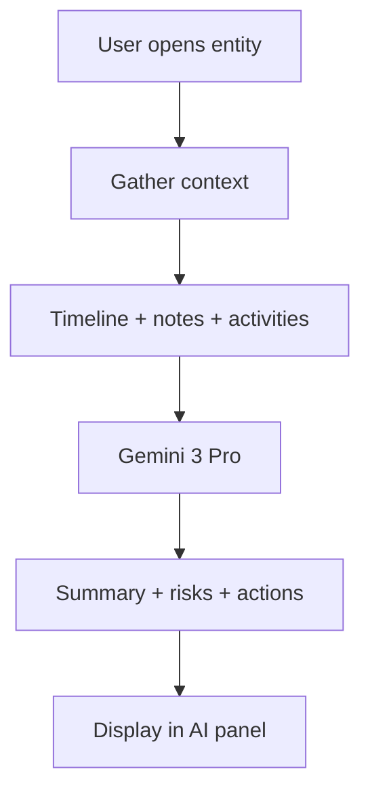
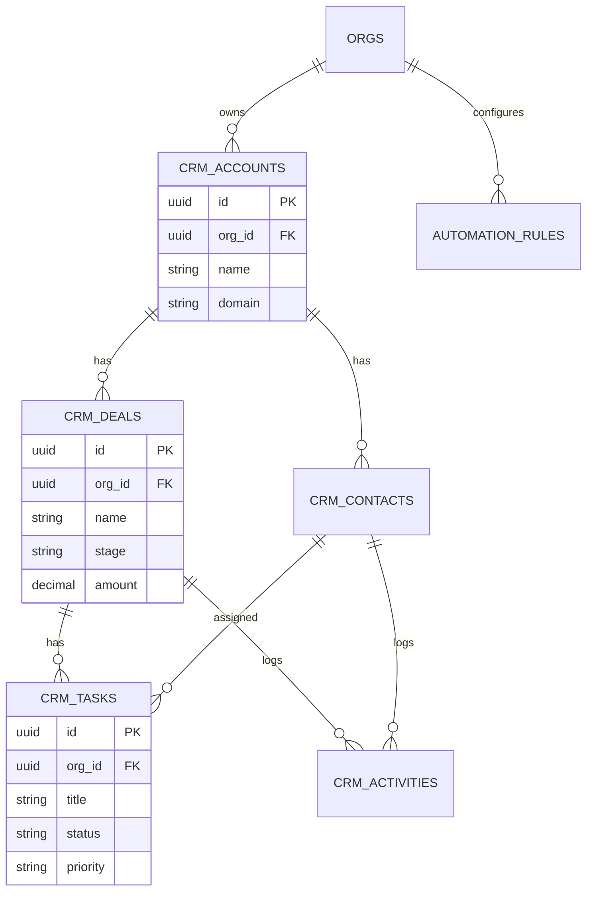

# Visual CRM with Gemini 3 AI — PRD

**Version:** 1.0  
**Owner:** StartupAI  
**Status:** 🟡 In Progress

---

## 📋 Table of Contents

1. [Lean Canvas](#lean-canvas)
2. [Core Features](#core-features)
3. [User Journeys](#user-journeys)
4. [Workflows](#workflows)
5. [Frontend Screens](#frontend-screens)
6. [Backend Requirements](#backend-requirements)
7. [Database Schema](#database-schema)
8. [Edge Functions](#edge-functions)
9. [Acceptance Criteria](#acceptance-criteria)
10. [Release Plan](#release-plan)

---

## Lean Canvas

### Problem

| Problem | Impact |
|---------|--------|
| CRM tools are too complex | Low adoption |
| No visual workflow guidance | Manual tracking |
| No AI-powered insights | Missed opportunities |
| Hard to know "who to contact next" | Lost deals |
| Heavy configuration required | Slow time-to-value |

### Customer Segments

- Startup founders
- Sales / growth teams
- Fundraising teams
- Partnership / BD teams

### Unique Value Proposition

**A Visual CRM powered by Gemini 3 AI** that:
- Turns contacts, deals, and tasks into **visual workflows**
- Auto-enriches data and predicts outcomes
- Suggests next steps with AI reasoning
- Works immediately with zero configuration

### Key Metrics

| Metric | Target |
|--------|--------|
| Time-to-first-value | < 5 min |
| Tasks completed/day | 10+ |
| AI insights accepted | > 70% |
| Deal conversion rate | +20% |

### Unfair Advantage

- Gemini 3 multimodal AI (thinking, search, URL context)
- Visual-first UX (Kanban, graphs, timelines)
- Unified data model (CRM + pitch deck + startup OS)

---

## Core Features

### 1. Visual Contacts Manager

```
┌─────────────────────────────────────────┐
│  CONTACTS                    + Add      │
├─────────────────────────────────────────┤
│  [Table] [Cards] [Graph]     🔍 Search  │
├─────────────────────────────────────────┤
│                                         │
│  ┌─────┐  ┌─────┐  ┌─────┐  ┌─────┐   │
│  │ 👤  │  │ 👤  │  │ 👤  │  │ 👤  │   │
│  │John │  │Sarah│  │Mike │  │Lisa │   │
│  │VC   │  │Angel│  │Lead │  │Part │   │
│  │ 🟢  │  │ 🟡  │  │ 🔴  │  │ 🟢  │   │
│  └─────┘  └─────┘  └─────┘  └─────┘   │
│                                         │
└─────────────────────────────────────────┘
```

- Table + Card + Graph views
- Relationship health indicators (🟢🟡🔴)
- AI insights per contact
- Quick actions (add task, message, log)

### 2. Deals Pipeline (Visual Kanban)

```
┌─────────────────────────────────────────────────────────────┐
│  PIPELINE          Fundraising ▼        + Add Deal          │
├─────────────────────────────────────────────────────────────┤
│                                                              │
│  Lead      Qualified   Meeting    Proposal   Closed         │
│  ┌────┐    ┌────┐      ┌────┐     ┌────┐     ┌────┐        │
│  │Deal│    │Deal│      │Deal│     │Deal│     │Deal│        │
│  │$50K│    │$100│      │$200│     │$500│     │$1M │        │
│  │75% │    │60% │      │40% │     │80% │     │✓   │        │
│  └────┘    └────┘      └────┘     └────┘     └────┘        │
│  ┌────┐    ┌────┐                                           │
│  │Deal│    │Deal│                                           │
│  └────┘    └────┘                                           │
│                                                              │
└─────────────────────────────────────────────────────────────┘
```

- Vertical stage columns
- Deal cards with AI probability %
- Drag-and-drop between stages
- Pipeline health score

### 3. Task Manager (5-Step Workflow)

```
Research → Planning → Execution → Review → Done

┌───────────┐  ┌───────────┐  ┌───────────┐  ┌───────────┐
│ RESEARCH  │  │ PLANNING  │  │ EXECUTION │  │  REVIEW   │
│ ───────── │  │ ───────── │  │ ───────── │  │ ───────── │
│ • Task 1  │  │ • Task 2  │  │ • Task 3  │  │ • Task 4  │
│ • Task 5  │  │           │  │ • Task 6  │  │           │
└───────────┘  └───────────┘  └───────────┘  └───────────┘
```

- Kanban + timeline views
- AI-suggested tasks
- Priority indicators
- Progress tracking

### 4. Contact Discovery (AI Search)

```
┌─────────────────────────────────────────┐
│  🔍 "AI founders in Europe"             │
├─────────────────────────────────────────┤
│                                         │
│  ┌─────────────────────────────────┐   │
│  │ John Smith          92% match   │   │
│  │ CEO @ AIStartup     [Add →]     │   │
│  │ "Raised $5M, AI focus"          │   │
│  └─────────────────────────────────┘   │
│  ┌─────────────────────────────────┐   │
│  │ Sarah Chen          87% match   │   │
│  │ Founder @ TechCo    [Add →]     │   │
│  └─────────────────────────────────┘   │
│                                         │
└─────────────────────────────────────────┘
```

- AI keyword search
- Fit scoring with explanation
- Quick add to pipeline
- Source attribution

### 5. AI Context Panel (Right Sidebar)

```
┌─────────────────────┐
│  ✨ AI INSIGHTS     │
├─────────────────────┤
│                     │
│  📊 Summary         │
│  "Strong investor   │
│   momentum. 2 deals │
│   at risk."         │
│                     │
│  🎯 Next Steps      │
│  • Follow up Acme   │
│  • Schedule meeting │
│  • Send proposal    │
│                     │
│  ⚠️ Risks           │
│  • Deal #3 stalled  │
│  • Missing contact  │
│                     │
│  [Generate Tasks]   │
│                     │
└─────────────────────┘
```

- AI summaries
- Next step suggestions
- Risk analysis
- One-click task generation

### 6. Automation Builder

```
┌─────────────────────────────────────────────────────────────┐
│  AUTOMATION: "Fundraising Follow-up"                        │
├─────────────────────────────────────────────────────────────┤
│                                                              │
│  ┌─────────┐     ┌─────────┐     ┌─────────┐               │
│  │ TRIGGER │ ──▶ │  IF     │ ──▶ │ ACTION  │               │
│  │ Stage   │     │ Amount  │     │ Create  │               │
│  │ Changed │     │ > $100K │     │ Task    │               │
│  └─────────┘     └─────────┘     └─────────┘               │
│                                       │                      │
│                                       ▼                      │
│                                  ┌─────────┐                │
│                                  │ AI      │                │
│                                  │ Draft   │                │
│                                  │ Email   │                │
│                                  └─────────┘                │
│                                                              │
└─────────────────────────────────────────────────────────────┘
```

- Drag-and-drop nodes
- Trigger → Condition → Action flow
- AI action nodes

---

## User Journeys

### Journey 1: Founder Managing Fundraising



### Journey 2: Sales Rep Qualifying Leads



### Journey 3: Daily Workflow



---

## Workflows

### Contact → Deal → Tasks → Automation



### Pipeline Stage Transition



### AI Summary Workflow



---

## Frontend Screens

### Component Tree

```
📁 screens/
├── CrmDashboard.tsx      # Main CRM dashboard
├── ContactsScreen.tsx    # Contacts list + detail
├── DealsPipeline.tsx     # Kanban deal board
├── TasksWorkflows.tsx    # Tasks + workflows
├── ContactDiscovery.tsx  # AI search + scoring
└── CommunicationHub.tsx  # Email + activity

📁 components/crm/
├── ContactCard.tsx       # Contact card
├── DealCard.tsx          # Deal card for Kanban
├── TaskCard.tsx          # Task card
├── StageNavigator.tsx    # Pipeline stages
├── AIContextPanel.tsx    # AI suggestions panel
├── PipelineKanban.tsx    # Kanban board
├── ActivityTimeline.tsx  # Activity feed
└── AutomationBuilder.tsx # Visual automation
```

### UI Rules

| Rule | Value |
|------|-------|
| Grid spacing | 24px |
| Border radius | 8px (cards), 4px (buttons) |
| AI accent | Indigo/violet gradient |
| Transitions | 0.2-0.3s ease |
| Contrast | WCAG AA compliant |

---

## Backend Requirements

### Database Tables

| Table | Purpose |
|-------|---------|
| `crm_contacts` | People |
| `crm_accounts` | Companies |
| `crm_deals` | Opportunities |
| `crm_tasks` | Action items |
| `crm_workflows` | Templates |
| `crm_workflow_runs` | Instances |
| `automation_rules` | Trigger logic |
| `crm_activities` | Timeline events |

All tables have:
- `org_id` for RLS
- `created_at`, `updated_at`
- Proper indexes

### Edge Functions

| Function | Model | Purpose |
|----------|-------|---------|
| `crm-generate-tasks` | Gemini 3 Pro | Generate tasks from context |
| `crm-summarize` | Gemini 3 Pro | Summarize timeline/contact |
| `crm-draft-email` | Gemini Flash | Draft emails |
| `crm-enrich-lead` | Gemini 3 Pro | Enrich with Google Search |
| `crm-automation` | N/A | Process automation rules |

---

## Database Schema

### crm_tasks

```sql
CREATE TABLE crm_tasks (
  id UUID PRIMARY KEY DEFAULT gen_random_uuid(),
  org_id UUID REFERENCES orgs(id) NOT NULL,
  deal_id UUID REFERENCES crm_deals(id),
  contact_id UUID REFERENCES crm_contacts(id),
  
  title TEXT NOT NULL,
  description TEXT,
  status TEXT DEFAULT 'todo',
  priority TEXT DEFAULT 'medium',
  task_type TEXT DEFAULT 'other',
  due_at TIMESTAMPTZ,
  
  source TEXT DEFAULT 'manual',
  created_at TIMESTAMPTZ DEFAULT NOW()
);

-- RLS
ALTER TABLE crm_tasks ENABLE ROW LEVEL SECURITY;
CREATE POLICY "org_isolation" ON crm_tasks
  FOR ALL USING (org_id = auth.jwt()->>'org_id');
```

### automation_rules

```sql
CREATE TABLE automation_rules (
  id UUID PRIMARY KEY DEFAULT gen_random_uuid(),
  org_id UUID REFERENCES orgs(id) NOT NULL,
  
  name TEXT NOT NULL,
  is_active BOOLEAN DEFAULT true,
  trigger_event TEXT NOT NULL,
  trigger_filter JSONB DEFAULT '{}',
  actions JSONB NOT NULL DEFAULT '[]',
  
  created_at TIMESTAMPTZ DEFAULT NOW()
);
```

### ERD



---

## Edge Functions

### crm-generate-tasks

```typescript
// supabase/functions/crm-generate-tasks/index.ts

import { GoogleGenAI, Type } from "npm:@google/genai@1.29.0";

const taskSchema = {
  type: Type.OBJECT,
  properties: {
    tasks: {
      type: Type.ARRAY,
      items: {
        type: Type.OBJECT,
        properties: {
          title: { type: Type.STRING },
          priority: { type: Type.STRING, enum: ["low", "medium", "high"] },
          task_type: { type: Type.STRING },
          due_in_days: { type: Type.NUMBER }
        },
        required: ["title", "priority"]
      }
    }
  }
};

Deno.serve(async (req) => {
  const { deal_id, context } = await req.json();
  
  const ai = new GoogleGenAI({ 
    apiKey: Deno.env.get('GEMINI_API_KEY') 
  });

  const response = await ai.models.generateContent({
    model: 'gemini-3-pro-preview',
    contents: `Generate 3-5 tasks for: ${context}`,
    config: {
      thinkingLevel: 'high',
      responseMimeType: 'application/json',
      responseSchema: taskSchema
    }
  });

  return new Response(response.text);
});
```

---

## Acceptance Criteria

### Functional

| Test | Criteria |
|------|----------|
| Contacts load | < 500ms |
| Pipeline renders | 200+ deals smoothly |
| AI insights | < 3s generation |
| Drag-and-drop | Updates backend |
| Automation triggers | Correct actions |

### AI

| Test | Criteria |
|------|----------|
| Task generation | Relevant, no duplicates |
| Summaries | Factual, concise |
| Email drafts | Professional, personalized |
| Scoring | Aligned with best practices |

### UX

| Test | Criteria |
|------|----------|
| Mobile responsive | All breakpoints |
| Visual hierarchy | Clear |
| Navigation | Intuitive |
| Cards | Readable, minimal |

---

## Release Plan

### Milestone 1: Core CRM

- [ ] Contacts screen
- [ ] Deals pipeline
- [ ] Basic tasks
- [ ] RLS policies

### Milestone 2: Visual CRM

- [ ] Relationship graph
- [ ] Visual workflows
- [ ] Contact discovery
- [ ] AI context panel

### Milestone 3: AI Engine

- [ ] Task generation
- [ ] Deal insights
- [ ] Email drafting
- [ ] Timeline summarization

### Milestone 4: Automations

- [ ] Workflow builder UI
- [ ] Rules engine
- [ ] Event triggers
- [ ] AI action nodes

### Milestone 5: Polish

- [ ] Performance tuning
- [ ] Accessibility
- [ ] Responsive layouts
- [ ] Production deploy

---

## Future Enhancements

- Calendar sync + meeting scheduler
- Custom pipelines per team
- Multi-language AI
- Voice notes → AI transcription
- Auto-generated org charts

---

**Last Updated:** 2025-12-06  
**Status:** Ready for Implementation
