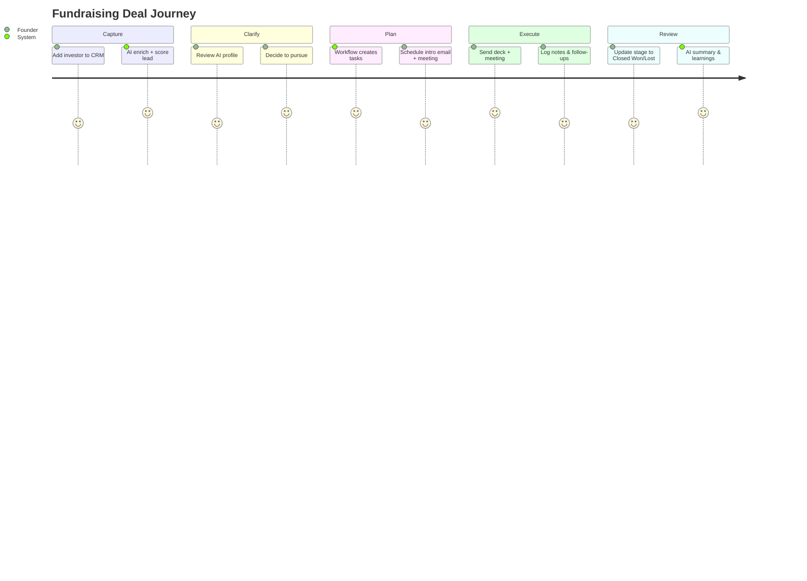
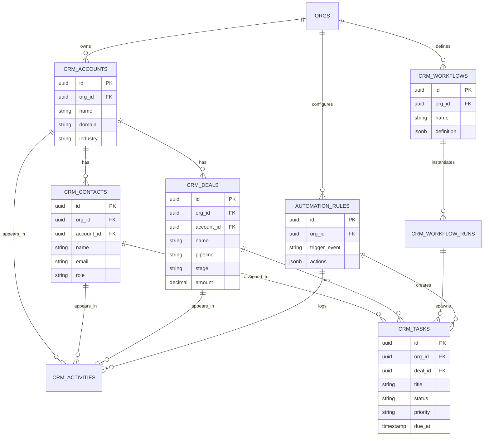
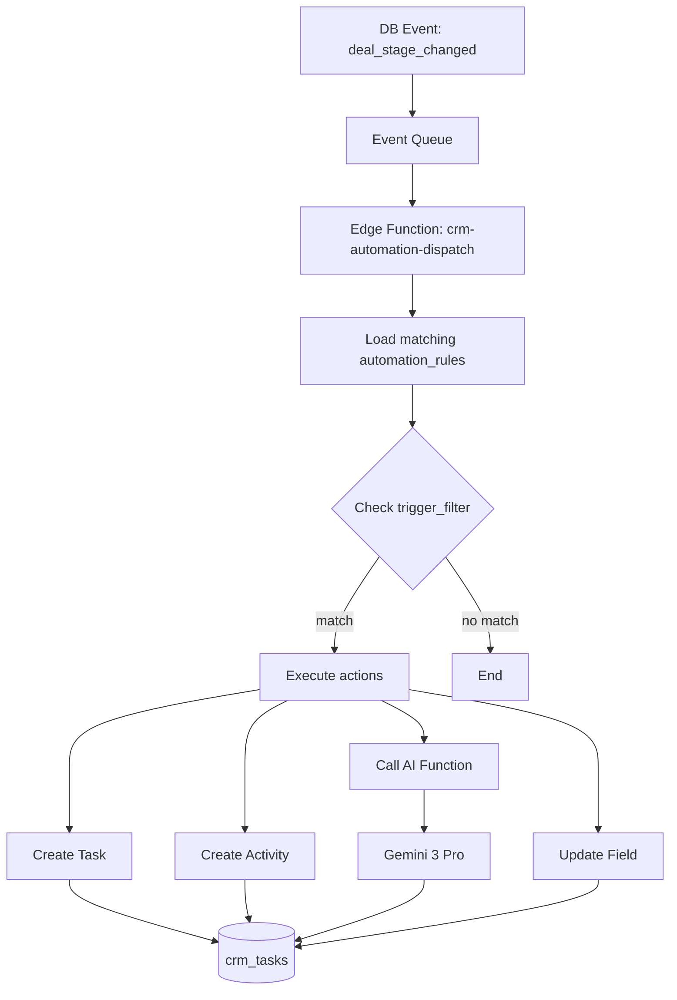
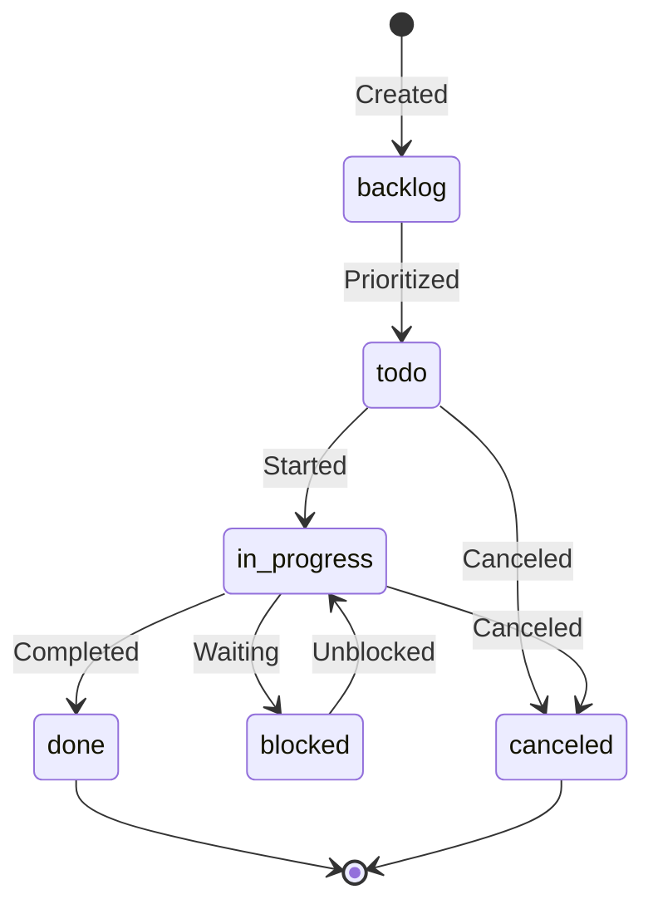
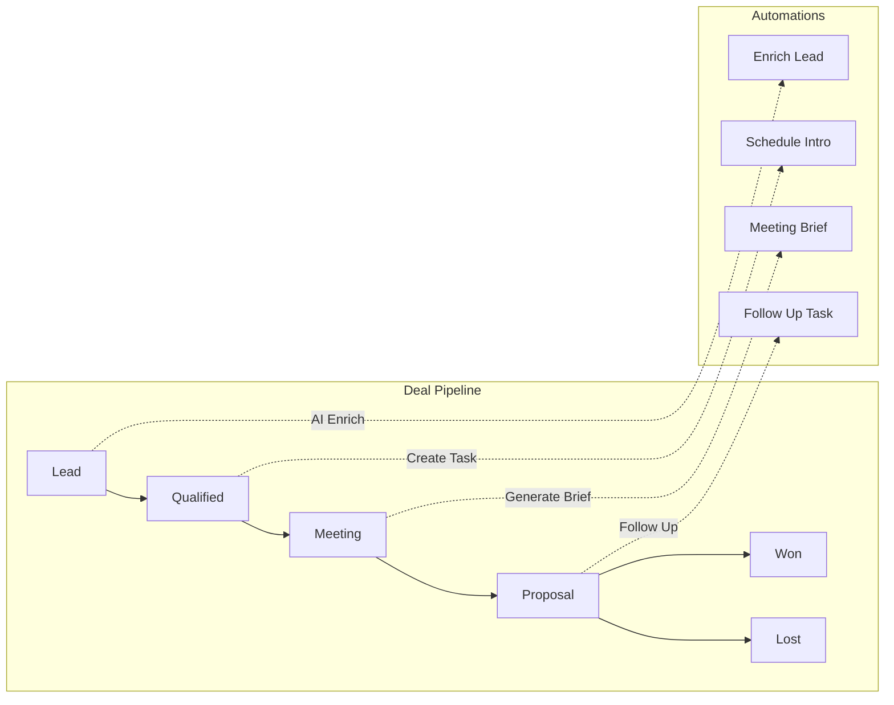
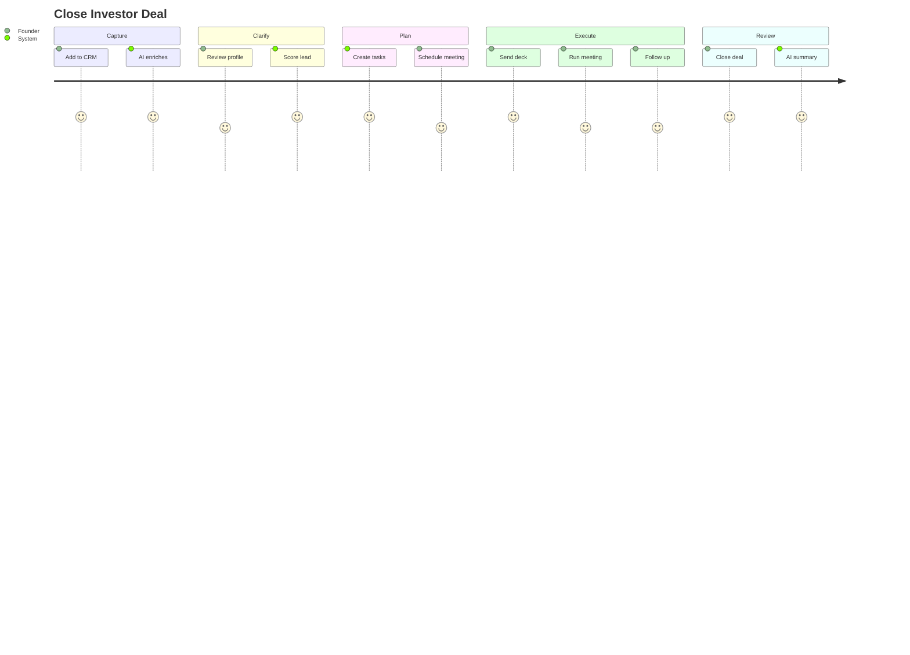

# CRM & Workflow Ecosystem - Master Implementation Plan

**Version:** 1.0  
**Last Updated:** 2025-12-06  
**Status:** 🟡 In Progress  
**Sprint:** S1-S2 (Days 1-6)

---

## 📋 Table of Contents

1. [System Overview](#system-overview)
2. [Core Objects & Data Model](#core-objects--data-model)
3. [User Personas & Journeys](#user-personas--journeys)
4. [Universal 5-Step Workflow Model](#universal-5-step-workflow-model)
5. [Gemini 3 AI Integration](#gemini-3-ai-integration)
6. [Database Schema](#database-schema)
7. [Automation Engine](#automation-engine)
8. [Task System](#task-system)
9. [Edge Functions](#edge-functions)
10. [Frontend Screens](#frontend-screens)
11. [Process Flows](#process-flows)
12. [Multi-Step Prompts](#multi-step-prompts)
13. [Success Criteria](#success-criteria)
14. [Mermaid Diagrams](#mermaid-diagrams)
15. [Implementation Checklist](#implementation-checklist)

---

## System Overview

### Goal

A unified, RLS-safe CRM + Workflow system that sits beside Pitch Deck, Investor Docs, and GTM modules, sharing the same org/startup model and AI stack (Gemini 3 Pro + Flash).

### Core Value Proposition

| Problem | Solution |
|---------|----------|
| Scattered investor tracking | Unified CRM with AI enrichment |
| Manual follow-up tracking | Automated task generation |
| No workflow consistency | Universal 5-step model |
| Disconnected tools | Single platform for CRM + Tasks + Docs |

### System Components

```
┌─────────────────────────────────────────────────────────────────┐
│                    SUN AI CRM ECOSYSTEM                          │
├─────────────────────────────────────────────────────────────────┤
│                                                                  │
│  ┌─────────────┐  ┌─────────────┐  ┌─────────────┐              │
│  │  CONTACTS   │  │   DEALS     │  │   TASKS     │              │
│  │  & ACCOUNTS │  │  PIPELINE   │  │ & WORKFLOWS │              │
│  └──────┬──────┘  └──────┬──────┘  └──────┬──────┘              │
│         │                │                │                      │
│         └────────────────┼────────────────┘                      │
│                          │                                       │
│                          ▼                                       │
│  ┌──────────────────────────────────────────────────────────┐   │
│  │                  AUTOMATION ENGINE                        │   │
│  │  Events → Rules → Actions (Tasks, Emails, AI Calls)       │   │
│  └──────────────────────────────────────────────────────────┘   │
│                          │                                       │
│                          ▼                                       │
│  ┌──────────────────────────────────────────────────────────┐   │
│  │                    GEMINI 3 AI                            │   │
│  │                                                           │   │
│  │  ┌─────────┐ ┌─────────┐ ┌─────────┐ ┌─────────┐         │   │
│  │  │ Task    │ │ Lead    │ │ Email   │ │Pipeline │         │   │
│  │  │ Gen     │ │ Enrich  │ │ Draft   │ │Forecast │         │   │
│  │  └─────────┘ └─────────┘ └─────────┘ └─────────┘         │   │
│  │                                                           │   │
│  │  Tools: Thinking | Search | Function Calling | Structured │   │
│  │                                                           │   │
│  └──────────────────────────────────────────────────────────┘   │
│                                                                  │
└─────────────────────────────────────────────────────────────────┘
```

---

## Core Objects & Data Model

### Core CRM Objects

| Object | Description | Key Fields |
|--------|-------------|------------|
| **Contacts** | People (investors, prospects, founders, team) | name, email, role, account_id, score |
| **Accounts** | Companies/Organizations | name, domain, industry, size |
| **Deals** | Sales, fundraising, hiring, projects | name, pipeline, stage, amount, account_id |
| **Tasks** | Atomic units of work | title, status, priority, type, due_at, deal_id |
| **Workflows** | Reusable multi-step templates | name, steps, entity_type, use_case |
| **Activities** | Emails, notes, calls, AI summaries | type, body, contact_id, deal_id |
| **Automation Rules** | Event → Condition → Action logic | trigger_event, filter, actions |

### Object Relationships

```
ORGS
 ├── ACCOUNTS (companies)
 │    ├── CONTACTS (people)
 │    ├── DEALS (opportunities)
 │    │    ├── TASKS
 │    │    └── ACTIVITIES
 │    └── ACTIVITIES
 │
 ├── WORKFLOWS (templates)
 │    └── WORKFLOW_RUNS (instances)
 │         └── TASKS (spawned)
 │
 └── AUTOMATION_RULES
      └── ACTIONS → TASKS, ACTIVITIES, AI_CALLS
```

### Pipeline Types

| Pipeline | Stages | Use Case |
|----------|--------|----------|
| **Fundraising** | Lead → Contacted → Meeting → Due Diligence → Term Sheet → Closed | Investor relations |
| **Sales** | Lead → Qualified → Demo → Proposal → Closed Won/Lost | Customer acquisition |
| **Hiring** | Sourced → Screening → Interview → Offer → Hired/Rejected | Recruitment |
| **Projects** | Backlog → Planning → In Progress → Review → Done | Internal projects |

---

## User Personas & Journeys

### Personas

#### 1. Founder / CEO
```yaml
Needs:
  - Unified view of pipeline + tasks + investors/clients
  - "What do we owe which investor/prospect this week?"
  - Quick wins and blockers at a glance

Key screens:
  - CRM Dashboard (KPIs + My Work Today)
  - Deals Pipeline (Kanban view)
  - Task list (filtered by priority/due date)

AI features used:
  - Task generation from deal context
  - Meeting brief generation
  - Pipeline forecasting
```

#### 2. Sales / Partnerships Lead
```yaml
Needs:
  - Deal pipeline + email sequences + tasks per account
  - "My top 20 deals, next steps, and AI-suggested emails"
  - Competitor insights for each deal

Key screens:
  - Deals Pipeline (by stage)
  - Contact detail (activity timeline)
  - Communication Hub (drafts + sent)

AI features used:
  - Lead enrichment & scoring
  - Email drafting
  - Deal probability scoring
```

#### 3. Ops / Marketing
```yaml
Needs:
  - Campaign tasks + sequences + reporting
  - "Launch checklist + tasks auto-spawned from templates"
  - Activity metrics

Key screens:
  - Tasks & Workflows
  - Communication Hub
  - Activity reports

AI features used:
  - Task suggestions from workflow templates
  - Activity summarization
  - Campaign insights
```

### Key User Journeys

#### Journey 1: Fundraising Pipeline



#### Journey 2: Sales Pipeline

```
1. Import leads → 2. AI enrich → 3. AI score → 4. Create Sales deals
                                                        ↓
5. Tasks auto-generated (demo, proposal, follow-up) ← Workflow template
                                                        ↓
6. Execute tasks → 7. Update stages → 8. Close deal → 9. Review & learnings
```

#### Journey 3: Task OS

```
Founder opens Tasks & Workflows
        ↓
Sees all tasks across deals/contacts/startups
        ↓
Filters: Today | This Week | Blocked | Waiting on others
        ↓
Works through tasks by priority
        ↓
Automation updates deal stages and creates follow-ups
```

---

## Universal 5-Step Workflow Model

### The Model

Every workflow follows this 5-step structure:

| Step | Phase | Description | Default Task Type |
|------|-------|-------------|-------------------|
| 1 | **Capture** | Log/ingest (lead, intro, meeting, todo) | email |
| 2 | **Clarify** | Qualify, enrich, prioritize | call |
| 3 | **Plan** | Assign, schedule, break into subtasks | internal |
| 4 | **Execute** | Do the work, track progress | email/meeting |
| 5 | **Review** | Summarize outcomes, next steps, learnings | meeting |

### Workflow Definition (JSON)

```json
{
  "name": "Fundraising – Warm Intro",
  "entity_type": "deal",
  "use_case": "fundraising",
  "steps": [
    { "phase": "capture", "label": "Log warm intro", "default_task_type": "email" },
    { "phase": "clarify", "label": "Qualify interest", "default_task_type": "call" },
    { "phase": "plan", "label": "Create plan & next step", "default_task_type": "internal" },
    { "phase": "execute", "label": "Send deck & schedule", "default_task_type": "email" },
    { "phase": "review", "label": "Review outcome", "default_task_type": "meeting" }
  ]
}
```

### Workflow Templates

| Template | Entity Type | Use Case | Steps |
|----------|-------------|----------|-------|
| Fundraising – Warm Intro | deal | fundraising | 5 steps |
| Fundraising – Cold Outreach | deal | fundraising | 5 steps |
| Sales – Inbound Lead | deal | sales | 5 steps |
| Sales – Enterprise | deal | sales | 6 steps |
| Hiring – Technical Role | deal | hiring | 5 steps |
| Project – Feature Launch | deal | project | 5 steps |

### Task Status → Phase Mapping

| Status | Phase | Description |
|--------|-------|-------------|
| `backlog` | Capture | Inbox, not yet processed |
| `todo` (no due date) | Clarify | Needs more info or prioritization |
| `todo` (with due date) | Plan | Scheduled and assigned |
| `in_progress` | Execute | Actively being worked on |
| `done` (recent) | Review | Completed, available for review |
| `blocked` | - | Waiting on external input |
| `canceled` | - | No longer needed |

---

## Gemini 3 AI Integration

### AI Features Matrix

| Feature | Model | Use Case | CRM Module |
|---------|-------|----------|------------|
| **Text Generation** | Gemini 3 Pro | Email drafts, meeting briefs | Communication Hub |
| **Gemini Thinking** | Gemini 3 Pro | Complex task planning, forecasting | Task Generator, Insights |
| **Function Calling** | Gemini 3 Pro | Create tasks, update deals, log activities | Automation Engine |
| **Google Search** | Gemini 3 Pro | Lead enrichment, competitor research | Lead Enrichment |
| **Structured Output** | Both | JSON responses for all AI calls | All modules |
| **URL Context** | Gemini 3 Pro | Extract company info from websites | Lead Enrichment |
| **Code Execution** | Gemini 3 Pro | Financial calculations, forecasting | Pipeline Forecast |

### AI Modules

#### 1. AI Task Generator
```yaml
Purpose: Generate tasks from deal/contact context
Input:
  - Deal context (name, stage, pipeline, account)
  - Contact context (name, role, last activity)
  - Current tasks (avoid duplicates)
Output:
  - Array of task objects with title, description, priority, due_at
Model: gemini-3-pro
Config:
  thinkingLevel: "high"
  tools: [googleSearch] # for company research
  responseMimeType: "application/json"
  responseSchema: taskArraySchema
```

#### 2. AI Lead Enrichment
```yaml
Purpose: Enrich contact/account with public data
Input:
  - Contact name, email, company
  - Account domain
Output:
  - LinkedIn profile, role history
  - Company size, funding, industry
  - News mentions
Model: gemini-3-pro
Config:
  tools: [googleSearch, urlContext]
  responseMimeType: "application/json"
  responseSchema: enrichmentSchema
```

#### 3. AI Email Drafter
```yaml
Purpose: Draft personalized emails
Input:
  - Contact/deal context
  - Email type (intro, follow-up, proposal)
  - Tone (formal, casual, urgent)
Output:
  - Subject line
  - Email body
  - Suggested send time
Model: gemini-2.5-flash
Config:
  responseMimeType: "application/json"
  responseSchema: emailDraftSchema
```

#### 4. AI Pipeline Forecast
```yaml
Purpose: Predict deal outcomes and pipeline value
Input:
  - All deals in pipeline
  - Historical win rates
  - Activity patterns
Output:
  - Deal probability scores
  - Pipeline forecast (30/60/90 days)
  - Risk deals to watch
Model: gemini-3-pro
Config:
  thinkingLevel: "high"
  tools: [codeExecution] # for calculations
  responseMimeType: "application/json"
  responseSchema: forecastSchema
```

#### 5. AI Meeting Brief Generator
```yaml
Purpose: Prepare for investor/customer meetings
Input:
  - Contact/account info
  - Deal history
  - Recent activities
Output:
  - Key talking points
  - Questions to ask
  - Recent news about company/person
Model: gemini-3-pro
Config:
  tools: [googleSearch]
  responseMimeType: "application/json"
  responseSchema: meetingBriefSchema
```

### Gemini 3 Feature Usage by Module

| CRM Module | Text Gen | Thinking | Function Call | Search | Structured | URL Context | Code Exec |
|------------|----------|----------|---------------|--------|------------|-------------|-----------|
| Task Generator | ✅ | ✅ | ✅ | ✅ | ✅ | ❌ | ❌ |
| Lead Enrichment | ✅ | ❌ | ✅ | ✅ | ✅ | ✅ | ❌ |
| Email Drafter | ✅ | ❌ | ✅ | ❌ | ✅ | ❌ | ❌ |
| Pipeline Forecast | ✅ | ✅ | ❌ | ❌ | ✅ | ❌ | ✅ |
| Meeting Brief | ✅ | ✅ | ❌ | ✅ | ✅ | ✅ | ❌ |
| Activity Summary | ✅ | ❌ | ❌ | ❌ | ✅ | ❌ | ❌ |

---

## Database Schema

### Table: crm_tasks

```sql
CREATE TABLE crm_tasks (
  id UUID PRIMARY KEY DEFAULT gen_random_uuid(),
  org_id UUID REFERENCES orgs(id) NOT NULL,
  
  -- Linked entities (at least one required)
  startup_id UUID REFERENCES startups(id),
  account_id UUID REFERENCES crm_accounts(id),
  contact_id UUID REFERENCES crm_contacts(id),
  deal_id UUID REFERENCES crm_deals(id),
  
  -- Task details
  title TEXT NOT NULL,
  description TEXT,
  status TEXT NOT NULL DEFAULT 'todo' 
    CHECK (status IN ('backlog', 'todo', 'in_progress', 'blocked', 'done', 'canceled')),
  priority TEXT NOT NULL DEFAULT 'medium'
    CHECK (priority IN ('low', 'medium', 'high', 'urgent')),
  task_type TEXT NOT NULL DEFAULT 'other'
    CHECK (task_type IN ('call', 'email', 'meeting', 'internal', 'document', 'other')),
  
  -- Scheduling
  due_at TIMESTAMPTZ,
  completed_at TIMESTAMPTZ,
  
  -- Assignment
  assignee_id UUID REFERENCES users(id),
  
  -- Source tracking
  source TEXT DEFAULT 'manual' -- manual, automation, ai_suggested, workflow
  
  -- Metadata
  meta JSONB DEFAULT '{}',
  created_at TIMESTAMPTZ DEFAULT NOW(),
  updated_at TIMESTAMPTZ DEFAULT NOW()
);

-- RLS
ALTER TABLE crm_tasks ENABLE ROW LEVEL SECURITY;
CREATE POLICY "org_isolation" ON crm_tasks
  FOR ALL USING (org_id = auth.jwt()->>'org_id');

-- Indexes
CREATE INDEX idx_tasks_org ON crm_tasks(org_id);
CREATE INDEX idx_tasks_deal ON crm_tasks(deal_id);
CREATE INDEX idx_tasks_contact ON crm_tasks(contact_id);
CREATE INDEX idx_tasks_status ON crm_tasks(status);
CREATE INDEX idx_tasks_due ON crm_tasks(due_at);
CREATE INDEX idx_tasks_assignee ON crm_tasks(assignee_id);
```

### Table: crm_workflows

```sql
CREATE TABLE crm_workflows (
  id UUID PRIMARY KEY DEFAULT gen_random_uuid(),
  org_id UUID REFERENCES orgs(id) NOT NULL,
  
  -- Workflow details
  name TEXT NOT NULL,
  description TEXT,
  entity_type TEXT NOT NULL
    CHECK (entity_type IN ('deal', 'account', 'startup', 'contact', 'global')),
  use_case TEXT -- fundraising, sales, hiring, project
  is_active BOOLEAN DEFAULT true,
  
  -- Definition (5-step model)
  definition JSONB NOT NULL DEFAULT '[]',
  -- Format: [{ phase, label, default_task_type, ai_action? }]
  
  -- Metadata
  created_at TIMESTAMPTZ DEFAULT NOW(),
  updated_at TIMESTAMPTZ DEFAULT NOW()
);

-- RLS
ALTER TABLE crm_workflows ENABLE ROW LEVEL SECURITY;
CREATE POLICY "org_isolation" ON crm_workflows
  FOR ALL USING (org_id = auth.jwt()->>'org_id');
```

### Table: crm_workflow_runs

```sql
CREATE TABLE crm_workflow_runs (
  id UUID PRIMARY KEY DEFAULT gen_random_uuid(),
  workflow_id UUID REFERENCES crm_workflows(id) NOT NULL,
  org_id UUID REFERENCES orgs(id) NOT NULL,
  
  -- Entity being processed
  entity_type TEXT NOT NULL,
  entity_id UUID NOT NULL,
  
  -- Progress
  status TEXT NOT NULL DEFAULT 'not_started'
    CHECK (status IN ('not_started', 'in_progress', 'completed', 'archived')),
  current_step INTEGER DEFAULT 0,
  progress INTEGER DEFAULT 0 CHECK (progress BETWEEN 0 AND 100),
  
  -- Metadata
  meta JSONB DEFAULT '{}',
  created_at TIMESTAMPTZ DEFAULT NOW(),
  completed_at TIMESTAMPTZ
);

-- RLS
ALTER TABLE crm_workflow_runs ENABLE ROW LEVEL SECURITY;
CREATE POLICY "org_isolation" ON crm_workflow_runs
  FOR ALL USING (org_id = auth.jwt()->>'org_id');
```

### Table: automation_rules

```sql
CREATE TABLE automation_rules (
  id UUID PRIMARY KEY DEFAULT gen_random_uuid(),
  org_id UUID REFERENCES orgs(id) NOT NULL,
  
  -- Rule details
  name TEXT NOT NULL,
  description TEXT,
  is_active BOOLEAN DEFAULT true,
  
  -- Trigger
  trigger_event TEXT NOT NULL,
  -- Options: deal_stage_changed, task_completed, task_created, 
  --          contact_created, activity_logged, time_based
  
  trigger_filter JSONB DEFAULT '{}',
  -- Example: { "pipeline": "fundraising", "from_stage": "contacted", "to_stage": "meeting" }
  
  -- Actions
  actions JSONB NOT NULL DEFAULT '[]',
  -- Format: [{ type, params }]
  -- Types: create_task, update_field, send_email_draft, call_ai, create_activity
  
  -- Metadata
  created_at TIMESTAMPTZ DEFAULT NOW(),
  updated_at TIMESTAMPTZ DEFAULT NOW()
);

-- RLS
ALTER TABLE automation_rules ENABLE ROW LEVEL SECURITY;
CREATE POLICY "org_isolation" ON automation_rules
  FOR ALL USING (org_id = auth.jwt()->>'org_id');
```

### Table: crm_activities

```sql
CREATE TABLE crm_activities (
  id UUID PRIMARY KEY DEFAULT gen_random_uuid(),
  org_id UUID REFERENCES orgs(id) NOT NULL,
  
  -- Linked entities
  startup_id UUID REFERENCES startups(id),
  account_id UUID REFERENCES crm_accounts(id),
  contact_id UUID REFERENCES crm_contacts(id),
  deal_id UUID REFERENCES crm_deals(id),
  task_id UUID REFERENCES crm_tasks(id),
  
  -- Activity details
  actor_id UUID REFERENCES users(id),
  activity_type TEXT NOT NULL,
  -- Options: note, email_sent, email_draft, call, meeting, 
  --          status_change, stage_change, ai_summary, ai_task_created
  
  title TEXT,
  body TEXT,
  
  -- Metadata
  meta JSONB DEFAULT '{}',
  created_at TIMESTAMPTZ DEFAULT NOW()
);

-- RLS
ALTER TABLE crm_activities ENABLE ROW LEVEL SECURITY;
CREATE POLICY "org_isolation" ON crm_activities
  FOR ALL USING (org_id = auth.jwt()->>'org_id');

-- Indexes for timeline queries
CREATE INDEX idx_activities_deal ON crm_activities(deal_id);
CREATE INDEX idx_activities_contact ON crm_activities(contact_id);
CREATE INDEX idx_activities_created ON crm_activities(created_at DESC);
```

---

## Automation Engine

### Architecture

```
┌──────────────────────────────────────────────────────────────────┐
│                      AUTOMATION ENGINE                            │
├──────────────────────────────────────────────────────────────────┤
│                                                                   │
│  ┌─────────────┐                                                 │
│  │   EVENT     │  DB Trigger / Webhook / Cron                    │
│  │   SOURCE    │                                                 │
│  └──────┬──────┘                                                 │
│         │                                                        │
│         ▼                                                        │
│  ┌─────────────┐                                                 │
│  │   QUEUE     │  pg_notify / Supabase realtime                  │
│  └──────┬──────┘                                                 │
│         │                                                        │
│         ▼                                                        │
│  ┌─────────────────────────────────────────────────────────────┐ │
│  │             EDGE FUNCTION: crm-automation-dispatch           │ │
│  │                                                              │ │
│  │  1. Receive event payload                                    │ │
│  │  2. Load matching automation_rules                           │ │
│  │  3. Evaluate trigger_filter for each rule                    │ │
│  │  4. Execute actions[] for matched rules                      │ │
│  │  5. Log activities                                           │ │
│  │                                                              │ │
│  └──────────────────────────────────────────────────────────────┘ │
│         │                                                        │
│         ▼                                                        │
│  ┌─────────────────────────────────────────────────────────────┐ │
│  │                      ACTIONS                                 │ │
│  │                                                              │ │
│  │  ┌───────────┐ ┌───────────┐ ┌───────────┐ ┌───────────┐   │ │
│  │  │  CREATE   │ │  UPDATE   │ │   CALL    │ │   LOG     │   │ │
│  │  │   TASK    │ │   FIELD   │ │    AI     │ │ ACTIVITY  │   │ │
│  │  └───────────┘ └───────────┘ └───────────┘ └───────────┘   │ │
│  │                                                              │ │
│  └──────────────────────────────────────────────────────────────┘ │
│                                                                   │
└──────────────────────────────────────────────────────────────────┘
```

### Trigger Events

| Event | Payload | Common Actions |
|-------|---------|----------------|
| `deal_stage_changed` | deal_id, from_stage, to_stage, pipeline | Create tasks, AI brief |
| `task_completed` | task_id, deal_id, task_type | Create follow-up task |
| `task_created` | task_id, source, deal_id | AI suggestions |
| `contact_created` | contact_id, account_id | AI enrichment |
| `activity_logged` | activity_id, type, deal_id | Update deal score |
| `time_based` | cron expression | Overdue sweep, reports |

### Automation Rule Examples

#### Rule 1: Fundraising – Meeting Scheduled

```json
{
  "name": "Fundraising – Meeting scheduled",
  "trigger_event": "deal_stage_changed",
  "trigger_filter": {
    "pipeline": "fundraising",
    "to_stage": "meeting"
  },
  "actions": [
    {
      "type": "create_task",
      "params": {
        "title": "Prepare investor meeting brief",
        "due_in_hours": 24,
        "priority": "high",
        "task_type": "internal"
      }
    },
    {
      "type": "call_ai",
      "params": {
        "function": "generate_meeting_brief",
        "save_to": "crm_activities"
      }
    },
    {
      "type": "create_activity",
      "params": {
        "type": "status_change",
        "title": "Meeting scheduled with investor"
      }
    }
  ]
}
```

#### Rule 2: Sales – Proposal Sent

```json
{
  "name": "Sales – Proposal sent",
  "trigger_event": "deal_stage_changed",
  "trigger_filter": {
    "pipeline": "sales",
    "to_stage": "proposal"
  },
  "actions": [
    {
      "type": "create_task",
      "params": {
        "title": "Follow up on proposal",
        "due_in_days": 3,
        "priority": "high",
        "task_type": "email"
      }
    },
    {
      "type": "call_ai",
      "params": {
        "function": "draft_follow_up_email",
        "save_to": "crm_activities"
      }
    }
  ]
}
```

#### Rule 3: Overdue Tasks Sweep

```json
{
  "name": "Overdue tasks sweep",
  "trigger_event": "time_based",
  "trigger_filter": {
    "cron": "0 9 * * *"
  },
  "actions": [
    {
      "type": "call_ai",
      "params": {
        "function": "process_overdue_tasks",
        "actions": ["bump_priority", "create_summary"]
      }
    }
  ]
}
```

---

## Task System

### Task Statuses

```
┌──────────┐     ┌──────────┐     ┌──────────────┐     ┌──────────┐
│ BACKLOG  │ ──▶ │   TODO   │ ──▶ │ IN_PROGRESS  │ ──▶ │   DONE   │
└──────────┘     └──────────┘     └──────────────┘     └──────────┘
                      │                  │
                      │                  │
                      ▼                  ▼
                ┌──────────┐       ┌──────────┐
                │ CANCELED │       │ BLOCKED  │
                └──────────┘       └──────────┘
```

### Task Types

| Type | Icon | Description | Example |
|------|------|-------------|---------|
| `call` | 📞 | Phone/video calls | "Call investor to follow up" |
| `email` | ✉️ | Email communications | "Send deck to VC" |
| `meeting` | 📅 | Scheduled events | "Investor meeting at 3pm" |
| `internal` | 📋 | Internal prep/research | "Prepare meeting brief" |
| `document` | 📄 | Decks, docs, data room | "Update pitch deck" |
| `other` | 📌 | Miscellaneous | "Review contract" |

### Task Priorities

| Priority | Color | Rule | Example |
|----------|-------|------|---------|
| `urgent` | 🔴 Red | Due today + high impact | "Send term sheet response" |
| `high` | 🟠 Orange | Due this week + important deal | "Follow up with lead investor" |
| `medium` | 🟡 Yellow | Standard priority | "Update CRM notes" |
| `low` | 🟢 Green | Backlog, nice-to-have | "Research competitor" |

### Task Views

| View | Filter | Purpose |
|------|--------|---------|
| **Today** | `due_at = today AND status IN ('todo', 'in_progress')` | Daily focus |
| **This Week** | `due_at BETWEEN today AND +7 days` | Weekly planning |
| **Overdue** | `due_at < today AND status NOT IN ('done', 'canceled')` | Catch up |
| **By Deal** | `deal_id = X` | Deal-specific tasks |
| **By Phase** | Grouped by status → phase mapping | Workflow view |

---

## Edge Functions

### Function List

| Function | Model | Tools | Priority | Description |
|----------|-------|-------|----------|-------------|
| `crm-generate-tasks` | Gemini 3 Pro | Search, Structured | P0 | Generate tasks from context |
| `crm-automation-dispatch` | N/A | DB queries | P0 | Process automation rules |
| `crm-enrich-lead` | Gemini 3 Pro | Search, URL Context | P1 | Enrich contact/account |
| `crm-draft-email` | Gemini 2.5 Flash | Structured | P1 | Draft personalized emails |
| `crm-meeting-brief` | Gemini 3 Pro | Search, Structured | P1 | Generate meeting prep |
| `crm-forecast` | Gemini 3 Pro | Code Exec, Structured | P2 | Pipeline forecasting |
| `crm-activity-summary` | Gemini 2.5 Flash | Structured | P2 | Summarize activities |

### Example: crm-generate-tasks

```typescript
// supabase/functions/crm-generate-tasks/index.ts

import { GoogleGenAI, Type } from "npm:@google/genai@1.29.0";
import { createClient } from "npm:@supabase/supabase-js@2.45.0";

const corsHeaders = {
  'Access-Control-Allow-Origin': '*',
  'Access-Control-Allow-Headers': 'authorization, x-client-info, apikey, content-type',
};

const taskArraySchema = {
  type: Type.OBJECT,
  properties: {
    tasks: {
      type: Type.ARRAY,
      items: {
        type: Type.OBJECT,
        properties: {
          title: { type: Type.STRING, description: "Task title (max 100 chars)" },
          description: { type: Type.STRING, description: "Task description" },
          priority: { type: Type.STRING, enum: ["low", "medium", "high", "urgent"] },
          task_type: { type: Type.STRING, enum: ["call", "email", "meeting", "internal", "document", "other"] },
          due_in_days: { type: Type.NUMBER, description: "Days until due (0 = today)" }
        },
        required: ["title", "priority", "task_type"]
      }
    },
    reasoning: { type: Type.STRING, description: "Brief explanation of why these tasks" }
  },
  required: ["tasks"]
};

Deno.serve(async (req) => {
  if (req.method === 'OPTIONS') {
    return new Response('ok', { headers: corsHeaders });
  }

  try {
    const { deal_id, contact_id, account_id, context } = await req.json();

    const apiKey = Deno.env.get('GEMINI_API_KEY');
    if (!apiKey) throw new Error('GEMINI_API_KEY not configured');

    // Get context from database
    const supabase = createClient(
      Deno.env.get('SUPABASE_URL')!,
      Deno.env.get('SUPABASE_SERVICE_ROLE_KEY')!
    );

    let contextData = context || "";

    if (deal_id) {
      const { data: deal } = await supabase
        .from('crm_deals')
        .select('*, crm_accounts(*), crm_contacts(*)')
        .eq('id', deal_id)
        .single();
      
      if (deal) {
        contextData += `\nDeal: ${deal.name} (${deal.pipeline} - ${deal.stage})`;
        contextData += `\nAmount: ${deal.amount || 'N/A'}`;
        if (deal.crm_accounts) contextData += `\nCompany: ${deal.crm_accounts.name}`;
        if (deal.crm_contacts) contextData += `\nContact: ${deal.crm_contacts.name}`;
      }
    }

    const ai = new GoogleGenAI({ apiKey });

    const prompt = `
You are a startup operations assistant helping a founder manage their CRM.

Based on this context, suggest 3-5 actionable tasks:
${contextData}

Consider:
- What's the next logical step in this deal/relationship?
- Are there follow-ups needed?
- Is there research or preparation required?
- Are there any time-sensitive actions?

Return practical, specific tasks that can be completed in 1-2 hours each.
`;

    const response = await ai.models.generateContent({
      model: 'gemini-3-pro-preview',
      contents: prompt,
      config: {
        thinkingLevel: 'high',
        tools: [{ googleSearch: {} }],
        responseMimeType: 'application/json',
        responseSchema: taskArraySchema,
      }
    });

    const result = JSON.parse(response.text || '{"tasks":[]}');

    return new Response(
      JSON.stringify({ success: true, ...result }),
      { headers: { ...corsHeaders, 'Content-Type': 'application/json' } }
    );

  } catch (error: any) {
    console.error('Error:', error);
    return new Response(
      JSON.stringify({ success: false, error: error.message }),
      { status: 500, headers: { ...corsHeaders, 'Content-Type': 'application/json' } }
    );
  }
});
```

### Example: crm-automation-dispatch

```typescript
// supabase/functions/crm-automation-dispatch/index.ts

import { createClient } from "npm:@supabase/supabase-js@2.45.0";

const corsHeaders = {
  'Access-Control-Allow-Origin': '*',
  'Access-Control-Allow-Headers': 'authorization, x-client-info, apikey, content-type',
};

Deno.serve(async (req) => {
  if (req.method === 'OPTIONS') {
    return new Response('ok', { headers: corsHeaders });
  }

  try {
    const event = await req.json();
    // event: { type, payload: { deal_id, from_stage, to_stage, etc. } }

    const supabase = createClient(
      Deno.env.get('SUPABASE_URL')!,
      Deno.env.get('SUPABASE_SERVICE_ROLE_KEY')!
    );

    // 1. Load matching automation rules
    const { data: rules } = await supabase
      .from('automation_rules')
      .select('*')
      .eq('trigger_event', event.type)
      .eq('is_active', true);

    if (!rules || rules.length === 0) {
      return new Response(
        JSON.stringify({ success: true, message: 'No matching rules' }),
        { headers: { ...corsHeaders, 'Content-Type': 'application/json' } }
      );
    }

    const results = [];

    for (const rule of rules) {
      // 2. Evaluate trigger_filter
      const filter = rule.trigger_filter || {};
      let match = true;

      for (const [key, value] of Object.entries(filter)) {
        if (event.payload[key] !== value) {
          match = false;
          break;
        }
      }

      if (!match) continue;

      // 3. Execute actions
      for (const action of rule.actions || []) {
        switch (action.type) {
          case 'create_task':
            const dueAt = action.params.due_in_hours
              ? new Date(Date.now() + action.params.due_in_hours * 60 * 60 * 1000)
              : action.params.due_in_days
              ? new Date(Date.now() + action.params.due_in_days * 24 * 60 * 60 * 1000)
              : null;

            await supabase.from('crm_tasks').insert({
              org_id: event.payload.org_id,
              deal_id: event.payload.deal_id,
              title: action.params.title,
              priority: action.params.priority || 'medium',
              task_type: action.params.task_type || 'other',
              due_at: dueAt,
              source: 'automation'
            });
            results.push({ action: 'create_task', status: 'success' });
            break;

          case 'create_activity':
            await supabase.from('crm_activities').insert({
              org_id: event.payload.org_id,
              deal_id: event.payload.deal_id,
              activity_type: action.params.type || 'note',
              title: action.params.title,
              body: action.params.body || ''
            });
            results.push({ action: 'create_activity', status: 'success' });
            break;

          case 'call_ai':
            // Call another Edge Function
            const aiResponse = await fetch(
              `${Deno.env.get('SUPABASE_URL')}/functions/v1/${action.params.function}`,
              {
                method: 'POST',
                headers: {
                  'Content-Type': 'application/json',
                  'Authorization': `Bearer ${Deno.env.get('SUPABASE_SERVICE_ROLE_KEY')}`
                },
                body: JSON.stringify(event.payload)
              }
            );
            results.push({ action: 'call_ai', status: aiResponse.ok ? 'success' : 'failed' });
            break;
        }
      }
    }

    return new Response(
      JSON.stringify({ success: true, results }),
      { headers: { ...corsHeaders, 'Content-Type': 'application/json' } }
    );

  } catch (error: any) {
    console.error('Error:', error);
    return new Response(
      JSON.stringify({ success: false, error: error.message }),
      { status: 500, headers: { ...corsHeaders, 'Content-Type': 'application/json' } }
    );
  }
});
```

---

## Frontend Screens

### Component Tree

```
📁 screens/
├── CrmDashboard.tsx          # Main CRM dashboard
├── ContactsScreen.tsx        # Contacts list + detail
├── AccountsScreen.tsx        # Accounts list + detail
├── DealsPipeline.tsx         # Kanban deal board
├── TasksWorkflows.tsx        # Tasks + workflows view
└── CommunicationHub.tsx      # Email + activity center

📁 components/crm/
├── DealCard.tsx              # Deal card for Kanban
├── TaskRow.tsx               # Task list item
├── TaskCard.tsx              # Task card for Kanban
├── ContactRow.tsx            # Contact list item
├── ContactDetail.tsx         # Contact detail panel
├── DealDetail.tsx            # Deal detail panel
├── ActivityTimeline.tsx      # Activity feed
├── WorkflowBadge.tsx         # Workflow status indicator
├── PipelineKanban.tsx        # Kanban board
├── TaskPhaseStrips.tsx       # 5-phase task view
└── AIInsightsPanel.tsx       # AI suggestions panel

📁 stores/
└── crmStore.ts               # Zustand store for CRM

📁 services/
└── crmService.ts             # API calls for CRM
```

### Screen: CRM Dashboard

```tsx
// screens/CrmDashboard.tsx

import React from 'react';

const CrmDashboard: React.FC = () => {
  return (
    <div className="min-h-screen bg-gray-50 p-6">
      {/* Header */}
      <header className="flex justify-between items-center mb-6">
        <div>
          <h1 className="text-2xl font-bold text-gray-900">CRM Dashboard</h1>
          <p className="text-gray-500">Your pipeline at a glance</p>
        </div>
        <div className="flex gap-2">
          <button className="px-4 py-2 bg-indigo-600 text-white rounded-lg">
            + Add Deal
          </button>
        </div>
      </header>

      {/* KPI Row */}
      <div className="grid grid-cols-4 gap-4 mb-6">
        <KPICard title="Active Deals" value="12" change="+2" />
        <KPICard title="Pipeline Value" value="$2.4M" change="+$500K" />
        <KPICard title="Tasks Due Today" value="5" change="" />
        <KPICard title="Win Rate" value="34%" change="+5%" />
      </div>

      {/* Main Content */}
      <div className="grid grid-cols-2 gap-6">
        {/* Pipeline Snapshot */}
        <div className="bg-white rounded-xl shadow-sm p-6">
          <h2 className="text-lg font-semibold mb-4">Pipeline Snapshot</h2>
          <PipelineSnapshot />
        </div>

        {/* My Work Today */}
        <div className="bg-white rounded-xl shadow-sm p-6">
          <h2 className="text-lg font-semibold mb-4">My Work Today</h2>
          <TaskList filter="today" />
        </div>
      </div>

      {/* Recent Activity */}
      <div className="mt-6 bg-white rounded-xl shadow-sm p-6">
        <h2 className="text-lg font-semibold mb-4">Recent Activity</h2>
        <ActivityTimeline limit={10} />
      </div>
    </div>
  );
};
```

### Screen: Deals Pipeline

```tsx
// screens/DealsPipeline.tsx

import React, { useState } from 'react';
import { PipelineKanban } from '../components/crm/PipelineKanban';
import { DealDetail } from '../components/crm/DealDetail';

const STAGES = [
  { id: 'lead', name: 'Lead', color: 'gray' },
  { id: 'qualified', name: 'Qualified', color: 'blue' },
  { id: 'meeting', name: 'Meeting', color: 'yellow' },
  { id: 'proposal', name: 'Proposal', color: 'orange' },
  { id: 'closed_won', name: 'Closed Won', color: 'green' },
  { id: 'closed_lost', name: 'Closed Lost', color: 'red' },
];

const DealsPipeline: React.FC = () => {
  const [selectedDeal, setSelectedDeal] = useState(null);
  const [pipeline, setPipeline] = useState('all'); // all, fundraising, sales

  return (
    <div className="min-h-screen bg-gray-50">
      {/* Header */}
      <header className="bg-white border-b px-6 py-4">
        <div className="flex justify-between items-center">
          <h1 className="text-xl font-bold">Deals Pipeline</h1>
          <div className="flex gap-4">
            {/* Pipeline Filter */}
            <select 
              value={pipeline} 
              onChange={(e) => setPipeline(e.target.value)}
              className="border rounded-lg px-3 py-2"
            >
              <option value="all">All Pipelines</option>
              <option value="fundraising">Fundraising</option>
              <option value="sales">Sales</option>
              <option value="hiring">Hiring</option>
            </select>
            <button className="px-4 py-2 bg-indigo-600 text-white rounded-lg">
              + Add Deal
            </button>
          </div>
        </div>
      </header>

      {/* Kanban Board */}
      <div className="p-6 overflow-x-auto">
        <PipelineKanban
          stages={STAGES}
          pipeline={pipeline}
          onDealClick={setSelectedDeal}
        />
      </div>

      {/* Deal Detail Slide-over */}
      {selectedDeal && (
        <DealDetail
          deal={selectedDeal}
          onClose={() => setSelectedDeal(null)}
        />
      )}
    </div>
  );
};
```

### Screen: Tasks & Workflows

```tsx
// screens/TasksWorkflows.tsx

import React, { useState } from 'react';
import { TaskPhaseStrips } from '../components/crm/TaskPhaseStrips';
import { TaskList } from '../components/crm/TaskList';

const TABS = [
  { id: 'all', name: 'All Tasks' },
  { id: 'today', name: 'Today' },
  { id: 'week', name: 'This Week' },
  { id: 'overdue', name: 'Overdue' },
  { id: 'workflows', name: 'Workflows' },
];

const PHASES = ['capture', 'clarify', 'plan', 'execute', 'review'];

const TasksWorkflows: React.FC = () => {
  const [activeTab, setActiveTab] = useState('today');
  const [view, setView] = useState<'list' | 'phases'>('phases');

  return (
    <div className="min-h-screen bg-gray-50">
      {/* Header */}
      <header className="bg-white border-b px-6 py-4">
        <div className="flex justify-between items-center">
          <h1 className="text-xl font-bold">Tasks & Workflows</h1>
          <div className="flex gap-2">
            <button 
              onClick={() => setView('list')}
              className={`px-3 py-1 rounded ${view === 'list' ? 'bg-indigo-100 text-indigo-600' : ''}`}
            >
              List
            </button>
            <button 
              onClick={() => setView('phases')}
              className={`px-3 py-1 rounded ${view === 'phases' ? 'bg-indigo-100 text-indigo-600' : ''}`}
            >
              Phases
            </button>
          </div>
        </div>

        {/* Tabs */}
        <div className="flex gap-4 mt-4">
          {TABS.map(tab => (
            <button
              key={tab.id}
              onClick={() => setActiveTab(tab.id)}
              className={`px-4 py-2 rounded-lg ${
                activeTab === tab.id 
                  ? 'bg-indigo-600 text-white' 
                  : 'bg-gray-100 text-gray-600 hover:bg-gray-200'
              }`}
            >
              {tab.name}
            </button>
          ))}
        </div>
      </header>

      {/* Main Content */}
      <div className="p-6">
        {view === 'phases' ? (
          <TaskPhaseStrips phases={PHASES} filter={activeTab} />
        ) : (
          <TaskList filter={activeTab} />
        )}
      </div>
    </div>
  );
};
```

---

## Process Flows

### Deal Lifecycle Flow

```
┌─────────────────────────────────────────────────────────────────┐
│                      DEAL LIFECYCLE                              │
├─────────────────────────────────────────────────────────────────┤
│                                                                  │
│  1. LEAD CAPTURE                                                │
│  ┌────────────────────────────────────────────────────────────┐ │
│  │ • Manual entry or import                                    │ │
│  │ • AI enriches contact/account                              │ │
│  │ • Auto-create tasks from workflow template                 │ │
│  └────────────────────────────────────────────────────────────┘ │
│                           │                                      │
│                           ▼                                      │
│  2. QUALIFICATION                                               │
│  ┌────────────────────────────────────────────────────────────┐ │
│  │ • Review AI insights                                        │ │
│  │ • Score lead (AI or manual)                                │ │
│  │ • Move to qualified or disqualify                          │ │
│  │ • Automation: Create intro task if qualified               │ │
│  └────────────────────────────────────────────────────────────┘ │
│                           │                                      │
│                           ▼                                      │
│  3. MEETING / DEMO                                              │
│  ┌────────────────────────────────────────────────────────────┐ │
│  │ • Schedule meeting                                          │ │
│  │ • Automation: Create meeting brief task                    │ │
│  │ • AI generates meeting brief                               │ │
│  │ • Log meeting notes                                         │ │
│  └────────────────────────────────────────────────────────────┘ │
│                           │                                      │
│                           ▼                                      │
│  4. PROPOSAL / TERMS                                            │
│  ┌────────────────────────────────────────────────────────────┐ │
│  │ • Send proposal / term sheet                               │ │
│  │ • Automation: Create follow-up task (3 days)              │ │
│  │ • AI drafts follow-up email                                │ │
│  │ • Track responses                                           │ │
│  └────────────────────────────────────────────────────────────┘ │
│                           │                                      │
│                           ▼                                      │
│  5. CLOSE                                                        │
│  ┌────────────────────────────────────────────────────────────┐ │
│  │ • Mark as Won or Lost                                      │ │
│  │ • AI generates summary / learnings                        │ │
│  │ • Log final activity                                       │ │
│  │ • Archive completed tasks                                   │ │
│  └────────────────────────────────────────────────────────────┘ │
│                                                                  │
└─────────────────────────────────────────────────────────────────┘
```

### Task Generation Flow

```
┌─────────────────────────────────────────────────────────────────┐
│                    TASK GENERATION FLOW                          │
├─────────────────────────────────────────────────────────────────┤
│                                                                  │
│  TRIGGER                                                         │
│  ┌────────────────────────────────────────────────────────────┐ │
│  │ Sources:                                                    │ │
│  │ • Manual: User clicks "Generate Tasks"                     │ │
│  │ • Automation: Deal stage changed                           │ │
│  │ • Workflow: Step reached                                   │ │
│  └────────────────────────────────────────────────────────────┘ │
│                           │                                      │
│                           ▼                                      │
│  CONTEXT GATHERING                                               │
│  ┌────────────────────────────────────────────────────────────┐ │
│  │ • Deal info (name, stage, pipeline, amount)                │ │
│  │ • Contact info (name, role, last activity)                 │ │
│  │ • Account info (company, industry, size)                   │ │
│  │ • Existing tasks (avoid duplicates)                        │ │
│  │ • Recent activities                                         │ │
│  └────────────────────────────────────────────────────────────┘ │
│                           │                                      │
│                           ▼                                      │
│  AI GENERATION                                                   │
│  ┌────────────────────────────────────────────────────────────┐ │
│  │ Gemini 3 Pro with:                                          │ │
│  │ • thinkingLevel: "high"                                    │ │
│  │ • Google Search (optional)                                 │ │
│  │ • Structured output (task array schema)                    │ │
│  │                                                             │ │
│  │ Output: 3-5 tasks with title, priority, type, due date    │ │
│  └────────────────────────────────────────────────────────────┘ │
│                           │                                      │
│                           ▼                                      │
│  TASK CREATION                                                   │
│  ┌────────────────────────────────────────────────────────────┐ │
│  │ • Insert tasks into crm_tasks                              │ │
│  │ • Link to deal/contact/account                             │ │
│  │ • Set source = 'ai_suggested'                              │ │
│  │ • Log activity: "AI created X tasks"                       │ │
│  └────────────────────────────────────────────────────────────┘ │
│                                                                  │
└─────────────────────────────────────────────────────────────────┘
```

---

## Multi-Step Prompts

### Master CRM System Prompt

```markdown
# Sun AI CRM Assistant - System Prompt

You are an AI assistant for Sun AI's CRM system, helping founders manage their investor relationships, sales pipeline, and tasks.

## Your Role
- Generate actionable tasks for deals and contacts
- Draft professional emails for investor/customer outreach
- Provide insights on pipeline health and deal probability
- Summarize activities and suggest next steps

## Context You Receive
- Deal information (name, stage, pipeline, amount)
- Contact information (name, email, role, company)
- Account information (company name, industry, size, funding)
- Activity history (recent notes, emails, meetings)
- Existing tasks (to avoid duplicates)

## Output Rules
1. Always return structured JSON matching the provided schema
2. Tasks should be specific, actionable, and completable in 1-2 hours
3. Emails should be professional but personalized
4. Insights should be data-driven when possible
5. Prioritize based on deal value and stage

## Task Generation Guidelines
- Consider the deal stage when suggesting next steps
- Include a mix of task types (call, email, meeting, internal)
- Set realistic due dates (today, 2 days, 1 week)
- Flag urgent items appropriately
- Don't create duplicate tasks

## Email Drafting Guidelines
- Start with a personalized opening
- Reference previous conversations or context
- Be concise (< 200 words for initial outreach)
- Include a clear call-to-action
- Match the tone to the relationship stage
```

### Task Generation Prompt

```markdown
# Generate CRM Tasks

## Context
Deal: {deal_name} ({pipeline} pipeline, {stage} stage)
Amount: {amount}
Company: {account_name} ({industry})
Contact: {contact_name}, {contact_role}
Last Activity: {last_activity_date} - {last_activity_summary}
Existing Tasks: {existing_task_titles}

## Instructions
Generate 3-5 actionable tasks for this deal based on the current stage and context.

Consider:
1. What's the logical next step for a {stage} deal in {pipeline}?
2. Is there follow-up needed from the last activity?
3. Are there research or preparation tasks needed?
4. What would move this deal forward most effectively?

## Output Schema
{
  "tasks": [
    {
      "title": "Task title (max 100 chars)",
      "description": "Optional longer description",
      "priority": "low | medium | high | urgent",
      "task_type": "call | email | meeting | internal | document | other",
      "due_in_days": 0-14
    }
  ],
  "reasoning": "Brief explanation of task selection"
}

## Rules
- Don't duplicate existing tasks
- Be specific (not "Follow up" but "Follow up on pricing discussion")
- Set appropriate priorities based on deal stage and value
- Include at least one near-term task (today or tomorrow)
```

### Email Draft Prompt

```markdown
# Draft CRM Email

## Context
Recipient: {contact_name}, {contact_role} at {account_name}
Deal: {deal_name} ({stage} stage)
Email Type: {email_type} (intro | follow_up | proposal | thank_you)
Tone: {tone} (formal | professional | casual)
Previous Context: {previous_context}

## Instructions
Draft a personalized email for this contact.

## Guidelines
1. Open with something personalized (reference their company, recent news, or previous conversation)
2. State the purpose clearly in the first paragraph
3. Keep body concise (2-3 short paragraphs max)
4. Include a specific call-to-action
5. Close professionally

## Output Schema
{
  "subject": "Email subject line",
  "body": "Full email body (HTML allowed)",
  "suggested_send_time": "morning | afternoon | evening",
  "follow_up_days": 3
}
```

### Meeting Brief Prompt

```markdown
# Generate Meeting Brief

## Context
Meeting With: {contact_name}, {contact_role} at {account_name}
Company Info: {company_description}
Deal: {deal_name} ({stage} stage, {pipeline})
Previous Interactions: {activity_summary}
Meeting Purpose: {meeting_purpose}

## Instructions
Generate a meeting preparation brief with:
1. Key talking points (3-5 bullet points)
2. Questions to ask (3-5 questions)
3. Recent news about the company/person (if found via search)
4. Potential objections and responses
5. Desired outcome / next steps

## Output Schema
{
  "talking_points": ["point 1", "point 2", ...],
  "questions_to_ask": ["question 1", "question 2", ...],
  "recent_news": ["news item 1", ...],
  "objection_responses": [
    { "objection": "...", "response": "..." }
  ],
  "desired_outcome": "What success looks like",
  "preparation_tasks": ["task 1", ...]
}

## Use Google Search to find:
- Recent company news
- Recent LinkedIn posts from the contact
- Industry trends relevant to the meeting
```

---

## Success Criteria

### Functionality Tests

| Test | Criteria | Status |
|------|----------|--------|
| Create org → add accounts | Data persists, RLS works | 🔴 |
| Add contacts to accounts | Relationships maintained | 🔴 |
| Create deals in pipeline | Stages work, Kanban renders | 🔴 |
| Create tasks for deals | Links maintained, filters work | 🔴 |
| Run workflow on deal | Steps progress, tasks spawned | 🔴 |
| Automation rule triggers | Actions execute correctly | 🔴 |
| AI generates tasks | Valid JSON, relevant tasks | 🔴 |
| AI drafts email | Personalized, professional | 🔴 |

### Security Tests

| Test | Criteria | Status |
|------|----------|--------|
| RLS on crm_tasks | Only org_id rows visible | 🔴 |
| RLS on crm_deals | Only org_id rows visible | 🔴 |
| RLS on crm_workflows | Only org_id rows visible | 🔴 |
| Cross-org access denied | Query returns 0 rows | 🔴 |
| Service role bypasses RLS | Admin functions work | 🔴 |

### Performance Tests

| Test | Criteria | Status |
|------|----------|--------|
| Pipeline renders 200+ deals | < 1s load time | 🔴 |
| Task list filters | < 300ms response | 🔴 |
| AI task generation | < 5s response | 🔴 |
| Automation dispatch | < 2s execution | 🔴 |

### Acceptance Tests

```yaml
# Test 1: Full CRM Flow
Given: New organization
When: 
  - Create account "Acme Corp"
  - Add contact "John Doe" to account
  - Create deal "Series A" in fundraising pipeline
  - Move deal to "meeting" stage
Then:
  - Automation creates "Prepare meeting brief" task
  - Activity logged: "Deal moved to meeting stage"
  - AI generates meeting brief (if enabled)

# Test 2: Task Workflow
Given: Deal in "meeting" stage with workflow attached
When: Complete current step tasks
Then:
  - Workflow progress updates
  - Next step tasks created
  - Deal stage suggestion shown

# Test 3: AI Task Generation
Given: Deal with context (account, contact, activities)
When: Click "Generate Tasks"
Then:
  - 3-5 tasks created with valid data
  - Tasks linked to deal
  - No duplicate tasks
  - Activity logged: "AI generated X tasks"

# Test 4: Cross-Org Isolation
Given: User in Org A
When: Query crm_deals
Then:
  - Only Org A deals returned
  - Org B deals not visible
  - No unauthorized data exposure
```

---

## Mermaid Diagrams

### CRM ERD



### Automation Engine Flow



### Task State Machine



### Deal Pipeline Flow



### User Journey: Close Investor



---

## Implementation Checklist

### Sprint 1 (Days 1-3) - Foundation

#### Day 1: Database
- [ ] Create migration: `crm_tasks` table
- [ ] Create migration: `crm_workflows` table
- [ ] Create migration: `crm_workflow_runs` table
- [ ] Add RLS policies to all tables
- [ ] Test CRUD operations

#### Day 2: Core UI
- [ ] Create `TaskRow` component
- [ ] Create `TaskCard` component
- [ ] Create `TaskList` component
- [ ] Create basic `TasksWorkflows` screen
- [ ] Wire up Zustand store

#### Day 3: Deals Pipeline
- [ ] Create `DealCard` component
- [ ] Create `PipelineKanban` component
- [ ] Create `DealsPipeline` screen
- [ ] Implement drag-and-drop
- [ ] Add deal detail slide-over

### Sprint 2 (Days 4-6) - Automation & AI

#### Day 4: Automation
- [ ] Create migration: `automation_rules` table
- [ ] Create migration: `crm_activities` table
- [ ] Seed default workflow templates
- [ ] Seed sample automation rules

#### Day 5: Edge Functions
- [ ] Deploy `crm-automation-dispatch`
- [ ] Deploy `crm-generate-tasks`
- [ ] Test automation triggers
- [ ] Test AI task generation

#### Day 6: Integration
- [ ] Wire automation to UI
- [ ] Add "Generate Tasks" button
- [ ] Display AI suggestions
- [ ] Test full flow end-to-end

### Sprint 3-4 (Days 7-14) - Polish

- [ ] Deploy remaining AI functions
- [ ] Build Communication Hub
- [ ] Add email drafting
- [ ] Add meeting briefs
- [ ] E2E testing
- [ ] Performance optimization
- [ ] Bug fixes
- [ ] Production deploy

---

## Quick Reference

### API Endpoints

| Endpoint | Method | Description |
|----------|--------|-------------|
| `/crm/tasks` | GET | List tasks (with filters) |
| `/crm/tasks` | POST | Create task |
| `/crm/tasks/:id` | PATCH | Update task |
| `/crm/deals` | GET | List deals |
| `/crm/deals/:id/stage` | PATCH | Update deal stage |
| `/crm/workflows/run` | POST | Start workflow |
| `/crm/ai/generate-tasks` | POST | AI generate tasks |
| `/crm/ai/draft-email` | POST | AI draft email |

### Service Methods

```typescript
// crmService.ts
getTasks(filters): Promise<Task[]>
createTask(task): Promise<Task>
updateTask(id, updates): Promise<Task>
getDeals(pipeline?): Promise<Deal[]>
updateDealStage(id, stage): Promise<Deal>
startWorkflow(workflowId, entityId): Promise<WorkflowRun>
generateTasks(dealId): Promise<Task[]>
draftEmail(contactId, type): Promise<EmailDraft>
```

### Store Actions

```typescript
// crmStore.ts (Zustand)
fetchTasks(filters): void
createTask(task): void
updateTaskStatus(id, status): void
fetchDeals(pipeline): void
moveDeal(id, stage): void
generateAITasks(dealId): void
```

---

**Last Updated:** 2025-12-06  
**Author:** Sun AI Team  
**Status:** Ready for Implementation

