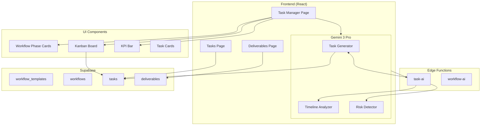
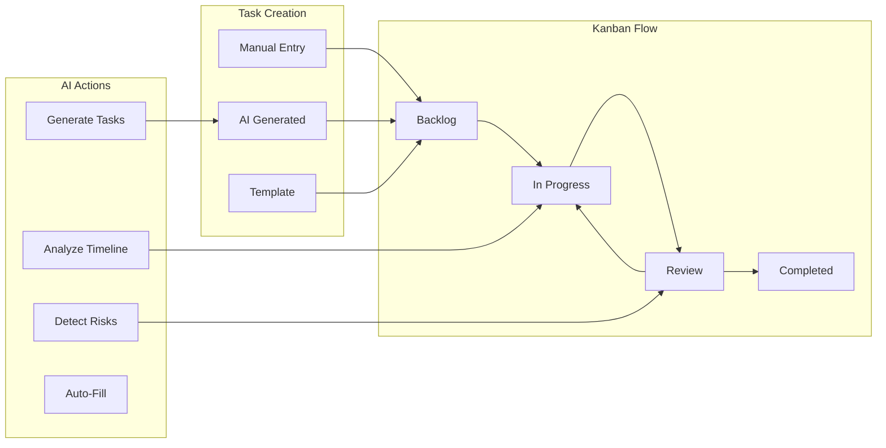
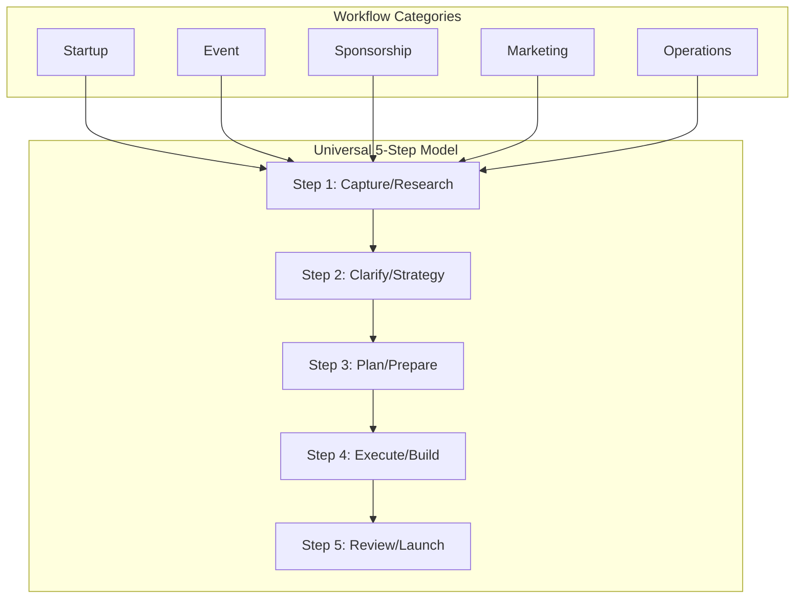
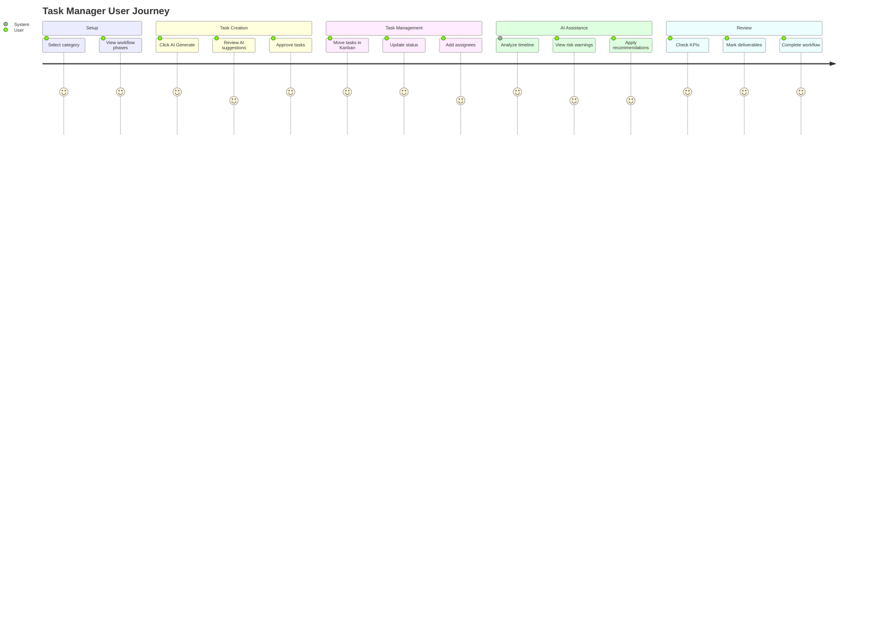

# Universal 5-Step Task System - Master Implementation Plan

**Version:** 1.0  
**Last Updated:** 2025-12-06  
**Status:** 🔴 Planning  
**Sprint:** S3 (Days 7-10)

---

## 📋 Table of Contents

1. [System Overview](#system-overview)
2. [Universal 5-Step Model](#universal-5-step-model)
3. [Page Structure](#page-structure)
4. [Workflow Templates](#workflow-templates)
5. [UI Components](#ui-components)
6. [Gemini AI Modules](#gemini-ai-modules)
7. [Database Schema](#database-schema)
8. [Edge Functions](#edge-functions)
9. [React Components](#react-components)
10. [Responsive Design](#responsive-design)
11. [Multi-Step Prompts](#multi-step-prompts)
12. [Mermaid Diagrams](#mermaid-diagrams)
13. [Success Criteria](#success-criteria)
14. [Implementation Checklist](#implementation-checklist)

---

## System Overview

### Goal

A universal, premium task management system using a consistent 5-step workflow model that adapts to any category (Startups, Events, Sponsorship, Marketing, etc.) with AI-powered automation via Gemini.

### Core Value Proposition

| Problem | Solution |
|---------|----------|
| Scattered task management | Unified 5-step workflow |
| Manual task creation | AI generates task lists |
| No workflow visibility | Visual Kanban + KPI bar |
| Category-specific tools | One universal system |

### System Architecture

```
┌─────────────────────────────────────────────────────────────────────┐
│                 UNIVERSAL 5-STEP TASK SYSTEM                         │
├─────────────────────────────────────────────────────────────────────┤
│                                                                      │
│  ┌─────────────────────────────────────────────────────────────────┐│
│  │                     CATEGORY TAB BAR                            ││
│  │  [Startup] [Event] [Sponsorship] [Marketing] [Operations] ...   ││
│  └─────────────────────────────────────────────────────────────────┘│
│                                                                      │
│  ┌─────────────────────────────────────────────────────────────────┐│
│  │                   5-STEP WORKFLOW CARDS                         ││
│  │                                                                  ││
│  │  ┌─────────┐ ┌─────────┐ ┌─────────┐ ┌─────────┐ ┌─────────┐  ││
│  │  │ STEP 1  │ │ STEP 2  │ │ STEP 3  │ │ STEP 4  │ │ STEP 5  │  ││
│  │  │Research │ │Strategy │ │Planning │ │Execute  │ │ Review  │  ││
│  │  └─────────┘ └─────────┘ └─────────┘ └─────────┘ └─────────┘  ││
│  │                                                                  ││
│  └─────────────────────────────────────────────────────────────────┘│
│                                                                      │
│  ┌─────────────────────────────────────────────────────────────────┐│
│  │                        KPI BAR                                  ││
│  │  🔺 High Priority: 12  │  ⏳ In Progress: 8  │  ✅ Completed: 45 ││
│  └─────────────────────────────────────────────────────────────────┘│
│                                                                      │
│  ┌─────────────────────────────────────────────────────────────────┐│
│  │                     KANBAN BOARD                                ││
│  │  [Backlog] [In Progress] [Review] [Completed]                   ││
│  └─────────────────────────────────────────────────────────────────┘│
│                                                                      │
│  ┌─────────────────────────────────────────────────────────────────┐│
│  │                    GEMINI AI PANEL                              ││
│  │  [Generate Tasks] [Analyze Timeline] [Detect Risks]             ││
│  └─────────────────────────────────────────────────────────────────┘│
│                                                                      │
└─────────────────────────────────────────────────────────────────────┘
```

---

## Universal 5-Step Model

### The Model

Every workflow follows this universal 5-step structure:

| Step | Phase | Description | Key Actions |
|------|-------|-------------|-------------|
| 1 | **Capture** | Gather inputs, ideas, requirements | Brainstorm, collect, document |
| 2 | **Clarify** | Define scope, prioritize, qualify | Research, analyze, validate |
| 3 | **Plan** | Create timeline, assign resources | Schedule, assign, budget |
| 4 | **Execute** | Do the work, track progress | Build, create, deliver |
| 5 | **Review** | Evaluate, learn, iterate | Analyze, report, improve |

### Category Variants

| Category | Step 1 | Step 2 | Step 3 | Step 4 | Step 5 |
|----------|--------|--------|--------|--------|--------|
| **Startup** | Ideation | Research | Validation | Build | Launch |
| **Event** | Brief | Design | Logistics | Execution | Wrap-up |
| **Sponsorship** | Prospect | Pitch | Negotiate | Activate | Report |
| **Marketing** | Research | Strategy | Content | Campaign | Analyze |
| **Operations** | Assess | Plan | Resource | Execute | Optimize |
| **Media** | Brief | Concept | Production | Distribution | Measure |

---

## Page Structure

### A. Header Component

```tsx
// Universal Page Header
┌─────────────────────────────────────────────────────────────────────┐
│                                                                      │
│  📋 Task Manager                              🔍 Search...          │
│  Manage your workflows with AI assistance     [+ New Task]          │
│                                                                      │
│  ┌─────────────────────────────────────────┐   ┌────────────────┐  │
│  │ 🤖 Powered by Gemini AI                  │   │ ⚙️ Settings    │  │
│  └─────────────────────────────────────────┘   └────────────────┘  │
│                                                                      │
└─────────────────────────────────────────────────────────────────────┘
```

### B. Category Tab Bar

```tsx
// Dynamic Category Tabs
┌─────────────────────────────────────────────────────────────────────┐
│                                                                      │
│  ┌──────────┐ ┌────────────┐ ┌─────────────┐ ┌───────────┐ ┌─────┐ │
│  │ Startup  │ │ Event Plan │ │ Sponsorship │ │ Marketing │ │ ... │ │
│  │ ──────── │ │            │ │             │ │           │ │     │ │
│  │  Active  │ │            │ │             │ │           │ │     │ │
│  └──────────┘ └────────────┘ └─────────────┘ └───────────┘ └─────┘ │
│                                                                      │
└─────────────────────────────────────────────────────────────────────┘
```

### C. 5-Step Workflow Card Row

```tsx
// Horizontally scrollable workflow phases
┌─────────────────────────────────────────────────────────────────────┐
│                                                                      │
│  ┌─────────────────┐  ┌─────────────────┐  ┌─────────────────┐     │
│  │ ╭───────────╮   │  │ ╭───────────╮   │  │ ╭───────────╮   │     │
│  │ │  🔍       │   │  │ │  📊       │   │  │ │  📋       │   │     │
│  │ ╰───────────╯   │  │ ╰───────────╯   │  │ ╰───────────╯   │     │
│  │                 │  │                 │  │                 │     │
│  │ ┌───────────┐   │  │ ┌───────────┐   │  │ ┌───────────┐   │     │
│  │ │  STEP 1   │   │  │ │  STEP 2   │   │  │ │  STEP 3   │   │     │
│  │ └───────────┘   │  │ └───────────┘   │  │ └───────────┘   │     │
│  │                 │  │                 │  │                 │     │
│  │ Research        │  │ Strategy        │  │ Planning        │     │
│  │                 │  │                 │  │                 │     │
│  │ Gather inputs   │  │ Define scope    │  │ Create timeline │     │
│  │ and context     │  │ and goals       │  │ and assign      │     │
│  │                 │  │                 │  │                 │     │
│  │ ┌─────────────┐ │  │ ┌─────────────┐ │  │ ┌─────────────┐ │     │
│  │ │ View Tasks  │ │  │ │ View Tasks  │ │  │ │ View Tasks  │ │     │
│  │ └─────────────┘ │  │ └─────────────┘ │  │ └─────────────┘ │     │
│  │                 │  │                 │  │                 │     │
│  │ ┌─────────────┐ │  │ ┌─────────────┐ │  │ ┌─────────────┐ │     │
│  │ │✨ AI Generate│ │  │ │✨ AI Generate│ │  │ │✨ AI Generate│ │     │
│  │ └─────────────┘ │  │ └─────────────┘ │  │ └─────────────┘ │     │
│  │                 │  │                 │  │                 │     │
│  └─────────────────┘  └─────────────────┘  └─────────────────┘     │
│                                                                      │
│     ... [STEP 4 - Execute] [STEP 5 - Review] →                      │
│                                                                      │
└─────────────────────────────────────────────────────────────────────┘
```

### D. KPI Bar

```tsx
// Responsive KPI metrics
┌─────────────────────────────────────────────────────────────────────┐
│                                                                      │
│  ┌─────────────────┐  ┌─────────────────┐  ┌─────────────────┐     │
│  │   🔺 12         │  │   ⏳ 8          │  │   ✅ 45         │     │
│  │   High Priority │  │   In Progress   │  │   Completed     │     │
│  │   ↑ 3 this week │  │   2 due today   │  │   +12 this week │     │
│  │                 │  │                 │  │                 │     │
│  │ bg-red-50       │  │ bg-amber-50    │  │ bg-green-50     │     │
│  └─────────────────┘  └─────────────────┘  └─────────────────┘     │
│                                                                      │
│  ┌─────────────────┐  ┌─────────────────┐                          │
│  │   📅 5          │  │   ⚡ 3          │                          │
│  │   Due This Week │  │   AI Suggested  │                          │
│  │   Next: Mon 9am │  │   Quick wins    │                          │
│  │                 │  │                 │                          │
│  │ bg-blue-50      │  │ bg-violet-50   │                          │
│  └─────────────────┘  └─────────────────┘                          │
│                                                                      │
└─────────────────────────────────────────────────────────────────────┘
```

### E. Kanban Board

```tsx
// Drag-and-drop task board
┌─────────────────────────────────────────────────────────────────────┐
│                                                                      │
│  ┌──────────────┐ ┌──────────────┐ ┌──────────────┐ ┌──────────────┐│
│  │   BACKLOG    │ │ IN PROGRESS  │ │    REVIEW    │ │  COMPLETED   ││
│  │   (15)       │ │     (8)      │ │     (4)      │ │    (45)      ││
│  │──────────────│ │──────────────│ │──────────────│ │──────────────││
│  │              │ │              │ │              │ │              ││
│  │ ┌──────────┐ │ │ ┌──────────┐ │ │ ┌──────────┐ │ │ ┌──────────┐ ││
│  │ │ Task 1   │ │ │ │ Task A   │ │ │ │ Task X   │ │ │ │ Task Z   │ ││
│  │ │ 🔴 High  │ │ │ │ 🟡 Med   │ │ │ │ 🔴 High  │ │ │ │ ✅ Done  │ ││
│  │ │ @John    │ │ │ │ @Sarah   │ │ │ │ @Mike    │ │ │ │ @Jane    │ ││
│  │ │ Due: Mon │ │ │ │ Due: Wed │ │ │ │ Due: Fri │ │ │ │ Done: Tue│ ││
│  │ └──────────┘ │ │ └──────────┘ │ │ └──────────┘ │ │ └──────────┘ ││
│  │              │ │              │ │              │ │              ││
│  │ ┌──────────┐ │ │ ┌──────────┐ │ │              │ │ ┌──────────┐ ││
│  │ │ Task 2   │ │ │ │ Task B   │ │ │              │ │ │ Task Y   │ ││
│  │ │ 🟡 Med   │ │ │ │ 🔴 High  │ │ │              │ │ │ ✅ Done  │ ││
│  │ │ @Lisa    │ │ │ │ @Tom     │ │ │              │ │ │ @Bob     │ ││
│  │ └──────────┘ │ │ └──────────┘ │ │              │ │ └──────────┘ ││
│  │              │ │              │ │              │ │              ││
│  │ + Add Task   │ │              │ │              │ │              ││
│  │              │ │              │ │              │ │              ││
│  └──────────────┘ └──────────────┘ └──────────────┘ └──────────────┘│
│                                                                      │
└─────────────────────────────────────────────────────────────────────┘
```

---

## Workflow Templates

### Startup Workflow (5-Step)

| Step | Phase | Tasks | Deliverables |
|------|-------|-------|--------------|
| 1 | **Ideation** | Brainstorm ideas, Problem validation, Market gap analysis | Problem statement, Initial hypothesis |
| 2 | **Research** | Competitor analysis, Market sizing, User interviews | Market report, TAM/SAM/SOM, User insights |
| 3 | **Validation** | MVP definition, Landing page, Early signups | MVP spec, Waitlist, Validation metrics |
| 4 | **Build** | Development sprints, Design system, Core features | Working product, Documentation |
| 5 | **Launch** | GTM execution, PR/Marketing, User acquisition | Launch metrics, Growth report |

### Event Planning Workflow

| Step | Phase | Tasks | Deliverables |
|------|-------|-------|--------------|
| 1 | **Brief** | Client meeting, Requirements gathering, Budget discussion | Event brief, Budget proposal |
| 2 | **Design** | Theme development, Visual concepts, Vendor research | Design deck, Mood boards |
| 3 | **Logistics** | Venue booking, Vendor contracts, Timeline creation | Contracts, Run of show |
| 4 | **Execution** | Setup coordination, Day-of management, Guest handling | Event photos, Guest list |
| 5 | **Wrap-up** | Feedback collection, Invoice reconciliation, Report | Post-event report, Testimonials |

### Sponsorship Workflow

| Step | Phase | Tasks | Deliverables |
|------|-------|-------|--------------|
| 1 | **Prospect** | Lead generation, Research sponsors, Build list | Prospect list, Research notes |
| 2 | **Pitch** | Create deck, Outreach emails, Initial calls | Pitch deck, Email templates |
| 3 | **Negotiate** | Proposal customization, Contract negotiation, Legal review | Custom proposals, Draft contracts |
| 4 | **Activate** | Logo placement, Brand integration, Deliverable execution | Brand assets, Activation photos |
| 5 | **Report** | Metrics collection, ROI analysis, Renewal discussion | Impact report, Renewal proposal |

### Marketing Campaign Workflow

| Step | Phase | Tasks | Deliverables |
|------|-------|-------|--------------|
| 1 | **Research** | Audience analysis, Competitive review, Trend research | Research report, Audience personas |
| 2 | **Strategy** | Campaign planning, Channel selection, Budget allocation | Strategy doc, Media plan |
| 3 | **Content** | Creative development, Copy writing, Asset production | Creative assets, Copy deck |
| 4 | **Campaign** | Launch execution, Performance monitoring, Optimization | Live campaigns, Daily reports |
| 5 | **Analyze** | Results compilation, ROI calculation, Learnings | Final report, Recommendations |

---

## UI Components

### Task Card Component

```tsx
interface TaskCardProps {
  id: string;
  title: string;
  description?: string;
  priority: 'low' | 'medium' | 'high' | 'urgent';
  status: 'backlog' | 'in_progress' | 'review' | 'completed';
  owner?: User;
  dueDate?: Date;
  category: string;
  phase: number; // 1-5
  tags?: string[];
  subtasks?: Task[];
  aiSuggested?: boolean;
}

// Visual representation
┌────────────────────────────────────────┐
│ ┌──────────────────────────────────┐   │
│ │ 🔴 HIGH │ STEP 2 │ Due: Mon 9am │   │
│ └──────────────────────────────────┘   │
│                                        │
│ Complete market research report        │
│                                        │
│ ┌──────────────────────────────────┐   │
│ │ 📝 3 subtasks │ 1 completed      │   │
│ └──────────────────────────────────┘   │
│                                        │
│ ┌────────────┐  ┌────────────────┐    │
│ │ 👤 @Sarah  │  │ 🏷️ Marketing  │    │
│ └────────────┘  └────────────────┘    │
│                                        │
│ ┌────────────────────────────────────┐ │
│ │ ✨ AI Suggested │ Quick Win       │ │
│ └────────────────────────────────────┘ │
│                                        │
│ ┌──────────────────────────────────┐   │
│ │ ▼ Expand                         │   │
│ └──────────────────────────────────┘   │
└────────────────────────────────────────┘
```

### Workflow Phase Card

```tsx
interface WorkflowPhaseCardProps {
  step: number;
  title: string;
  description: string;
  icon: string;
  taskCount: number;
  completedCount: number;
  deliverableCount: number;
  category: string;
}

// Visual representation
┌─────────────────────────────────────┐
│                                     │
│      ╭─────────────────────╮       │
│      │       🔍            │       │
│      │      (icon)         │       │
│      ╰─────────────────────╯       │
│                                     │
│      ┌─────────────────────┐       │
│      │      STEP 1         │       │
│      └─────────────────────┘       │
│                                     │
│         Research                    │
│                                     │
│   Gather inputs, conduct            │
│   interviews, collect data          │
│                                     │
│   ┌───────────────────────────┐    │
│   │ 📋 8 Tasks │ 3 Completed  │    │
│   └───────────────────────────┘    │
│                                     │
│   ┌───────────────────────────┐    │
│   │      View Tasks           │    │
│   └───────────────────────────┘    │
│                                     │
│   ┌───────────────────────────┐    │
│   │    View Deliverables      │    │
│   └───────────────────────────┘    │
│                                     │
│   ┌───────────────────────────┐    │
│   │ ✨ Generate with AI       │    │
│   └───────────────────────────┘    │
│                                     │
└─────────────────────────────────────┘
```

### KPI Card Component

```tsx
interface KPICardProps {
  icon: string;
  value: number;
  label: string;
  subtext?: string;
  trend?: {
    direction: 'up' | 'down' | 'flat';
    value: string;
  };
  color: 'red' | 'amber' | 'green' | 'blue' | 'violet';
}

// Visual representation
┌─────────────────────────┐
│                         │
│   🔺  12                │
│                         │
│   High Priority         │
│                         │
│   ↑ 3 this week         │
│                         │
│   bg-red-50 / red-100   │
│                         │
└─────────────────────────┘
```

---

## Gemini AI Modules

### AI Features Matrix

| Feature | Model | Tools | Use Case |
|---------|-------|-------|----------|
| **Task Generator** | Gemini 3 Pro | Thinking, Structured | Generate full task lists |
| **Timeline Analyzer** | Gemini 3 Pro | Thinking | Detect schedule risks |
| **Risk Detector** | Gemini 3 Pro | Search, Thinking | Identify blockers |
| **Auto-Fill** | Gemini 2.5 Flash | Structured | Fill missing fields |
| **URL Extractor** | Gemini 3 Pro | URL Context | Parse requirements from URLs |
| **Insight Generator** | Gemini 3 Pro | Thinking | Surface bottlenecks |

### AI Panel Component

```tsx
// Sidebar AI Module
┌─────────────────────────────────────┐
│                                     │
│   ✨ Gemini AI Assistant            │
│                                     │
│   ┌───────────────────────────────┐ │
│   │ 🤖 What would you like to do? │ │
│   └───────────────────────────────┘ │
│                                     │
│   ┌───────────────────────────────┐ │
│   │ 📋 Generate Tasks             │ │
│   │ Create task list for phase    │ │
│   └───────────────────────────────┘ │
│                                     │
│   ┌───────────────────────────────┐ │
│   │ 📊 Analyze Timeline           │ │
│   │ Detect schedule risks         │ │
│   └───────────────────────────────┘ │
│                                     │
│   ┌───────────────────────────────┐ │
│   │ ⚠️ Detect Risks               │ │
│   │ Find potential blockers       │ │
│   └───────────────────────────────┘ │
│                                     │
│   ┌───────────────────────────────┐ │
│   │ 🔗 Extract from URL           │ │
│   │ Parse requirements from link  │ │
│   └───────────────────────────────┘ │
│                                     │
│   ┌───────────────────────────────┐ │
│   │ 💡 Surface Insights           │ │
│   │ Find bottlenecks              │ │
│   └───────────────────────────────┘ │
│                                     │
│   ─────────────────────────────     │
│                                     │
│   Recent Suggestions:               │
│                                     │
│   • 3 tasks overdue - reassign?     │
│   • Research phase 80% done         │
│   • Consider adding QA task         │
│                                     │
└─────────────────────────────────────┘
```

### Function Declarations

#### generateTasksForPhase

```typescript
const generateTasksForPhaseFunctionDeclaration = {
  name: 'generateTasksForPhase',
  description: 'Generate a complete task list for a specific workflow phase',
  parameters: {
    type: Type.OBJECT,
    properties: {
      tasks: {
        type: Type.ARRAY,
        items: {
          type: Type.OBJECT,
          properties: {
            title: { type: Type.STRING },
            description: { type: Type.STRING },
            priority: { type: Type.STRING, enum: ['low', 'medium', 'high', 'urgent'] },
            estimatedHours: { type: Type.NUMBER },
            suggestedOwnerRole: { type: Type.STRING },
            dependencies: { type: Type.ARRAY, items: { type: Type.STRING } },
            deliverables: { type: Type.ARRAY, items: { type: Type.STRING } }
          },
          required: ['title', 'priority']
        }
      },
      reasoning: { type: Type.STRING }
    },
    required: ['tasks']
  }
};
```

#### analyzeTimelineRisks

```typescript
const analyzeTimelineRisksFunctionDeclaration = {
  name: 'analyzeTimelineRisks',
  description: 'Analyze workflow timeline and detect potential risks',
  parameters: {
    type: Type.OBJECT,
    properties: {
      risks: {
        type: Type.ARRAY,
        items: {
          type: Type.OBJECT,
          properties: {
            type: { type: Type.STRING, enum: ['deadline', 'dependency', 'resource', 'scope'] },
            severity: { type: Type.STRING, enum: ['low', 'medium', 'high', 'critical'] },
            description: { type: Type.STRING },
            affectedTasks: { type: Type.ARRAY, items: { type: Type.STRING } },
            recommendation: { type: Type.STRING }
          }
        }
      },
      overallHealth: { type: Type.STRING, enum: ['healthy', 'at_risk', 'critical'] },
      summary: { type: Type.STRING }
    }
  }
};
```

---

## Database Schema

### Table: workflow_templates

```sql
CREATE TABLE workflow_templates (
  id UUID PRIMARY KEY DEFAULT gen_random_uuid(),
  
  -- Template info
  name TEXT NOT NULL,
  category TEXT NOT NULL,
  description TEXT,
  icon TEXT,
  
  -- 5-step definition
  steps JSONB NOT NULL DEFAULT '[]',
  -- Format: [{ step, title, description, defaultTasks }]
  
  -- Metadata
  is_system BOOLEAN DEFAULT false, -- System templates vs user-created
  created_at TIMESTAMPTZ DEFAULT NOW()
);

-- Seed system templates
INSERT INTO workflow_templates (name, category, is_system, steps) VALUES
('Startup Launch', 'startup', true, '[
  {"step": 1, "title": "Ideation", "description": "Brainstorm and validate ideas"},
  {"step": 2, "title": "Research", "description": "Market and competitor analysis"},
  {"step": 3, "title": "Validation", "description": "MVP and early testing"},
  {"step": 4, "title": "Build", "description": "Development and iteration"},
  {"step": 5, "title": "Launch", "description": "Go-to-market execution"}
]'),
('Event Planning', 'event', true, '[
  {"step": 1, "title": "Brief", "description": "Gather requirements"},
  {"step": 2, "title": "Design", "description": "Create concept and visuals"},
  {"step": 3, "title": "Logistics", "description": "Venue, vendors, timeline"},
  {"step": 4, "title": "Execution", "description": "Event day management"},
  {"step": 5, "title": "Wrap-up", "description": "Reporting and follow-up"}
]');
```

### Table: workflows

```sql
CREATE TABLE workflows (
  id UUID PRIMARY KEY DEFAULT gen_random_uuid(),
  org_id UUID REFERENCES orgs(id) NOT NULL,
  template_id UUID REFERENCES workflow_templates(id),
  
  -- Workflow info
  name TEXT NOT NULL,
  category TEXT NOT NULL,
  description TEXT,
  
  -- Custom steps (override template)
  custom_steps JSONB,
  
  -- Status
  status TEXT DEFAULT 'active' CHECK (status IN ('active', 'completed', 'archived')),
  current_phase INTEGER DEFAULT 1,
  progress INTEGER DEFAULT 0 CHECK (progress BETWEEN 0 AND 100),
  
  -- Timestamps
  start_date DATE,
  target_date DATE,
  created_at TIMESTAMPTZ DEFAULT NOW(),
  updated_at TIMESTAMPTZ DEFAULT NOW()
);

-- RLS
ALTER TABLE workflows ENABLE ROW LEVEL SECURITY;
CREATE POLICY "org_isolation" ON workflows
  FOR ALL USING (org_id = auth.jwt()->>'org_id');
```

### Table: tasks

```sql
CREATE TABLE tasks (
  id UUID PRIMARY KEY DEFAULT gen_random_uuid(),
  org_id UUID REFERENCES orgs(id) NOT NULL,
  workflow_id UUID REFERENCES workflows(id),
  
  -- Task details
  title TEXT NOT NULL,
  description TEXT,
  
  -- Classification
  phase INTEGER NOT NULL CHECK (phase BETWEEN 1 AND 5),
  category TEXT NOT NULL,
  task_type TEXT DEFAULT 'task', -- task, milestone, deliverable
  
  -- Status & Priority
  status TEXT DEFAULT 'backlog' CHECK (status IN ('backlog', 'in_progress', 'review', 'completed', 'cancelled')),
  priority TEXT DEFAULT 'medium' CHECK (priority IN ('low', 'medium', 'high', 'urgent')),
  
  -- Assignment
  assignee_id UUID REFERENCES users(id),
  
  -- Dates
  due_date DATE,
  completed_at TIMESTAMPTZ,
  
  -- AI tracking
  ai_generated BOOLEAN DEFAULT false,
  ai_suggested BOOLEAN DEFAULT false,
  
  -- Relationships
  parent_task_id UUID REFERENCES tasks(id), -- For subtasks
  dependencies UUID[], -- Task IDs this depends on
  
  -- Metadata
  tags TEXT[],
  meta JSONB DEFAULT '{}',
  
  -- Timestamps
  created_at TIMESTAMPTZ DEFAULT NOW(),
  updated_at TIMESTAMPTZ DEFAULT NOW()
);

-- Indexes
CREATE INDEX idx_tasks_workflow ON tasks(workflow_id);
CREATE INDEX idx_tasks_phase ON tasks(phase);
CREATE INDEX idx_tasks_status ON tasks(status);
CREATE INDEX idx_tasks_assignee ON tasks(assignee_id);
CREATE INDEX idx_tasks_due ON tasks(due_date);

-- RLS
ALTER TABLE tasks ENABLE ROW LEVEL SECURITY;
CREATE POLICY "org_isolation" ON tasks
  FOR ALL USING (org_id = auth.jwt()->>'org_id');
```

### Table: deliverables

```sql
CREATE TABLE deliverables (
  id UUID PRIMARY KEY DEFAULT gen_random_uuid(),
  org_id UUID REFERENCES orgs(id) NOT NULL,
  workflow_id UUID REFERENCES workflows(id),
  task_id UUID REFERENCES tasks(id),
  
  -- Deliverable info
  name TEXT NOT NULL,
  description TEXT,
  category TEXT,
  
  -- Classification
  phase INTEGER NOT NULL CHECK (phase BETWEEN 1 AND 5),
  deliverable_type TEXT, -- document, asset, report, etc.
  
  -- Status
  status TEXT DEFAULT 'pending' CHECK (status IN ('pending', 'in_progress', 'review', 'approved', 'delivered')),
  
  -- Assignment
  owner_id UUID REFERENCES users(id),
  
  -- Dates
  due_date DATE,
  delivered_at TIMESTAMPTZ,
  
  -- File attachment
  file_url TEXT,
  file_type TEXT,
  
  -- AI tracking
  ai_risk_level TEXT, -- low, medium, high
  ai_recommendation TEXT,
  
  -- Metadata
  meta JSONB DEFAULT '{}',
  created_at TIMESTAMPTZ DEFAULT NOW()
);

-- RLS
ALTER TABLE deliverables ENABLE ROW LEVEL SECURITY;
CREATE POLICY "org_isolation" ON deliverables
  FOR ALL USING (org_id = auth.jwt()->>'org_id');
```

---

## Edge Functions

### task-ai/index.ts

```typescript
// supabase/functions/task-ai/index.ts

import { GoogleGenAI, Type } from "npm:@google/genai@1.29.0";
import { createClient } from "npm:@supabase/supabase-js@2.45.0";

const corsHeaders = {
  'Access-Control-Allow-Origin': '*',
  'Access-Control-Allow-Headers': 'authorization, x-client-info, apikey, content-type',
};

// Function declarations
const generateTasksForPhaseFunctionDeclaration = {
  name: 'generateTasksForPhase',
  description: 'Generate tasks for a workflow phase',
  parameters: {
    type: Type.OBJECT,
    properties: {
      tasks: {
        type: Type.ARRAY,
        items: {
          type: Type.OBJECT,
          properties: {
            title: { type: Type.STRING },
            description: { type: Type.STRING },
            priority: { type: Type.STRING },
            estimatedHours: { type: Type.NUMBER },
            suggestedOwnerRole: { type: Type.STRING }
          },
          required: ['title', 'priority']
        }
      }
    },
    required: ['tasks']
  }
};

const analyzeTimelineRisksFunctionDeclaration = {
  name: 'analyzeTimelineRisks',
  description: 'Analyze timeline and detect risks',
  parameters: {
    type: Type.OBJECT,
    properties: {
      risks: {
        type: Type.ARRAY,
        items: {
          type: Type.OBJECT,
          properties: {
            type: { type: Type.STRING },
            severity: { type: Type.STRING },
            description: { type: Type.STRING },
            recommendation: { type: Type.STRING }
          }
        }
      },
      overallHealth: { type: Type.STRING },
      summary: { type: Type.STRING }
    }
  }
};

Deno.serve(async (req) => {
  if (req.method === 'OPTIONS') {
    return new Response('ok', { headers: corsHeaders });
  }

  try {
    const { action, workflowId, phase, category, context } = await req.json();

    const apiKey = Deno.env.get('GEMINI_API_KEY');
    if (!apiKey) throw new Error('GEMINI_API_KEY not configured');

    const ai = new GoogleGenAI({ apiKey });

    let response;
    let functionName;

    switch (action) {
      case 'generateTasks':
        functionName = 'generateTasksForPhase';
        const taskPrompt = `
You are a project management expert. Generate a comprehensive task list for:

Category: ${category}
Phase: ${phase} (Step ${phase} of 5)
Context: ${context || 'General workflow'}

Create 5-8 actionable tasks appropriate for this phase.
Consider dependencies, priorities, and realistic time estimates.
        `;

        response = await ai.models.generateContent({
          model: 'gemini-3-pro-preview',
          contents: taskPrompt,
          config: {
            thinkingConfig: { thinkingBudget: 512 },
            tools: [{ functionDeclarations: [generateTasksForPhaseFunctionDeclaration] }]
          }
        });
        break;

      case 'analyzeTimeline':
        functionName = 'analyzeTimelineRisks';
        
        // Fetch current tasks for analysis
        const supabase = createClient(
          Deno.env.get('SUPABASE_URL')!,
          Deno.env.get('SUPABASE_SERVICE_ROLE_KEY')!
        );

        const { data: tasks } = await supabase
          .from('tasks')
          .select('*')
          .eq('workflow_id', workflowId);

        const timelinePrompt = `
Analyze this workflow's timeline and identify risks:

Tasks: ${JSON.stringify(tasks)}

Look for:
- Overdue tasks
- Dependency conflicts
- Resource bottlenecks
- Scope creep indicators

Provide actionable recommendations.
        `;

        response = await ai.models.generateContent({
          model: 'gemini-3-pro-preview',
          contents: timelinePrompt,
          config: {
            thinkingConfig: { thinkingBudget: 1024 },
            tools: [{ functionDeclarations: [analyzeTimelineRisksFunctionDeclaration] }]
          }
        });
        break;

      default:
        throw new Error(`Unknown action: ${action}`);
    }

    // Extract function call result
    const functionCall = response.candidates?.[0]?.content?.parts?.find(
      p => p.functionCall?.name === functionName
    );

    return new Response(
      JSON.stringify({ success: true, data: functionCall?.functionCall?.args || {} }),
      { headers: { ...corsHeaders, 'Content-Type': 'application/json' } }
    );

  } catch (error: any) {
    console.error('Error:', error);
    return new Response(
      JSON.stringify({ success: false, error: error.message }),
      { status: 500, headers: { ...corsHeaders, 'Content-Type': 'application/json' } }
    );
  }
});
```

---

## React Components

### Component Tree

```
📁 screens/
├── TaskManager.tsx           # Main task page
├── TasksPage.tsx             # Phase-specific tasks
└── DeliverablesPage.tsx      # Deliverables table

📁 components/task-system/
├── TaskHeader.tsx            # Page header
├── CategoryTabs.tsx          # Category tab bar
├── WorkflowPhaseCards.tsx    # 5-step card row
├── WorkflowPhaseCard.tsx     # Single phase card
├── KPIBar.tsx                # KPI metrics row
├── KPICard.tsx               # Single KPI card
├── KanbanBoard.tsx           # Kanban view
├── KanbanColumn.tsx          # Single column
├── TaskCard.tsx              # Task card
├── TaskDetailDrawer.tsx      # Task detail panel
├── DeliverableRow.tsx        # Deliverable table row
├── AIPanel.tsx               # Gemini AI sidebar
└── AIActionButton.tsx        # AI action button

📁 stores/
└── taskStore.ts              # Zustand store

📁 services/
└── taskService.ts            # API calls
```

### TaskManager.tsx (Main Page)

```tsx
// screens/TaskManager.tsx

import React, { useState } from 'react';
import { TaskHeader } from '../components/task-system/TaskHeader';
import { CategoryTabs } from '../components/task-system/CategoryTabs';
import { WorkflowPhaseCards } from '../components/task-system/WorkflowPhaseCards';
import { KPIBar } from '../components/task-system/KPIBar';
import { KanbanBoard } from '../components/task-system/KanbanBoard';
import { AIPanel } from '../components/task-system/AIPanel';

const CATEGORIES = [
  { id: 'startup', name: 'Startup Growth', icon: '🚀' },
  { id: 'event', name: 'Event Planning', icon: '🎉' },
  { id: 'sponsorship', name: 'Sponsorship', icon: '🤝' },
  { id: 'marketing', name: 'Marketing', icon: '📣' },
  { id: 'operations', name: 'Operations', icon: '⚙️' },
  { id: 'media', name: 'Media & Content', icon: '🎬' },
];

const TaskManager: React.FC = () => {
  const [activeCategory, setActiveCategory] = useState('startup');
  const [showAIPanel, setShowAIPanel] = useState(false);
  const [viewMode, setViewMode] = useState<'kanban' | 'list'>('kanban');

  return (
    <div className="min-h-screen bg-slate-50">
      {/* Header */}
      <TaskHeader
        title="Task Manager"
        description="Manage your workflows with AI assistance"
        onNewTask={() => {/* open modal */}}
        onToggleAI={() => setShowAIPanel(!showAIPanel)}
      />

      {/* Category Tabs */}
      <div className="px-6 py-4 border-b border-slate-200 bg-white">
        <CategoryTabs
          categories={CATEGORIES}
          active={activeCategory}
          onChange={setActiveCategory}
        />
      </div>

      {/* Main Content */}
      <div className="flex">
        {/* Content Area */}
        <div className={`flex-1 p-6 ${showAIPanel ? 'pr-80' : ''}`}>
          {/* 5-Step Workflow Cards */}
          <WorkflowPhaseCards category={activeCategory} />

          {/* KPI Bar */}
          <div className="my-6">
            <KPIBar category={activeCategory} />
          </div>

          {/* View Toggle */}
          <div className="flex justify-between items-center mb-4">
            <h2 className="text-lg font-semibold text-slate-800">Tasks</h2>
            <div className="flex gap-2">
              <button
                onClick={() => setViewMode('kanban')}
                className={`px-3 py-1.5 rounded-lg text-sm ${
                  viewMode === 'kanban'
                    ? 'bg-indigo-100 text-indigo-700'
                    : 'text-slate-600 hover:bg-slate-100'
                }`}
              >
                Kanban
              </button>
              <button
                onClick={() => setViewMode('list')}
                className={`px-3 py-1.5 rounded-lg text-sm ${
                  viewMode === 'list'
                    ? 'bg-indigo-100 text-indigo-700'
                    : 'text-slate-600 hover:bg-slate-100'
                }`}
              >
                List
              </button>
            </div>
          </div>

          {/* Kanban Board */}
          <KanbanBoard category={activeCategory} />
        </div>

        {/* AI Panel (Sidebar) */}
        {showAIPanel && (
          <AIPanel
            category={activeCategory}
            onClose={() => setShowAIPanel(false)}
          />
        )}
      </div>
    </div>
  );
};

export default TaskManager;
```

### WorkflowPhaseCard.tsx

```tsx
// components/task-system/WorkflowPhaseCard.tsx

import React from 'react';

interface WorkflowPhaseCardProps {
  step: number;
  title: string;
  description: string;
  icon: string;
  taskCount: number;
  completedCount: number;
  onViewTasks: () => void;
  onViewDeliverables: () => void;
  onGenerateAI: () => void;
}

const WorkflowPhaseCard: React.FC<WorkflowPhaseCardProps> = ({
  step,
  title,
  description,
  icon,
  taskCount,
  completedCount,
  onViewTasks,
  onViewDeliverables,
  onGenerateAI,
}) => {
  const progress = taskCount > 0 ? Math.round((completedCount / taskCount) * 100) : 0;

  return (
    <div className="flex-shrink-0 w-64 bg-white rounded-2xl shadow-sm border border-slate-200 p-5 hover:shadow-md transition-shadow">
      {/* Icon */}
      <div className="w-12 h-12 bg-gradient-to-br from-indigo-100 to-violet-100 rounded-xl flex items-center justify-center text-2xl mb-4">
        {icon}
      </div>

      {/* Step Badge */}
      <div className="inline-flex px-3 py-1 bg-slate-100 rounded-full text-xs font-medium text-slate-600 mb-3">
        STEP {step}
      </div>

      {/* Title & Description */}
      <h3 className="text-lg font-semibold text-slate-800 mb-1">{title}</h3>
      <p className="text-sm text-slate-500 mb-4 line-clamp-2">{description}</p>

      {/* Progress */}
      <div className="mb-4">
        <div className="flex justify-between text-xs text-slate-500 mb-1">
          <span>{completedCount} of {taskCount} tasks</span>
          <span>{progress}%</span>
        </div>
        <div className="h-2 bg-slate-100 rounded-full overflow-hidden">
          <div
            className="h-full bg-gradient-to-r from-indigo-500 to-violet-500 rounded-full transition-all"
            style={{ width: `${progress}%` }}
          />
        </div>
      </div>

      {/* Action Buttons */}
      <div className="space-y-2">
        <button
          onClick={onViewTasks}
          className="w-full px-3 py-2 bg-slate-100 hover:bg-slate-200 rounded-lg text-sm font-medium text-slate-700 transition-colors"
        >
          View Tasks
        </button>
        <button
          onClick={onViewDeliverables}
          className="w-full px-3 py-2 bg-slate-100 hover:bg-slate-200 rounded-lg text-sm font-medium text-slate-700 transition-colors"
        >
          View Deliverables
        </button>
        <button
          onClick={onGenerateAI}
          className="w-full px-3 py-2 bg-gradient-to-r from-indigo-500 to-violet-500 hover:from-indigo-600 hover:to-violet-600 rounded-lg text-sm font-medium text-white transition-colors flex items-center justify-center gap-2"
        >
          <span>✨</span>
          Generate with AI
        </button>
      </div>
    </div>
  );
};

export default WorkflowPhaseCard;
```

### TaskCard.tsx

```tsx
// components/task-system/TaskCard.tsx

import React from 'react';

interface TaskCardProps {
  id: string;
  title: string;
  description?: string;
  priority: 'low' | 'medium' | 'high' | 'urgent';
  status: string;
  owner?: { name: string; avatar?: string };
  dueDate?: string;
  phase: number;
  category: string;
  subtaskCount?: number;
  completedSubtasks?: number;
  aiSuggested?: boolean;
  onClick: () => void;
  onDragStart?: (e: React.DragEvent) => void;
}

const priorityColors = {
  low: 'bg-green-100 text-green-700',
  medium: 'bg-amber-100 text-amber-700',
  high: 'bg-orange-100 text-orange-700',
  urgent: 'bg-red-100 text-red-700',
};

const priorityIcons = {
  low: '🟢',
  medium: '🟡',
  high: '🟠',
  urgent: '🔴',
};

const TaskCard: React.FC<TaskCardProps> = ({
  id,
  title,
  description,
  priority,
  status,
  owner,
  dueDate,
  phase,
  category,
  subtaskCount,
  completedSubtasks,
  aiSuggested,
  onClick,
  onDragStart,
}) => {
  return (
    <div
      className="bg-white rounded-xl border border-slate-200 p-4 cursor-pointer hover:shadow-md hover:border-indigo-200 transition-all"
      onClick={onClick}
      draggable
      onDragStart={onDragStart}
    >
      {/* Header Row */}
      <div className="flex items-center gap-2 mb-2 flex-wrap">
        <span className={`px-2 py-0.5 rounded-full text-xs font-medium ${priorityColors[priority]}`}>
          {priorityIcons[priority]} {priority.toUpperCase()}
        </span>
        <span className="px-2 py-0.5 bg-slate-100 rounded-full text-xs text-slate-600">
          STEP {phase}
        </span>
        {dueDate && (
          <span className="px-2 py-0.5 bg-blue-50 rounded-full text-xs text-blue-600">
            📅 {dueDate}
          </span>
        )}
      </div>

      {/* Title */}
      <h4 className="font-medium text-slate-800 mb-1 line-clamp-2">{title}</h4>

      {/* Description */}
      {description && (
        <p className="text-sm text-slate-500 mb-3 line-clamp-2">{description}</p>
      )}

      {/* Subtasks */}
      {subtaskCount && subtaskCount > 0 && (
        <div className="flex items-center gap-2 text-xs text-slate-500 mb-3">
          <span>📝 {subtaskCount} subtasks</span>
          <span>•</span>
          <span>{completedSubtasks || 0} completed</span>
        </div>
      )}

      {/* Footer Row */}
      <div className="flex items-center justify-between">
        <div className="flex items-center gap-2">
          {owner && (
            <div className="flex items-center gap-1.5">
              <div className="w-6 h-6 bg-indigo-100 rounded-full flex items-center justify-center text-xs font-medium text-indigo-600">
                {owner.avatar || owner.name.charAt(0)}
              </div>
              <span className="text-xs text-slate-600">@{owner.name}</span>
            </div>
          )}
        </div>

        <div className="flex items-center gap-2">
          <span className="px-2 py-0.5 bg-slate-100 rounded text-xs text-slate-600">
            {category}
          </span>
          {aiSuggested && (
            <span className="px-2 py-0.5 bg-violet-100 rounded text-xs text-violet-600">
              ✨ AI
            </span>
          )}
        </div>
      </div>

      {/* Expand Arrow */}
      <div className="mt-3 pt-3 border-t border-slate-100">
        <button className="w-full text-xs text-slate-400 hover:text-slate-600 flex items-center justify-center gap-1">
          <span>▼</span> Expand
        </button>
      </div>
    </div>
  );
};

export default TaskCard;
```

---

## Responsive Design

### Breakpoint Rules

| Breakpoint | Screen | Layout Adjustments |
|------------|--------|-------------------|
| `xl` (1280px+) | Desktop | 5 cards row, full Kanban, AI sidebar |
| `lg` (1024px) | Laptop | 4 cards row, Kanban scroll, AI modal |
| `md` (768px) | Tablet | 3 cards row, 2-column tasks |
| `sm` (640px) | Mobile | 1 card row, stacked layout |

### Responsive Component Examples

```tsx
// WorkflowPhaseCards - Responsive Grid
<div className="flex gap-4 overflow-x-auto pb-4 snap-x snap-mandatory
  md:grid md:grid-cols-3 md:overflow-visible
  lg:grid-cols-4
  xl:grid-cols-5">
  {phases.map(phase => (
    <div key={phase.step} className="snap-start">
      <WorkflowPhaseCard {...phase} />
    </div>
  ))}
</div>

// KPIBar - Responsive Grid
<div className="grid grid-cols-2 gap-4
  md:grid-cols-3
  lg:grid-cols-5">
  {kpis.map(kpi => (
    <KPICard key={kpi.label} {...kpi} />
  ))}
</div>

// Kanban Board - Responsive
<div className="flex gap-4 overflow-x-auto pb-4
  lg:grid lg:grid-cols-4 lg:overflow-visible">
  {columns.map(column => (
    <KanbanColumn key={column.id} {...column} />
  ))}
</div>

// Category Tabs - Horizontal Scroll on Mobile
<div className="flex gap-2 overflow-x-auto pb-2 -mx-6 px-6
  md:mx-0 md:px-0 md:flex-wrap">
  {categories.map(cat => (
    <button key={cat.id} className="flex-shrink-0 ...">
      {cat.icon} {cat.name}
    </button>
  ))}
</div>
```

---

## Multi-Step Prompts

### Task Generation Prompt

```markdown
# Task Generator - System Prompt

You are an expert project manager generating tasks for a workflow phase.

## Context
- Category: {category}
- Phase: Step {phase} of 5 ({phaseName})
- Workflow Description: {description}
- Existing Tasks: {existingTasks}

## Task Generation Rules

1. **Quantity**: Generate 5-8 tasks appropriate for this phase
2. **Actionable**: Each task should be specific and completable
3. **Prioritized**: Include mix of priorities (mostly medium, some high, few low)
4. **Realistic**: Time estimates should be reasonable (1-8 hours typical)
5. **Dependencies**: Note any dependencies on other tasks
6. **Deliverables**: Link tasks to expected outputs

## Phase-Specific Guidance

### Step 1 - Research/Ideation
Focus on: Discovery, analysis, brainstorming, requirement gathering

### Step 2 - Strategy/Definition
Focus on: Planning, goal-setting, scope definition, resource allocation

### Step 3 - Planning/Preparation
Focus on: Detailed planning, scheduling, coordination, setup

### Step 4 - Execution/Build
Focus on: Creating, building, implementing, producing

### Step 5 - Review/Launch
Focus on: Testing, reviewing, launching, measuring, reporting

## Output Schema

Return via generateTasksForPhase function with:
- tasks: array of task objects
- reasoning: brief explanation of task selection
```

### Timeline Analysis Prompt

```markdown
# Timeline Analyzer - System Prompt

You are analyzing a workflow's timeline for potential risks.

## Input Data
- All tasks with status, due dates, assignees
- Dependencies between tasks
- Current date: {currentDate}
- Target completion: {targetDate}

## Risk Categories

1. **Deadline Risks**
   - Overdue tasks
   - Tasks due soon with low progress
   - Compressed timelines

2. **Dependency Risks**
   - Blocked tasks
   - Chain dependencies at risk
   - Circular dependencies

3. **Resource Risks**
   - Overloaded team members
   - Unassigned critical tasks
   - Skill gaps

4. **Scope Risks**
   - Too many tasks for timeline
   - Missing critical tasks
   - Scope creep indicators

## Analysis Requirements

1. Calculate overall health score
2. Identify top 5 risks
3. Provide specific recommendations
4. Suggest timeline adjustments if needed

## Output

Return via analyzeTimelineRisks function.
```

---

## Mermaid Diagrams

### System Architecture



### 5-Step Workflow State Machine

```mermaid
stateDiagram-v2
    [*] --> Step1_Research
    Step1_Research --> Step2_Strategy: Phase complete
    Step2_Strategy --> Step3_Planning: Phase complete
    Step3_Planning --> Step4_Execute: Phase complete
    Step4_Execute --> Step5_Review: Phase complete
    Step5_Review --> [*]: Workflow complete

    state Step1_Research {
        [*] --> Backlog1
        Backlog1 --> InProgress1
        InProgress1 --> Review1
        Review1 --> Completed1
    }

    state Step2_Strategy {
        [*] --> Backlog2
        Backlog2 --> InProgress2
        InProgress2 --> Review2
        Review2 --> Completed2
    }

    state Step3_Planning {
        [*] --> Backlog3
        Backlog3 --> InProgress3
        InProgress3 --> Review3
        Review3 --> Completed3
    }

    state Step4_Execute {
        [*] --> Backlog4
        Backlog4 --> InProgress4
        InProgress4 --> Review4
        Review4 --> Completed4
    }

    state Step5_Review {
        [*] --> Backlog5
        Backlog5 --> InProgress5
        InProgress5 --> Review5
        Review5 --> Completed5
    }
```



### Task Flow Diagram



### Category-Phase Mapping



### User Journey



---

## Success Criteria

### Functional Tests

| Test | Criteria | Status |
|------|----------|--------|
| Category switching | Tabs load correct workflows | 🔴 |
| Phase cards render | 5 cards per category | 🔴 |
| Task CRUD | Create, read, update, delete | 🔴 |
| Kanban drag-drop | Tasks move between columns | 🔴 |
| AI task generation | Returns 5-8 valid tasks | 🔴 |
| Timeline analysis | Detects risks accurately | 🔴 |
| Responsive layout | Works on all breakpoints | 🔴 |

### Performance Tests

| Test | Criteria | Status |
|------|----------|--------|
| Page load | < 2 seconds | 🔴 |
| AI generation | < 10 seconds | 🔴 |
| Kanban render | 100+ tasks smooth | 🔴 |
| Filter response | < 300ms | 🔴 |

### Acceptance Tests

```yaml
# Test 1: Full Workflow Setup
Given: User on Task Manager
When:
  - Select "Startup" category
  - Click "Generate with AI" on Step 1
Then:
  - 5-8 tasks generated
  - Tasks appear in Backlog
  - AI badge shown on cards

# Test 2: Kanban Management
Given: Tasks in Backlog
When:
  - Drag task to "In Progress"
  - Assign team member
  - Set due date
Then:
  - Task moves instantly
  - Status updates in DB
  - KPI bar updates

# Test 3: Timeline Analysis
Given: Workflow with mixed task statuses
When: Click "Analyze Timeline"
Then:
  - Risks identified
  - Recommendations shown
  - Severity levels accurate

# Test 4: Responsive Layout
Given: Desktop view
When: Resize to mobile
Then:
  - Cards stack vertically
  - Tabs scroll horizontally
  - Kanban scrolls
  - No content overflow
```

---

## Implementation Checklist

### Sprint 3 (Days 7-10) - Foundation

#### Day 7: Database & Templates
- [ ] Create `workflow_templates` migration
- [ ] Create `workflows` migration
- [ ] Create `tasks` migration
- [ ] Create `deliverables` migration
- [ ] Seed workflow templates (6 categories)
- [ ] Add RLS policies

#### Day 8: Edge Functions
- [ ] Create `task-ai` Edge Function
- [ ] Implement `generateTasks` action
- [ ] Implement `analyzeTimeline` action
- [ ] Deploy and test

#### Day 9: Core UI
- [ ] Create `TaskManager` page
- [ ] Create `CategoryTabs` component
- [ ] Create `WorkflowPhaseCards` component
- [ ] Create `WorkflowPhaseCard` component
- [ ] Create `KPIBar` component
- [ ] Create `KPICard` component

#### Day 10: Kanban & Tasks
- [ ] Create `KanbanBoard` component
- [ ] Create `KanbanColumn` component
- [ ] Create `TaskCard` component
- [ ] Implement drag-and-drop
- [ ] Create `AIPanel` component
- [ ] Wire up AI generation

### Sprint 4 (Days 11-14) - Polish

- [ ] Create `TasksPage` (phase detail)
- [ ] Create `DeliverablesPage`
- [ ] Create `TaskDetailDrawer`
- [ ] Implement filters
- [ ] Add responsive styles
- [ ] Create Zustand store
- [ ] E2E testing
- [ ] Bug fixes
- [ ] Production deploy

---

## Quick Reference

### API Endpoints

| Endpoint | Method | Description |
|----------|--------|-------------|
| `/functions/v1/task-ai` | POST | AI task operations |
| `/rest/v1/tasks` | GET/POST/PATCH | Task CRUD |
| `/rest/v1/workflows` | GET/POST | Workflow CRUD |
| `/rest/v1/deliverables` | GET/POST | Deliverable CRUD |

### Service Methods

```typescript
// services/taskService.ts
getTasks(workflowId, filters): Promise<Task[]>
createTask(task): Promise<Task>
updateTask(id, updates): Promise<Task>
moveTask(id, status): Promise<Task>
generateTasks(workflowId, phase): Promise<Task[]>
analyzeTimeline(workflowId): Promise<TimelineAnalysis>
```

### Store Actions

```typescript
// stores/taskStore.ts (Zustand)
setCategory(category): void
setPhase(phase): void
fetchTasks(workflowId): void
addTask(task): void
updateTaskStatus(id, status): void
generateAITasks(phase): void
```

---

**Last Updated:** 2025-12-06  
**Author:** Sun AI Team  
**Status:** Ready for Implementation

