# Document System - AI-Powered Startup Document Factory

**Version:** 1.0  
**Last Updated:** 2025-12-06  
**Status:** 🔴 Planning  
**Sprint:** S3 (Days 7-10)

---

## 📋 Table of Contents

1. [Overview](#overview)
2. [The 10 Essential Documents](#the-10-essential-documents)
3. [Gemini 3 Features & Tools](#gemini-3-features--tools)
4. [System Architecture](#system-architecture)
5. [Process Flows](#process-flows)
6. [Multi-Step Prompts](#multi-step-prompts)
7. [Database Schema](#database-schema)
8. [Edge Functions](#edge-functions)
9. [Frontend Components](#frontend-components)
10. [Workflows & Tasks](#workflows--tasks)
11. [Success Criteria](#success-criteria)
12. [Mermaid Diagrams](#mermaid-diagrams)

---

## Overview

The Document System is an AI-powered factory that generates, edits, and exports the 10 essential documents every early-stage startup needs. It leverages Gemini 3 Pro's advanced capabilities including structured outputs, function calling, Google Search grounding, URL context extraction, RAG file search, and code execution.

### Core Value Proposition

| Problem | Solution |
|---------|----------|
| Founders waste 60+ hours on pitch decks | Generate in < 2 minutes |
| Documents are inconsistent | Single source of truth with AI consistency |
| Market data is stale/made up | Real-time Google Search grounding |
| Numbers don't match across docs | Structured outputs ensure consistency |
| Export is painful | One-click PDF, PPTX, Notion, Google Docs |

---

## The 10 Essential Documents

### Document Matrix

| # | Document | Purpose | Audience | Pages | AI Model |
|---|----------|---------|----------|-------|----------|
| 1 | **Pitch Deck** | Investor presentation | Investors, Partners | 10-12 slides | Gemini 3 Pro |
| 2 | **One-Pager** | Quick intro summary | Cold outreach, Accelerators | 1 page | Gemini 2.5 Flash |
| 3 | **Executive Summary** | Snapshot paragraph | Early conversations | 1-2 paragraphs | Gemini 2.5 Flash |
| 4 | **Business Plan** | Strategy outline | Team, Advisors | 5-10 pages | Gemini 3 Pro |
| 5 | **Financial Model** | Revenue, costs, runway | Investors, Board | Spreadsheet | Gemini + Code Exec |
| 6 | **GTM Strategy** | Go-to-market plan | Team, Investors | 3-5 pages | Gemini 3 Pro |
| 7 | **Market Research** | TAM/SAM/SOM, competitors | Investors, Team | 5-8 pages | Gemini 3 Pro |
| 8 | **Product Roadmap** | Feature timeline | Team, Users | 1-2 pages | Gemini 2.5 Flash |
| 9 | **Legal Checklist** | Compliance, IP, contracts | Founders, Lawyers | 2-3 pages | Gemini 2.5 Flash |
| 10 | **Data Room Checklist** | Due diligence folder | Investors | Folder structure | Gemini 2.5 Flash |

### Document Categories

```
📁 STORYTELLING DOCUMENTS
├── Pitch Deck (Investor story)
├── One-Pager (Quick intro)
└── Executive Summary (Snapshot)

📁 BUSINESS UNDERSTANDING
├── Business Plan / Lean Canvas
├── GTM Strategy
├── Market Research
└── Financial Model

📁 EXECUTION DOCUMENTS
└── Product Roadmap

📁 LEGAL & COMPLIANCE
├── Legal Documents
└── Data Room Checklist
```

---

## Gemini 3 Features & Tools

### Feature Usage by Document

| Feature | Pitch Deck | One-Pager | Exec Sum | Biz Plan | Financials | GTM | Market | Roadmap | Legal | Data Room |
|---------|------------|-----------|----------|----------|------------|-----|--------|---------|-------|-----------|
| **Text Generation** | ✅ | ✅ | ✅ | ✅ | ✅ | ✅ | ✅ | ✅ | ✅ | ✅ |
| **Structured Output** | ✅ | ✅ | ✅ | ✅ | ✅ | ✅ | ✅ | ✅ | ✅ | ✅ |
| **Thinking (High)** | ✅ | ❌ | ❌ | ✅ | ✅ | ✅ | ✅ | ❌ | ❌ | ❌ |
| **Google Search** | ✅ | ❌ | ❌ | ✅ | ✅ | ✅ | ✅ | ❌ | ✅ | ❌ |
| **URL Context** | ✅ | ✅ | ✅ | ✅ | ❌ | ✅ | ✅ | ✅ | ❌ | ❌ |
| **RAG File Search** | ✅ | ✅ | ✅ | ✅ | ✅ | ✅ | ✅ | ✅ | ❌ | ✅ |
| **Code Execution** | ❌ | ❌ | ❌ | ❌ | ✅ | ❌ | ❌ | ❌ | ❌ | ❌ |
| **Function Calling** | ✅ | ✅ | ✅ | ✅ | ✅ | ✅ | ✅ | ✅ | ✅ | ✅ |

### Feature Descriptions

#### 1. Text Generation + Thinking
```yaml
Purpose: Generate high-quality content with deep reasoning
Use Cases:
  - First drafts of all document sections
  - Rewriting content for different audiences
  - Maintaining consistency across documents
Settings:
  - thinkingLevel: "high" for complex docs (pitch deck, GTM, market research)
  - thinkingLevel: "low" for simple docs (one-pager, checklist)
```

#### 2. Structured Outputs
```yaml
Purpose: Return JSON instead of plain text for UI mapping
Use Cases:
  - Pitch deck slides array
  - One-pager sections
  - Financial model tables
  - Checklist items
Benefits:
  - No parsing required
  - Direct mapping to UI components
  - Easy database storage
  - Consistent format across generations
```

#### 3. Google Search Grounding
```yaml
Purpose: Real-world data instead of hallucinated facts
Use Cases:
  - Market size (TAM/SAM/SOM) research
  - Competitor analysis
  - Industry benchmarks
  - Financial assumptions (CAC, LTV, margins)
  - Legal requirements by jurisdiction
Benefits:
  - Up-to-date information
  - Verifiable sources
  - Citations for credibility
```

#### 4. URL Context Tool
```yaml
Purpose: Extract information from startup's website
Use Cases:
  - Pull tagline, features, pricing from website
  - Understand product from landing page
  - Extract team info from about page
  - Analyze competitor websites
Benefits:
  - No manual re-typing
  - Accurate product descriptions
  - Consistent branding
```

#### 5. RAG File Search
```yaml
Purpose: Search uploaded files for context
Use Cases:
  - Previous pitch decks
  - Customer interview notes
  - Analytics reports (Stripe, GA, Mixpanel)
  - Meeting notes
  - Internal documents
Benefits:
  - Use existing data
  - Update traction slides with real metrics
  - Create data room from existing docs
```

#### 6. Code Execution
```yaml
Purpose: Run calculations in sandbox
Use Cases:
  - Financial model projections
  - CSV data aggregation
  - Growth curve calculations
  - Cohort analysis
  - Sensitivity tables
Benefits:
  - Accurate calculations
  - Data visualizations
  - Complex financial modeling
```

#### 7. Function Calling
```yaml
Purpose: AI decides when to call backend functions
Functions:
  - create_document(type, content)
  - update_document_section(doc_id, section, content)
  - generate_financial_inputs(assumptions)
  - summarize_document(doc_id)
  - export_document(doc_id, format)
Benefits:
  - Autonomous document creation
  - Smart section updates
  - Seamless backend integration
```

---

## System Architecture

### High-Level Architecture

```
┌─────────────────────────────────────────────────────────────────────┐
│                         DOCUMENT SYSTEM                              │
├─────────────────────────────────────────────────────────────────────┤
│                                                                      │
│  ┌──────────────┐   ┌──────────────┐   ┌──────────────┐            │
│  │   Document   │   │   Document   │   │   Document   │            │
│  │     Hub      │   │    Wizard    │   │    Editor    │            │
│  │  (Dashboard) │   │   (Create)   │   │    (Edit)    │            │
│  └──────┬───────┘   └──────┬───────┘   └──────┬───────┘            │
│         │                  │                  │                     │
│         └──────────────────┼──────────────────┘                     │
│                            │                                        │
│                            ▼                                        │
│  ┌──────────────────────────────────────────────────────────────┐  │
│  │                     Document Service                          │  │
│  │  - generateDocument()  - updateSection()  - exportDocument()  │  │
│  └──────────────────────────────────────────────────────────────┘  │
│                            │                                        │
│                            ▼                                        │
│  ┌──────────────────────────────────────────────────────────────┐  │
│  │                   Supabase Edge Functions                     │  │
│  │                                                               │  │
│  │  ┌─────────────┐ ┌─────────────┐ ┌─────────────┐             │  │
│  │  │ generate-   │ │ generate-   │ │ generate-   │             │  │
│  │  │ pitch-deck  │ │ one-pager   │ │ gtm-strat   │             │  │
│  │  └──────┬──────┘ └──────┬──────┘ └──────┬──────┘             │  │
│  │         │               │               │                     │  │
│  │         └───────────────┼───────────────┘                     │  │
│  │                         │                                      │  │
│  │                         ▼                                      │  │
│  │  ┌──────────────────────────────────────────────────────┐    │  │
│  │  │                  GEMINI 3 PRO                        │    │  │
│  │  │                                                       │    │  │
│  │  │  ┌─────────┐ ┌─────────┐ ┌─────────┐ ┌─────────┐    │    │  │
│  │  │  │Thinking │ │Struct   │ │ Google  │ │  URL    │    │    │  │
│  │  │  │ (High)  │ │ Output  │ │ Search  │ │ Context │    │    │  │
│  │  │  └─────────┘ └─────────┘ └─────────┘ └─────────┘    │    │  │
│  │  │                                                       │    │  │
│  │  │  ┌─────────┐ ┌─────────┐ ┌─────────┐                │    │  │
│  │  │  │  RAG    │ │  Code   │ │Function │                │    │  │
│  │  │  │ Search  │ │  Exec   │ │ Calling │                │    │  │
│  │  │  └─────────┘ └─────────┘ └─────────┘                │    │  │
│  │  │                                                       │    │  │
│  │  └──────────────────────────────────────────────────────┘    │  │
│  │                                                               │  │
│  └──────────────────────────────────────────────────────────────┘  │
│                            │                                        │
│                            ▼                                        │
│  ┌──────────────────────────────────────────────────────────────┐  │
│  │                     Supabase Database                         │  │
│  │                                                               │  │
│  │  ┌────────────────┐ ┌────────────────┐ ┌────────────────┐   │  │
│  │  │   startup_     │ │   document_    │ │   file_store   │   │  │
│  │  │   documents    │ │   versions     │ │    (RAG)       │   │  │
│  │  └────────────────┘ └────────────────┘ └────────────────┘   │  │
│  │                                                               │  │
│  └──────────────────────────────────────────────────────────────┘  │
│                                                                      │
└─────────────────────────────────────────────────────────────────────┘
```

### Data Flow

```
┌─────────┐     ┌──────────┐     ┌──────────┐     ┌──────────┐
│  User   │ ──▶ │  Wizard  │ ──▶ │  Service │ ──▶ │   Edge   │
│  Input  │     │  Form    │     │   Layer  │     │ Function │
└─────────┘     └──────────┘     └──────────┘     └──────────┘
                                                        │
                                                        ▼
┌─────────┐     ┌──────────┐     ┌──────────┐     ┌──────────┐
│  Export │ ◀── │  Editor  │ ◀── │  Store   │ ◀── │  Gemini  │
│PDF/PPTX │     │   UI     │     │ (Zustand)│     │  3 Pro   │
└─────────┘     └──────────┘     └──────────┘     └──────────┘
```

---

## Process Flows

### 1. Document Generation Flow

```
┌─────────────────────────────────────────────────────────────────┐
│                  DOCUMENT GENERATION FLOW                        │
├─────────────────────────────────────────────────────────────────┤
│                                                                  │
│  STEP 1: INPUT CAPTURE                                          │
│  ┌────────────────────────────────────────────────────────────┐ │
│  │ User fills startup form:                                    │ │
│  │ - Name, tagline, stage, industry                           │ │
│  │ - Website URL (for URL Context)                            │ │
│  │ - Upload files (for RAG)                                   │ │
│  │ - Select documents to generate                             │ │
│  │ - Toggle grounding options                                  │ │
│  └────────────────────────────────────────────────────────────┘ │
│                           │                                      │
│                           ▼                                      │
│  STEP 2: CONTEXT ENRICHMENT                                     │
│  ┌────────────────────────────────────────────────────────────┐ │
│  │ System gathers context:                                     │ │
│  │ - URL Context → read website, extract features              │ │
│  │ - RAG Search → find relevant uploaded files                │ │
│  │ - Google Search → market data, competitors, benchmarks     │ │
│  └────────────────────────────────────────────────────────────┘ │
│                           │                                      │
│                           ▼                                      │
│  STEP 3: DOCUMENT GENERATION                                    │
│  ┌────────────────────────────────────────────────────────────┐ │
│  │ For each selected document:                                 │ │
│  │ - Call Gemini with inputs + context + schema               │ │
│  │ - Use appropriate thinkingLevel                            │ │
│  │ - Get structured JSON output                               │ │
│  │ - Validate against schema                                   │ │
│  └────────────────────────────────────────────────────────────┘ │
│                           │                                      │
│                           ▼                                      │
│  STEP 4: STORE & DISPLAY                                        │
│  ┌────────────────────────────────────────────────────────────┐ │
│  │ - Save to startup_documents table                          │ │
│  │ - Create initial version in document_versions              │ │
│  │ - Map JSON to UI components                                │ │
│  │ - Display in editor for review                             │ │
│  └────────────────────────────────────────────────────────────┘ │
│                           │                                      │
│                           ▼                                      │
│  STEP 5: EDIT & EXPORT                                          │
│  ┌────────────────────────────────────────────────────────────┐ │
│  │ User can:                                                   │ │
│  │ - Edit any section manually                                │ │
│  │ - Regenerate sections with AI                              │ │
│  │ - Export to PDF, PPTX, Notion, Google Docs                 │ │
│  │ - Save new versions                                         │ │
│  └────────────────────────────────────────────────────────────┘ │
│                                                                  │
└─────────────────────────────────────────────────────────────────┘
```

### 2. Section Editing Flow

```
User clicks "Regenerate Section"
        │
        ▼
┌───────────────────┐
│ Collect section   │
│ context + prompt  │
└─────────┬─────────┘
          │
          ▼
┌───────────────────┐     ┌───────────────────┐
│ User selects      │────▶│ Send to Gemini    │
│ action:           │     │ with appropriate  │
│ - Regenerate      │     │ instruction       │
│ - Make shorter    │     └─────────┬─────────┘
│ - Make longer     │               │
│ - More formal     │               ▼
│ - More casual     │     ┌───────────────────┐
│ - Add citations   │     │ Get new content   │
└───────────────────┘     │ (structured JSON) │
                          └─────────┬─────────┘
                                    │
                                    ▼
                          ┌───────────────────┐
                          │ Update section    │
                          │ in UI & database  │
                          └───────────────────┘
```

### 3. Financial Model Flow

```
┌─────────────────────────────────────────────────────────────────┐
│                  FINANCIAL MODEL FLOW                            │
├─────────────────────────────────────────────────────────────────┤
│                                                                  │
│  INPUT                                                           │
│  ┌────────────────────────────────────────────────────────────┐ │
│  │ User provides:                                              │ │
│  │ - Revenue model (SaaS, marketplace, transactional)         │ │
│  │ - Current MRR / ARR                                         │ │
│  │ - Pricing tiers                                             │ │
│  │ - Customer count                                            │ │
│  │ - Burn rate                                                 │ │
│  │ - Team size / hiring plan                                   │ │
│  │ - Funding goal                                              │ │
│  └────────────────────────────────────────────────────────────┘ │
│                           │                                      │
│                           ▼                                      │
│  GROUNDING                                                       │
│  ┌────────────────────────────────────────────────────────────┐ │
│  │ Google Search for:                                          │ │
│  │ - Industry benchmarks (CAC, LTV, churn)                    │ │
│  │ - Comparable company metrics                               │ │
│  │ - Market growth rates                                       │ │
│  └────────────────────────────────────────────────────────────┘ │
│                           │                                      │
│                           ▼                                      │
│  CODE EXECUTION                                                  │
│  ┌────────────────────────────────────────────────────────────┐ │
│  │ Gemini generates & runs Python code:                        │ │
│  │ - Monthly revenue projections (12-36 months)               │ │
│  │ - Expense forecasts                                         │ │
│  │ - Runway calculations                                       │ │
│  │ - Cohort analysis                                           │ │
│  │ - Sensitivity analysis                                      │ │
│  │ - Break-even point                                          │ │
│  └────────────────────────────────────────────────────────────┘ │
│                           │                                      │
│                           ▼                                      │
│  OUTPUT                                                          │
│  ┌────────────────────────────────────────────────────────────┐ │
│  │ Structured JSON with:                                       │ │
│  │ - Monthly projections table                                │ │
│  │ - Key metrics (MRR, ARR, runway, burn)                     │ │
│  │ - Charts data (revenue, costs, runway)                     │ │
│  │ - Commentary / assumptions                                  │ │
│  └────────────────────────────────────────────────────────────┘ │
│                                                                  │
└─────────────────────────────────────────────────────────────────┘
```

---

## Multi-Step Prompts

### Master System Prompt

```markdown
# AI Document Factory - System Prompt

You are an expert startup advisor and document generator for Sun AI.
Your role is to create professional, investor-ready startup documents.

## Core Principles

1. **Investor Focus**: Write for investors who have seen 1000s of decks
2. **Clarity**: Clear, concise, no jargon unless industry-specific
3. **Data-Driven**: Use real numbers, cite sources when possible
4. **Consistency**: Ensure facts match across all documents
5. **Action-Oriented**: Every section should drive toward funding/growth

## Document Quality Standards

- Pitch Deck: 10-12 slides, punchy headlines, bullet points
- One-Pager: Single page, scannable in 30 seconds
- Executive Summary: 150-250 words, compelling hook
- Business Plan: Structured, strategic, realistic
- Financial Model: Conservative base, aggressive upside
- GTM Strategy: Specific channels, timelines, metrics
- Market Research: TAM/SAM/SOM with sources
- Product Roadmap: Prioritized, time-bound, realistic
- Legal Checklist: Stage-appropriate, actionable
- Data Room: Organized, complete, professional

## Output Rules

1. Always return structured JSON matching the provided schema
2. Include citations for market data when using Google Search
3. Maintain consistent messaging across documents
4. Flag assumptions clearly
5. Use active voice, present tense
```

### Pitch Deck Prompt

```markdown
# Generate Pitch Deck

## Context
Startup: {startup_name}
Tagline: {tagline}
Stage: {stage}
Industry: {industry}
Website Content: {url_context}
Uploaded Files Summary: {rag_summary}
Market Data: {google_search_results}

## Task
Generate a compelling 10-12 slide pitch deck that tells the startup's story.

## Slide Structure
1. **Vision** - Big picture, why this matters (1 sentence + image prompt)
2. **Problem** - Pain point, quantified if possible (3 bullet points)
3. **Solution** - How you solve it (3 bullet points + image prompt)
4. **Product** - What you've built (features, screenshots desc)
5. **Market** - TAM/SAM/SOM with sources (use Google Search data)
6. **Business Model** - How you make money (pricing, revenue model)
7. **Traction** - Metrics, growth, customers (use uploaded data if available)
8. **Competition** - 2x2 matrix positioning (identify real competitors)
9. **Team** - Founders + key hires (backgrounds, why them)
10. **Financials** - Key metrics, projections (high-level)
11. **Ask** - Funding amount, use of funds, timeline

## Output Schema
{pitch_deck_schema}

## Style Guidelines
- Headlines: Punchy, memorable, max 8 words
- Bullets: Start with action verb, max 15 words each
- Image prompts: Detailed, specific, professional style
- Tone: Confident but not arrogant
```

### One-Pager Prompt

```markdown
# Generate One-Pager

## Context
Startup: {startup_name}
Pitch Deck Summary: {pitch_deck_summary}
Website Content: {url_context}

## Task
Create a single-page document that captures the essence of the startup.
This should be scannable in 30 seconds and leave the reader wanting more.

## Sections
1. **Header** - Logo, name, tagline
2. **Problem** - 2-3 sentences
3. **Solution** - 2-3 sentences
4. **Key Features** - 3-4 bullet points
5. **Traction** - 3-4 key metrics
6. **Team** - Founder names + one-line bios
7. **Ask** - What you're looking for
8. **Contact** - Email, website

## Output Schema
{one_pager_schema}

## Style Guidelines
- Total word count: 200-300 words
- Use icons/visual cues in descriptions
- Numbers > words (e.g., "50+ customers" not "many customers")
```

### GTM Strategy Prompt

```markdown
# Generate Go-To-Market Strategy

## Context
Startup: {startup_name}
Industry: {industry}
Target Users: {target_users}
Stage: {stage}
Current Traction: {traction}
Website Content: {url_context}
Market Research: {google_search_results}

## Task
Create a comprehensive go-to-market strategy that shows HOW the startup
will acquire customers.

## Sections

### 1. Target Personas (2-3 detailed personas)
- Demographics
- Pain points
- Where they spend time
- How they make decisions

### 2. Positioning
- Value proposition
- Competitive differentiation
- Messaging framework

### 3. Channels (ranked by expected ROI)
For each channel:
- Channel name
- Why it fits
- Strategy summary
- Expected CAC
- Timeline to see results

### 4. Launch Plan
- Pre-launch activities
- Launch day
- Post-launch iteration

### 5. Metrics & Goals
- 30/60/90 day targets
- Key metrics to track
- Success criteria

## Output Schema
{gtm_schema}

## Style Guidelines
- Be specific, not generic
- Include actual channel names (not just "social media")
- Reference competitor strategies when relevant
- Ground assumptions in industry benchmarks
```

### Market Research Prompt

```markdown
# Generate Market Research Report

## Context
Startup: {startup_name}
Industry: {industry}
Target Market: {target_market}
Google Search Results: {google_search_results}

## Task
Create a comprehensive market research report that quantifies the opportunity
and analyzes the competitive landscape.

## Sections

### 1. Market Size
- TAM (Total Addressable Market) - with source
- SAM (Serviceable Addressable Market) - with calculation
- SOM (Serviceable Obtainable Market) - realistic 3-5 year target

### 2. Market Trends
- 3-5 key trends driving the market
- Growth projections
- Emerging technologies/behaviors

### 3. Competitive Analysis
- Direct competitors (3-5)
- Indirect competitors (2-3)
- Competitive positioning map
- Strengths/weaknesses of each

### 4. Customer Analysis
- Buyer personas
- Buying behaviors
- Decision criteria
- Willingness to pay

### 5. Market Entry Strategy
- Beachhead market
- Expansion plan
- Barriers to entry

## Output Schema
{market_research_schema}

## Requirements
- CITE ALL MARKET SIZE DATA with source URLs
- Use recent data (2023-2025 preferred)
- Be conservative with estimates
- Flag any assumptions clearly
```

### Financial Model Prompt

```markdown
# Generate Financial Model

## Context
Startup: {startup_name}
Revenue Model: {revenue_model}
Current Metrics:
- MRR: {mrr}
- Customers: {customers}
- Pricing: {pricing}
- Burn Rate: {burn_rate}
Benchmarks: {google_search_benchmarks}

## Task
Generate a 36-month financial projection with:
- Revenue forecast
- Cost structure
- Key metrics
- Funding requirements

## Calculations Required (Use Code Execution)

### Revenue Model
```python
# Calculate monthly revenue based on:
# - Current MRR
# - Growth rate (based on benchmarks)
# - Churn rate (based on benchmarks)
# - Price increases
# - New product lines
```

### Cost Model
```python
# Calculate monthly costs:
# - Personnel (headcount x avg salary)
# - Infrastructure (% of revenue)
# - Marketing (CAC x new customers)
# - G&A (% of revenue)
```

### Key Metrics
```python
# Calculate:
# - MRR, ARR
# - Net Revenue Retention
# - CAC, LTV, LTV/CAC ratio
# - Burn rate, runway
# - Break-even point
```

## Output Schema
{financial_model_schema}

## Requirements
- Show monthly data for 36 months
- Include assumptions for each projection
- Flag industry benchmark sources
- Generate data for charts (revenue, costs, runway)
```

---

## Database Schema

### Tables

#### startup_documents
```sql
CREATE TABLE startup_documents (
  id UUID PRIMARY KEY DEFAULT gen_random_uuid(),
  org_id UUID REFERENCES orgs(id) NOT NULL,
  startup_id UUID REFERENCES startups(id) NOT NULL,
  
  -- Document metadata
  doc_type VARCHAR(50) NOT NULL CHECK (doc_type IN (
    'pitch_deck', 'one_pager', 'exec_summary', 'business_plan',
    'financial_model', 'gtm_strategy', 'market_research',
    'product_roadmap', 'legal_checklist', 'data_room'
  )),
  title VARCHAR(255) NOT NULL,
  status VARCHAR(20) DEFAULT 'draft' CHECK (status IN (
    'draft', 'review', 'final', 'archived'
  )),
  
  -- Content (structured JSON)
  content_json JSONB NOT NULL DEFAULT '{}',
  
  -- Generation metadata
  ai_model VARCHAR(50),
  grounding_sources JSONB DEFAULT '[]', -- URLs, file IDs used
  generation_prompt TEXT,
  
  -- Timestamps
  created_at TIMESTAMPTZ DEFAULT NOW(),
  updated_at TIMESTAMPTZ DEFAULT NOW(),
  
  -- Constraints
  UNIQUE(startup_id, doc_type)
);

-- RLS Policy
ALTER TABLE startup_documents ENABLE ROW LEVEL SECURITY;
CREATE POLICY "org_isolation" ON startup_documents
  FOR ALL USING (org_id = auth.jwt()->>'org_id');

-- Indexes
CREATE INDEX idx_docs_startup ON startup_documents(startup_id);
CREATE INDEX idx_docs_type ON startup_documents(doc_type);
CREATE INDEX idx_docs_status ON startup_documents(status);
```

#### document_versions
```sql
CREATE TABLE document_versions (
  id UUID PRIMARY KEY DEFAULT gen_random_uuid(),
  document_id UUID REFERENCES startup_documents(id) ON DELETE CASCADE,
  version_number INTEGER NOT NULL,
  
  -- Snapshot
  content_json JSONB NOT NULL,
  change_summary TEXT,
  
  -- Metadata
  created_by UUID REFERENCES users(id),
  created_at TIMESTAMPTZ DEFAULT NOW(),
  
  -- Constraints
  UNIQUE(document_id, version_number)
);

-- RLS via parent
ALTER TABLE document_versions ENABLE ROW LEVEL SECURITY;
CREATE POLICY "org_isolation" ON document_versions
  FOR ALL USING (
    document_id IN (
      SELECT id FROM startup_documents WHERE org_id = auth.jwt()->>'org_id'
    )
  );
```

### JSON Schemas

#### Pitch Deck Content Schema
```json
{
  "slides": [
    {
      "id": "uuid",
      "type": "vision|problem|solution|product|market|business_model|traction|competition|team|financials|ask",
      "title": "string (max 80 chars)",
      "bullets": ["string (max 100 chars each)"],
      "image_prompt": "string (detailed image generation prompt)",
      "image_url": "string (generated image URL)",
      "notes": "string (speaker notes)"
    }
  ],
  "metadata": {
    "theme": "string",
    "font": "string",
    "colors": {
      "primary": "#hex",
      "secondary": "#hex",
      "accent": "#hex"
    }
  }
}
```

#### One-Pager Content Schema
```json
{
  "header": {
    "company_name": "string",
    "tagline": "string",
    "logo_url": "string"
  },
  "sections": [
    {
      "type": "problem|solution|features|traction|team|ask|contact",
      "title": "string",
      "content": "string",
      "items": ["string"]
    }
  ],
  "footer": {
    "email": "string",
    "website": "string",
    "phone": "string"
  }
}
```

#### Financial Model Content Schema
```json
{
  "assumptions": {
    "revenue_model": "string",
    "starting_mrr": "number",
    "monthly_growth_rate": "number",
    "churn_rate": "number",
    "cac": "number",
    "ltv": "number",
    "burn_rate": "number",
    "funding_goal": "number"
  },
  "projections": [
    {
      "month": 1,
      "mrr": "number",
      "arr": "number",
      "customers": "number",
      "revenue": "number",
      "costs": "number",
      "burn": "number",
      "runway_months": "number"
    }
  ],
  "summary": {
    "year_1_arr": "number",
    "year_2_arr": "number",
    "year_3_arr": "number",
    "break_even_month": "number",
    "total_funding_needed": "number"
  },
  "charts_data": {
    "revenue_chart": [{"month": "string", "value": "number"}],
    "runway_chart": [{"month": "string", "value": "number"}]
  },
  "commentary": "string"
}
```

---

## Edge Functions

### Function List

| Function | Model | Tools | Priority |
|----------|-------|-------|----------|
| `generate-startup-docs` | Gemini 3 Pro | All | P0 |
| `generate-pitch-deck` | Gemini 3 Pro | Structured, URL, Search, RAG | P0 |
| `generate-one-pager` | Gemini 2.5 Flash | Structured, URL | P1 |
| `generate-exec-summary` | Gemini 2.5 Flash | Structured, URL | P1 |
| `generate-business-plan` | Gemini 3 Pro | Structured, URL, Search, Thinking | P1 |
| `generate-financial-model` | Gemini 3 Pro | Structured, Code Exec, Search | P1 |
| `generate-gtm-strategy` | Gemini 3 Pro | Structured, URL, Search, Thinking | P0 |
| `generate-market-research` | Gemini 3 Pro | Structured, Search | P0 |
| `generate-product-roadmap` | Gemini 2.5 Flash | Structured, URL | P2 |
| `generate-legal-checklist` | Gemini 2.5 Flash | Structured, Search | P2 |
| `generate-data-room-checklist` | Gemini 2.5 Flash | Structured, RAG | P2 |
| `rewrite-document-section` | Gemini 2.5 Flash | Structured | P1 |

### Example Edge Function

```typescript
// supabase/functions/generate-one-pager/index.ts

import { GoogleGenAI, Type } from "npm:@google/genai@1.29.0";
import { createClient } from "npm:@supabase/supabase-js@2.45.0";

const corsHeaders = {
  'Access-Control-Allow-Origin': '*',
  'Access-Control-Allow-Headers': 'authorization, x-client-info, apikey, content-type',
};

const onePagerSchema = {
  type: Type.OBJECT,
  properties: {
    header: {
      type: Type.OBJECT,
      properties: {
        company_name: { type: Type.STRING },
        tagline: { type: Type.STRING },
      },
      required: ['company_name', 'tagline']
    },
    sections: {
      type: Type.ARRAY,
      items: {
        type: Type.OBJECT,
        properties: {
          type: { type: Type.STRING },
          title: { type: Type.STRING },
          content: { type: Type.STRING },
          items: { type: Type.ARRAY, items: { type: Type.STRING } }
        },
        required: ['type', 'title']
      }
    },
    footer: {
      type: Type.OBJECT,
      properties: {
        email: { type: Type.STRING },
        website: { type: Type.STRING }
      }
    }
  },
  required: ['header', 'sections']
};

Deno.serve(async (req) => {
  if (req.method === 'OPTIONS') {
    return new Response('ok', { headers: corsHeaders });
  }

  try {
    const { startup, pitchDeckSummary, websiteUrl } = await req.json();

    const apiKey = Deno.env.get('GEMINI_API_KEY');
    if (!apiKey) {
      throw new Error('GEMINI_API_KEY not configured');
    }

    const ai = new GoogleGenAI({ apiKey });

    // Build prompt with URL context if provided
    const tools = websiteUrl ? [{ urlContext: {} }] : [];
    
    const prompt = `
Generate a one-pager for this startup:
Company: ${startup.name}
Tagline: ${startup.tagline}
Stage: ${startup.stage}
Industry: ${startup.industry}
${pitchDeckSummary ? `Pitch Deck Summary: ${pitchDeckSummary}` : ''}
${websiteUrl ? `Website to analyze: ${websiteUrl}` : ''}

Create a scannable one-page document with:
1. Header with company name and tagline
2. Problem section (2-3 sentences)
3. Solution section (2-3 sentences)
4. Key Features (3-4 bullet points)
5. Traction (3-4 key metrics if available)
6. Team (founders with one-line bios)
7. Ask (what they're looking for)
8. Contact (email, website)

Keep total word count under 300 words.
`;

    const response = await ai.models.generateContent({
      model: 'gemini-2.5-flash',
      contents: prompt,
      config: {
        tools,
        responseMimeType: 'application/json',
        responseSchema: onePagerSchema,
      }
    });

    const content = JSON.parse(response.text || '{}');

    return new Response(
      JSON.stringify({ success: true, content }),
      { headers: { ...corsHeaders, 'Content-Type': 'application/json' } }
    );

  } catch (error: any) {
    console.error('Error:', error);
    return new Response(
      JSON.stringify({ success: false, error: error.message }),
      { status: 500, headers: { ...corsHeaders, 'Content-Type': 'application/json' } }
    );
  }
});
```

---

## Frontend Components

### Component Tree

```
📁 components/documents/
├── DocumentHub.tsx           # Dashboard with 10 document cards
├── DocumentCard.tsx          # Individual document card
├── DocumentWizard/
│   ├── WizardContainer.tsx   # Multi-step wizard
│   ├── Step1Basics.tsx       # Startup name, tagline, stage
│   ├── Step2Website.tsx      # URL input for context
│   ├── Step3Files.tsx        # File upload for RAG
│   ├── Step4Select.tsx       # Select documents to generate
│   └── Step5Options.tsx      # Grounding options
├── DocumentEditor/
│   ├── EditorContainer.tsx   # Main editor layout
│   ├── EditorSidebar.tsx     # Document outline
│   ├── EditorCanvas.tsx      # Main content area
│   ├── EditorToolbar.tsx     # Actions, AI, export
│   └── SectionEditor.tsx     # Individual section editing
├── DocumentViewer/
│   ├── PitchDeckViewer.tsx   # Slide-based view
│   ├── OnePagerViewer.tsx    # Single page view
│   ├── FinancialViewer.tsx   # Tables and charts
│   └── ChecklistViewer.tsx   # Checklist items
└── ExportModal.tsx           # Export options dialog

📁 screens/
├── DocumentsHub.tsx          # /documents route
├── DocumentCreate.tsx        # /documents/new route
└── DocumentEdit.tsx          # /documents/:id route

📁 services/
└── documentService.ts        # API calls for documents

📁 stores/
└── documentStore.ts          # Zustand store for documents
```

### Document Hub Screen

```tsx
// screens/DocumentsHub.tsx

import React from 'react';
import { DocumentCard } from '../components/documents/DocumentCard';
import { useDocumentStore } from '../stores/documentStore';

const DOCUMENT_TYPES = [
  { id: 'pitch_deck', name: 'Pitch Deck', icon: '📊', desc: 'Investor presentation (10-12 slides)' },
  { id: 'one_pager', name: 'One-Pager', icon: '📄', desc: 'Quick intro summary' },
  { id: 'exec_summary', name: 'Executive Summary', icon: '📝', desc: '1-2 paragraph snapshot' },
  { id: 'business_plan', name: 'Business Plan', icon: '📋', desc: 'Strategy outline' },
  { id: 'financial_model', name: 'Financial Model', icon: '💰', desc: 'Revenue projections' },
  { id: 'gtm_strategy', name: 'GTM Strategy', icon: '🚀', desc: 'Go-to-market plan' },
  { id: 'market_research', name: 'Market Research', icon: '🔍', desc: 'TAM/SAM/SOM analysis' },
  { id: 'product_roadmap', name: 'Product Roadmap', icon: '🗺️', desc: 'Feature timeline' },
  { id: 'legal_checklist', name: 'Legal Checklist', icon: '⚖️', desc: 'Compliance items' },
  { id: 'data_room', name: 'Data Room', icon: '📁', desc: 'Due diligence folder' },
];

export const DocumentsHub: React.FC = () => {
  const { documents, loading } = useDocumentStore();

  const getDocStatus = (docType: string) => {
    const doc = documents.find(d => d.doc_type === docType);
    return doc?.status || 'not_started';
  };

  return (
    <div className="min-h-screen bg-gray-50 p-8">
      <div className="max-w-7xl mx-auto">
        {/* Header */}
        <div className="flex justify-between items-center mb-8">
          <div>
            <h1 className="text-3xl font-bold text-gray-900">Document Hub</h1>
            <p className="text-gray-600 mt-1">
              Generate all 10 essential startup documents with AI
            </p>
          </div>
          <button className="px-6 py-3 bg-indigo-600 text-white rounded-lg font-medium hover:bg-indigo-700 transition-colors">
            Generate All Documents
          </button>
        </div>

        {/* Progress Bar */}
        <div className="bg-white rounded-lg p-4 mb-8 shadow-sm">
          <div className="flex justify-between text-sm text-gray-600 mb-2">
            <span>Document Completion</span>
            <span>{documents.filter(d => d.status === 'final').length} / 10 Complete</span>
          </div>
          <div className="h-2 bg-gray-200 rounded-full">
            <div 
              className="h-2 bg-indigo-600 rounded-full transition-all"
              style={{ width: `${(documents.filter(d => d.status === 'final').length / 10) * 100}%` }}
            />
          </div>
        </div>

        {/* Document Grid */}
        <div className="grid grid-cols-1 md:grid-cols-2 lg:grid-cols-3 xl:grid-cols-5 gap-4">
          {DOCUMENT_TYPES.map(doc => (
            <DocumentCard
              key={doc.id}
              icon={doc.icon}
              name={doc.name}
              description={doc.desc}
              status={getDocStatus(doc.id)}
              onClick={() => {/* navigate */}}
            />
          ))}
        </div>
      </div>
    </div>
  );
};
```

---

## Workflows & Tasks

### Document Generation Workflow

```yaml
Workflow: Generate All Documents
Trigger: User clicks "Generate All"
Steps:
  1. Collect Inputs:
     - Startup basics from wizard
     - Website URL
     - Uploaded files
     - Grounding preferences
  
  2. Context Enrichment:
     - Call URL Context on website
     - Index uploaded files for RAG
     - Run Google Search for market data
  
  3. Generate Core Documents (Parallel):
     - Pitch Deck (Gemini 3 Pro)
     - GTM Strategy (Gemini 3 Pro)
     - Market Research (Gemini 3 Pro)
  
  4. Generate Derived Documents (Sequential):
     - One-Pager (from Pitch Deck)
     - Executive Summary (from Pitch Deck)
     - Business Plan (from GTM + Market)
  
  5. Generate Financial Model:
     - Run Code Execution
     - Generate projections
  
  6. Generate Supporting Documents:
     - Product Roadmap
     - Legal Checklist
     - Data Room Checklist
  
  7. Store & Notify:
     - Save all to database
     - Create version 1
     - Send completion notification
```

### Task Breakdown

| Task ID | Task | Priority | Sprint | Dependencies |
|---------|------|----------|--------|--------------|
| DOC-001 | Create startup_documents migration | P0 | S3 | - |
| DOC-002 | Create document_versions migration | P0 | S3 | DOC-001 |
| DOC-003 | Create generate-pitch-deck function | P0 | S3 | DOC-001 |
| DOC-004 | Create generate-one-pager function | P1 | S3 | DOC-003 |
| DOC-005 | Create generate-gtm-strategy function | P0 | S3 | - |
| DOC-006 | Create generate-market-research function | P0 | S3 | - |
| DOC-007 | Create generate-financial-model function | P1 | S3 | - |
| DOC-008 | Create DocumentHub screen | P0 | S3 | DOC-001 |
| DOC-009 | Create DocumentWizard component | P0 | S3 | DOC-008 |
| DOC-010 | Create DocumentEditor screen | P1 | S3 | DOC-003 |
| DOC-011 | Create documentService.ts | P0 | S3 | DOC-001 |
| DOC-012 | Create documentStore.ts (Zustand) | P0 | S3 | DOC-011 |
| DOC-013 | Create remaining 5 generators | P2 | S4 | DOC-003 |
| DOC-014 | Create rewrite-document-section function | P1 | S4 | DOC-003 |
| DOC-015 | Create export functionality | P1 | S4 | DOC-010 |
| DOC-016 | E2E testing all documents | P0 | S4 | All |

---

## Success Criteria

### Functional Requirements

| Requirement | Criteria | Test |
|-------------|----------|------|
| **Generation Speed** | Pitch deck < 2 min, One-pager < 30s | Time test |
| **Quality** | 80%+ investor-ready content | Manual review |
| **Consistency** | Same facts across all docs | Cross-doc comparison |
| **Citations** | Market data has sources | Check groundingMetadata |
| **Editing** | Any section regenerable | UI test |
| **Export** | PDF export works | Export test |
| **Storage** | All docs saved to DB | Query test |
| **Versions** | Version history works | Version test |

### Non-Functional Requirements

| Requirement | Criteria | Measurement |
|-------------|----------|-------------|
| **Availability** | 99.9% uptime | Monitoring |
| **Latency** | API < 3s response | Timing |
| **Scalability** | Handle 100 concurrent users | Load test |
| **Security** | RLS enforced, no cross-org access | Security audit |
| **Error Handling** | Graceful failures, retry logic | Error injection |

### Acceptance Tests

```yaml
# Test 1: Generate Pitch Deck
Given: New startup with name, tagline, URL
When: User triggers pitch deck generation
Then:
  - 10-12 slides generated
  - Each slide has title + bullets
  - Image prompts included
  - Market slide uses search data
  - Stored in database
  - Time < 2 minutes

# Test 2: Generate One-Pager from Deck
Given: Existing pitch deck
When: User triggers one-pager generation
Then:
  - Content derived from pitch deck
  - Single page format
  - Key sections present
  - < 300 words total
  - Time < 30 seconds

# Test 3: Generate Financial Model
Given: Revenue assumptions + current MRR
When: User triggers financial model generation
Then:
  - 36-month projections
  - Code execution runs
  - Charts data generated
  - Key metrics calculated
  - Benchmarks cited

# Test 4: Edit Section
Given: Existing document
When: User clicks "Regenerate Section" with instruction
Then:
  - Only that section updates
  - Rest of doc unchanged
  - New version created

# Test 5: Export to PDF
Given: Completed pitch deck
When: User clicks export to PDF
Then:
  - PDF generated
  - All slides included
  - Images rendered
  - Downloadable

# Test 6: Cross-Org Isolation
Given: User from Org A
When: User queries documents
Then:
  - Only Org A documents returned
  - Org B documents not visible
```

---

## Mermaid Diagrams

### Document Generation Sequence


### Document System ERD


### Document State Machine


### Generation Flow (Detailed)


### Export Flow


### Multi-Document Consistency Flow

```mermaid
flowchart TB
    subgraph Source["📊 SOURCE OF TRUTH"]
        A[Pitch Deck] --> |Facts| B[Central Facts Store]
        B --> |Tagline| C["'AI for Events'"]
        B --> |TAM| D["$50B"]
        B --> |Traction| E["500 users"]
    end
    
    subgraph Derived["📄 DERIVED DOCUMENTS"]
        C --> F[One-Pager Tagline]
        C --> G[Exec Summary Tagline]
        
        D --> H[Market Research TAM]
        D --> I[Business Plan TAM]
        
        E --> J[One-Pager Traction]
        E --> K[Financial Model Base]
    end
    
    subgraph Validate["✅ CONSISTENCY CHECK"]
        L{Cross-Doc Validator}
        F --> L
        G --> L
        H --> L
        I --> L
        J --> L
        K --> L
        L --> |Pass| M[All Consistent]
        L --> |Fail| N[Flag Discrepancy]
    end
```



---

## Implementation Checklist

### Sprint 3 (Days 7-10)

#### Day 7: Foundation
- [ ] Create `startup_documents` migration
- [ ] Create `document_versions` migration
- [ ] Apply migrations to Supabase
- [ ] Create `documentService.ts`
- [ ] Create `documentStore.ts`

#### Day 8: Core Functions
- [ ] Deploy `generate-pitch-deck` function
- [ ] Deploy `generate-one-pager` function
- [ ] Test both with sample data
- [ ] Create `DocumentHub` screen

#### Day 9: More Functions
- [ ] Deploy `generate-gtm-strategy` function
- [ ] Deploy `generate-market-research` function
- [ ] Create `DocumentWizard` component
- [ ] Wire wizard to services

#### Day 10: Financial & Polish
- [ ] Deploy `generate-financial-model` function
- [ ] Create `DocumentEditor` screen
- [ ] Test full generation flow
- [ ] Fix bugs, polish UI

### Sprint 4 (Days 11-14)

#### Day 11: Remaining Docs
- [ ] Deploy `generate-exec-summary`
- [ ] Deploy `generate-business-plan`
- [ ] Deploy `generate-product-roadmap`
- [ ] Deploy `generate-legal-checklist`
- [ ] Deploy `generate-data-room-checklist`

#### Day 12: Editing & Export
- [ ] Deploy `rewrite-document-section`
- [ ] Implement section editing UI
- [ ] Implement PDF export
- [ ] Implement PPTX export (optional)

#### Day 13: Testing
- [ ] E2E test all 10 documents
- [ ] Test cross-org isolation
- [ ] Test error scenarios
- [ ] Performance testing

#### Day 14: Deploy
- [ ] Fix remaining bugs
- [ ] Update documentation
- [ ] Production deployment
- [ ] Smoke test production

---

## Quick Reference

### API Endpoints

| Endpoint | Method | Description |
|----------|--------|-------------|
| `/functions/v1/generate-pitch-deck` | POST | Generate pitch deck |
| `/functions/v1/generate-one-pager` | POST | Generate one-pager |
| `/functions/v1/generate-gtm-strategy` | POST | Generate GTM |
| `/functions/v1/generate-market-research` | POST | Generate market research |
| `/functions/v1/generate-financial-model` | POST | Generate financials |
| `/functions/v1/rewrite-document-section` | POST | Rewrite section |

### Service Methods

```typescript
// documentService.ts
getDocuments(startupId: string): Promise<Document[]>
getDocument(docId: string): Promise<Document>
generateDocument(type: DocType, startup: Startup, options: Options): Promise<Document>
updateSection(docId: string, sectionId: string, content: string): Promise<Document>
exportDocument(docId: string, format: 'pdf' | 'pptx'): Promise<Blob>
```

### Store Actions

```typescript
// documentStore.ts
fetchDocuments(startupId: string): void
setActiveDocument(doc: Document): void
updateSection(sectionId: string, content: string): void
generateDocument(type: DocType): void
```

---

**Last Updated:** 2025-12-06  
**Author:** Sun AI Team  
**Status:** Ready for Implementation

