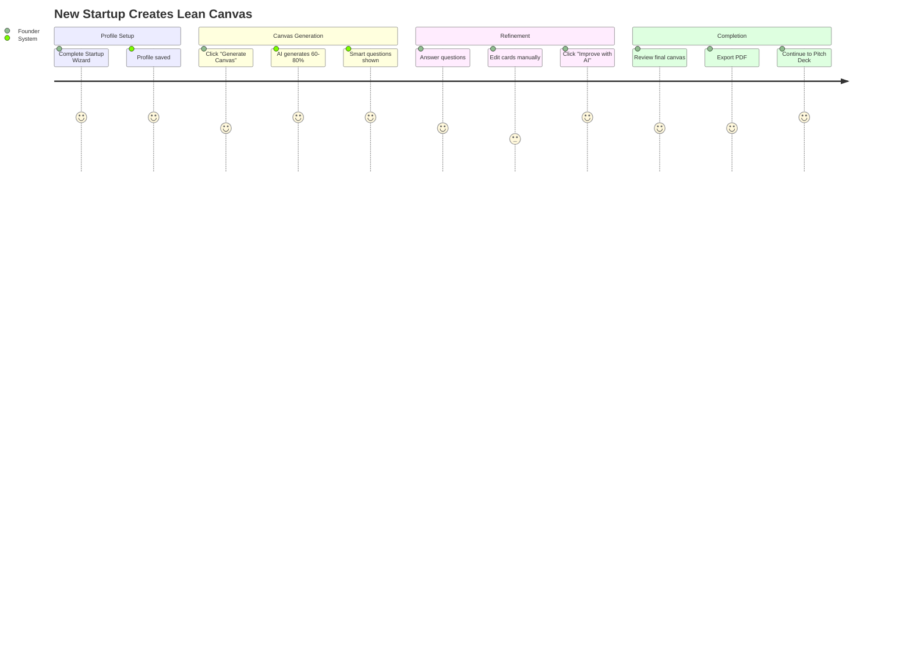
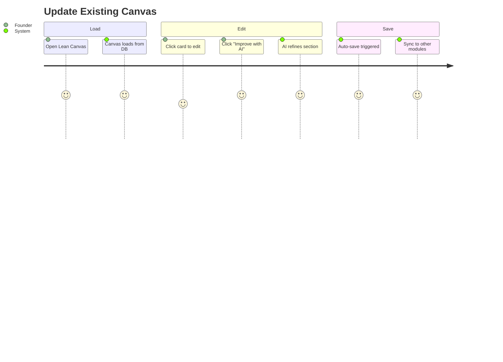
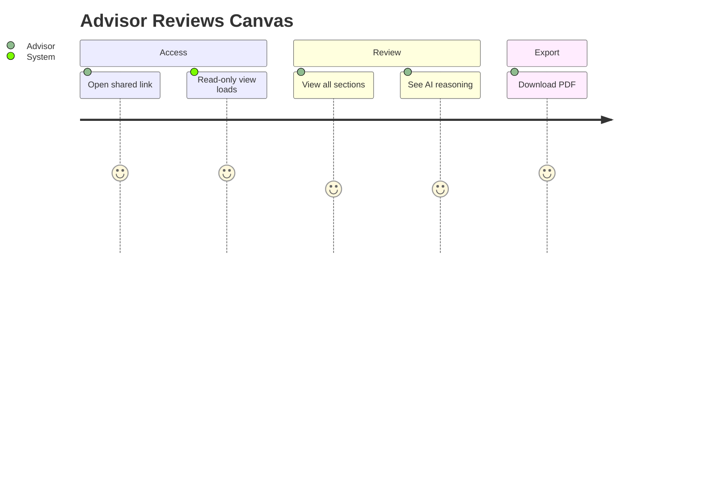
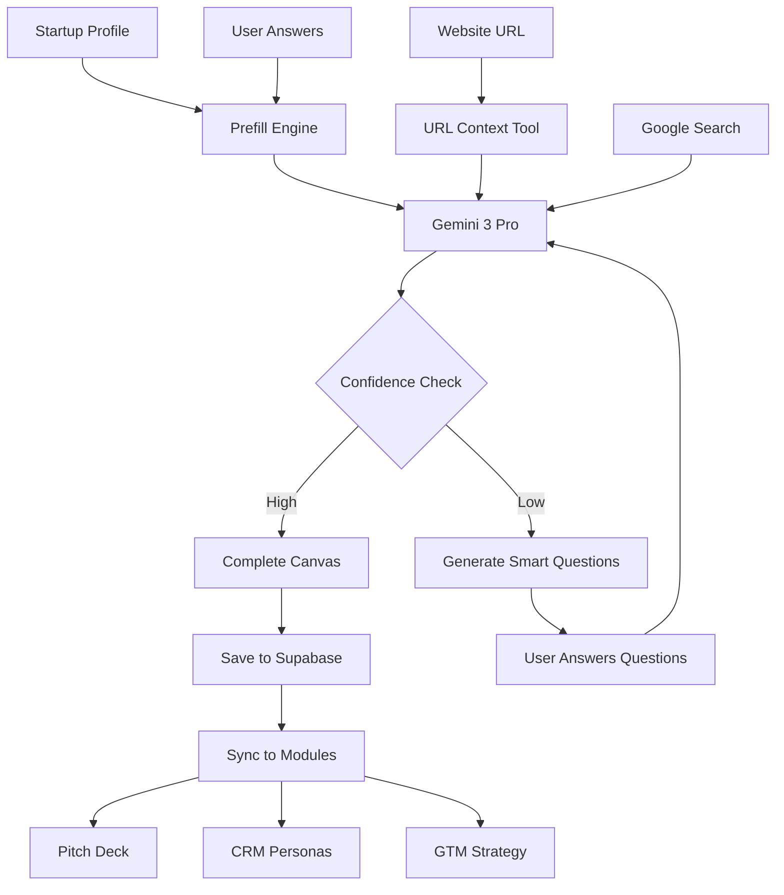
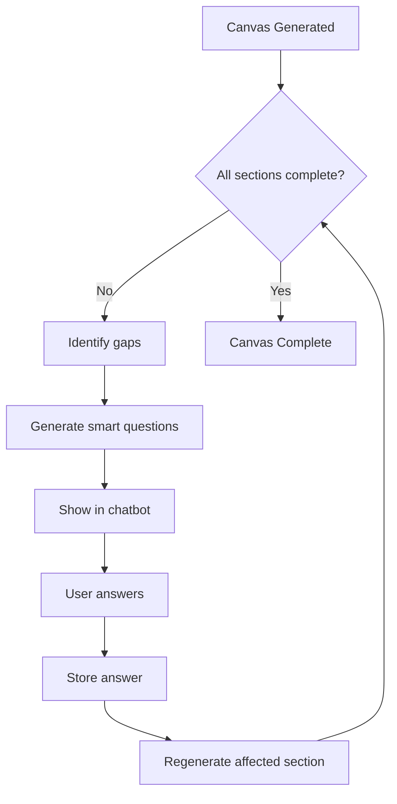
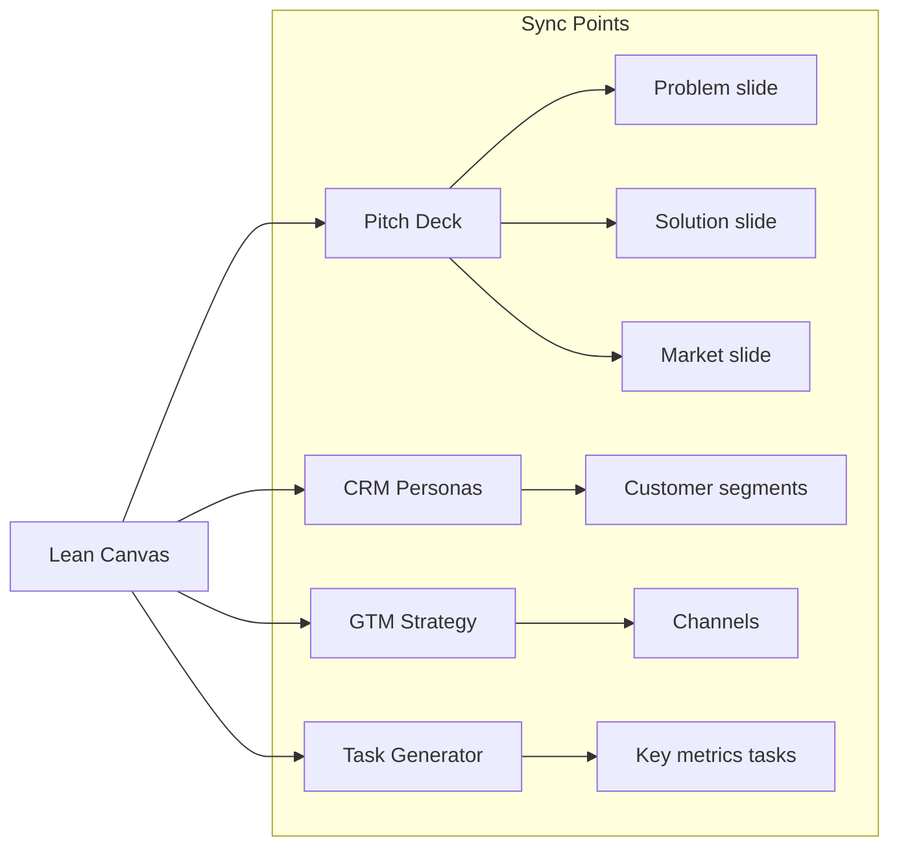

# Lean Canvas AI Module — Implementation Plan

**Version:** 1.0  
**Status:** 🔴 Todo  
**Priority:** P1  
**Dependencies:** Startup Profile, Edge Functions, Gemini 3

---

## 📋 Table of Contents

1. [Overview](#overview)
2. [Gemini 3 Features & Tools](#gemini-3-features--tools)
3. [Database Schema](#database-schema)
4. [Edge Functions](#edge-functions)
5. [Frontend Components](#frontend-components)
6. [User Journeys](#user-journeys)
7. [Workflows](#workflows)
8. [Engineering Tasks](#engineering-tasks)
9. [Success Criteria](#success-criteria)

---

## Overview

### Goal
Generate, refine, and store a complete Lean Canvas using Gemini 3 AI capabilities with guided user workflows.

### Value Proposition
- **60-80% auto-prefill** from Startup Profile
- **AI-powered refinement** for each canvas section
- **Foundation for** Pitch Deck, CRM, GTM, Tasks

### Lean Canvas Sections (12 Cards)

| # | Section | AI Source |
|---|---------|-----------|
| 1 | Problem | Wizard + Search |
| 2 | Existing Alternatives | Search Grounding |
| 3 | Solution | Wizard |
| 4 | Unique Value Proposition | Tagline + AI |
| 5 | High-Level Concept | AI Generated |
| 6 | Unfair Advantage | Chatbot |
| 7 | Customer Segments | Industry + AI |
| 8 | Early Adopters | Chatbot |
| 9 | Channels | GTM + Search |
| 10 | Key Metrics | Stage-based |
| 11 | Cost Structure | Business Model |
| 12 | Revenue Streams | Business Model |

---

## Gemini 3 Features & Tools

### Model Selection

| Task | Model | Reason |
|------|-------|--------|
| Full Canvas Generation | `gemini-3-pro-preview` | Complex reasoning, multi-source synthesis |
| Section Refinement | `gemini-2.5-flash` | Fast rewrites, low latency |
| Chatbot Questions | `gemini-2.5-flash` | Quick responses |
| Competitor Research | `gemini-3-pro-preview` | Search Grounding needed |

### Tools Configuration

```typescript
// Full canvas generation config
const canvasGenerationConfig = {
  model: 'gemini-3-pro-preview',
  config: {
    thinkingLevel: 'high',
    tools: [
      { googleSearch: {} },      // Competitor & market research
      { urlContext: {} }         // Company website analysis
    ],
    responseMimeType: 'application/json',
    responseSchema: leanCanvasSchema
  }
};

// Section refinement config
const refinementConfig = {
  model: 'gemini-2.5-flash',
  config: {
    responseMimeType: 'application/json',
    responseSchema: sectionSchema
  }
};
```

### Structured Output Schema

```typescript
import { Type } from "@google/genai";

const leanCanvasSchema = {
  type: Type.OBJECT,
  properties: {
    problem: {
      type: Type.OBJECT,
      properties: {
        items: { type: Type.ARRAY, items: { type: Type.STRING } },
        confidence: { type: Type.NUMBER }
      }
    },
    existingAlternatives: {
      type: Type.OBJECT,
      properties: {
        items: { type: Type.ARRAY, items: { type: Type.STRING } },
        sources: { type: Type.ARRAY, items: { type: Type.STRING } }
      }
    },
    solution: {
      type: Type.OBJECT,
      properties: {
        items: { type: Type.ARRAY, items: { type: Type.STRING } },
        confidence: { type: Type.NUMBER }
      }
    },
    uniqueValueProposition: {
      type: Type.OBJECT,
      properties: {
        headline: { type: Type.STRING },
        subheadline: { type: Type.STRING },
        confidence: { type: Type.NUMBER }
      }
    },
    highLevelConcept: { type: Type.STRING },
    unfairAdvantage: {
      type: Type.OBJECT,
      properties: {
        items: { type: Type.ARRAY, items: { type: Type.STRING } },
        needsClarification: { type: Type.BOOLEAN }
      }
    },
    customerSegments: {
      type: Type.OBJECT,
      properties: {
        segments: { type: Type.ARRAY, items: { type: Type.STRING } },
        primarySegment: { type: Type.STRING }
      }
    },
    earlyAdopters: {
      type: Type.OBJECT,
      properties: {
        description: { type: Type.STRING },
        characteristics: { type: Type.ARRAY, items: { type: Type.STRING } }
      }
    },
    channels: {
      type: Type.OBJECT,
      properties: {
        acquisition: { type: Type.ARRAY, items: { type: Type.STRING } },
        retention: { type: Type.ARRAY, items: { type: Type.STRING } }
      }
    },
    keyMetrics: {
      type: Type.OBJECT,
      properties: {
        northStar: { type: Type.STRING },
        supporting: { type: Type.ARRAY, items: { type: Type.STRING } }
      }
    },
    costStructure: {
      type: Type.OBJECT,
      properties: {
        fixed: { type: Type.ARRAY, items: { type: Type.STRING } },
        variable: { type: Type.ARRAY, items: { type: Type.STRING } }
      }
    },
    revenueStreams: {
      type: Type.OBJECT,
      properties: {
        primary: { type: Type.STRING },
        secondary: { type: Type.ARRAY, items: { type: Type.STRING } },
        model: { type: Type.STRING }
      }
    },
    smartQuestions: {
      type: Type.ARRAY,
      items: {
        type: Type.OBJECT,
        properties: {
          section: { type: Type.STRING },
          question: { type: Type.STRING },
          reason: { type: Type.STRING }
        }
      }
    },
    aiReasoning: { type: Type.STRING }
  },
  required: [
    "problem", "solution", "uniqueValueProposition",
    "customerSegments", "keyMetrics", "revenueStreams"
  ]
};
```

---

## Database Schema

### Migration SQL

```sql
-- Migration: lean_canvas
-- Description: Lean Canvas AI Module storage

-- Main table
CREATE TABLE lean_canvas (
  id UUID PRIMARY KEY DEFAULT gen_random_uuid(),
  startup_id UUID REFERENCES startups(id) ON DELETE CASCADE NOT NULL,
  org_id UUID REFERENCES orgs(id) NOT NULL,
  
  -- Canvas Status
  status TEXT DEFAULT 'draft' CHECK (status IN ('draft', 'complete', 'archived')),
  completion_percent INTEGER DEFAULT 0 CHECK (completion_percent >= 0 AND completion_percent <= 100),
  
  -- Canvas Sections (JSONB for flexibility)
  problem JSONB DEFAULT '{"items": [], "confidence": 0}',
  existing_alternatives JSONB DEFAULT '{"items": [], "sources": []}',
  solution JSONB DEFAULT '{"items": [], "confidence": 0}',
  unique_value_proposition JSONB DEFAULT '{"headline": "", "subheadline": "", "confidence": 0}',
  high_level_concept TEXT,
  unfair_advantage JSONB DEFAULT '{"items": [], "needsClarification": true}',
  customer_segments JSONB DEFAULT '{"segments": [], "primarySegment": ""}',
  early_adopters JSONB DEFAULT '{"description": "", "characteristics": []}',
  channels JSONB DEFAULT '{"acquisition": [], "retention": []}',
  key_metrics JSONB DEFAULT '{"northStar": "", "supporting": []}',
  cost_structure JSONB DEFAULT '{"fixed": [], "variable": []}',
  revenue_streams JSONB DEFAULT '{"primary": "", "secondary": [], "model": ""}',
  
  -- AI Metadata
  smart_questions JSONB DEFAULT '[]',
  ai_reasoning TEXT,
  generation_model TEXT,
  sources_used JSONB DEFAULT '[]',
  
  -- User Inputs
  user_answers JSONB DEFAULT '{}',
  website_url TEXT,
  
  -- Timestamps
  created_at TIMESTAMPTZ DEFAULT NOW(),
  updated_at TIMESTAMPTZ DEFAULT NOW(),
  last_ai_generation_at TIMESTAMPTZ
);

-- Indexes
CREATE INDEX idx_lean_canvas_startup ON lean_canvas(startup_id);
CREATE INDEX idx_lean_canvas_org ON lean_canvas(org_id);
CREATE INDEX idx_lean_canvas_status ON lean_canvas(status);

-- RLS
ALTER TABLE lean_canvas ENABLE ROW LEVEL SECURITY;

CREATE POLICY "org_isolation" ON lean_canvas
  FOR ALL USING (
    org_id IN (
      SELECT org_id FROM org_members WHERE user_id = auth.uid()
    )
  );

-- Trigger for updated_at
CREATE TRIGGER update_lean_canvas_timestamp
  BEFORE UPDATE ON lean_canvas
  FOR EACH ROW
  EXECUTE FUNCTION update_updated_at_column();

-- Comments
COMMENT ON TABLE lean_canvas IS 'Lean Canvas business model data generated by Gemini 3 AI';
COMMENT ON COLUMN lean_canvas.smart_questions IS 'AI-generated clarifying questions for incomplete sections';
COMMENT ON COLUMN lean_canvas.ai_reasoning IS 'Gemini thinking trace for transparency';
```

### Version History Table (Optional)

```sql
-- Canvas version history for undo/compare
CREATE TABLE lean_canvas_versions (
  id UUID PRIMARY KEY DEFAULT gen_random_uuid(),
  canvas_id UUID REFERENCES lean_canvas(id) ON DELETE CASCADE,
  version_number INTEGER NOT NULL,
  snapshot JSONB NOT NULL,
  changed_by UUID REFERENCES auth.users(id),
  created_at TIMESTAMPTZ DEFAULT NOW()
);

CREATE INDEX idx_canvas_versions ON lean_canvas_versions(canvas_id, version_number DESC);
```

---

## Edge Functions

### 1. generate-lean-canvas

```typescript
// supabase/functions/generate-lean-canvas/index.ts

import { GoogleGenAI, Type } from "npm:@google/genai@1.29.0";
import { createClient } from "npm:@supabase/supabase-js@2.45.0";

const corsHeaders = {
  'Access-Control-Allow-Origin': '*',
  'Access-Control-Allow-Headers': 'authorization, x-client-info, apikey, content-type',
};

Deno.serve(async (req) => {
  if (req.method === 'OPTIONS') {
    return new Response('ok', { headers: corsHeaders });
  }

  try {
    const { startupId, profile, userAnswers, websiteUrl } = await req.json();

    // Validate inputs
    if (!startupId || !profile) {
      throw new Error('startupId and profile are required');
    }

    // Initialize Gemini
    const ai = new GoogleGenAI({ apiKey: Deno.env.get('GEMINI_API_KEY') });

    // Build context prompt
    const contextPrompt = `
You are an expert startup strategist. Generate a complete Lean Canvas for this startup.

## Startup Profile
- Name: ${profile.name}
- Industry: ${profile.industry || 'Not specified'}
- Stage: ${profile.stage || 'Early'}
- Tagline: ${profile.tagline || 'Not provided'}
- Description: ${profile.description || 'Not provided'}
- Business Model: ${profile.businessModel || 'Not specified'}
- Target Customer: ${profile.targetCustomer || 'Not specified'}

## User Answers
${JSON.stringify(userAnswers || {}, null, 2)}

## Website URL (for context)
${websiteUrl || 'Not provided'}

## Instructions
1. Generate a complete 12-section Lean Canvas
2. Use Google Search to find competitors and market context
3. If website URL provided, analyze it for additional context
4. For sections with low confidence, generate clarifying questions
5. Provide reasoning trace for transparency
6. Be specific and actionable, not generic
`;

    // Generate canvas with Gemini 3 Pro
    const response = await ai.models.generateContent({
      model: 'gemini-3-pro-preview',
      contents: contextPrompt,
      config: {
        thinkingLevel: 'high',
        tools: [
          { googleSearch: {} },
          { urlContext: {} }
        ],
        responseMimeType: 'application/json',
        responseSchema: leanCanvasSchema
      }
    });

    const canvas = JSON.parse(response.text || '{}');

    // Calculate completion percentage
    const sections = [
      'problem', 'existingAlternatives', 'solution', 'uniqueValueProposition',
      'highLevelConcept', 'unfairAdvantage', 'customerSegments', 'earlyAdopters',
      'channels', 'keyMetrics', 'costStructure', 'revenueStreams'
    ];
    
    let completedSections = 0;
    for (const section of sections) {
      if (canvas[section] && hasContent(canvas[section])) {
        completedSections++;
      }
    }
    const completionPercent = Math.round((completedSections / sections.length) * 100);

    // Get grounding metadata
    const groundingMetadata = response.candidates?.[0]?.groundingMetadata;
    const sourcesUsed = groundingMetadata?.groundingChunks?.map(
      (chunk: any) => chunk.web?.uri
    ).filter(Boolean) || [];

    // Save to Supabase
    const supabase = createClient(
      Deno.env.get('SUPABASE_URL')!,
      Deno.env.get('SUPABASE_SERVICE_ROLE_KEY')!
    );

    const { data, error } = await supabase
      .from('lean_canvas')
      .upsert({
        startup_id: startupId,
        org_id: profile.orgId,
        status: completionPercent >= 80 ? 'complete' : 'draft',
        completion_percent: completionPercent,
        problem: canvas.problem,
        existing_alternatives: canvas.existingAlternatives,
        solution: canvas.solution,
        unique_value_proposition: canvas.uniqueValueProposition,
        high_level_concept: canvas.highLevelConcept,
        unfair_advantage: canvas.unfairAdvantage,
        customer_segments: canvas.customerSegments,
        early_adopters: canvas.earlyAdopters,
        channels: canvas.channels,
        key_metrics: canvas.keyMetrics,
        cost_structure: canvas.costStructure,
        revenue_streams: canvas.revenueStreams,
        smart_questions: canvas.smartQuestions || [],
        ai_reasoning: canvas.aiReasoning,
        generation_model: 'gemini-3-pro-preview',
        sources_used: sourcesUsed,
        user_answers: userAnswers || {},
        website_url: websiteUrl,
        last_ai_generation_at: new Date().toISOString()
      }, { onConflict: 'startup_id' })
      .select()
      .single();

    if (error) throw error;

    return new Response(JSON.stringify({
      success: true,
      canvas: data,
      completionPercent,
      smartQuestions: canvas.smartQuestions || [],
      sourcesUsed
    }), {
      headers: { ...corsHeaders, 'Content-Type': 'application/json' }
    });

  } catch (error: any) {
    console.error('Error generating lean canvas:', error);
    return new Response(JSON.stringify({
      success: false,
      error: error.message
    }), {
      status: 500,
      headers: { ...corsHeaders, 'Content-Type': 'application/json' }
    });
  }
});

// Helper function
function hasContent(section: any): boolean {
  if (!section) return false;
  if (typeof section === 'string') return section.trim().length > 0;
  if (Array.isArray(section)) return section.length > 0;
  if (section.items) return section.items.length > 0;
  if (section.headline) return section.headline.trim().length > 0;
  if (section.segments) return section.segments.length > 0;
  return Object.keys(section).some(k => hasContent(section[k]));
}
```

### 2. refine-canvas-section

```typescript
// supabase/functions/refine-canvas-section/index.ts

import { GoogleGenAI, Type } from "npm:@google/genai@1.29.0";

const corsHeaders = {
  'Access-Control-Allow-Origin': '*',
  'Access-Control-Allow-Headers': 'authorization, x-client-info, apikey, content-type',
};

Deno.serve(async (req) => {
  if (req.method === 'OPTIONS') {
    return new Response('ok', { headers: corsHeaders });
  }

  try {
    const { section, currentContent, instruction, context } = await req.json();

    if (!section || !instruction) {
      throw new Error('section and instruction are required');
    }

    const ai = new GoogleGenAI({ apiKey: Deno.env.get('GEMINI_API_KEY') });

    const prompt = `
You are a Lean Canvas expert. Improve this section.

## Section: ${section}
## Current Content:
${JSON.stringify(currentContent, null, 2)}

## User Instruction:
${instruction}

## Startup Context:
${JSON.stringify(context || {}, null, 2)}

## Task:
Rewrite and improve the section based on the instruction.
Return the improved content in the same JSON structure.
`;

    const response = await ai.models.generateContent({
      model: 'gemini-2.5-flash',
      contents: prompt,
      config: {
        responseMimeType: 'application/json'
      }
    });

    const improved = JSON.parse(response.text || '{}');

    return new Response(JSON.stringify({
      success: true,
      section,
      improved
    }), {
      headers: { ...corsHeaders, 'Content-Type': 'application/json' }
    });

  } catch (error: any) {
    return new Response(JSON.stringify({
      success: false,
      error: error.message
    }), {
      status: 500,
      headers: { ...corsHeaders, 'Content-Type': 'application/json' }
    });
  }
});
```

### 3. canvas-chatbot

```typescript
// supabase/functions/canvas-chatbot/index.ts

import { GoogleGenAI } from "npm:@google/genai@1.29.0";

const corsHeaders = {
  'Access-Control-Allow-Origin': '*',
  'Access-Control-Allow-Headers': 'authorization, x-client-info, apikey, content-type',
};

Deno.serve(async (req) => {
  if (req.method === 'OPTIONS') {
    return new Response('ok', { headers: corsHeaders });
  }

  try {
    const { message, canvas, conversationHistory } = await req.json();

    const ai = new GoogleGenAI({ apiKey: Deno.env.get('GEMINI_API_KEY') });

    const systemPrompt = `
You are a friendly Lean Canvas assistant for StartupAI.
Your job is to help founders complete their Lean Canvas by asking smart questions.

Current Canvas State:
${JSON.stringify(canvas, null, 2)}

Guidelines:
1. Be concise and actionable
2. Ask one question at a time
3. Provide examples when helpful
4. Detect incomplete sections and guide user
5. Store answers for canvas generation
`;

    const messages = [
      { role: 'user', parts: [{ text: systemPrompt }] },
      ...(conversationHistory || []),
      { role: 'user', parts: [{ text: message }] }
    ];

    const response = await ai.models.generateContent({
      model: 'gemini-2.5-flash',
      contents: messages
    });

    return new Response(JSON.stringify({
      success: true,
      reply: response.text,
      timestamp: new Date().toISOString()
    }), {
      headers: { ...corsHeaders, 'Content-Type': 'application/json' }
    });

  } catch (error: any) {
    return new Response(JSON.stringify({
      success: false,
      error: error.message
    }), {
      status: 500,
      headers: { ...corsHeaders, 'Content-Type': 'application/json' }
    });
  }
});
```

---

## Frontend Components

### Component Tree

```
📁 screens/
└── LeanCanvas.tsx              # Main screen

📁 components/lean-canvas/
├── CanvasGrid.tsx              # 12-card grid layout
├── CanvasCard.tsx              # Individual card component
├── CanvasCardEditor.tsx        # Editable card modal
├── CanvasChatbot.tsx           # AI assistant panel
├── CanvasProgress.tsx          # Completion indicator
├── CanvasExport.tsx            # Export options
├── CanvasSmartQuestions.tsx    # AI questions list
└── ImproveWithAI.tsx           # AI refinement button

📁 services/
└── leanCanvasService.ts        # API calls

📁 stores/
└── leanCanvasStore.ts          # Zustand state
```

### CanvasGrid Layout

```
┌─────────────────────────────────────────────────────────────────────┐
│  LEAN CANVAS                           [Save] [Export] [Continue →] │
├─────────────────────────────────────────────────────────────────────┤
│                                                                      │
│  ┌──────────┐ ┌──────────┐ ┌──────────┐ ┌──────────┐ ┌──────────┐  │
│  │ PROBLEM  │ │ SOLUTION │ │   UVP    │ │ UNFAIR   │ │ CUSTOMER │  │
│  │          │ │          │ │          │ │ ADVNTGE  │ │ SEGMENTS │  │
│  │ • Item 1 │ │ • Item 1 │ │ Headline │ │          │ │          │  │
│  │ • Item 2 │ │ • Item 2 │ │          │ │ [?]      │ │ • Seg 1  │  │
│  │ [✨ AI]  │ │ [✨ AI]  │ │ [✨ AI]  │ │ [✨ AI]  │ │ [✨ AI]  │  │
│  └──────────┘ └──────────┘ └──────────┘ └──────────┘ └──────────┘  │
│                                                                      │
│  ┌──────────┐ ┌──────────┐ ┌──────────┐ ┌──────────┐ ┌──────────┐  │
│  │ EXISTING │ │ KEY      │ │ HIGH-LVL │ │ CHANNELS │ │ EARLY    │  │
│  │ ALTERNS  │ │ METRICS  │ │ CONCEPT  │ │          │ │ ADOPTERS │  │
│  │          │ │          │ │          │ │          │ │          │  │
│  │ [✨ AI]  │ │ [✨ AI]  │ │ [✨ AI]  │ │ [✨ AI]  │ │ [✨ AI]  │  │
│  └──────────┘ └──────────┘ └──────────┘ └──────────┘ └──────────┘  │
│                                                                      │
│  ┌────────────────────────────────┐ ┌────────────────────────────┐  │
│  │        COST STRUCTURE          │ │      REVENUE STREAMS       │  │
│  │                                │ │                            │  │
│  │ Fixed: ...    Variable: ...    │ │ Primary: ...               │  │
│  │ [✨ AI]                        │ │ [✨ AI]                     │  │
│  └────────────────────────────────┘ └────────────────────────────┘  │
│                                                                      │
│  ├──────────────────────────────────────────────────────────────────┤
│  │ 🤖 AI Assistant                                     [Expand ↗]  │
│  │ "What makes your solution hard to copy?"                         │
│  │ [Answer...]                                                      │
│  └──────────────────────────────────────────────────────────────────┘
```

### UI Specifications

| Element | Specification |
|---------|---------------|
| Grid | 5 columns × 3 rows (responsive) |
| Card size | Min 200px width |
| Border radius | 8px |
| Card shadow | `shadow-sm hover:shadow-md` |
| AI button | Indigo accent, sparkle icon |
| Progress bar | Top of page, gradient fill |
| Chatbot | Collapsible bottom panel |

---

## User Journeys

### Journey A: New Startup (Primary)



### Journey B: Existing Startup Update



### Journey C: Advisor View



---

## Workflows

### Full Generation Workflow



### Section Refinement Workflow

```mermaid
flowchart TD
    A[User clicks "Improve with AI"] --> B[Load current section]
    B --> C[User provides instruction]
    C --> D[Gemini 2.5 Flash]
    D --> E[Return improved content]
    E --> F[Update UI]
    F --> G[Auto-save to DB]
```

### Chatbot Clarification Workflow



### Data Sync Workflow



---

## Engineering Tasks

### Phase 1: Database & API (Day 1-2)

| # | Task | Priority | Est |
|---|------|----------|-----|
| 1.1 | Create `lean_canvas` migration | P0 | 1h |
| 1.2 | Create `lean_canvas_versions` migration | P1 | 30m |
| 1.3 | Add RLS policies | P0 | 30m |
| 1.4 | Deploy `generate-lean-canvas` function | P0 | 2h |
| 1.5 | Deploy `refine-canvas-section` function | P0 | 1h |
| 1.6 | Deploy `canvas-chatbot` function | P1 | 1h |
| 1.7 | Test all Edge Functions | P0 | 1h |

### Phase 2: Frontend Core (Day 3-4)

| # | Task | Priority | Est |
|---|------|----------|-----|
| 2.1 | Create `leanCanvasService.ts` | P0 | 1h |
| 2.2 | Create `leanCanvasStore.ts` (Zustand) | P0 | 1h |
| 2.3 | Build `LeanCanvas.tsx` screen | P0 | 2h |
| 2.4 | Build `CanvasGrid.tsx` component | P0 | 2h |
| 2.5 | Build `CanvasCard.tsx` component | P0 | 1h |
| 2.6 | Build `CanvasCardEditor.tsx` modal | P0 | 2h |
| 2.7 | Add route to App.tsx | P0 | 15m |

### Phase 3: AI Features (Day 5-6)

| # | Task | Priority | Est |
|---|------|----------|-----|
| 3.1 | Build `ImproveWithAI.tsx` button | P0 | 1h |
| 3.2 | Build `CanvasChatbot.tsx` panel | P1 | 3h |
| 3.3 | Build `CanvasSmartQuestions.tsx` | P1 | 1h |
| 3.4 | Integrate chatbot with canvas state | P1 | 2h |
| 3.5 | Add loading states and error handling | P0 | 1h |

### Phase 4: Export & Sync (Day 7)

| # | Task | Priority | Est |
|---|------|----------|-----|
| 4.1 | Build `CanvasExport.tsx` | P1 | 2h |
| 4.2 | PDF generation (server-side) | P2 | 3h |
| 4.3 | JSON export | P1 | 30m |
| 4.4 | Sync to Pitch Deck generator | P1 | 2h |
| 4.5 | Sync to CRM personas | P2 | 1h |

### Phase 5: Polish (Day 8)

| # | Task | Priority | Est |
|---|------|----------|-----|
| 5.1 | Add `CanvasProgress.tsx` bar | P1 | 1h |
| 5.2 | Responsive design | P0 | 2h |
| 5.3 | Keyboard navigation | P2 | 1h |
| 5.4 | Loading animations | P2 | 1h |
| 5.5 | E2E testing | P0 | 2h |

---

## Success Criteria

### Functional

| Test | Criteria | Priority |
|------|----------|----------|
| Generate canvas | < 5 seconds | P0 |
| Load editor | < 1 second | P0 |
| Refine section | < 2 seconds | P0 |
| Save canvas | Automatic, no data loss | P0 |
| Export PDF | Renders all sections | P1 |

### AI Quality

| Test | Criteria | Priority |
|------|----------|----------|
| Prefill accuracy | 60-80% useful | P0 |
| Smart questions | Relevant to gaps | P1 |
| Refinement | Improves content | P0 |
| Search Grounding | Finds competitors | P1 |

### UX

| Test | Criteria | Priority |
|------|----------|----------|
| Completion time | < 10 minutes | P0 |
| Mobile responsive | All breakpoints | P1 |
| Progress visible | Shows % complete | P1 |
| Chatbot helpful | Reduces friction | P1 |

### Business

| Metric | Target |
|--------|--------|
| Users completing canvas | 75% |
| Users proceeding to Pitch Deck | 80% |
| AI suggestions accepted | 90% |
| Onboarding completion | +70% |

---

## Figma Prompt

```
Create a Lean Canvas editor screen for StartupAI.

## Layout
- Full-width header with: Title, Save button, Export dropdown, "Continue to Pitch Deck" CTA
- Progress bar showing completion percentage (0-100%)
- 12-card grid layout (5 columns, flexible rows)
- Collapsible AI chatbot panel at bottom

## Card Design
- White background, subtle border, rounded corners (8px)
- Section title at top (bold, indigo accent)
- Content area with bullet points or text
- "Improve with AI" button (sparkle icon, indigo)
- Yellow warning indicator for incomplete sections
- Green checkmark for complete sections

## Cards Layout
Row 1: Problem, Solution, UVP, Unfair Advantage, Customer Segments
Row 2: Existing Alternatives, Key Metrics, High-Level Concept, Channels, Early Adopters
Row 3 (full width): Cost Structure (left half), Revenue Streams (right half)

## Chatbot Panel
- Collapsible (click to expand)
- Chat message bubbles
- Input field at bottom
- "Ask AI" button
- Shows smart questions as suggestions

## Style
- Clean, minimal, professional
- Indigo accent for AI features
- Inter font
- Subtle shadows on cards
- Responsive: stack cards vertically on mobile

## States
- Empty state: "Generate your canvas" CTA
- Loading: Skeleton cards with shimmer
- Complete: All cards filled, progress 100%
- Error: Toast notification
```

---

## API Reference

### Endpoints

| Method | Endpoint | Description |
|--------|----------|-------------|
| POST | `/generate-lean-canvas` | Generate full canvas |
| POST | `/refine-canvas-section` | Improve single section |
| POST | `/canvas-chatbot` | Chat with AI assistant |

### Request/Response Examples

```typescript
// Generate Canvas
POST /generate-lean-canvas
{
  "startupId": "uuid",
  "profile": { /* startup profile */ },
  "userAnswers": { "unfairAdvantage": "..." },
  "websiteUrl": "https://..."
}

// Response
{
  "success": true,
  "canvas": { /* full canvas object */ },
  "completionPercent": 75,
  "smartQuestions": [
    { "section": "unfairAdvantage", "question": "What makes this hard to copy?" }
  ],
  "sourcesUsed": ["https://competitor1.com", "..."]
}
```

---

## Dependencies

| Package | Purpose |
|---------|---------|
| `@google/genai` | Gemini AI SDK |
| `@supabase/supabase-js` | Database client |
| `zustand` | State management |
| `react-pdf` | PDF export (optional) |
| `lucide-react` | Icons |

---

## Future Enhancements

- [ ] Version history with diff view
- [ ] Multiple canvases per startup
- [ ] Collaborative editing (real-time)
- [ ] Industry-specific templates
- [ ] Voice input for chatbot
- [ ] Canvas comparison tool
- [ ] AI-generated pitch from canvas

---

**Last Updated:** 2025-12-06  
**Status:** Ready for Implementation  
**Est. Total Effort:** 8 days

