# Deal System - Visual CRM Pipeline & AI Intelligence

**Version:** 1.1  
**Last Updated:** 2025-12-07  
**Status:** 🟡 In Progress (40%)  
**Module:** 07 - Deal System  
**Sprint:** S1-S2 (Days 1-14)  
**Database:** ✅ Schema Verified & Extended (2025-12-07)

---

## 📋 Table of Contents

1. [Overview](#overview)
2. [Feature Matrix](#feature-matrix)
3. [User Journeys](#user-journeys)
4. [System Architecture](#system-architecture)
5. [Gemini 3 AI Features](#gemini-3-ai-features)
6. [Database Schema](#database-schema)
7. [Supabase Functions](#supabase-functions)
8. [Edge Functions](#edge-functions)
9. [Frontend Components](#frontend-components)
10. [API Schema](#api-schema)
11. [Process Flows](#process-flows)
12. [Mermaid Diagrams](#mermaid-diagrams)
13. [Acceptance Criteria](#acceptance-criteria)
14. [Implementation Checklist](#implementation-checklist)

---

## Overview

### Goal

Build a **visual, AI-powered Deal Pipeline** that enables founders to manage sales, investors, partnerships, and opportunities with intelligent forecasting and automation.

### Core Value Proposition

| Problem | Solution |
|---------|----------|
| Deals scattered across tools | Unified visual Kanban pipeline |
| Manual probability guessing | AI-powered win forecasting |
| Missed follow-ups | AI-generated next actions |
| No deal insights | Gemini enrichment + analysis |
| Complex CRM setup | Zero-config intelligent system |

### Key Capabilities

- **Visual Kanban Board** - Drag-and-drop deal stages
- **AI Forecasting** - Win probability + close date prediction
- **Deal Enrichment** - Company data via URL Context + Google Search
- **Natural Language** - Create deals via text commands
- **Smart Actions** - AI-generated next steps
- **Close Confirmation** - Win/loss reasoning + summary

---

## Feature Matrix

### Core Features

| Feature | Status | Priority | AI Model |
|---------|--------|----------|----------|
| **Kanban Board** | 🔴 | P0 | - |
| **Deal Cards** | 🔴 | P0 | - |
| **Drag-and-Drop** | 🔴 | P0 | - |
| **List View** | 🔴 | P1 | - |
| **Add Deal Modal** | 🔴 | P0 | - |
| **Edit Deal Modal** | 🔴 | P0 | - |
| **Close Deal Dialog** | 🔴 | P0 | Gemini 2.5 Flash |
| **Filters & Search** | 🔴 | P1 | - |

### AI Features

| Feature | Status | Model | Tool |
|---------|--------|-------|------|
| **Win Probability** | 🔴 | Gemini 3 Pro | Thinking |
| **Deal Enrichment** | 🔴 | Gemini 3 Pro | URL Context + Search |
| **Next Action Generator** | 🔴 | Gemini 2.5 Flash | Structured Output |
| **Natural Language Create** | 🔴 | Gemini 2.5 Flash | Function Calling |
| **Deal Summary** | 🔴 | Gemini 2.5 Flash | - |
| **Risk Analysis** | 🔴 | Gemini 3 Pro | Thinking |
| **Similar Deals** | 🔴 | Gemini 3 Pro | - |

### Database Status (Verified 2025-12-07)

| Component | Status | Details |
|-----------|--------|---------|
| **crm_deals** | ✅ Extended | +9 columns (owner_id, sector, next_action, ai_risk_factors, etc.) |
| **crm_tasks** | ✅ Extended | +6 columns (deal_id, contact_id, status, priority, etc.) |
| **crm_deal_enrichment** | ✅ Created | AI enrichment cache table |
| **crm_deal_stage_history** | ✅ Created | Stage transition tracking |
| **automation_rules** | ✅ Created | Workflow automation rules |
| **crm_activities** | ✅ Created | Unified activity log |
| **RLS Policies** | ✅ Applied | All 4 new tables secured |
| **Indexes** | ✅ Created | 15+ indexes for performance |
| **RPC Functions** | ✅ Created | move_deal_stage, get_deal_analytics, close_deal, get_deal_stage_history |

---

## User Journeys

### Journey 1: Creating a Deal

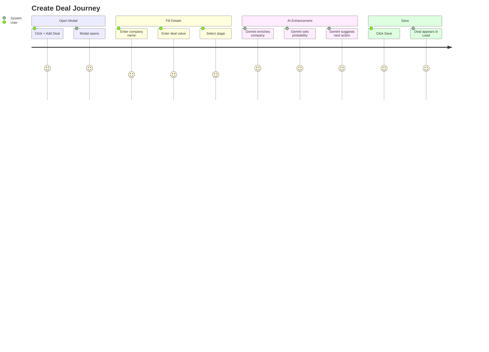

### Journey 2: Moving Deal Between Stages

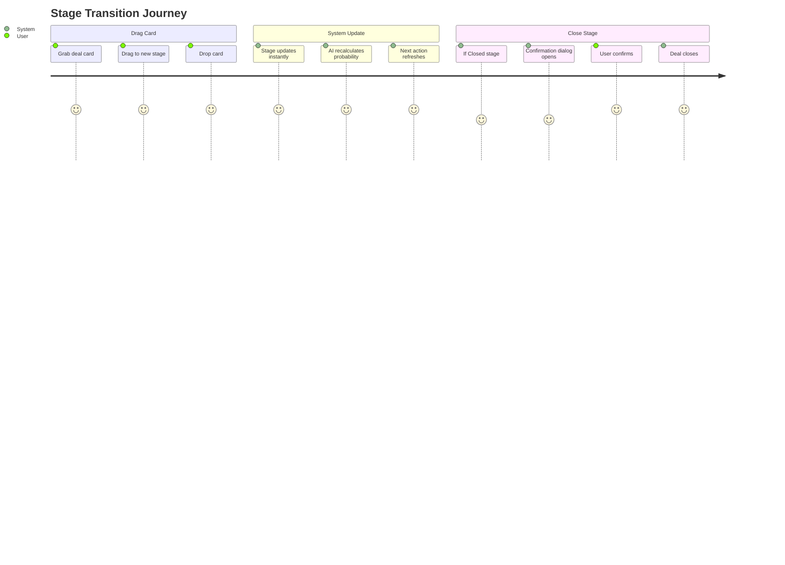

### Journey 3: Natural Language Deal Creation

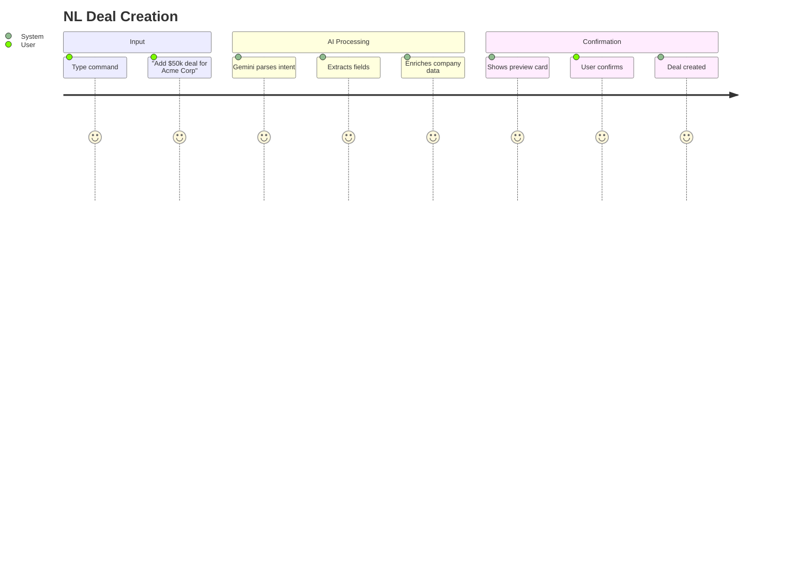

### Journey 4: Closing a Deal

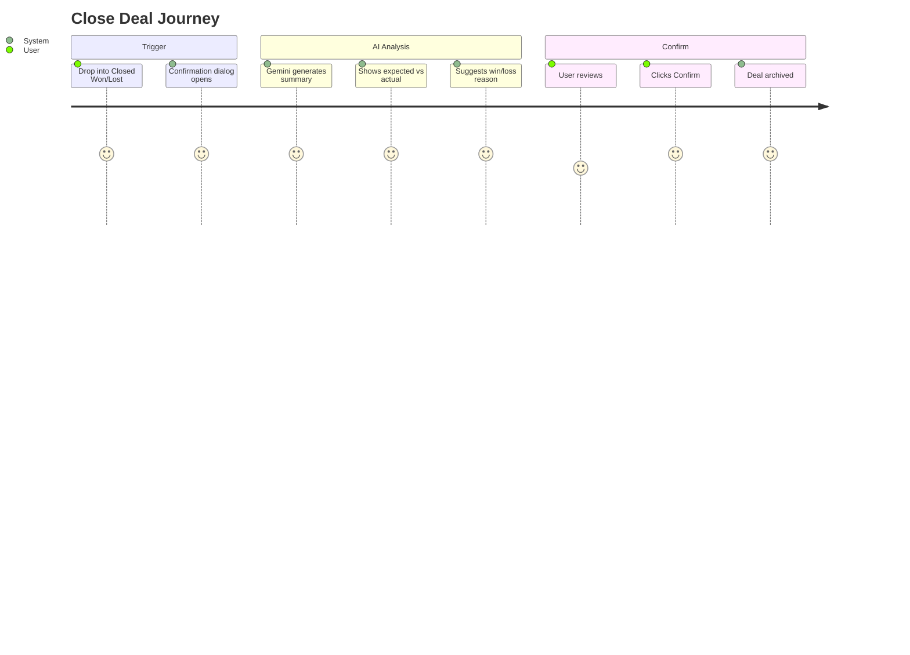

---

## System Architecture

### High-Level Architecture

```
┌─────────────────────────────────────────────────────────────────────────────┐
│                            DEAL SYSTEM                                       │
├─────────────────────────────────────────────────────────────────────────────┤
│                                                                              │
│  ┌────────────────────────────────────────────────────────────────────────┐ │
│  │                         FRONTEND (React)                                │ │
│  │                                                                         │ │
│  │  ┌─────────────┐  ┌─────────────┐  ┌─────────────┐  ┌─────────────┐  │ │
│  │  │   Kanban    │  │    List     │  │  Add Deal   │  │ Close Deal  │  │ │
│  │  │    Board    │  │    View     │  │   Modal     │  │   Dialog    │  │ │
│  │  └──────┬──────┘  └──────┬──────┘  └──────┬──────┘  └──────┬──────┘  │ │
│  │         │                │                │                │          │ │
│  │         └────────────────┼────────────────┼────────────────┘          │ │
│  │                          │                │                            │ │
│  │  ┌───────────────────────┴────────────────┴───────────────────────┐   │ │
│  │  │                    dealStore (Zustand)                          │   │ │
│  │  │                                                                 │   │ │
│  │  │   deals: Deal[]         filters: FilterState                   │   │ │
│  │  │   selectedDeal: Deal    moveDeal(id, stage)                    │   │ │
│  │  │   createDeal(data)      closeDeal(id, outcome)                 │   │ │
│  │  └─────────────────────────────┬───────────────────────────────────┘   │ │
│  │                                │                                        │ │
│  └────────────────────────────────┼────────────────────────────────────────┘ │
│                                   │                                          │
│  ┌────────────────────────────────┼────────────────────────────────────────┐ │
│  │                         SERVICE LAYER                                    │ │
│  │                                │                                         │ │
│  │  ┌─────────────────────────────┴─────────────────────────────────┐     │ │
│  │  │                   dealService.ts                               │     │ │
│  │  │                                                                │     │ │
│  │  │   getDeals(filters)      createDeal(data)                     │     │ │
│  │  │   updateDeal(id, data)   moveDealStage(id, stage)             │     │ │
│  │  │   closeDeal(id, outcome) scoreDeal(id)                        │     │ │
│  │  │   enrichDeal(id)         generateNextAction(id)               │     │ │
│  │  └───────────────────────────────────────────────────────────────┘     │ │
│  │                                │                                         │ │
│  └────────────────────────────────┼─────────────────────────────────────────┘ │
│                                   │                                          │
│  ┌────────────────────────────────┼────────────────────────────────────────┐ │
│  │                      EDGE FUNCTIONS (Deno)                               │ │
│  │                                │                                         │ │
│  │  ┌─────────────┐  ┌─────────────┐  ┌─────────────┐  ┌─────────────┐    │ │
│  │  │ score-deal  │  │ enrich-deal │  │ generate-   │  │ parse-deal  │    │ │
│  │  │             │  │             │  │ next-action │  │ -command    │    │ │
│  │  └──────┬──────┘  └──────┬──────┘  └──────┬──────┘  └──────┬──────┘    │ │
│  │         │                │                │                │            │ │
│  │         └────────────────┼────────────────┼────────────────┘            │ │
│  │                          │                │                              │ │
│  │  ┌───────────────────────┴────────────────┴────────────────────────┐   │ │
│  │  │                    GEMINI 3 PRO / FLASH                         │   │ │
│  │  │                                                                  │   │ │
│  │  │  ✅ Thinking (High)     ✅ Google Search    ✅ URL Context      │   │ │
│  │  │  ✅ Structured Output   ✅ Function Calling                     │   │ │
│  │  └──────────────────────────────────────────────────────────────────┘   │ │
│  │                                                                          │ │
│  └──────────────────────────────────────────────────────────────────────────┘ │
│                                                                              │
│  ┌──────────────────────────────────────────────────────────────────────────┐ │
│  │                           SUPABASE                                        │ │
│  │                                                                           │ │
│  │  ┌────────────┐  ┌────────────┐  ┌────────────┐  ┌────────────────────┐ │ │
│  │  │ crm_deals  │  │ crm_deal_  │  │ crm_       │  │ crm_deal_          │ │ │
│  │  │            │  │ enrichment │  │ interactions│  │ stage_history     │ │ │
│  │  └────────────┘  └────────────┘  └────────────┘  └────────────────────┘ │ │
│  │                                                                           │ │
│  └──────────────────────────────────────────────────────────────────────────┘ │
│                                                                              │
└──────────────────────────────────────────────────────────────────────────────┘
```

---

## Gemini 3 AI Features

### Feature 1: Win Probability Scoring

**Model:** Gemini 3 Pro with Thinking (High)

**Input:**
- Deal value, stage, age
- Past interactions count
- Similar closed deals
- Owner performance metrics
- Buyer company profile

**Output:**
```typescript
interface DealScore {
  probability: number;        // 0-100
  confidence: 'low' | 'medium' | 'high';
  risk_factors: string[];
  positive_signals: string[];
  predicted_close_date: string;
  reasoning: string;
}
```

**Edge Function:** `score-deal`

```typescript
// supabase/functions/score-deal/index.ts

import { GoogleGenAI, Type } from "npm:@google/genai@1.29.0";
import { createClient } from "jsr:@supabase/supabase-js@2";

const scoreSchema = {
  type: Type.OBJECT,
  properties: {
    probability: { type: Type.NUMBER, description: "Win probability 0-100" },
    confidence: { type: Type.STRING, enum: ["low", "medium", "high"] },
    risk_factors: { type: Type.ARRAY, items: { type: Type.STRING } },
    positive_signals: { type: Type.ARRAY, items: { type: Type.STRING } },
    predicted_close_date: { type: Type.STRING, description: "ISO date" },
    reasoning: { type: Type.STRING, description: "Brief explanation" }
  },
  required: ["probability", "confidence", "reasoning"]
};

Deno.serve(async (req) => {
  const corsHeaders = {
    'Access-Control-Allow-Origin': '*',
    'Access-Control-Allow-Headers': 'authorization, x-client-info, apikey, content-type',
  };
  
  if (req.method === 'OPTIONS') {
    return new Response('ok', { headers: corsHeaders });
  }

  try {
    const { deal_id } = await req.json();
    
    const supabase = createClient(
      Deno.env.get('SUPABASE_URL')!,
      Deno.env.get('SUPABASE_SERVICE_ROLE_KEY')!
    );

    // Fetch deal with related data
    const { data: deal } = await supabase
      .from('crm_deals')
      .select(`
        *,
        crm_accounts(name, domain, industry),
        crm_interactions(count),
        owner:profiles(full_name)
      `)
      .eq('id', deal_id)
      .single();

    // Fetch similar closed deals
    const { data: similarDeals } = await supabase
      .from('crm_deals')
      .select('amount, stage, outcome, close_date')
      .eq('startup_id', deal.startup_id)
      .in('stage', ['Closed Won', 'Closed Lost'])
      .limit(10);

    const ai = new GoogleGenAI({ apiKey: Deno.env.get('GEMINI_API_KEY') });

    const prompt = `
      Analyze this sales deal and predict win probability:

      DEAL:
      - Name: ${deal.name}
      - Value: $${deal.amount}
      - Stage: ${deal.stage}
      - Days in pipeline: ${Math.floor((Date.now() - new Date(deal.created_at).getTime()) / 86400000)}
      - Expected close: ${deal.expected_close}
      - Company: ${deal.crm_accounts?.name || 'Unknown'}
      - Industry: ${deal.crm_accounts?.industry || 'Unknown'}
      - Interactions: ${deal.crm_interactions?.length || 0}

      SIMILAR CLOSED DEALS:
      ${JSON.stringify(similarDeals, null, 2)}

      Provide realistic probability (not always high) based on:
      1. Stage progression speed
      2. Deal value vs typical range
      3. Interaction frequency
      4. Similar deals win rate
      5. Industry patterns
    `;

    const response = await ai.models.generateContent({
      model: 'gemini-3-pro-preview',
      contents: prompt,
      config: {
        thinkingLevel: 'high',
        responseMimeType: 'application/json',
        responseSchema: scoreSchema
      }
    });

    const score = JSON.parse(response.text || '{}');

    // Update deal with AI score
    await supabase
      .from('crm_deals')
      .update({
        ai_score: score.probability,
        ai_reasoning: score.reasoning,
        ai_risk_factors: score.risk_factors,
        updated_at: new Date().toISOString()
      })
      .eq('id', deal_id);

    return new Response(JSON.stringify(score), {
      headers: { ...corsHeaders, 'Content-Type': 'application/json' }
    });
  } catch (error: any) {
    return new Response(JSON.stringify({ error: error.message }), {
      status: 500,
      headers: { ...corsHeaders, 'Content-Type': 'application/json' }
    });
  }
});
```

---

### Feature 2: Deal Enrichment

**Model:** Gemini 3 Pro with URL Context + Google Search

**Input:**
- Company name
- Company website (if available)
- Deal context

**Output:**
```typescript
interface DealEnrichment {
  company: {
    description: string;
    industry: string;
    employee_count: string;
    funding_stage: string;
    headquarters: string;
  };
  decision_makers: string[];
  competitors: string[];
  recent_news: string[];
  recommended_approach: string;
}
```

**Edge Function:** `enrich-deal`

```typescript
// supabase/functions/enrich-deal/index.ts

import { GoogleGenAI, Type } from "npm:@google/genai@1.29.0";

const enrichmentSchema = {
  type: Type.OBJECT,
  properties: {
    company: {
      type: Type.OBJECT,
      properties: {
        description: { type: Type.STRING },
        industry: { type: Type.STRING },
        employee_count: { type: Type.STRING },
        funding_stage: { type: Type.STRING },
        headquarters: { type: Type.STRING }
      }
    },
    decision_makers: { type: Type.ARRAY, items: { type: Type.STRING } },
    competitors: { type: Type.ARRAY, items: { type: Type.STRING } },
    recent_news: { type: Type.ARRAY, items: { type: Type.STRING } },
    recommended_approach: { type: Type.STRING }
  }
};

Deno.serve(async (req) => {
  const corsHeaders = {
    'Access-Control-Allow-Origin': '*',
    'Access-Control-Allow-Headers': 'authorization, x-client-info, apikey, content-type',
  };
  
  if (req.method === 'OPTIONS') {
    return new Response('ok', { headers: corsHeaders });
  }

  try {
    const { company_name, website_url, deal_context } = await req.json();

    const ai = new GoogleGenAI({ apiKey: Deno.env.get('GEMINI_API_KEY') });

    const prompt = `
      Research this company for a sales deal:

      Company: ${company_name}
      Website: ${website_url || 'Not provided'}
      Deal Context: ${deal_context || 'General sales opportunity'}

      Provide comprehensive company intelligence including:
      1. Company overview and description
      2. Industry and market position
      3. Company size and funding stage
      4. Key decision makers to target
      5. Main competitors
      6. Recent news or developments
      7. Recommended sales approach
    `;

    const tools = [];
    if (website_url) {
      tools.push({ urlContext: {} });
    }
    tools.push({ googleSearch: {} });

    const response = await ai.models.generateContent({
      model: 'gemini-3-pro-preview',
      contents: prompt,
      config: {
        tools,
        thinkingLevel: 'high',
        responseMimeType: 'application/json',
        responseSchema: enrichmentSchema
      }
    });

    return new Response(response.text, {
      headers: { ...corsHeaders, 'Content-Type': 'application/json' }
    });
  } catch (error: any) {
    return new Response(JSON.stringify({ error: error.message }), {
      status: 500,
      headers: { ...corsHeaders, 'Content-Type': 'application/json' }
    });
  }
});
```

---

### Feature 3: Next Action Generator

**Model:** Gemini 2.5 Flash (fast)

**Input:**
- Current deal stage
- Last interaction date
- Deal value
- Buyer profile

**Output:**
```typescript
interface NextAction {
  action: string;
  priority: 'low' | 'medium' | 'high' | 'urgent';
  due_in_days: number;
  reasoning: string;
  template?: string;  // Email/message template if applicable
}
```

**Edge Function:** `generate-next-action`

```typescript
// supabase/functions/generate-next-action/index.ts

import { GoogleGenAI, Type } from "npm:@google/genai@1.29.0";

const actionSchema = {
  type: Type.OBJECT,
  properties: {
    action: { type: Type.STRING, description: "Specific action to take" },
    priority: { type: Type.STRING, enum: ["low", "medium", "high", "urgent"] },
    due_in_days: { type: Type.NUMBER },
    reasoning: { type: Type.STRING },
    template: { type: Type.STRING, description: "Optional message template" }
  },
  required: ["action", "priority", "due_in_days", "reasoning"]
};

Deno.serve(async (req) => {
  const corsHeaders = {
    'Access-Control-Allow-Origin': '*',
    'Access-Control-Allow-Headers': 'authorization, x-client-info, apikey, content-type',
  };
  
  if (req.method === 'OPTIONS') {
    return new Response('ok', { headers: corsHeaders });
  }

  try {
    const { deal } = await req.json();

    const ai = new GoogleGenAI({ apiKey: Deno.env.get('GEMINI_API_KEY') });

    const daysSinceLastActivity = deal.last_activity_date
      ? Math.floor((Date.now() - new Date(deal.last_activity_date).getTime()) / 86400000)
      : 999;

    const prompt = `
      Suggest the best next action for this deal:

      Deal: ${deal.name}
      Value: $${deal.amount}
      Stage: ${deal.stage}
      Days since last activity: ${daysSinceLastActivity}
      Expected close: ${deal.expected_close}
      Current next action: ${deal.next_action || 'None set'}

      Consider:
      1. Stage-appropriate actions
      2. Time since last contact
      3. Deal urgency based on expected close
      4. Value of the deal
      
      Be specific (not generic like "follow up"). Give actionable tasks.
    `;

    const response = await ai.models.generateContent({
      model: 'gemini-2.5-flash',
      contents: prompt,
      config: {
        responseMimeType: 'application/json',
        responseSchema: actionSchema
      }
    });

    return new Response(response.text, {
      headers: { ...corsHeaders, 'Content-Type': 'application/json' }
    });
  } catch (error: any) {
    return new Response(JSON.stringify({ error: error.message }), {
      status: 500,
      headers: { ...corsHeaders, 'Content-Type': 'application/json' }
    });
  }
});
```

---

### Feature 4: Natural Language Deal Parser

**Model:** Gemini 2.5 Flash with Function Calling

**Input:** Natural language command

**Output:** Structured deal data

**Edge Function:** `parse-deal-command`

```typescript
// supabase/functions/parse-deal-command/index.ts

import { GoogleGenAI, Type } from "npm:@google/genai@1.29.0";

const dealSchema = {
  type: Type.OBJECT,
  properties: {
    name: { type: Type.STRING, description: "Company or deal name" },
    amount: { type: Type.NUMBER, description: "Deal value in USD" },
    sector: { type: Type.STRING },
    stage: { type: Type.STRING, enum: ["Lead", "Qualified", "Proposal", "Negotiation"] },
    expected_close: { type: Type.STRING, description: "ISO date" },
    next_action: { type: Type.STRING },
    probability: { type: Type.NUMBER }
  },
  required: ["name"]
};

Deno.serve(async (req) => {
  const corsHeaders = {
    'Access-Control-Allow-Origin': '*',
    'Access-Control-Allow-Headers': 'authorization, x-client-info, apikey, content-type',
  };
  
  if (req.method === 'OPTIONS') {
    return new Response('ok', { headers: corsHeaders });
  }

  try {
    const { command } = await req.json();

    const ai = new GoogleGenAI({ apiKey: Deno.env.get('GEMINI_API_KEY') });

    const today = new Date().toISOString().split('T')[0];

    const prompt = `
      Parse this natural language command into a structured deal:

      Command: "${command}"

      Today's date: ${today}

      Examples:
      - "Add $50k deal for Acme Corp closing in 30 days" → 
        name: "Acme Corp", amount: 50000, expected_close: (30 days from today)
      - "New enterprise SaaS deal with TechCo worth 100k" →
        name: "TechCo", amount: 100000, sector: "SaaS"
      - "Quick $10k deal, should close this week" →
        name: (extract), amount: 10000, expected_close: (this week)

      Extract all available information. Default stage to "Lead" if not specified.
      Set reasonable probability based on context (new deals typically 20-40%).
    `;

    const response = await ai.models.generateContent({
      model: 'gemini-2.5-flash',
      contents: prompt,
      config: {
        responseMimeType: 'application/json',
        responseSchema: dealSchema
      }
    });

    return new Response(response.text, {
      headers: { ...corsHeaders, 'Content-Type': 'application/json' }
    });
  } catch (error: any) {
    return new Response(JSON.stringify({ error: error.message }), {
      status: 500,
      headers: { ...corsHeaders, 'Content-Type': 'application/json' }
    });
  }
});
```

---

### Feature 5: Deal Summary Generator

**Model:** Gemini 2.5 Flash

**Input:** Deal data + interaction history

**Output:** Executive summary for closing

```typescript
interface DealSummary {
  headline: string;
  key_points: string[];
  timeline: string;
  outcome_reason: string;
  lessons_learned: string;
  next_steps: string[];
}
```

---

## Database Schema

### SQL Migration: `20250607_deal_system.sql`

```sql
-- ============================================
-- DEAL SYSTEM MIGRATION
-- ============================================

-- Extend crm_deals table with AI fields
ALTER TABLE crm_deals ADD COLUMN IF NOT EXISTS
  ai_score INTEGER CHECK (ai_score >= 0 AND ai_score <= 100);

ALTER TABLE crm_deals ADD COLUMN IF NOT EXISTS
  ai_reasoning TEXT;

ALTER TABLE crm_deals ADD COLUMN IF NOT EXISTS
  ai_risk_factors TEXT[];

ALTER TABLE crm_deals ADD COLUMN IF NOT EXISTS
  ai_predicted_close DATE;

ALTER TABLE crm_deals ADD COLUMN IF NOT EXISTS
  last_activity_date TIMESTAMPTZ;

ALTER TABLE crm_deals ADD COLUMN IF NOT EXISTS
  outcome TEXT CHECK (outcome IN ('won', 'lost', null));

ALTER TABLE crm_deals ADD COLUMN IF NOT EXISTS
  outcome_reason TEXT;

ALTER TABLE crm_deals ADD COLUMN IF NOT EXISTS
  actual_close_date DATE;

-- Deal enrichment cache
CREATE TABLE IF NOT EXISTS crm_deal_enrichment (
  id UUID PRIMARY KEY DEFAULT gen_random_uuid(),
  deal_id UUID REFERENCES crm_deals(id) ON DELETE CASCADE,
  company_data JSONB DEFAULT '{}',
  decision_makers JSONB DEFAULT '[]',
  competitors JSONB DEFAULT '[]',
  recent_news JSONB DEFAULT '[]',
  recommended_approach TEXT,
  enriched_at TIMESTAMPTZ DEFAULT NOW(),
  UNIQUE(deal_id)
);

-- Stage history for analytics
CREATE TABLE IF NOT EXISTS crm_deal_stage_history (
  id UUID PRIMARY KEY DEFAULT gen_random_uuid(),
  deal_id UUID REFERENCES crm_deals(id) ON DELETE CASCADE,
  from_stage TEXT,
  to_stage TEXT NOT NULL,
  changed_by UUID REFERENCES profiles(id),
  changed_at TIMESTAMPTZ DEFAULT NOW(),
  ai_probability_at_change INTEGER
);

-- Indexes
CREATE INDEX IF NOT EXISTS idx_deals_startup_stage 
  ON crm_deals(startup_id, stage);

CREATE INDEX IF NOT EXISTS idx_deals_expected_close 
  ON crm_deals(expected_close);

CREATE INDEX IF NOT EXISTS idx_deals_ai_score 
  ON crm_deals(ai_score);

CREATE INDEX IF NOT EXISTS idx_stage_history_deal 
  ON crm_deal_stage_history(deal_id);

-- RLS Policies
ALTER TABLE crm_deal_enrichment ENABLE ROW LEVEL SECURITY;
ALTER TABLE crm_deal_stage_history ENABLE ROW LEVEL SECURITY;

CREATE POLICY "Users can manage deal enrichment" ON crm_deal_enrichment
  FOR ALL USING (
    deal_id IN (
      SELECT id FROM crm_deals WHERE startup_id IN (
        SELECT id FROM startups WHERE user_id = auth.uid()
      )
    )
  );

CREATE POLICY "Users can view stage history" ON crm_deal_stage_history
  FOR SELECT USING (
    deal_id IN (
      SELECT id FROM crm_deals WHERE startup_id IN (
        SELECT id FROM startups WHERE user_id = auth.uid()
      )
    )
  );

-- Function: Move deal stage with history tracking
CREATE OR REPLACE FUNCTION move_deal_stage(
  p_deal_id UUID,
  p_new_stage TEXT,
  p_user_id UUID
)
RETURNS JSONB
LANGUAGE plpgsql
SECURITY DEFINER
AS $$
DECLARE
  v_deal RECORD;
  v_result JSONB;
BEGIN
  -- Get current deal
  SELECT * INTO v_deal FROM crm_deals WHERE id = p_deal_id;
  
  IF v_deal IS NULL THEN
    RETURN jsonb_build_object('error', 'Deal not found');
  END IF;

  -- Insert stage history
  INSERT INTO crm_deal_stage_history (
    deal_id, from_stage, to_stage, changed_by, ai_probability_at_change
  ) VALUES (
    p_deal_id, v_deal.stage, p_new_stage, p_user_id, v_deal.ai_score
  );

  -- Update deal
  UPDATE crm_deals 
  SET 
    stage = p_new_stage,
    updated_at = NOW(),
    actual_close_date = CASE 
      WHEN p_new_stage IN ('Closed Won', 'Closed Lost') THEN CURRENT_DATE 
      ELSE actual_close_date 
    END,
    outcome = CASE 
      WHEN p_new_stage = 'Closed Won' THEN 'won'
      WHEN p_new_stage = 'Closed Lost' THEN 'lost'
      ELSE outcome 
    END
  WHERE id = p_deal_id
  RETURNING * INTO v_deal;

  RETURN jsonb_build_object(
    'success', true,
    'deal', row_to_json(v_deal)
  );
END;
$$;

-- Function: Get deal analytics
CREATE OR REPLACE FUNCTION get_deal_analytics(p_startup_id UUID)
RETURNS JSONB
LANGUAGE plpgsql
SECURITY DEFINER
AS $$
DECLARE
  v_result JSONB;
BEGIN
  SELECT jsonb_build_object(
    'total_deals', COUNT(*),
    'total_value', COALESCE(SUM(amount), 0),
    'avg_probability', COALESCE(AVG(ai_score), 0),
    'by_stage', (
      SELECT jsonb_object_agg(stage, cnt)
      FROM (
        SELECT stage, COUNT(*) as cnt 
        FROM crm_deals 
        WHERE startup_id = p_startup_id 
        GROUP BY stage
      ) s
    ),
    'won_this_month', (
      SELECT COUNT(*) FROM crm_deals 
      WHERE startup_id = p_startup_id 
      AND outcome = 'won' 
      AND actual_close_date >= date_trunc('month', CURRENT_DATE)
    ),
    'pipeline_value', (
      SELECT COALESCE(SUM(amount), 0) FROM crm_deals 
      WHERE startup_id = p_startup_id 
      AND stage NOT IN ('Closed Won', 'Closed Lost')
    )
  ) INTO v_result
  FROM crm_deals
  WHERE startup_id = p_startup_id;

  RETURN v_result;
END;
$$;
```

### ERD: Deal System

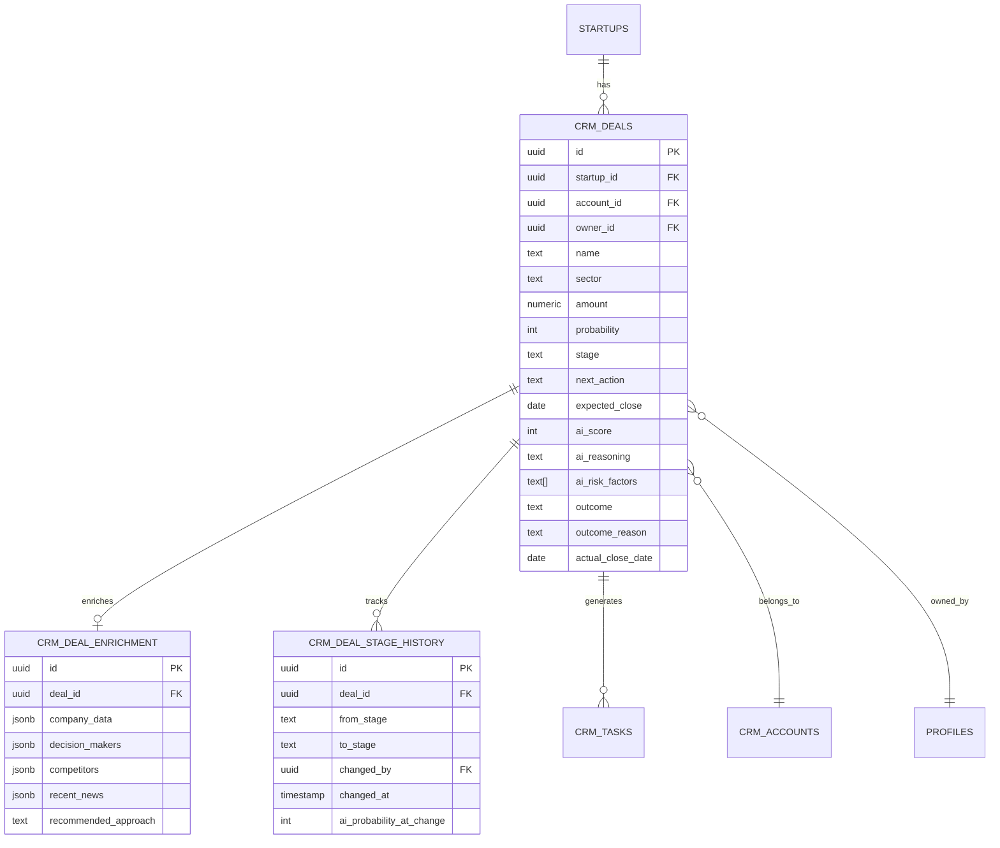

---

## Supabase Functions

### RPC Functions Summary

| Function | Purpose | Input | Output |
|----------|---------|-------|--------|
| `move_deal_stage` | Stage transition with history | deal_id, stage, user_id | Updated deal |
| `get_deal_analytics` | Pipeline analytics | startup_id | Stats JSON |
| `close_deal` | Complete deal closure | deal_id, outcome, reason | Closed deal |

---

## API Schema

### TypeScript Interfaces

```typescript
// types/deal.ts

export type DealStage = 
  | 'Lead' 
  | 'Qualified' 
  | 'Proposal' 
  | 'Negotiation' 
  | 'Closed Won' 
  | 'Closed Lost';

export interface Deal {
  id: string;
  startup_id: string;
  account_id?: string;
  owner_id?: string;
  name: string;
  sector?: string;
  amount: number;
  probability: number;
  stage: DealStage;
  next_action?: string;
  expected_close?: string;
  ai_score?: number;
  ai_reasoning?: string;
  ai_risk_factors?: string[];
  ai_predicted_close?: string;
  outcome?: 'won' | 'lost';
  outcome_reason?: string;
  actual_close_date?: string;
  last_activity_date?: string;
  created_at: string;
  updated_at: string;
  
  // Relations
  account?: Account;
  owner?: Profile;
  enrichment?: DealEnrichment;
}

export interface DealEnrichment {
  company_data: {
    description?: string;
    industry?: string;
    employee_count?: string;
    funding_stage?: string;
    headquarters?: string;
  };
  decision_makers: string[];
  competitors: string[];
  recent_news: string[];
  recommended_approach?: string;
  enriched_at: string;
}

export interface DealFilters {
  stage?: DealStage[];
  sector?: string[];
  owner_id?: string;
  amount_min?: number;
  amount_max?: number;
  expected_close_from?: string;
  expected_close_to?: string;
  search?: string;
}

export interface CreateDealInput {
  name: string;
  sector?: string;
  amount: number;
  stage?: DealStage;
  next_action?: string;
  expected_close?: string;
  owner_id?: string;
  account_id?: string;
}

export interface UpdateDealInput {
  name?: string;
  sector?: string;
  amount?: number;
  probability?: number;
  stage?: DealStage;
  next_action?: string;
  expected_close?: string;
  owner_id?: string;
  outcome_reason?: string;
}

export interface DealAnalytics {
  total_deals: number;
  total_value: number;
  avg_probability: number;
  by_stage: Record<DealStage, number>;
  won_this_month: number;
  pipeline_value: number;
}
```

### Service Layer

```typescript
// services/dealService.ts

import { supabase } from '@/lib/supabaseClient';
import { Deal, DealFilters, CreateDealInput, UpdateDealInput, DealAnalytics } from '@/types/deal';
import { callEdgeFunction } from '@/services/edgeFunctionService';

// ============================================
// CRUD Operations
// ============================================

export async function getDeals(
  startupId: string, 
  filters?: DealFilters
): Promise<Deal[]> {
  let query = supabase
    .from('crm_deals')
    .select(`
      *,
      account:crm_accounts(id, name, domain),
      owner:profiles(id, full_name, avatar_url)
    `)
    .eq('startup_id', startupId)
    .order('created_at', { ascending: false });

  // Apply filters
  if (filters?.stage?.length) {
    query = query.in('stage', filters.stage);
  }
  if (filters?.sector?.length) {
    query = query.in('sector', filters.sector);
  }
  if (filters?.owner_id) {
    query = query.eq('owner_id', filters.owner_id);
  }
  if (filters?.amount_min !== undefined) {
    query = query.gte('amount', filters.amount_min);
  }
  if (filters?.amount_max !== undefined) {
    query = query.lte('amount', filters.amount_max);
  }
  if (filters?.expected_close_from) {
    query = query.gte('expected_close', filters.expected_close_from);
  }
  if (filters?.expected_close_to) {
    query = query.lte('expected_close', filters.expected_close_to);
  }
  if (filters?.search) {
    query = query.ilike('name', `%${filters.search}%`);
  }

  const { data, error } = await query;
  if (error) throw error;
  return data || [];
}

export async function getDealById(id: string): Promise<Deal> {
  const { data, error } = await supabase
    .from('crm_deals')
    .select(`
      *,
      account:crm_accounts(*),
      owner:profiles(*),
      enrichment:crm_deal_enrichment(*)
    `)
    .eq('id', id)
    .single();

  if (error) throw error;
  return data;
}

export async function createDeal(
  startupId: string, 
  input: CreateDealInput
): Promise<Deal> {
  const { data, error } = await supabase
    .from('crm_deals')
    .insert({
      startup_id: startupId,
      name: input.name,
      sector: input.sector,
      amount: input.amount,
      stage: input.stage || 'Lead',
      probability: 25, // Default for new deals
      next_action: input.next_action,
      expected_close: input.expected_close,
      owner_id: input.owner_id,
      account_id: input.account_id
    })
    .select()
    .single();

  if (error) throw error;
  
  // Trigger AI scoring in background
  scoreDeal(data.id).catch(console.error);
  
  return data;
}

export async function updateDeal(
  id: string, 
  input: UpdateDealInput
): Promise<Deal> {
  const { data, error } = await supabase
    .from('crm_deals')
    .update({
      ...input,
      updated_at: new Date().toISOString()
    })
    .eq('id', id)
    .select()
    .single();

  if (error) throw error;
  return data;
}

export async function deleteDeal(id: string): Promise<void> {
  const { error } = await supabase
    .from('crm_deals')
    .delete()
    .eq('id', id);

  if (error) throw error;
}

// ============================================
// Stage Management
// ============================================

export async function moveDealStage(
  dealId: string, 
  newStage: string
): Promise<Deal> {
  const { data: { user } } = await supabase.auth.getUser();
  
  const { data, error } = await supabase
    .rpc('move_deal_stage', {
      p_deal_id: dealId,
      p_new_stage: newStage,
      p_user_id: user?.id
    });

  if (error) throw error;
  if (data.error) throw new Error(data.error);
  
  // Refresh AI score after stage change
  scoreDeal(dealId).catch(console.error);
  
  return data.deal;
}

export async function closeDeal(
  dealId: string, 
  outcome: 'won' | 'lost',
  reason?: string
): Promise<Deal> {
  const stage = outcome === 'won' ? 'Closed Won' : 'Closed Lost';
  
  await moveDealStage(dealId, stage);
  
  const { data, error } = await supabase
    .from('crm_deals')
    .update({
      outcome,
      outcome_reason: reason,
      actual_close_date: new Date().toISOString().split('T')[0]
    })
    .eq('id', dealId)
    .select()
    .single();

  if (error) throw error;
  return data;
}

// ============================================
// AI Features
// ============================================

export async function scoreDeal(dealId: string): Promise<any> {
  return callEdgeFunction('score-deal', { deal_id: dealId });
}

export async function enrichDeal(
  companyName: string, 
  websiteUrl?: string,
  dealContext?: string
): Promise<any> {
  return callEdgeFunction('enrich-deal', {
    company_name: companyName,
    website_url: websiteUrl,
    deal_context: dealContext
  });
}

export async function generateNextAction(deal: Deal): Promise<any> {
  return callEdgeFunction('generate-next-action', { deal });
}

export async function parseDealCommand(command: string): Promise<any> {
  return callEdgeFunction('parse-deal-command', { command });
}

export async function generateDealSummary(dealId: string): Promise<any> {
  return callEdgeFunction('generate-deal-summary', { deal_id: dealId });
}

// ============================================
// Analytics
// ============================================

export async function getDealAnalytics(startupId: string): Promise<DealAnalytics> {
  const { data, error } = await supabase
    .rpc('get_deal_analytics', { p_startup_id: startupId });

  if (error) throw error;
  return data;
}
```

---

## Frontend Components

### Component Tree

```
📁 screens/
├── DealsPipeline.tsx        # Main Kanban view
└── DealsListView.tsx        # Table/list view

📁 components/deals/
├── DealKanban.tsx           # Kanban board container
├── DealColumn.tsx           # Stage column
├── DealCard.tsx             # Draggable deal card
├── DealCardCompact.tsx      # Minimal card for mobile
├── DealModal.tsx            # Add/Edit modal
├── DealFilters.tsx          # Filter panel
├── DealListTable.tsx        # Table view
├── DealListRow.tsx          # Table row
├── DealAIPanel.tsx          # AI insights panel
├── DealEnrichment.tsx       # Enrichment display
├── CloseDealDialog.tsx      # Close confirmation
├── NLDealInput.tsx          # Natural language input
└── DealAnalyticsBar.tsx     # Top stats bar
```

### Key Component: DealKanban.tsx

```typescript
// components/deals/DealKanban.tsx

import React, { useState } from 'react';
import {
  DndContext,
  DragOverlay,
  closestCorners,
  KeyboardSensor,
  PointerSensor,
  useSensor,
  useSensors,
  DragEndEvent,
  DragStartEvent,
} from '@dnd-kit/core';
import { sortableKeyboardCoordinates } from '@dnd-kit/sortable';
import { Deal, DealStage } from '@/types/deal';
import { DealColumn } from './DealColumn';
import { DealCard } from './DealCard';
import { CloseDealDialog } from './CloseDealDialog';
import { moveDealStage } from '@/services/dealService';
import { useToast } from '@/contexts/ToastContext';

const STAGES: DealStage[] = [
  'Lead',
  'Qualified',
  'Proposal',
  'Negotiation',
  'Closed Won',
  'Closed Lost'
];

interface DealKanbanProps {
  deals: Deal[];
  onDealClick: (deal: Deal) => void;
  onRefresh: () => void;
}

export const DealKanban: React.FC<DealKanbanProps> = ({
  deals,
  onDealClick,
  onRefresh
}) => {
  const { showToast } = useToast();
  const [activeDeal, setActiveDeal] = useState<Deal | null>(null);
  const [closingDeal, setClosingDeal] = useState<Deal | null>(null);
  const [pendingStage, setPendingStage] = useState<DealStage | null>(null);

  const sensors = useSensors(
    useSensor(PointerSensor),
    useSensor(KeyboardSensor, {
      coordinateGetter: sortableKeyboardCoordinates,
    })
  );

  const dealsByStage = STAGES.reduce((acc, stage) => {
    acc[stage] = deals.filter(d => d.stage === stage);
    return acc;
  }, {} as Record<DealStage, Deal[]>);

  const handleDragStart = (event: DragStartEvent) => {
    const deal = deals.find(d => d.id === event.active.id);
    setActiveDeal(deal || null);
  };

  const handleDragEnd = async (event: DragEndEvent) => {
    const { active, over } = event;
    setActiveDeal(null);

    if (!over) return;

    const dealId = active.id as string;
    const newStage = over.id as DealStage;
    const deal = deals.find(d => d.id === dealId);

    if (!deal || deal.stage === newStage) return;

    // Check if moving to closed stage
    if (newStage === 'Closed Won' || newStage === 'Closed Lost') {
      setClosingDeal(deal);
      setPendingStage(newStage);
      return;
    }

    // Regular stage move
    try {
      await moveDealStage(dealId, newStage);
      onRefresh();
      showToast(`Deal moved to ${newStage}`, 'success');
    } catch (error: any) {
      showToast(error.message, 'error');
    }
  };

  const handleCloseDeal = async (outcome: 'won' | 'lost', reason?: string) => {
    if (!closingDeal) return;

    try {
      await moveDealStage(closingDeal.id, pendingStage!);
      // Additional close logic handled by service
      onRefresh();
      showToast(`Deal closed as ${outcome}`, 'success');
    } catch (error: any) {
      showToast(error.message, 'error');
    } finally {
      setClosingDeal(null);
      setPendingStage(null);
    }
  };

  return (
    <>
      <DndContext
        sensors={sensors}
        collisionDetection={closestCorners}
        onDragStart={handleDragStart}
        onDragEnd={handleDragEnd}
      >
        <div className="flex gap-4 overflow-x-auto pb-4 min-h-[600px]">
          {STAGES.map(stage => (
            <DealColumn
              key={stage}
              stage={stage}
              deals={dealsByStage[stage]}
              onDealClick={onDealClick}
            />
          ))}
        </div>

        <DragOverlay>
          {activeDeal && (
            <DealCard deal={activeDeal} isDragging />
          )}
        </DragOverlay>
      </DndContext>

      {closingDeal && (
        <CloseDealDialog
          deal={closingDeal}
          outcome={pendingStage === 'Closed Won' ? 'won' : 'lost'}
          onConfirm={handleCloseDeal}
          onCancel={() => {
            setClosingDeal(null);
            setPendingStage(null);
          }}
        />
      )}
    </>
  );
};
```

---

## Process Flows

### Deal Creation Flow

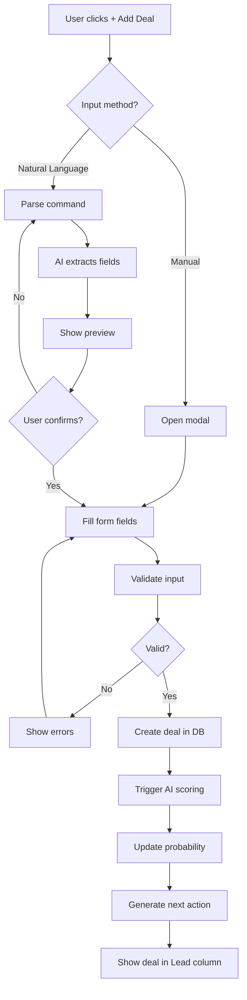

### Stage Transition Flow

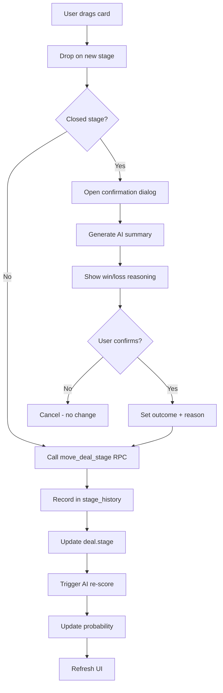

### AI Enrichment Flow

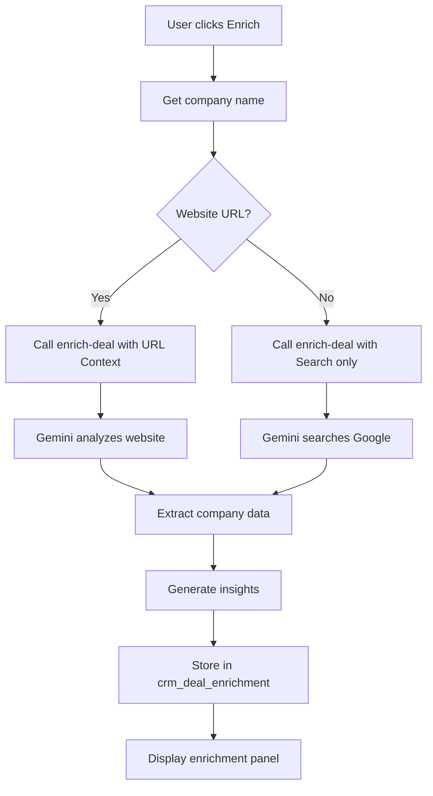

---

## Mermaid Diagrams

### System Architecture

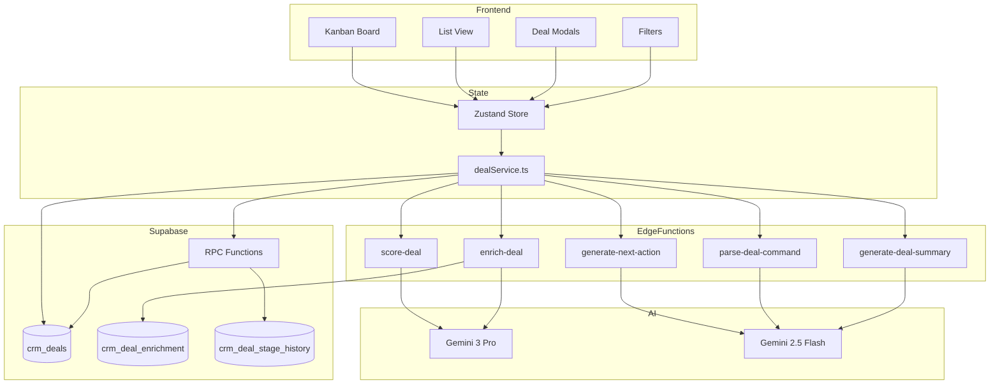

### State Machine: Deal Lifecycle

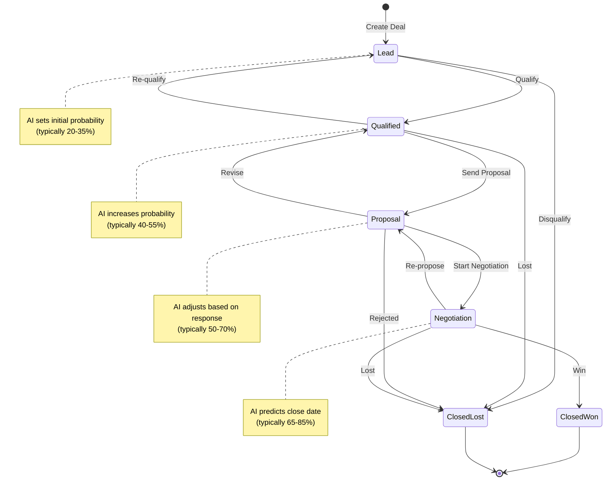

### Sequence: Full Deal Flow

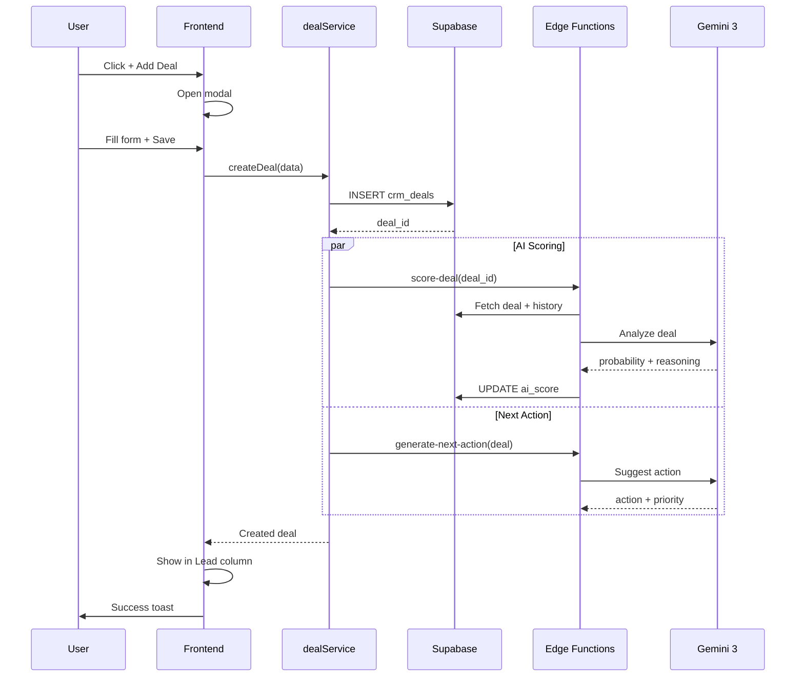

---

## Acceptance Criteria

### Core Functionality

| Test Case | Criteria | Priority |
|-----------|----------|----------|
| Create Deal | Modal validates + saves to DB | P0 |
| Edit Deal | Pre-fills + updates correctly | P0 |
| Drag-and-Drop | Stage updates in < 500ms | P0 |
| Close Deal | Confirmation dialog appears | P0 |
| List View | Filters work + state persists | P1 |
| Natural Language | Parses common patterns | P1 |

### AI Features

| Test Case | Criteria | Priority |
|-----------|----------|----------|
| AI Scoring | Returns 0-100 probability | P0 |
| Enrichment | Returns company data | P1 |
| Next Action | Generates actionable task | P1 |
| Deal Summary | Creates close summary | P1 |

### Performance

| Metric | Target |
|--------|--------|
| Kanban load | < 1s |
| Drag response | < 200ms |
| AI scoring | < 5s |
| Enrichment | < 10s |

---

## Implementation Checklist

### Phase 1: Database & Core (Days 1-3)

- [ ] Run migration `20250607_deal_system.sql`
- [ ] Test RPC functions
- [ ] Create `dealService.ts`
- [ ] Create TypeScript interfaces

### Phase 2: Edge Functions (Days 4-6)

- [ ] Deploy `score-deal`
- [ ] Deploy `enrich-deal`
- [ ] Deploy `generate-next-action`
- [ ] Deploy `parse-deal-command`
- [ ] Test all Edge Functions

### Phase 3: Kanban Board (Days 7-9)

- [ ] Create `DealKanban.tsx`
- [ ] Create `DealColumn.tsx`
- [ ] Create `DealCard.tsx`
- [ ] Implement drag-and-drop (`dnd-kit`)
- [ ] Create `CloseDealDialog.tsx`

### Phase 4: Modals & Forms (Days 10-11)

- [ ] Create `DealModal.tsx` (add/edit)
- [ ] Create `DealFilters.tsx`
- [ ] Create `NLDealInput.tsx`
- [ ] Create `DealAIPanel.tsx`

### Phase 5: List View (Days 12-13)

- [ ] Create `DealsListView.tsx`
- [ ] Create `DealListTable.tsx`
- [ ] Create `DealListRow.tsx`
- [ ] Implement sorting + pagination

### Phase 6: Testing & Polish (Day 14)

- [ ] E2E test full workflow
- [ ] Test AI features
- [ ] Performance optimization
- [ ] Mobile responsiveness
- [ ] Bug fixes

---

## Quick Reference

### Edge Functions

| Function | Model | Tool | Purpose |
|----------|-------|------|---------|
| `score-deal` | Gemini 3 Pro | Thinking | Win probability |
| `enrich-deal` | Gemini 3 Pro | URL + Search | Company research |
| `generate-next-action` | Gemini 2.5 Flash | Structured | Next steps |
| `parse-deal-command` | Gemini 2.5 Flash | Structured | NL parsing |
| `generate-deal-summary` | Gemini 2.5 Flash | - | Close summary |

### Database Tables

| Table | Purpose |
|-------|---------|
| `crm_deals` | Core deal data |
| `crm_deal_enrichment` | AI enrichment cache |
| `crm_deal_stage_history` | Stage transitions |

### Key Files

| File | Purpose |
|------|---------|
| `services/dealService.ts` | CRUD + AI operations |
| `stores/dealStore.ts` | Zustand state |
| `components/deals/DealKanban.tsx` | Kanban board |
| `screens/DealsPipeline.tsx` | Main screen |

---

**Estimated Effort:** 14 days  
**Dependencies:** Auth, CRM Accounts, CRM Contacts  
**AI Models:** Gemini 3 Pro, Gemini 2.5 Flash

