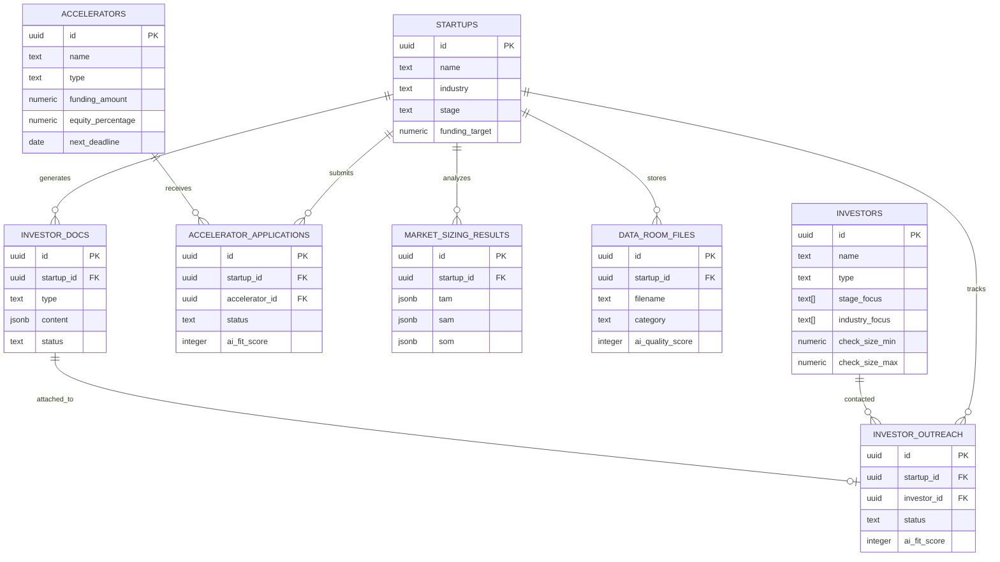
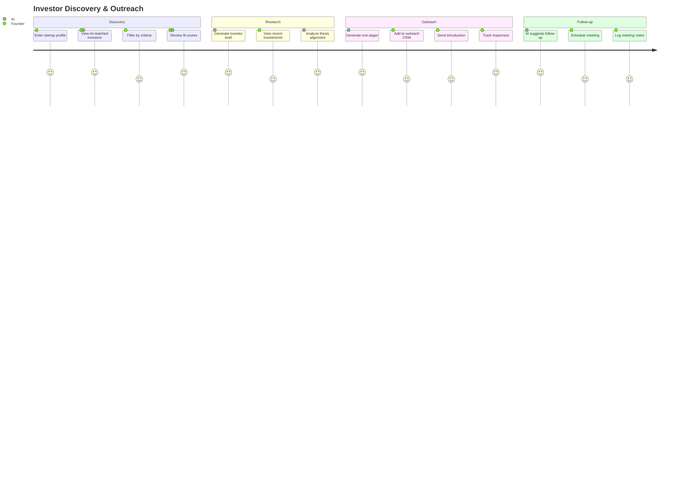
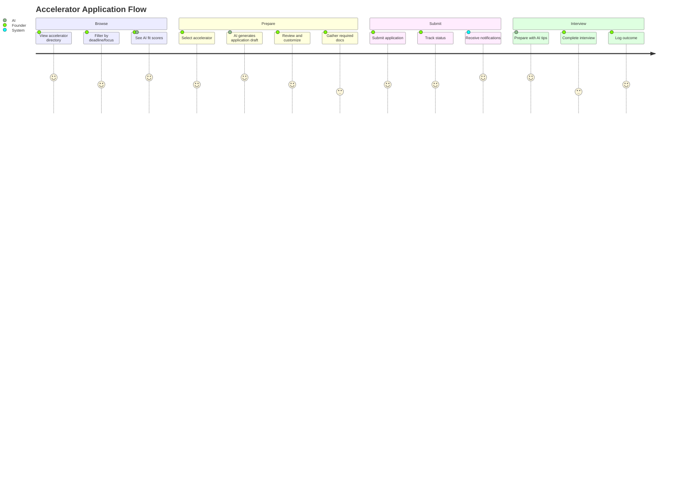
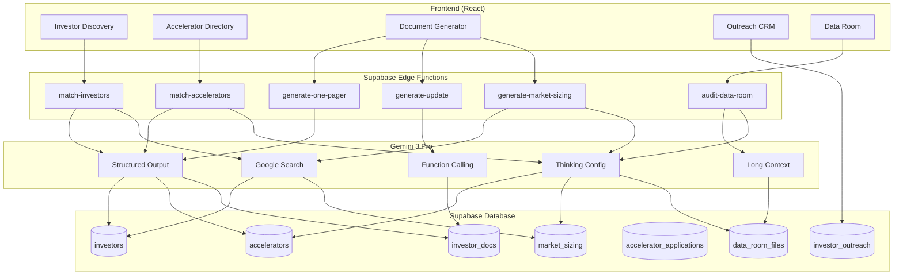
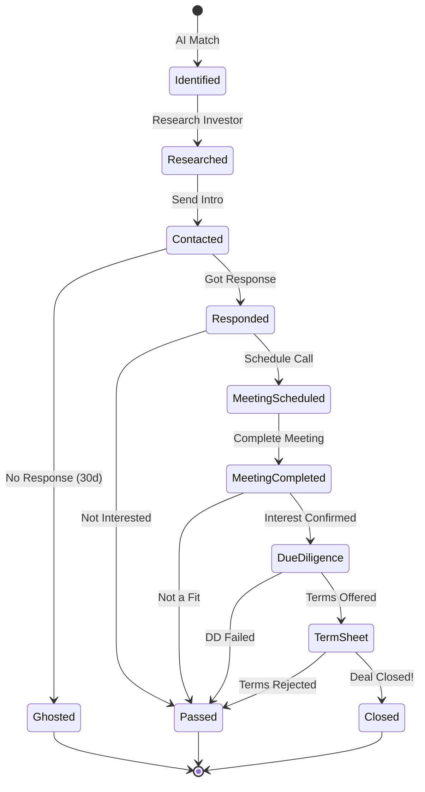
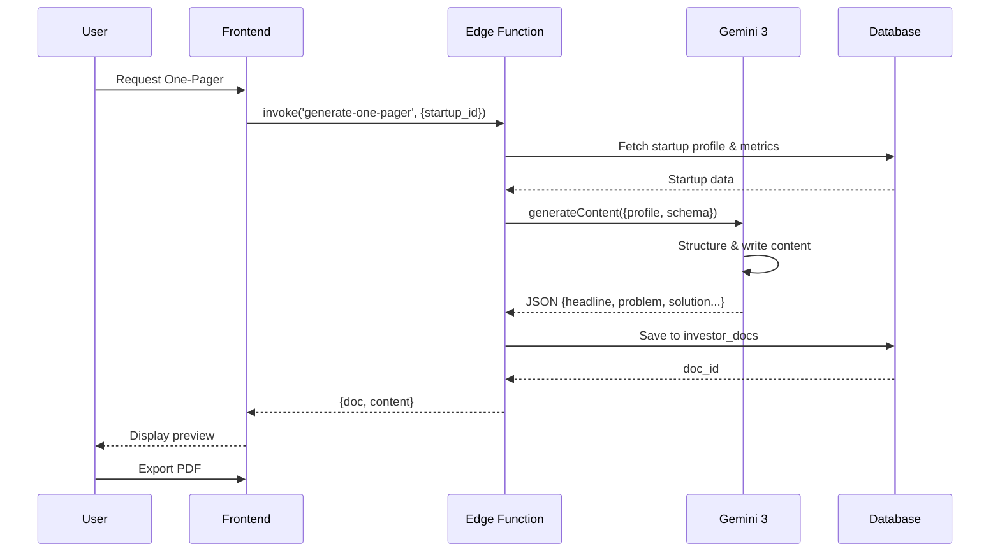
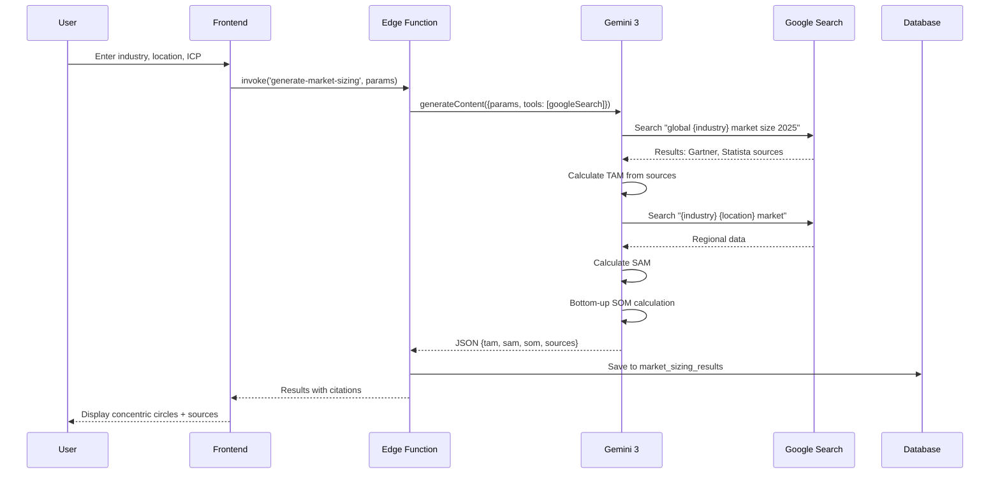

# 🚀 Investors & Accelerators System

**Module:** 08-investors-system  
**Status:** 🟡 Planning (15%)  
**Last Updated:** 2025-01-07  
**Priority:** High  

---

## 📋 Table of Contents

1. [Executive Summary](#executive-summary)
2. [Feature Matrix](#feature-matrix)
3. [Real-World Examples & Data](#real-world-examples--data)
4. [User Journeys](#user-journeys)
5. [System Architecture](#system-architecture)
6. [Gemini 3 AI Integration](#gemini-3-ai-integration)
7. [Database Schema](#database-schema)
8. [Supabase Edge Functions](#supabase-edge-functions)
9. [Frontend Components](#frontend-components)
10. [Mermaid Diagrams](#mermaid-diagrams)
11. [Implementation Checklist](#implementation-checklist)
12. [Success Criteria](#success-criteria)

---

## Executive Summary

### The Problem
- **70% of startups** fail to raise funding due to poor investor outreach strategy
- Founders spend **40+ hours** researching investors manually
- **No centralized system** to match startup stage/industry with right investors
- Accelerator applications are **scattered and untracked**
- Missing documents and poor data rooms **kill 30% of deals**

### The Solution
The **Investors & Accelerators System** is an AI-powered platform that:
- **Discovers** relevant investors and accelerators based on startup profile
- **Matches** funding stage, industry, and check size automatically
- **Generates** investor-ready documents (One-Pagers, Updates, Deal Memos)
- **Tracks** outreach, applications, and engagement
- **Scores** investor fit using AI reasoning
- **Manages** data rooms with readiness scoring

### Key Differentiators
| Feature | Traditional | StartupAI |
|---------|-------------|-----------|
| Investor Research | 40+ hours manual | 5 minutes AI-powered |
| Document Generation | Templates + editing | AI-generated, data-driven |
| Market Sizing | Guesswork | Google Search Grounded |
| Outreach Tracking | Spreadsheets | CRM with AI insights |
| Application Management | Email chaos | Centralized dashboard |

---

## Feature Matrix

### Core Features

| # | Feature | Description | Gemini 3 Tool | Priority | Status |
|---|---------|-------------|---------------|----------|--------|
| 1 | **Investor Discovery** | Search & filter 500+ investors by stage, industry, check size | Google Search Grounding | P0 | 🔴 |
| 2 | **Accelerator Matcher** | Match startup profile to accelerators with fit scores | Structured Output + Reasoning | P0 | 🔴 |
| 3 | **AI Fit Scoring** | Score investor/accelerator fit (0-100) with reasoning | Thinking Config (High) | P0 | 🔴 |
| 4 | **One-Pager Generator** | Auto-generate investor tear sheets | Structured Output (Strict) | P0 | 🔴 |
| 5 | **Investor Update Writer** | Draft monthly/quarterly updates with MoM comparison | Function Calling | P1 | 🔴 |
| 6 | **Market Sizing Agent** | Calculate TAM/SAM/SOM with cited sources | Google Search Grounding | P0 | 🔴 |
| 7 | **GTM Strategy Builder** | Generate go-to-market plans | Google Search + Thinking | P1 | 🔴 |
| 8 | **Data Room Manager** | Organize & audit due diligence docs | File Search (RAG) | P1 | 🔴 |
| 9 | **Deal Memo Generator** | Create VC-style investment memos | Thinking Config (High) | P2 | 🔴 |
| 10 | **Outreach CRM** | Track investor communications & status | Structured Output | P1 | 🔴 |
| 11 | **Application Tracker** | Manage accelerator applications | Structured Output | P1 | 🔴 |
| 12 | **Investor Alerts** | Notify when new matching investors appear | Background Jobs | P2 | 🔴 |

### AI Document Types

| Document | Input Required | AI Capabilities | Output Format |
|----------|----------------|-----------------|---------------|
| **One-Pager** | Startup profile, metrics | Structured Output, URL Context | PDF / Web View |
| **Investor Update** | Current/previous metrics, notes | Function Calling, Comparison | Markdown Email |
| **GTM Strategy** | Industry, audience, model | Google Search, Thinking | Structured Doc |
| **Market Sizing** | Industry, location, ICP | Google Search Grounding | JSON + Sources |
| **Deal Memo** | Full profile, deck, metrics | Thinking (High), Search | PDF Report |
| **Data Room Audit** | File list / uploads | Long Context, Reasoning | JSON Checklist |

---

## Real-World Examples & Data

### Top VC Firms (Sample Data)

```json
{
  "investors": [
    {
      "name": "Andreessen Horowitz (a16z)",
      "type": "VC Firm",
      "hq": "Menlo Park, CA",
      "stage_focus": ["Seed", "Series A", "Series B+"],
      "check_size": {"min": 500000, "max": 50000000},
      "specialization": ["AI Infrastructure", "Enterprise AI", "Consumer AI"],
      "notable_investments": ["OpenAI", "Anthropic", "Mistral AI", "Cursor"],
      "website": "https://a16z.com"
    },
    {
      "name": "Sequoia Capital",
      "type": "VC Firm",
      "hq": "Menlo Park, CA",
      "stage_focus": ["Seed", "Series A", "Series B+"],
      "check_size": {"min": 500000, "max": 50000000},
      "specialization": ["AI Infrastructure", "Foundational AI"],
      "notable_investments": ["OpenAI", "Hugging Face", "Nvidia"],
      "website": "https://sequoiacap.com"
    },
    {
      "name": "Khosla Ventures",
      "type": "VC Firm",
      "hq": "Menlo Park, CA",
      "stage_focus": ["Pre-seed", "Seed", "Series A"],
      "check_size": {"min": 1000000, "max": 20000000},
      "specialization": ["Early-stage AI", "Deep Tech"],
      "notable_investments": ["OpenAI (first investor)", "Rad AI"],
      "website": "https://khoslaventures.com"
    }
  ]
}
```

### Top AI Accelerators (Sample Data)

```json
{
  "accelerators": [
    {
      "name": "Y Combinator",
      "type": "Accelerator",
      "location": "San Francisco, CA",
      "funding": {"amount": 125000, "equity": 7},
      "duration": "3 months",
      "specialization": ["Broad Tech", "AI (75% of recent cohorts)"],
      "benefits": ["Demo Day", "Investor Network", "YC Alumni Network"],
      "application_deadline": "Rolling (Winter/Summer batches)",
      "website": "https://ycombinator.com"
    },
    {
      "name": "AI2 Incubator",
      "type": "AI-Focused Accelerator",
      "location": "Seattle, WA",
      "funding": {"amount": 200000, "follow_on": 500000, "equity": "varies"},
      "duration": "Flexible",
      "specialization": ["Applied AI", "Deep Tech", "AI-native"],
      "benefits": ["Allen Institute Access", "Compute Credits", "Research Labs"],
      "application_deadline": "Rolling",
      "website": "https://ai2incubator.com"
    },
    {
      "name": "Google for Startups AI",
      "type": "Corporate Accelerator",
      "location": "Global",
      "funding": {"credits": 350000, "equity": 0},
      "duration": "10 weeks",
      "specialization": ["AI/ML", "GenAI", "Cloud"],
      "benefits": ["$350K Cloud Credits", "TPU Access", "Google Mentors"],
      "application_deadline": "Regional cohorts",
      "website": "https://startup.google.com"
    },
    {
      "name": "Creative Destruction Lab (CDL)",
      "type": "Deep Tech Accelerator",
      "location": "Toronto, Montreal, Vancouver",
      "funding": {"amount": 100000, "equity": "Non-dilutive"},
      "duration": "9 months",
      "specialization": ["Science/Tech", "AI Stream", "Deep Tech"],
      "benefits": ["$95B+ Alumni Equity Value", "Scientist Mentors"],
      "application_deadline": "Annual cycles",
      "website": "https://creativedestructionlab.com"
    }
  ]
}
```

### Angel Investors (Sample Data)

```json
{
  "angels": [
    {
      "name": "Naval Ravikant",
      "background": "AngelList Co-founder",
      "focus": ["AI", "Crypto", "Consumer"],
      "notable_investments": ["Uber", "Twitter", "Anthropic", "Perplexity"],
      "check_size": "Varies"
    },
    {
      "name": "Elad Gil",
      "background": "Serial Entrepreneur",
      "focus": ["Frontier AI", "Deep Tech"],
      "notable_investments": ["Character.AI", "Mistral", "Perplexity"],
      "check_size": "Varies"
    }
  ]
}
```

---

## User Journeys

### Journey 1: Investor Discovery & Outreach

```
1. DISCOVER → User enters startup profile (stage, industry, raise amount)
2. MATCH → AI matches 50+ relevant investors with fit scores
3. FILTER → User filters by check size, location, specialization
4. RESEARCH → AI generates investor brief (recent investments, thesis)
5. GENERATE → AI creates personalized one-pager for each investor
6. TRACK → User logs outreach, meetings, and status in CRM
7. FOLLOW-UP → AI suggests follow-up timing and content
```

### Journey 2: Accelerator Application

```
1. BROWSE → User views accelerator directory with deadlines
2. SCORE → AI scores fit for each accelerator (0-100)
3. SELECT → User chooses accelerators to apply
4. PREPARE → AI generates application drafts
5. CUSTOMIZE → User reviews and edits applications
6. SUBMIT → Track submission status and deadlines
7. NOTIFY → Alerts for interviews, decisions, next steps
```

### Journey 3: Investor Document Generation

```
1. INPUT → User provides startup data (profile, metrics)
2. ANALYZE → AI extracts key insights and growth trends
3. RESEARCH → AI grounds data with Google Search (market size)
4. GENERATE → AI creates document (One-Pager, Update, Memo)
5. REVIEW → User previews and edits
6. EXPORT → PDF, email, or shareable link
7. TRACK → Analytics on document views
```

### Journey 4: Data Room Management

```
1. UPLOAD → User uploads or connects data room files
2. INDEX → AI scans filenames and metadata
3. AUDIT → AI compares against VC checklist
4. SCORE → Generate "Due Diligence Readiness" score (0-100)
5. GAP ANALYSIS → List missing/outdated documents
6. GENERATE → AI creates templates for missing docs
7. ORGANIZE → Auto-categorize and tag documents
```

---

## System Architecture

### High-Level Architecture

```
┌─────────────────────────────────────────────────────────────────────┐
│                         FRONTEND (React)                             │
├─────────────────────────────────────────────────────────────────────┤
│  ┌─────────────┐ ┌─────────────┐ ┌─────────────┐ ┌─────────────┐   │
│  │  Investor   │ │ Accelerator │ │  Document   │ │  Data Room  │   │
│  │  Discovery  │ │   Matcher   │ │  Generator  │ │   Manager   │   │
│  └─────────────┘ └─────────────┘ └─────────────┘ └─────────────┘   │
│  ┌─────────────┐ ┌─────────────┐ ┌─────────────┐ ┌─────────────┐   │
│  │  Outreach   │ │ Application │ │   Market    │ │     CRM     │   │
│  │   Tracker   │ │   Tracker   │ │   Sizing    │ │  Pipeline   │   │
│  └─────────────┘ └─────────────┘ └─────────────┘ └─────────────┘   │
└─────────────────────────────────────────────────────────────────────┘
                                  │
                                  ▼
┌─────────────────────────────────────────────────────────────────────┐
│                    SUPABASE EDGE FUNCTIONS                          │
├─────────────────────────────────────────────────────────────────────┤
│  ┌─────────────────┐ ┌─────────────────┐ ┌─────────────────┐       │
│  │ match-investors │ │ generate-onepager│ │ market-sizing   │       │
│  └─────────────────┘ └─────────────────┘ └─────────────────┘       │
│  ┌─────────────────┐ ┌─────────────────┐ ┌─────────────────┐       │
│  │ match-accelerator│ │ generate-update │ │ audit-dataroom  │       │
│  └─────────────────┘ └─────────────────┘ └─────────────────┘       │
│  ┌─────────────────┐ ┌─────────────────┐ ┌─────────────────┐       │
│  │ score-fit       │ │ generate-gtm    │ │ generate-memo   │       │
│  └─────────────────┘ └─────────────────┘ └─────────────────┘       │
└─────────────────────────────────────────────────────────────────────┘
                                  │
                                  ▼
┌─────────────────────────────────────────────────────────────────────┐
│                         GEMINI 3 PRO                                │
├─────────────────────────────────────────────────────────────────────┤
│  • Google Search Grounding (TAM/SAM/SOM, Competitor Research)       │
│  • Structured Output (Documents, Scores, Checklists)                │
│  • Function Calling (Metrics Retrieval, Period Comparison)          │
│  • Thinking Config (High reasoning for Deal Memos, Scoring)         │
│  • Long Context (Data Room Analysis, Full Deck Review)              │
│  • URL Context (Investor Website Analysis)                          │
└─────────────────────────────────────────────────────────────────────┘
                                  │
                                  ▼
┌─────────────────────────────────────────────────────────────────────┐
│                        SUPABASE DATABASE                            │
├─────────────────────────────────────────────────────────────────────┤
│  investors │ accelerators │ investor_docs │ investor_outreach      │
│  accelerator_applications │ data_room_files │ market_sizing_results │
└─────────────────────────────────────────────────────────────────────┘
```

---

## Gemini 3 AI Integration

### Feature-to-Capability Mapping

| Feature | Gemini 3 Capability | Config |
|---------|---------------------|--------|
| Investor Matching | Structured Output + Reasoning | `thinkingLevel: "low"` |
| Fit Scoring | Thinking Config | `thinkingLevel: "high"` |
| Market Sizing | Google Search Grounding | `tools: [{googleSearch: {}}]` |
| One-Pager Generation | Structured Output (Strict) | `responseSchema: onePagerSchema` |
| Investor Update | Function Calling | `tools: [{functionDeclarations}]` |
| GTM Strategy | Google Search + Thinking | `tools: [{googleSearch: {}}], thinkingLevel: "high"` |
| Data Room Audit | Long Context + Reasoning | `thinkingLevel: "high"` |
| Deal Memo | Thinking + Search | `tools: [{googleSearch: {}}], thinkingLevel: "high"` |
| Investor Research | URL Context | `tools: [{urlContext: {}}]` |

### Structured Output Schemas

#### Investor Match Schema
```typescript
const investorMatchSchema = {
  type: Type.OBJECT,
  properties: {
    investors: {
      type: Type.ARRAY,
      items: {
        type: Type.OBJECT,
        properties: {
          id: { type: Type.STRING },
          name: { type: Type.STRING },
          fit_score: { type: Type.NUMBER, description: "0-100 fit score" },
          fit_reasoning: { type: Type.STRING, description: "Why this investor is a good fit" },
          check_size_match: { type: Type.BOOLEAN },
          stage_match: { type: Type.BOOLEAN },
          industry_match: { type: Type.BOOLEAN },
          recent_investments: { type: Type.ARRAY, items: { type: Type.STRING } },
          contact_suggestion: { type: Type.STRING }
        },
        required: ["id", "name", "fit_score", "fit_reasoning"]
      }
    },
    total_matches: { type: Type.NUMBER },
    search_criteria_used: { type: Type.STRING }
  },
  required: ["investors", "total_matches"]
};
```

#### One-Pager Schema
```typescript
const onePagerSchema = {
  type: Type.OBJECT,
  properties: {
    headline: { type: Type.STRING, description: "Catchy 5-10 word value prop" },
    problem_summary: { type: Type.STRING, description: "2-3 sentences on the pain point" },
    solution_summary: { type: Type.STRING, description: "2-3 sentences on the product" },
    market_opportunity: { type: Type.STRING, description: "TAM/SAM/SOM narrative" },
    traction_highlights: { 
      type: Type.ARRAY, 
      items: { type: Type.STRING },
      description: "Key metrics and achievements"
    },
    business_model: { type: Type.STRING, description: "How they make money" },
    team_highlight: { type: Type.STRING, description: "Key team credentials" },
    funding_ask: { type: Type.STRING, description: "Amount and use of funds" },
    contact_info: {
      type: Type.OBJECT,
      properties: {
        email: { type: Type.STRING },
        website: { type: Type.STRING },
        linkedin: { type: Type.STRING }
      }
    }
  },
  required: ["headline", "problem_summary", "solution_summary", "traction_highlights", "funding_ask"]
};
```

#### Market Sizing Schema
```typescript
const marketSizingSchema = {
  type: Type.OBJECT,
  properties: {
    icp: { type: Type.STRING, description: "Ideal Customer Profile description" },
    beachhead: { type: Type.STRING, description: "Initial target market segment" },
    tam: {
      type: Type.OBJECT,
      properties: {
        value: { type: Type.STRING, description: "e.g., $50B" },
        description: { type: Type.STRING },
        source_url: { type: Type.STRING },
        source_name: { type: Type.STRING }
      },
      required: ["value", "description", "source_url"]
    },
    sam: {
      type: Type.OBJECT,
      properties: {
        value: { type: Type.STRING },
        description: { type: Type.STRING },
        source_url: { type: Type.STRING },
        source_name: { type: Type.STRING }
      },
      required: ["value", "description"]
    },
    som: {
      type: Type.OBJECT,
      properties: {
        value: { type: Type.STRING },
        description: { type: Type.STRING },
        methodology: { type: Type.STRING }
      },
      required: ["value", "description", "methodology"]
    },
    methodology: { type: Type.STRING, description: "Explanation of calculation approach" },
    confidence_score: { type: Type.NUMBER, description: "0-100 confidence in estimates" }
  },
  required: ["tam", "sam", "som", "methodology"]
};
```

#### Data Room Audit Schema
```typescript
const dataRoomAuditSchema = {
  type: Type.OBJECT,
  properties: {
    readiness_score: { type: Type.NUMBER, description: "0-100 due diligence readiness" },
    status: { type: Type.STRING, enum: ["ready", "needs_work", "critical_gaps"] },
    categories: {
      type: Type.ARRAY,
      items: {
        type: Type.OBJECT,
        properties: {
          category: { type: Type.STRING },
          score: { type: Type.NUMBER },
          found_documents: { type: Type.ARRAY, items: { type: Type.STRING } },
          missing_documents: { type: Type.ARRAY, items: { type: Type.STRING } },
          warnings: { type: Type.ARRAY, items: { type: Type.STRING } }
        }
      }
    },
    critical_missing: { type: Type.ARRAY, items: { type: Type.STRING } },
    recommendations: { type: Type.ARRAY, items: { type: Type.STRING } }
  },
  required: ["readiness_score", "status", "categories", "critical_missing"]
};
```

### AI Prompt Strategies

#### Market Sizing Agent Prompt
```typescript
const marketSizingPrompt = `
You are a Venture Capital analyst. Calculate the TAM, SAM, and SOM for a startup.

**Startup Context:**
- Industry: {industry}
- Target Audience: {target_audience}
- Location Focus: {location}
- Business Model: {business_model}

**Research Steps:**
1. Search for total global spend on {industry} (TAM). Use sources from 2023-2025.
2. Filter to {target_audience} + {location} for SAM.
3. Use bottom-up calculation: (Potential customers in SAM) × (Average Contract Value).
4. Estimate realistic 3-5 year capture (1-5% of SAM) for SOM.

**Requirements:**
- Include source URLs for all TAM/SAM figures
- Prioritize: Gartner, Forrester, Statista, McKinsey
- Explain your methodology clearly
- Provide confidence score (0-100)

Return JSON matching the MarketSizingSchema.
`;
```

#### Investor Fit Scoring Prompt
```typescript
const investorFitPrompt = `
You are a VC matchmaker. Score the fit between this startup and investor.

**Startup Profile:**
{startup_profile}

**Investor Profile:**
{investor_profile}

**Scoring Criteria (weighted):**
1. Stage Match (25%): Does investor invest at startup's stage?
2. Industry Match (25%): Does investor specialize in startup's industry?
3. Check Size Match (20%): Is raise amount within investor's range?
4. Geographic Match (10%): Is location aligned?
5. Thesis Alignment (20%): Does startup align with investor's thesis?

**Requirements:**
- Score each criterion 0-100
- Calculate weighted total
- Provide specific reasoning for each score
- Suggest best approach to contact this investor

Return JSON with fit_score, category_scores, and reasoning.
`;
```

---

## Database Schema

### New Tables

```sql
-- =============================================================
-- INVESTORS TABLE
-- Stores investor/VC firm profiles from directories
-- =============================================================
CREATE TABLE public.investors (
    id uuid PRIMARY KEY DEFAULT gen_random_uuid(),
    name text NOT NULL,
    type text NOT NULL CHECK (type IN ('vc_firm', 'angel', 'corporate_vc', 'family_office', 'accelerator')),
    website text,
    hq_location text,
    description text,
    
    -- Investment criteria
    stage_focus text[] DEFAULT '{}',
    industry_focus text[] DEFAULT '{}',
    check_size_min numeric,
    check_size_max numeric,
    
    -- Track record
    notable_investments text[] DEFAULT '{}',
    portfolio_companies jsonb DEFAULT '[]',
    aum numeric, -- Assets under management
    
    -- Contact info
    contact_email text,
    linkedin_url text,
    twitter_url text,
    
    -- Metadata
    data_source text, -- Where this data came from
    last_verified_at timestamptz,
    is_active boolean DEFAULT true,
    
    created_at timestamptz DEFAULT now(),
    updated_at timestamptz DEFAULT now()
);

COMMENT ON TABLE public.investors IS 'Directory of investors, VCs, and angels for startup matching';

-- =============================================================
-- ACCELERATORS TABLE
-- Stores accelerator/incubator program profiles
-- =============================================================
CREATE TABLE public.accelerators (
    id uuid PRIMARY KEY DEFAULT gen_random_uuid(),
    name text NOT NULL,
    type text NOT NULL CHECK (type IN ('accelerator', 'incubator', 'corporate', 'university', 'government')),
    website text,
    location text,
    
    -- Program details
    funding_amount numeric,
    equity_percentage numeric,
    funding_type text, -- 'equity', 'convertible', 'grant', 'equity_free'
    program_duration text,
    
    -- Focus areas
    industry_focus text[] DEFAULT '{}',
    stage_focus text[] DEFAULT '{}',
    
    -- Benefits
    benefits text[] DEFAULT '{}',
    mentors_available boolean DEFAULT false,
    office_space boolean DEFAULT false,
    cloud_credits jsonb DEFAULT '{}',
    
    -- Application info
    application_url text,
    next_deadline date,
    cohort_size integer,
    acceptance_rate numeric,
    
    -- Track record
    notable_alumni text[] DEFAULT '{}',
    total_alumni_funding numeric,
    success_rate numeric,
    
    -- Metadata
    is_active boolean DEFAULT true,
    last_verified_at timestamptz,
    
    created_at timestamptz DEFAULT now(),
    updated_at timestamptz DEFAULT now()
);

COMMENT ON TABLE public.accelerators IS 'Directory of accelerators and incubators for startup applications';

-- =============================================================
-- INVESTOR_DOCS TABLE
-- Stores AI-generated investor documents
-- =============================================================
CREATE TABLE public.investor_docs (
    id uuid PRIMARY KEY DEFAULT gen_random_uuid(),
    startup_id uuid NOT NULL REFERENCES public.startups(id) ON DELETE CASCADE,
    user_id uuid NOT NULL REFERENCES auth.users(id) ON DELETE CASCADE,
    
    type text NOT NULL CHECK (type IN ('one_pager', 'investor_update', 'deal_memo', 'gtm_strategy', 'market_sizing', 'data_room_audit')),
    title text NOT NULL,
    
    -- Content
    content jsonb NOT NULL, -- Structured content
    content_markdown text, -- Rendered markdown version
    
    -- Metadata
    status text DEFAULT 'draft' CHECK (status IN ('draft', 'final', 'sent', 'archived')),
    version integer DEFAULT 1,
    
    -- AI generation info
    ai_model text,
    ai_prompt_used text,
    generation_time_ms integer,
    
    -- Sharing
    share_token text UNIQUE,
    share_expires_at timestamptz,
    view_count integer DEFAULT 0,
    
    created_at timestamptz DEFAULT now(),
    updated_at timestamptz DEFAULT now()
);

COMMENT ON TABLE public.investor_docs IS 'AI-generated investor documents (one-pagers, updates, memos)';

-- =============================================================
-- INVESTOR_OUTREACH TABLE
-- CRM for tracking investor communications
-- =============================================================
CREATE TABLE public.investor_outreach (
    id uuid PRIMARY KEY DEFAULT gen_random_uuid(),
    startup_id uuid NOT NULL REFERENCES public.startups(id) ON DELETE CASCADE,
    user_id uuid NOT NULL REFERENCES auth.users(id) ON DELETE CASCADE,
    investor_id uuid REFERENCES public.investors(id) ON DELETE SET NULL,
    
    -- Contact info (if not linked to investor)
    investor_name text,
    investor_email text,
    investor_firm text,
    
    -- Outreach tracking
    status text DEFAULT 'identified' CHECK (status IN (
        'identified', 'researched', 'contacted', 'responded', 
        'meeting_scheduled', 'meeting_completed', 'due_diligence',
        'term_sheet', 'closed', 'passed', 'ghosted'
    )),
    
    -- Communication log
    first_contact_date date,
    last_contact_date date,
    next_follow_up date,
    meeting_date timestamptz,
    
    -- AI insights
    ai_fit_score integer,
    ai_fit_reasoning text,
    ai_suggested_approach text,
    
    -- Notes
    notes text,
    tags text[] DEFAULT '{}',
    
    -- Document links
    one_pager_id uuid REFERENCES public.investor_docs(id),
    
    created_at timestamptz DEFAULT now(),
    updated_at timestamptz DEFAULT now()
);

COMMENT ON TABLE public.investor_outreach IS 'CRM for tracking investor outreach and communications';

-- =============================================================
-- ACCELERATOR_APPLICATIONS TABLE
-- Track accelerator applications
-- =============================================================
CREATE TABLE public.accelerator_applications (
    id uuid PRIMARY KEY DEFAULT gen_random_uuid(),
    startup_id uuid NOT NULL REFERENCES public.startups(id) ON DELETE CASCADE,
    user_id uuid NOT NULL REFERENCES auth.users(id) ON DELETE CASCADE,
    accelerator_id uuid REFERENCES public.accelerators(id) ON DELETE SET NULL,
    
    -- Application info
    accelerator_name text NOT NULL,
    cohort text, -- e.g., "Winter 2026"
    
    status text DEFAULT 'researching' CHECK (status IN (
        'researching', 'preparing', 'submitted', 'interview_scheduled',
        'interview_completed', 'accepted', 'rejected', 'waitlisted', 'withdrawn'
    )),
    
    -- Dates
    deadline date,
    submitted_at timestamptz,
    interview_date timestamptz,
    decision_date date,
    
    -- AI insights
    ai_fit_score integer,
    ai_fit_reasoning text,
    ai_application_tips text,
    
    -- Application content
    application_draft jsonb,
    application_final jsonb,
    
    -- Notes
    notes text,
    
    created_at timestamptz DEFAULT now(),
    updated_at timestamptz DEFAULT now()
);

COMMENT ON TABLE public.accelerator_applications IS 'Tracking accelerator/incubator applications';

-- =============================================================
-- MARKET_SIZING_RESULTS TABLE
-- Store AI-generated market sizing analyses
-- =============================================================
CREATE TABLE public.market_sizing_results (
    id uuid PRIMARY KEY DEFAULT gen_random_uuid(),
    startup_id uuid NOT NULL REFERENCES public.startups(id) ON DELETE CASCADE,
    user_id uuid NOT NULL REFERENCES auth.users(id) ON DELETE CASCADE,
    
    -- Input parameters
    industry text NOT NULL,
    target_audience text,
    location text,
    business_model text,
    
    -- Results (structured)
    tam jsonb NOT NULL, -- {value, description, source_url, source_name}
    sam jsonb NOT NULL,
    som jsonb NOT NULL,
    icp text,
    beachhead text,
    
    -- Metadata
    methodology text,
    confidence_score integer,
    sources jsonb DEFAULT '[]',
    
    -- AI info
    ai_model text,
    generated_at timestamptz DEFAULT now(),
    
    created_at timestamptz DEFAULT now()
);

COMMENT ON TABLE public.market_sizing_results IS 'AI-generated market sizing analyses (TAM/SAM/SOM)';

-- =============================================================
-- DATA_ROOM_FILES TABLE
-- Track data room documents and audit status
-- =============================================================
CREATE TABLE public.data_room_files (
    id uuid PRIMARY KEY DEFAULT gen_random_uuid(),
    startup_id uuid NOT NULL REFERENCES public.startups(id) ON DELETE CASCADE,
    user_id uuid NOT NULL REFERENCES auth.users(id) ON DELETE CASCADE,
    
    -- File info
    filename text NOT NULL,
    file_path text,
    file_size bigint,
    mime_type text,
    
    -- Categorization
    category text CHECK (category IN (
        'corporate', 'ip_tech', 'employment', 'financials', 
        'legal', 'compliance', 'product', 'other'
    )),
    subcategory text,
    
    -- Audit status
    is_verified boolean DEFAULT false,
    is_outdated boolean DEFAULT false,
    last_reviewed_at timestamptz,
    
    -- AI insights
    ai_category_suggestion text,
    ai_quality_score integer,
    ai_notes text,
    
    created_at timestamptz DEFAULT now(),
    updated_at timestamptz DEFAULT now()
);

COMMENT ON TABLE public.data_room_files IS 'Data room documents for due diligence tracking';

-- =============================================================
-- INDEXES
-- =============================================================
CREATE INDEX idx_investors_type ON public.investors(type);
CREATE INDEX idx_investors_stage_focus ON public.investors USING GIN(stage_focus);
CREATE INDEX idx_investors_industry_focus ON public.investors USING GIN(industry_focus);
CREATE INDEX idx_accelerators_type ON public.accelerators(type);
CREATE INDEX idx_accelerators_industry_focus ON public.accelerators USING GIN(industry_focus);
CREATE INDEX idx_investor_docs_startup ON public.investor_docs(startup_id);
CREATE INDEX idx_investor_docs_type ON public.investor_docs(type);
CREATE INDEX idx_investor_outreach_startup ON public.investor_outreach(startup_id);
CREATE INDEX idx_investor_outreach_status ON public.investor_outreach(status);
CREATE INDEX idx_accelerator_applications_startup ON public.accelerator_applications(startup_id);
CREATE INDEX idx_accelerator_applications_status ON public.accelerator_applications(status);
CREATE INDEX idx_market_sizing_startup ON public.market_sizing_results(startup_id);
CREATE INDEX idx_data_room_files_startup ON public.data_room_files(startup_id);
CREATE INDEX idx_data_room_files_category ON public.data_room_files(category);

-- =============================================================
-- RLS POLICIES
-- =============================================================
ALTER TABLE public.investors ENABLE ROW LEVEL SECURITY;
ALTER TABLE public.accelerators ENABLE ROW LEVEL SECURITY;
ALTER TABLE public.investor_docs ENABLE ROW LEVEL SECURITY;
ALTER TABLE public.investor_outreach ENABLE ROW LEVEL SECURITY;
ALTER TABLE public.accelerator_applications ENABLE ROW LEVEL SECURITY;
ALTER TABLE public.market_sizing_results ENABLE ROW LEVEL SECURITY;
ALTER TABLE public.data_room_files ENABLE ROW LEVEL SECURITY;

-- Public read access for investor/accelerator directories
CREATE POLICY "Anyone can view investors" ON public.investors
    FOR SELECT TO authenticated, anon USING (true);

CREATE POLICY "Anyone can view accelerators" ON public.accelerators
    FOR SELECT TO authenticated, anon USING (true);

-- User-specific access for documents and outreach
CREATE POLICY "Users can manage own investor docs" ON public.investor_docs
    FOR ALL TO authenticated USING ((select auth.uid()) = user_id);

CREATE POLICY "Users can manage own investor outreach" ON public.investor_outreach
    FOR ALL TO authenticated USING ((select auth.uid()) = user_id);

CREATE POLICY "Users can manage own accelerator applications" ON public.accelerator_applications
    FOR ALL TO authenticated USING ((select auth.uid()) = user_id);

CREATE POLICY "Users can manage own market sizing" ON public.market_sizing_results
    FOR ALL TO authenticated USING ((select auth.uid()) = user_id);

CREATE POLICY "Users can manage own data room files" ON public.data_room_files
    FOR ALL TO authenticated USING ((select auth.uid()) = user_id);
```

---

## Supabase Edge Functions

### 1. match-investors

```typescript
// supabase/functions/match-investors/index.ts
import { GoogleGenAI, Type } from "https://esm.sh/@google/genai";
import { createClient } from "https://esm.sh/@supabase/supabase-js@2";

const corsHeaders = {
  "Access-Control-Allow-Origin": "*",
  "Access-Control-Allow-Headers": "authorization, x-client-info, apikey, content-type",
};

Deno.serve(async (req) => {
  if (req.method === "OPTIONS") {
    return new Response("ok", { headers: corsHeaders });
  }

  try {
    const { startup_profile, filters } = await req.json();
    
    const ai = new GoogleGenAI({ apiKey: Deno.env.get("GEMINI_API_KEY") });
    const supabase = createClient(
      Deno.env.get("SUPABASE_URL")!,
      Deno.env.get("SUPABASE_SERVICE_ROLE_KEY")!
    );

    // Fetch investors from database
    let query = supabase.from("investors").select("*").eq("is_active", true);
    
    if (filters?.type) query = query.eq("type", filters.type);
    if (filters?.stage) query = query.contains("stage_focus", [filters.stage]);
    
    const { data: investors } = await query.limit(100);

    // Use Gemini to score and rank matches
    const response = await ai.models.generateContent({
      model: "gemini-2.5-flash",
      contents: `
        Score and rank these investors for the following startup.
        
        STARTUP PROFILE:
        ${JSON.stringify(startup_profile, null, 2)}
        
        INVESTORS:
        ${JSON.stringify(investors, null, 2)}
        
        For each investor, provide:
        1. fit_score (0-100)
        2. fit_reasoning (why they match)
        3. suggested_approach (how to contact)
        
        Return top 20 matches sorted by fit_score.
      `,
      config: {
        responseMimeType: "application/json",
        responseSchema: investorMatchSchema,
        temperature: 0.3
      }
    });

    const matches = JSON.parse(response.text || "{}");
    
    return new Response(JSON.stringify(matches), {
      headers: { ...corsHeaders, "Content-Type": "application/json" }
    });
  } catch (error) {
    return new Response(JSON.stringify({ error: error.message }), {
      status: 500,
      headers: { ...corsHeaders, "Content-Type": "application/json" }
    });
  }
});
```

### 2. generate-market-sizing

```typescript
// supabase/functions/generate-market-sizing/index.ts
Deno.serve(async (req) => {
  if (req.method === "OPTIONS") {
    return new Response("ok", { headers: corsHeaders });
  }

  try {
    const { industry, target_audience, location, business_model, startup_id } = await req.json();
    
    const ai = new GoogleGenAI({ apiKey: Deno.env.get("GEMINI_API_KEY") });
    const supabase = createClient(
      Deno.env.get("SUPABASE_URL")!,
      Deno.env.get("SUPABASE_SERVICE_ROLE_KEY")!
    );

    const response = await ai.models.generateContent({
      model: "gemini-2.5-flash",
      contents: `
        You are a Venture Capital analyst. Calculate TAM, SAM, SOM.
        
        Industry: ${industry}
        Target Audience: ${target_audience}
        Location: ${location}
        Business Model: ${business_model}
        
        RESEARCH STEPS:
        1. Search for total global spend on ${industry} (TAM)
        2. Filter to ${target_audience} + ${location} for SAM
        3. Calculate bottom-up: (Potential customers) × (ACV)
        4. Estimate 3-5 year capture (1-5% SAM) for SOM
        
        REQUIREMENTS:
        - Include source URLs for TAM/SAM
        - Use sources from 2023-2025
        - Prioritize Gartner, Forrester, Statista
        - Provide confidence score (0-100)
      `,
      config: {
        tools: [{ googleSearch: {} }],
        responseMimeType: "application/json",
        responseSchema: marketSizingSchema,
        thinkingLevel: "high"
      }
    });

    const result = JSON.parse(response.text || "{}");
    
    // Save to database
    await supabase.from("market_sizing_results").insert({
      startup_id,
      user_id: (await supabase.auth.getUser()).data.user?.id,
      industry,
      target_audience,
      location,
      business_model,
      tam: result.tam,
      sam: result.sam,
      som: result.som,
      icp: result.icp,
      beachhead: result.beachhead,
      methodology: result.methodology,
      confidence_score: result.confidence_score,
      ai_model: "gemini-2.5-flash"
    });

    return new Response(JSON.stringify(result), {
      headers: { ...corsHeaders, "Content-Type": "application/json" }
    });
  } catch (error) {
    return new Response(JSON.stringify({ error: error.message }), {
      status: 500,
      headers: { ...corsHeaders, "Content-Type": "application/json" }
    });
  }
});
```

### 3. generate-one-pager

```typescript
// supabase/functions/generate-one-pager/index.ts
Deno.serve(async (req) => {
  if (req.method === "OPTIONS") {
    return new Response("ok", { headers: corsHeaders });
  }

  try {
    const { startup_id } = await req.json();
    
    const ai = new GoogleGenAI({ apiKey: Deno.env.get("GEMINI_API_KEY") });
    const supabase = createClient(
      Deno.env.get("SUPABASE_URL")!,
      Deno.env.get("SUPABASE_SERVICE_ROLE_KEY")!
    );

    // Fetch startup data
    const { data: startup } = await supabase
      .from("startups")
      .select("*, startup_founders(*), startup_metrics_snapshots(*)")
      .eq("id", startup_id)
      .single();

    const response = await ai.models.generateContent({
      model: "gemini-2.5-flash",
      contents: `
        You are a Tier-1 VC associate. Generate a One-Pager for investors.
        
        STARTUP DATA:
        ${JSON.stringify(startup, null, 2)}
        
        REQUIREMENTS:
        1. Headline: Punchy, benefit-driven (5-10 words)
        2. Problem: Under 40 words, specific pain point
        3. Solution: Focus on benefits, not features
        4. Traction: Use specific numbers (e.g., "$10k MRR", "20% MoM growth")
        5. Market: Include TAM if available
        6. Ask: Clear funding amount and use of funds
        
        Tone: Professional but energetic.
      `,
      config: {
        responseMimeType: "application/json",
        responseSchema: onePagerSchema,
        temperature: 0.4
      }
    });

    const content = JSON.parse(response.text || "{}");
    
    // Save document
    const { data: doc } = await supabase.from("investor_docs").insert({
      startup_id,
      user_id: (await supabase.auth.getUser()).data.user?.id,
      type: "one_pager",
      title: `${startup.name} - One Pager`,
      content,
      ai_model: "gemini-2.5-flash",
      status: "draft"
    }).select().single();

    return new Response(JSON.stringify({ doc, content }), {
      headers: { ...corsHeaders, "Content-Type": "application/json" }
    });
  } catch (error) {
    return new Response(JSON.stringify({ error: error.message }), {
      status: 500,
      headers: { ...corsHeaders, "Content-Type": "application/json" }
    });
  }
});
```

### Edge Functions Summary

| Function | Purpose | Gemini Config |
|----------|---------|---------------|
| `match-investors` | Score & rank investor matches | Structured Output, Low Thinking |
| `match-accelerators` | Score accelerator fit | Structured Output, Reasoning |
| `generate-one-pager` | Create investor tear sheet | Strict Schema |
| `generate-update` | Write investor update email | Function Calling |
| `generate-market-sizing` | Calculate TAM/SAM/SOM | Google Search, High Thinking |
| `generate-gtm` | Create GTM strategy doc | Google Search, High Thinking |
| `audit-data-room` | Analyze data room readiness | Long Context, Reasoning |
| `generate-deal-memo` | Create investment memo | High Thinking, Search |
| `score-investor-fit` | Individual fit scoring | High Thinking |

---

## Frontend Components

### Component Architecture

```
src/
├── features/investors/
│   ├── components/
│   │   ├── InvestorCard.tsx          # Single investor display
│   │   ├── InvestorFilters.tsx       # Filter controls
│   │   ├── InvestorMatchList.tsx     # List of matched investors
│   │   ├── AcceleratorCard.tsx       # Single accelerator display
│   │   ├── AcceleratorFilters.tsx    # Filter controls
│   │   ├── AcceleratorMatchList.tsx  # List of matched accelerators
│   │   ├── FitScoreBadge.tsx         # AI fit score display
│   │   ├── OutreachCard.tsx          # CRM outreach entry
│   │   ├── OutreachKanban.tsx        # Kanban board for outreach
│   │   ├── ApplicationCard.tsx       # Application entry
│   │   ├── ApplicationTimeline.tsx   # Application status timeline
│   │   └── DeadlineCalendar.tsx      # Upcoming deadlines
│   │
│   ├── documents/
│   │   ├── DocEditor.tsx             # Document editor
│   │   ├── DocPreview.tsx            # PDF-style preview
│   │   ├── OnePagerBuilder.tsx       # One-pager wizard
│   │   ├── UpdateWriter.tsx          # Investor update wizard
│   │   ├── MarketSizingCard.tsx      # TAM/SAM/SOM display
│   │   ├── DataRoomManager.tsx       # Data room file manager
│   │   └── DataRoomAudit.tsx         # Readiness score display
│   │
│   ├── hooks/
│   │   ├── useInvestors.ts           # Investor CRUD
│   │   ├── useAccelerators.ts        # Accelerator CRUD
│   │   ├── useInvestorDocs.ts        # Document CRUD
│   │   ├── useOutreach.ts            # Outreach CRM hooks
│   │   ├── useApplications.ts        # Application tracking
│   │   └── useMarketSizing.ts        # Market sizing hooks
│   │
│   └── screens/
│       ├── InvestorDiscovery.tsx     # Main investor search
│       ├── AcceleratorDirectory.tsx   # Accelerator search
│       ├── InvestorDashboard.tsx     # Overview dashboard
│       ├── OutreachCRM.tsx           # CRM pipeline
│       ├── ApplicationTracker.tsx    # Application management
│       ├── DocumentBuilder.tsx       # Document generation
│       └── DataRoomDashboard.tsx     # Data room management
```

### Key Components

#### InvestorCard.tsx
```tsx
interface InvestorCardProps {
  investor: Investor;
  fitScore?: number;
  fitReasoning?: string;
  onAddToOutreach: () => void;
}

export function InvestorCard({ investor, fitScore, fitReasoning, onAddToOutreach }: InvestorCardProps) {
  return (
    <Card className="p-4 hover:shadow-lg transition-shadow">
      <div className="flex justify-between items-start">
        <div>
          <h3 className="font-semibold text-lg">{investor.name}</h3>
          <p className="text-sm text-gray-500">{investor.type} • {investor.hq_location}</p>
        </div>
        {fitScore && <FitScoreBadge score={fitScore} />}
      </div>
      
      <div className="mt-3 flex flex-wrap gap-2">
        {investor.stage_focus?.map(stage => (
          <Badge key={stage} variant="outline">{stage}</Badge>
        ))}
      </div>
      
      <div className="mt-3 text-sm">
        <span className="font-medium">Check Size:</span>{" "}
        ${formatNumber(investor.check_size_min)} - ${formatNumber(investor.check_size_max)}
      </div>
      
      {fitReasoning && (
        <p className="mt-3 text-sm text-gray-600 bg-violet-50 p-2 rounded">
          <Sparkles className="w-4 h-4 inline mr-1" />
          {fitReasoning}
        </p>
      )}
      
      <div className="mt-4 flex gap-2">
        <Button variant="outline" size="sm" onClick={() => window.open(investor.website)}>
          Website
        </Button>
        <Button size="sm" onClick={onAddToOutreach}>
          Add to Outreach
        </Button>
      </div>
    </Card>
  );
}
```

#### MarketSizingCard.tsx
```tsx
interface MarketSizingCardProps {
  result: MarketSizingResult;
}

export function MarketSizingCard({ result }: MarketSizingCardProps) {
  return (
    <Card className="p-6">
      <h3 className="text-xl font-bold mb-4">Market Sizing Analysis</h3>
      
      {/* Concentric circles visualization */}
      <div className="relative h-64 flex items-center justify-center">
        <div className="absolute w-48 h-48 rounded-full bg-violet-100 flex items-center justify-center">
          <span className="text-xs font-medium">TAM: {result.tam.value}</span>
        </div>
        <div className="absolute w-32 h-32 rounded-full bg-violet-200 flex items-center justify-center">
          <span className="text-xs font-medium">SAM: {result.sam.value}</span>
        </div>
        <div className="absolute w-16 h-16 rounded-full bg-violet-500 text-white flex items-center justify-center">
          <span className="text-xs font-medium">SOM: {result.som.value}</span>
        </div>
      </div>
      
      {/* Details */}
      <div className="mt-6 space-y-4">
        <MarketSizeSection title="TAM" data={result.tam} />
        <MarketSizeSection title="SAM" data={result.sam} />
        <MarketSizeSection title="SOM" data={result.som} />
      </div>
      
      <div className="mt-4 p-3 bg-gray-50 rounded">
        <p className="text-sm text-gray-600">
          <strong>Methodology:</strong> {result.methodology}
        </p>
        <p className="text-sm mt-2">
          <strong>Confidence:</strong>{" "}
          <span className={`font-medium ${result.confidence_score >= 70 ? 'text-green-600' : 'text-yellow-600'}`}>
            {result.confidence_score}%
          </span>
        </p>
      </div>
    </Card>
  );
}
```

---

## Mermaid Diagrams

### Entity Relationship Diagram



### User Journey: Investor Discovery



### User Journey: Accelerator Application



### System Architecture Flow



### Investor Outreach Pipeline



### Document Generation Flow



### Market Sizing Agent Flow



---

## Implementation Checklist

### Phase 1: Foundation (Week 1-2)
- [ ] Create database migration for all tables
- [ ] Set up RLS policies
- [ ] Import investor directory data (500+ investors)
- [ ] Import accelerator directory data (100+ accelerators)
- [ ] Create basic frontend components

### Phase 2: Core Features (Week 3-4)
- [ ] Implement `match-investors` Edge Function
- [ ] Implement `match-accelerators` Edge Function
- [ ] Build InvestorDiscovery screen
- [ ] Build AcceleratorDirectory screen
- [ ] Create InvestorCard and AcceleratorCard components
- [ ] Implement filtering and search

### Phase 3: AI Documents (Week 5-6)
- [ ] Implement `generate-one-pager` Edge Function
- [ ] Implement `generate-market-sizing` Edge Function
- [ ] Build DocumentBuilder screen
- [ ] Create OnePagerBuilder wizard
- [ ] Create MarketSizingCard visualization
- [ ] Add PDF export functionality

### Phase 4: CRM & Tracking (Week 7-8)
- [ ] Build OutreachCRM screen with Kanban
- [ ] Build ApplicationTracker screen
- [ ] Implement outreach status workflow
- [ ] Add deadline notifications
- [ ] Create analytics dashboard

### Phase 5: Advanced Features (Week 9-10)
- [ ] Implement `generate-update` Edge Function
- [ ] Implement `audit-data-room` Edge Function
- [ ] Build DataRoomManager screen
- [ ] Create investor update wizard
- [ ] Add data room readiness scoring
- [ ] Implement AI alerts for new matches

---

## Success Criteria

### Quantitative Metrics

| Metric | Target | Measurement |
|--------|--------|-------------|
| Investor Discovery Time | < 5 minutes | From profile entry to top 20 matches |
| One-Pager Generation | < 30 seconds | Time to generate complete document |
| Market Sizing Accuracy | 80%+ | Compared to manual research |
| Fit Score Correlation | 0.7+ | Correlation with actual investor interest |
| Data Room Audit Time | < 2 minutes | For 50+ files |
| User Satisfaction | 4.5+/5 | Post-feature survey |

### Qualitative Criteria

- [ ] AI matches are relevant and actionable
- [ ] Generated documents are investor-ready without major edits
- [ ] Market sizing includes credible, recent sources
- [ ] CRM workflow is intuitive and comprehensive
- [ ] Data room audit identifies real gaps
- [ ] Overall UX is clean and professional

### Business Impact

- **Reduce investor research time** by 80%
- **Increase investor meeting rate** by 2x
- **Improve fundraising success rate** by 30%
- **Streamline accelerator applications** (track all in one place)
- **Enhance data room readiness** before VC asks

---

## References

- [Investor Directory Data](/home/sk/sun100/accelerators/vc-directory.md)
- [AI Accelerators Data](/home/sk/sun100/accelerators/ai-accelerators.md)
- [Canada Directory Data](/home/sk/sun100/accelerators/canada-directory.md)
- [Investor Docs Plan](/home/sk/sun100/plan/investors/)
- [Gemini 3 Capabilities](/home/sk/sun100/plan/investors/60-gemini-3-investor-capabilities.md)

---

**Next Steps:**
1. Run database migration
2. Import investor/accelerator seed data
3. Build first Edge Function (`match-investors`)
4. Create InvestorDiscovery screen
5. Test end-to-end flow

