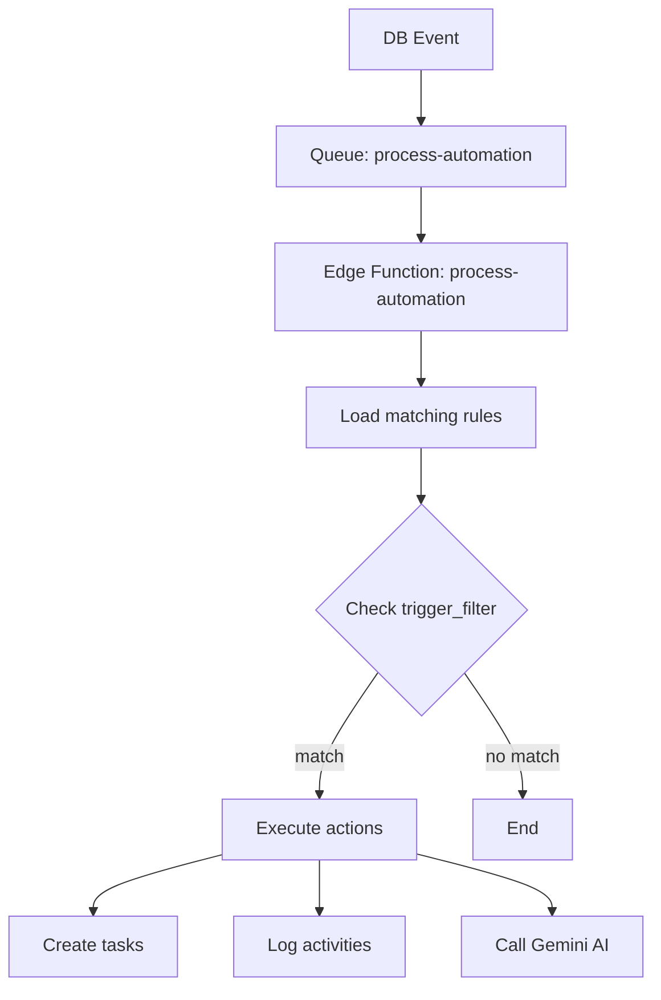
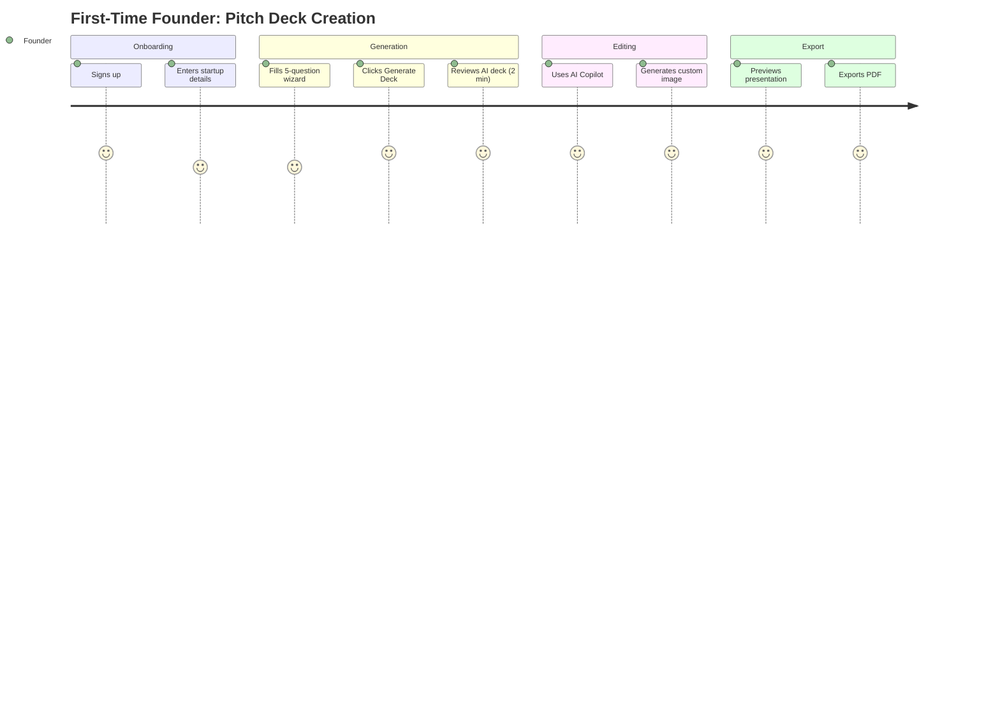
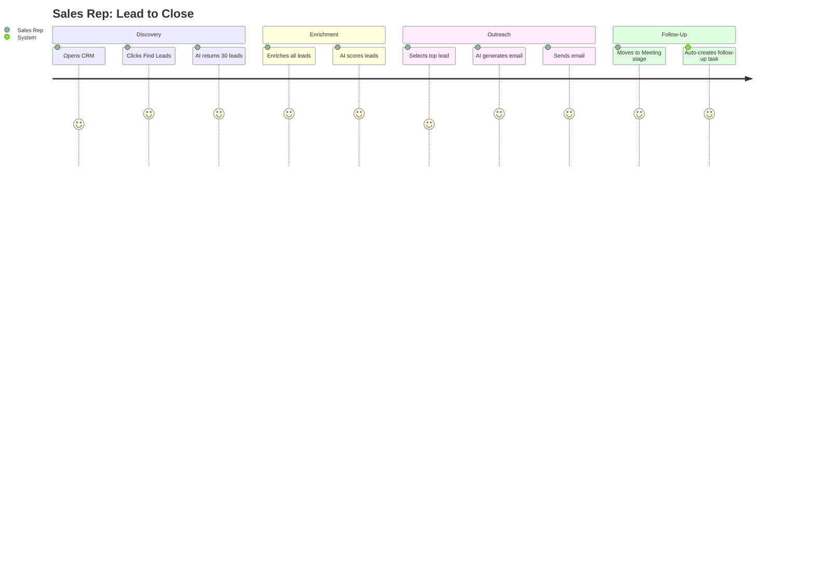
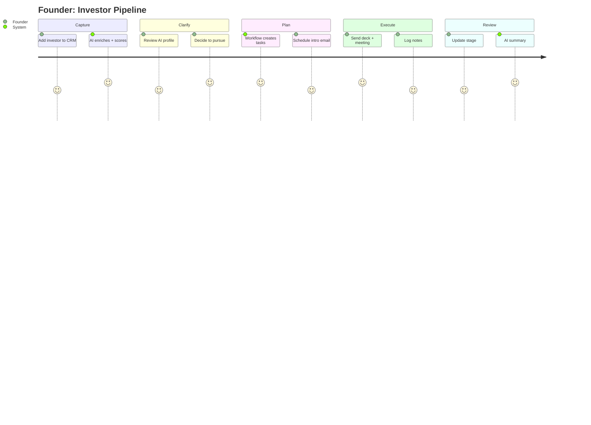
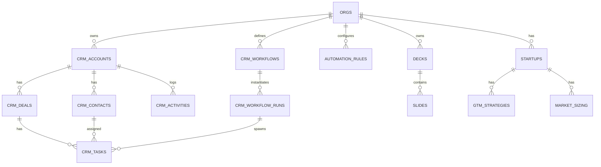

# Product Requirements Document (PRD)
# Sun AI - AI-Powered Startup Operating System

**Version:** 2.0  
**Last Updated:** 2025-12-06  
**Status:** Production Ready  
**Product Type:** AI-Powered SaaS Platform for Startups

---

## 📋 Table of Contents

1. [Executive Summary](#1-executive-summary)
2. [Quick Reference](#2-quick-reference)
3. [Problem Statement](#3-problem-statement)
4. [Target Users](#4-target-users)
5. [Core Features](#5-core-features)
   - 5.1 [CRM & Contacts](#51-crm--contacts)
   - 5.2 [Sales Pipeline](#52-sales-pipeline)
   - 5.3 [Task Manager & Workflows](#53-task-manager--workflows)
   - 5.4 [AI Pitch Deck Generator](#54-ai-pitch-deck-generator)
   - 5.5 [Startup Document Suite](#55-startup-document-suite)
   - 5.6 [GTM Strategy Builder](#56-gtm-strategy-builder)
   - 5.7 [Founder Dashboard](#57-founder-dashboard)
6. [AI Features & Modules](#6-ai-features--modules)
7. [Workflows & Automation](#7-workflows--automation)
8. [User Journeys](#8-user-journeys)
9. [Data Model](#9-data-model)
10. [Website & Dashboard Pages](#10-website--dashboard-pages)
11. [Success Criteria](#11-success-criteria)
12. [Risks & Constraints](#12-risks--constraints)
13. [Implementation Notes](#13-implementation-notes)
14. [Roadmap](#14-roadmap)

---

## 1. Executive Summary

**Sun AI** is an AI-powered startup operating system that combines:

| Module | Purpose |
|--------|---------|
| **CRM** | Manage contacts, companies, investors, customers |
| **Sales Pipeline** | Track deals from lead → close |
| **Task Manager** | Projects, tasks, workflows with AI suggestions |
| **Document Suite** | Auto-generate pitch decks + 10 essential startup docs |
| **GTM Builder** | Go-to-market strategy with AI reasoning |
| **AI Assistant** | Gemini 3 Pro automation, insights, enrichment |

**Core Value:** Transform raw startup data into investor-ready materials and operational workflows using advanced AI.

**Target:** Early-stage founders (Pre-seed to Series A) who need to move fast.

---

## 2. Quick Reference

### Feature Status Matrix

| Feature | Status | Priority |
|---------|--------|----------|
| Auth & Security | ✅ Done | P0 |
| Pitch Deck Generator | ✅ Done | P0 |
| Pitch Deck Editor | ✅ Done | P0 |
| Edge Functions (33) | ✅ Done | P0 |
| CRM - Contacts | 🟡 60% | P1 |
| CRM - Deals Pipeline | 🟡 50% | P1 |
| Task Manager | 🔴 20% | P1 |
| Workflows Engine | 🔴 10% | P1 |
| Automation Rules | 🔴 0% | P2 |
| Document Suite | 🔴 0% | P2 |
| GTM Builder | 🟡 40% | P1 |

### Tech Stack

| Layer | Technology |
|-------|------------|
| Frontend | React 19, TypeScript, Tailwind CSS, Zustand |
| Backend | Supabase (PostgreSQL + Edge Functions) |
| AI | Gemini 3 Pro (reasoning), Gemini 2.5 Flash (fast), Nano Banana (images) |
| Auth | Supabase Auth with RLS |
| Hosting | Vercel / Google Cloud Run |

### Key Metrics (6-Month Target)

| Metric | Target |
|--------|--------|
| Active Users | 5,000 MAU |
| Decks Generated | 25,000 |
| MRR | $50,000 |
| Conversion (Free→Paid) | 15% |
| Churn | <5% |

---

## 3. Problem Statement

### Pain Points

| Problem | Current State | Sun AI Solution |
|---------|---------------|-----------------|
| Pitch deck creation | 40+ hours, $3K-$10K | 2 minutes, $0 |
| Investor documents | Manual, inconsistent | Auto-generated, always current |
| CRM systems | Generic, no AI | AI enrichment, scoring, suggestions |
| Task management | Scattered tools | Unified with AI workflows |
| Market research | Hours of research | AI-powered with citations |

### Quantified Impact

- **Time saved:** 40 hours → 2 minutes (pitch deck)
- **Cost saved:** $5,000-$15,000 → $0 (investor materials)
- **Lead enrichment:** 30 min/lead → 30 seconds/lead

---

## 4. Target Users

### Primary Personas

| Persona | Stage | Pain Point | Goal |
|---------|-------|------------|------|
| **Solo Founder** | Pre-seed | No time/budget for design | Create pitch deck for $500K-$1M raise |
| **Startup Team** | Seed (2-5 people) | Manual investor updates | Automate updates, manage CRM |
| **Growth Founder** | Series A | Need data rooms, market sizing | Professionalize fundraising |
| **Sales Lead** | Any stage | Manual prospecting | AI-powered lead gen and scoring |

---

## 5. Core Features

### 5.1 CRM & Contacts

**Purpose:** Manage all relationships (investors, customers, partners, team)

**Features:**
- Add contacts manually, import CSV, or sync Google Contacts
- Store: name, role, company, notes, tags, relationship score
- Log activity: calls, emails, meetings, tasks
- Auto-enrich using Gemini + LinkedIn URL
- Health score (0-100) based on engagement

**Data Fields:**

| Field | Type | Description |
|-------|------|-------------|
| name | TEXT | Contact name |
| email | TEXT | Email address |
| company | TEXT | Company name |
| role | TEXT | Job title |
| linkedin | TEXT | LinkedIn URL |
| tags | ARRAY | Custom tags |
| health_score | INT | 0-100 engagement score |
| last_contact | DATE | Last interaction date |

**AI Features:**
- Auto-enrich from LinkedIn URL
- Suggest next best action
- Relationship health scoring
- Email draft generation

---

### 5.2 Sales Pipeline

**Purpose:** Track deals from lead to close

**Pipeline Stages:**

```
Lead → Qualified → Meeting → Proposal → Negotiation → Closed Won/Lost
```

**Features:**
- Kanban board view
- Deal value + probability + expected close date
- AI scoring ("Which leads are most likely to convert?")
- Activity timeline per deal
- Win/loss analysis

**Pipeline Types:**
- **Sales:** Customer acquisition
- **Fundraising:** Investor pipeline
- **Hiring:** Candidate tracking
- **Projects:** Project stages

**AI Features:**
- Lead scoring (Fit + Intent + Risk)
- Deal forecasting
- Next step suggestions
- Competitor battlecards

---

### 5.3 Task Manager & Workflows

**Purpose:** Unified task system with AI automation

**Task Statuses:**

```
Backlog → Todo → In Progress → Blocked → Done → Canceled
```

**Task Types:**
- `call` - Phone/video calls
- `email` - Communications
- `meeting` - Scheduled events
- `internal` - Internal prep/research
- `document` - Decks, docs, data room
- `other` - Miscellaneous

**5-Step Workflow Model:**

| Phase | Purpose | Example Task |
|-------|---------|--------------|
| **Capture** | Log/ingest | Add investor to CRM |
| **Clarify** | Qualify, prioritize | Score lead, research company |
| **Plan** | Assign, schedule | Create meeting brief |
| **Execute** | Do the work | Send deck, attend meeting |
| **Review** | Summarize, learn | Log outcome, update stage |

**Workflow Templates:**
- Fundraising Pipeline
- Sales Sequence
- Hiring Process
- Product Launch
- Customer Onboarding

**AI Features:**
- Auto-generate tasks from goals
- Suggest deadlines and priorities
- Predict blockers
- Create follow-up tasks automatically

---

### 5.4 AI Pitch Deck Generator

**Purpose:** Create investor-ready pitch decks in 2 minutes

**How It Works:**
1. Founder fills 5-question wizard
2. AI analyzes business context using Gemini 3 Pro
3. Generates 10-15 slides with narrative structure
4. Applies professional design template
5. Exports to PDF or editable format

**Slide Types:**

| Slide | Content |
|-------|---------|
| Vision | Company mission, big picture |
| Problem | Pain points, market gap |
| Solution | Your product/service |
| Product | Demo, screenshots, features |
| Market | TAM, SAM, SOM with sources |
| Business Model | Revenue streams, pricing |
| Traction | Metrics, milestones, growth |
| Competition | Positioning, differentiation |
| Team | Founders, key hires |
| Financials | Projections, unit economics |
| Ask | Funding amount, use of funds |

**AI Features:**
- Content rewriting ("Make this more investor-focused")
- Headline generation (5 variations per slide)
- Financial projections from assumptions
- Image generation (Nano Banana)
- Slide analysis (clarity, impact, tone scores)

---

### 5.5 Startup Document Suite

**Purpose:** Auto-generate essential startup documents

**Top 10 Documents:**

| # | Document | Description |
|---|----------|-------------|
| 1 | **Pitch Deck** | 10-15 slide investor presentation |
| 2 | **One-Pager** | 1-page investor tear sheet |
| 3 | **Executive Summary** | 2-page business overview |
| 4 | **Business Plan** | Lean Canvas / detailed plan |
| 5 | **Financial Model** | Revenue, costs, projections |
| 6 | **GTM Strategy** | Go-to-market plan |
| 7 | **Market Research** | TAM/SAM/SOM with citations |
| 8 | **Product Roadmap** | Features, timeline, priorities |
| 9 | **Legal Checklist** | Incorporation, IP, contracts |
| 10 | **Data Room Checklist** | Due diligence documents |

**AI Generation Flow:**
```
User Inputs → URL Context → RAG Search → Google Search → Gemini 3 Pro → Structured JSON → UI Editor → Export
```

---

### 5.6 GTM Strategy Builder

**Purpose:** Generate complete go-to-market strategy

**Output Structure:**

| Section | Content |
|---------|---------|
| Summary | Executive overview |
| Target Customers | ICP definition |
| Value Proposition | Core messaging |
| Positioning | vs. competitors |
| Channels | SEO, Paid, Partnerships, Community |
| Activation Plan | User onboarding strategy |
| Pricing | Strategy and tiers |
| Retention | Churn reduction tactics |
| Growth Loops | Viral/referral mechanics |
| 90-Day Plan | Week-by-week roadmap |
| Success Metrics | KPIs to track |
| Risks | Challenges and mitigations |

**AI Features:**
- Competitor insights via Google Search
- Persona generation from URL context
- Messaging optimization
- Channel recommendations based on industry

---

### 5.7 Founder Dashboard

**Purpose:** Central hub for all startup metrics and AI tools

**Widgets:**

| Widget | Data Shown |
|--------|------------|
| Financial Overview | MRR, burn rate, runway, ARR |
| Growth Metrics | Users, revenue, churn, LTV |
| CRM Pipeline | Deal stages, win rate, value |
| Tasks Today | Priority tasks, AI suggestions |
| AI Activity | Recent generations, cost tracking |
| Quick Actions | Generate deck, update investors, find leads |

---

## 6. AI Features & Modules

### AI Model Matrix

| Feature | Model | Tools | Output |
|---------|-------|-------|--------|
| Pitch Deck | Gemini 3 Pro | Google Search, URL Context, Structured Output | JSON → Slides |
| Content Rewriting | Gemini 2.5 Flash | Text Generation | Text |
| Market Sizing | Gemini 3 Pro | Google Search, Thinking | JSON with sources |
| Lead Enrichment | Gemini 2.5 Flash | Google Search | JSON |
| Lead Scoring | Gemini 3 Pro | Thinking | Scores + Reasoning |
| Cold Email | Gemini 2.5 Flash | Text Generation | Email draft |
| GTM Strategy | Gemini 3 Pro | Thinking, Google Search | JSON |
| Image Generation | Nano Banana | Image Generation | Base64 PNG |
| Task Generation | Gemini 2.5 Flash | Structured Output | Task array |

### Gemini 3 Pro Capabilities

| Capability | Use Case |
|------------|----------|
| **Thinking (High)** | Complex strategy, market sizing, GTM |
| **Structured Outputs** | All AI generations (type-safe JSON) |
| **Google Search** | Real-time market data, competitors |
| **URL Context** | Extract brand identity, company info |
| **Function Calling** | Save to database, create tasks |
| **RAG File Search** | Pull from uploaded PDFs, past decks |

---

## 7. Workflows & Automation

### Automation Rules

**Trigger → Condition → Action**

| Trigger | Condition | Action |
|---------|-----------|--------|
| `deal_stage_changed` | Stage = "Meeting" | Create "Prepare brief" task |
| `task_completed` | Type = "Meeting" | Create "Follow-up" task |
| `new_contact_created` | Has LinkedIn URL | Enrich contact |
| `time_based` (daily) | Overdue tasks exist | Send reminder email |

### Automation Architecture



### Example Automation: Fundraising Meeting Scheduled

```json
{
  "name": "Fundraising - Meeting Scheduled",
  "trigger_event": "deal_stage_changed",
  "trigger_filter": {
    "pipeline": "fundraising",
    "to_stage": "meeting"
  },
  "actions": [
    {
      "type": "create_task",
      "params": {
        "title": "Prepare investor meeting brief",
        "due_in_hours": 24,
        "priority": "high"
      }
    },
    {
      "type": "call_ai",
      "params": {
        "tool": "generate_meeting_brief",
        "target": "crm_activities"
      }
    }
  ]
}
```

---

## 8. User Journeys

### Journey 1: Founder Creates Pitch Deck



### Journey 2: Sales Pipeline



### Journey 3: Fundraising Pipeline



---

## 9. Data Model

### Entity Relationship Diagram



### Core Tables

| Table | Purpose |
|-------|---------|
| `users` | User accounts |
| `orgs` | Organizations/teams |
| `startups` | Startup profiles |
| `decks` | Pitch decks |
| `slides` | Deck slides |
| `crm_accounts` | Companies |
| `crm_contacts` | People |
| `crm_deals` | Sales/fundraising deals |
| `crm_tasks` | Tasks and todos |
| `crm_workflows` | Workflow templates |
| `crm_workflow_runs` | Active workflow instances |
| `crm_activities` | Activity log |
| `automation_rules` | Automation triggers |
| `gtm_strategies` | GTM plans |
| `market_sizing` | TAM/SAM/SOM data |

---

## 10. Website & Dashboard Pages

### Website Pages

| Page | Purpose | CTA |
|------|---------|-----|
| Landing | Convert visitors | "Start Free Trial" |
| Features | Explain capabilities | "See Demo" |
| Pricing | Show plans | "Get Started" |
| About | Build trust | "Contact Us" |
| Blog | SEO + thought leadership | Email signup |

### Dashboard Pages

| Page | Purpose | Key Components |
|------|---------|----------------|
| **Dashboard** | Overview hub | KPI cards, pipeline chart, tasks, activity |
| **CRM** | Contacts + companies | Table, filters, detail drawer |
| **Pipeline** | Deal tracking | Kanban board, deal cards |
| **Tasks** | Work management | Kanban, list, calendar views |
| **Pitch Decks** | Deck management | Grid of decks, create button |
| **Deck Editor** | Edit slides | Canvas, sidebar, AI panel |
| **Documents** | Generate docs | Document cards, generators |
| **GTM** | Strategy builder | Wizard, strategy dashboard |
| **Financials** | Metrics tracking | Charts, input forms |
| **Settings** | Configuration | Team, billing, integrations |

---

## 11. Success Criteria

### Business Metrics

| Metric | Month 3 | Month 6 |
|--------|---------|---------|
| Active Users | 1,000 | 5,000 |
| Decks Generated | 5,000 | 25,000 |
| MRR | $5,000 | $50,000 |
| Conversion Rate | 10% | 15% |
| Churn Rate | <10% | <5% |

### Technical Metrics

| Metric | Target |
|--------|--------|
| Page Load Time | <2s |
| API Response Time | <500ms (P95) |
| AI Generation Time | <3 min (deck) |
| Uptime | 99.9% |
| Error Rate | <0.1% |

### User Success

| Metric | Target |
|--------|--------|
| Time to First Deck | <5 min |
| User Satisfaction | >4.5/5 |
| Feature Adoption | >60% |
| Export Rate | >80% |

---

## 12. Risks & Constraints

### Technical Risks

| Risk | Mitigation |
|------|------------|
| AI API outages | Fallback models, caching, retry logic |
| Cost overruns | Token optimization, aggressive caching |
| Data loss | Auto-save every 30s, conflict resolution |
| Performance | Pagination, lazy loading, virtualization |

### Business Risks

| Risk | Mitigation |
|------|------------|
| Low conversion | Paywalls, upsell during generation |
| Competition | Vertical focus, move fast |
| User trust | Show citations, allow editing |

### Constraints

- **Budget:** $5,000/month infrastructure
- **Team:** 2-3 developers
- **Timeline:** MVP in 3 months
- **Tech:** Must use Supabase, React, TypeScript

---

## 13. Implementation Notes

### Frontend Structure

```
src/
├── screens/          # Page components
├── components/       # Reusable UI
│   ├── ui/          # Atomic (Button, Input, Card)
│   ├── crm/         # CRM-specific
│   ├── pitch/       # Pitch deck components
│   └── common/      # Shared (Spinner, ErrorBoundary)
├── contexts/        # React Context
├── services/        # API calls
├── hooks/           # Custom hooks
├── stores/          # Zustand stores
└── lib/             # Utilities
```

### Edge Functions

```
supabase/functions/
├── generate-deck/           # Pitch deck generation
├── slide-ai/                # Slide modifications
├── image-ai/                # Image generation
├── generate-leads/          # Lead search
├── enrich-lead/             # Lead enrichment
├── score-lead/              # Lead scoring
├── generate-gtm-strategy/   # GTM generation
├── generate-market-sizing/  # Market sizing
├── crm-generate-tasks/      # Task generation
├── crm-automation-dispatch/ # Automation engine
└── crm-communication-draft/ # Email drafts
```

### Security

- **RLS:** All tables have org_id policies
- **Auth:** Supabase Auth with JWT
- **Secrets:** API keys in Supabase Secrets
- **CORS:** Restricted origins

---

## 14. Roadmap

### Phase 1: Foundation (Month 1-2)
- [x] Auth & security
- [x] Pitch deck generator
- [x] Deck editor
- [x] Edge functions (33 deployed)
- [ ] CRM contacts CRUD
- [ ] CRM deals pipeline

### Phase 2: CRM & Tasks (Month 3-4)
- [ ] Task manager
- [ ] Workflows engine
- [ ] Automation rules
- [ ] AI task generation
- [ ] Activity timeline

### Phase 3: Documents & GTM (Month 5-6)
- [ ] Document suite (10 docs)
- [ ] GTM strategy builder
- [ ] Market sizing tool
- [ ] Financial inputs
- [ ] Data room

### Phase 4: Scale (Month 7-12)
- [ ] Mobile app
- [ ] Collaboration features
- [ ] Integrations (Stripe, HubSpot)
- [ ] White-label solution
- [ ] AI Pitch Coach

---

## Appendix: JSON Schemas

### Task Schema

```json
{
  "title": "string",
  "description": "string",
  "priority": "low | medium | high | urgent",
  "task_type": "call | email | meeting | internal | document | other",
  "status": "backlog | todo | in_progress | blocked | done | canceled",
  "due_at": "ISO8601",
  "linked_entity": {
    "type": "deal | contact | account | startup",
    "id": "uuid"
  }
}
```

### Workflow Definition Schema

```json
{
  "name": "Fundraising - Warm Intro",
  "entity_type": "deal",
  "use_case": "fundraising",
  "steps": [
    { "phase": "capture", "label": "Log intro", "default_task_type": "email" },
    { "phase": "clarify", "label": "Qualify investor", "default_task_type": "internal" },
    { "phase": "plan", "label": "Define ask & materials", "default_task_type": "internal" },
    { "phase": "execute", "label": "Send deck & schedule call", "default_task_type": "email" },
    { "phase": "review", "label": "Log outcome & next step", "default_task_type": "meeting" }
  ]
}
```

### Automation Rule Schema

```json
{
  "name": "string",
  "trigger_event": "deal_stage_changed | task_completed | new_contact_created | time_based",
  "trigger_filter": {
    "pipeline": "string",
    "from_stage": "string",
    "to_stage": "string"
  },
  "actions": [
    {
      "type": "create_task | send_email_draft | update_field | call_ai",
      "params": {}
    }
  ]
}
```

---

**Document Version:** 2.0  
**Last Updated:** 2025-12-06  
**Status:** Production Ready
