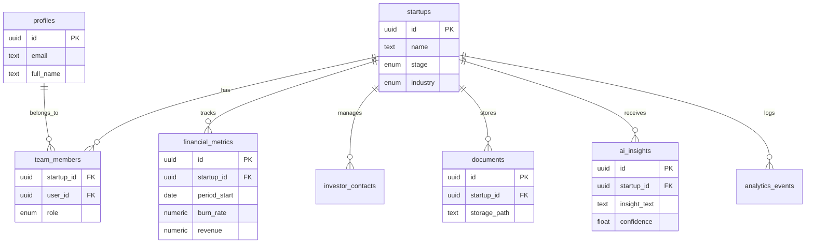

# 🏛️ Supabase Architecture Blueprint: Startup Command Center

**Document Status:** Production Ready (v2.0)
**Target System:** Supabase (PostgreSQL 15+) + Edge Functions (Deno)
**Scope:** Full Backend Architecture for Financials, Growth, Fundraising, and AI.

---

## 1. System Architecture

### 1.1 High-Level Architecture
This diagram illustrates the secure flow of data between the Client, Supabase services, and the Gemini AI Engine.

```mermaid
graph TD
    subgraph "Client Layer"
        Client[React App / Vite]
    end

    subgraph "Supabase Backend"
        Auth[GoTrue Auth]
        DB[(PostgreSQL 15+)]
        Storage[File Storage]
        Edge[Edge Functions (Deno)]
        Cron[pg_cron]
    end

    subgraph "External AI"
        Gemini[Google Gemini 3 Pro]
        Search[Google Search Grounding]
    end

    Client -- "JWT Auth" --> Auth
    Client -- "REST / Realtime" --> DB
    Client -- "File Uploads" --> Storage
    Client -- "Invoke AI Actions" --> Edge

    Edge -- "Service Role Key" --> DB
    Edge -- "Secure API Key" --> Gemini
    Gemini -- "Grounding" --> Search

    DB -- "Triggers/Webhooks" --> Edge
    Cron -- "Scheduled Analysis" --> Edge
```

### 1.2 Entity Relationship Diagram (ERD)



---

## 2. Database Schema Plan

### 2.1 Enumerated Types (Enums)
Strict typing for consistent data integrity.

```sql
CREATE TYPE public.startup_stage AS ENUM ('Idea', 'Pre-Seed', 'Seed', 'Series A', 'Series B', 'Growth');
CREATE TYPE public.user_role AS ENUM ('owner', 'admin', 'editor', 'viewer');
CREATE TYPE public.investor_type AS ENUM ('VC', 'Angel', 'PE', 'Accelerator', 'CVC');
CREATE TYPE public.doc_category AS ENUM ('Financial', 'Legal', 'Pitch Deck', 'Product', 'Other');
CREATE TYPE public.metric_category AS ENUM ('Revenue', 'Expense', 'Growth', 'Engagement');
```

### 2.2 Core Identity & Access

*   **`profiles`**:
    *   `id` (uuid, pk, ref `auth.users` ON DELETE CASCADE)
    *   `full_name` (text)
    *   `avatar_url` (text)
    *   `updated_at` (timestamptz)
*   **`startups`**:
    *   `id` (uuid, pk, default `gen_random_uuid()`)
    *   `name` (text, not null)
    *   `industry` (text)
    *   `stage` (public.startup_stage, default 'Pre-Seed')
    *   `website_url` (text)
    *   `is_deleted` (boolean, default false) -- Soft delete support
    *   `created_at` (timestamptz, default `now()`)
    *   `updated_at` (timestamptz)
*   **`team_members`**:
    *   `startup_id` (uuid, ref `startups` ON DELETE CASCADE)
    *   `user_id` (uuid, ref `profiles` ON DELETE CASCADE)
    *   `role` (public.user_role, not null)
    *   `created_at` (timestamptz)
    *   **Constraint:** Primary Key (`startup_id`, `user_id`)

### 2.3 Financial Engine

*   **`financial_metrics`**:
    *   `id` (uuid, pk)
    *   `startup_id` (uuid, ref `startups` ON DELETE CASCADE)
    *   `period_start` (date, not null)
    *   `period_end` (date, not null)
    *   `revenue` (numeric, default 0)
    *   `burn_rate` (numeric, default 0)
    *   `cash_balance` (numeric, default 0)
    *   `expenses` (numeric, default 0)
    *   `updated_at` (timestamptz)
*   **`runway_scenarios`**:
    *   `id` (uuid, pk)
    *   `startup_id` (uuid, ref `startups` ON DELETE CASCADE)
    *   `name` (text)
    *   `assumptions` (jsonb) -- e.g., { "hiring_freeze": true }
    *   `forecast_data` (jsonb) -- The AI-generated projection array
    *   `created_at` (timestamptz)

### 2.4 Growth & Analytics (New)

*   **`analytics_events`**: High-volume ingestion table for product usage.
    *   `id` (uuid, pk)
    *   `startup_id` (uuid, ref `startups` ON DELETE CASCADE)
    *   `event_name` (text) -- e.g., "deck_created", "investor_viewed"
    *   `properties` (jsonb)
    *   `timestamp` (timestamptz)
*   **`growth_metrics`**: Aggregated KPIs.
    *   `id` (uuid, pk)
    *   `startup_id` (uuid, ref `startups` ON DELETE CASCADE)
    *   `date` (date)
    *   `active_users` (int)
    *   `churn_rate` (numeric)
    *   `cac` (numeric)
    *   `ltv` (numeric)

### 2.5 Fundraising CRM

*   **`investor_contacts`**:
    *   `id` (uuid, pk)
    *   `startup_id` (uuid, ref `startups` ON DELETE CASCADE)
    *   `firm_name` (text)
    *   `contact_name` (text)
    *   `type` (public.investor_type)
    *   `status` (text) -- Consider enum here too
    *   `check_size_min` (int)
    *   `check_size_max` (int)
    *   `updated_at` (timestamptz)
    *   `is_deleted` (boolean, default false)

### 2.6 Documents & Data Room

*   **`documents`**:
    *   `id` (uuid, pk)
    *   `startup_id` (uuid, ref `startups` ON DELETE CASCADE)
    *   `title` (text)
    *   `storage_path` (text, not null) -- **Secure Private Bucket Path**
    *   `category` (public.doc_category)
    *   `size_bytes` (bigint)
    *   `updated_at` (timestamptz)
*   **`dataroom_status`**:
    *   `startup_id` (uuid, pk, ref `startups` ON DELETE CASCADE)
    *   `readiness_score` (int)
    *   `missing_items` (jsonb)
    *   `last_audited_at` (timestamptz)

### 2.7 AI Intelligence & System Protection

*   **`ai_insights`**:
    *   `id` (uuid, pk)
    *   `startup_id` (uuid, ref `startups` ON DELETE CASCADE)
    *   `category` (text)
    *   `insight_text` (text)
    *   `confidence_score` (float)
    *   `created_at` (timestamptz)
*   **`ai_market_data`**:
    *   `startup_id` (uuid, pk, ref `startups` ON DELETE CASCADE) -- 1:1 relationship
    *   `tam` (numeric)
    *   `sam` (numeric)
    *   `som` (numeric)
    *   `sources` (jsonb)
    *   `updated_at` (timestamptz)
*   **`rate_limits`**:
    *   `user_id` (uuid, pk, ref `profiles` ON DELETE CASCADE)
    *   `daily_requests` (int, default 0)
    *   `last_reset` (timestamptz)

---

## 3. Security: Row-Level Security (RLS)

### 3.1 Role Resolution Helper Function
**Critical:** This function allows policies to check a user's role within a specific startup context.

```sql
CREATE OR REPLACE FUNCTION public.get_user_role(target_startup_id uuid)
RETURNS public.user_role AS $$
  SELECT role FROM public.team_members
  WHERE startup_id = target_startup_id
  AND user_id = auth.uid()
  LIMIT 1;
$$ LANGUAGE sql STABLE SECURITY DEFINER;
```

### 3.2 RLS Policy Strategy

**Table: `startups`**
*   **Select:** `id IN (SELECT startup_id FROM team_members WHERE user_id = auth.uid())`
*   **Insert:** Authenticated users only. Trigger automatically adds creator as 'owner'.

**Table: `financial_metrics` (and sensitive data)**
*   **Select:** `get_user_role(startup_id) IS NOT NULL`
*   **Insert/Update:** `get_user_role(startup_id) IN ('owner', 'admin', 'editor')`
*   **Delete:** `get_user_role(startup_id) IN ('owner', 'admin')`

**Table: `ai_insights`**
*   **Select:** `get_user_role(startup_id) IS NOT NULL`
*   **Insert/Update/Delete:** **Service Role Only.** Users cannot fake AI insights.

**Storage Buckets**
*   **Private Bucket:** `secure-docs`
*   **Policy:** `(bucket_id = 'secure-docs' AND (storage.foldername(name))[1] = auth.uid()::text)` ensures strict isolation.

---

## 4. Triggers & Automation

### 4.1 Timestamp Management
Enable the `moddatetime` extension.
```sql
CREATE EXTENSION IF NOT EXISTS moddatetime;

CREATE TRIGGER handle_updated_at BEFORE UPDATE ON public.startups
FOR EACH ROW EXECUTE PROCEDURE moddatetime(updated_at);

-- Apply to: financial_metrics, documents, investor_contacts, etc.
```

### 4.2 Automatic Team Assignment
When a startup is created, assign the creator as owner.
```sql
CREATE OR REPLACE FUNCTION public.assign_startup_owner()
RETURNS TRIGGER AS $$
BEGIN
  INSERT INTO public.team_members (startup_id, user_id, role)
  VALUES (NEW.id, auth.uid(), 'owner');
  RETURN NEW;
END;
$$ LANGUAGE plpgsql SECURITY DEFINER;

CREATE TRIGGER on_startup_created AFTER INSERT ON public.startups
FOR EACH ROW EXECUTE PROCEDURE public.assign_startup_owner();
```

---

## 5. Performance: Indexing Strategy

1.  **Foreign Keys (Critical for RLS):**
    *   `CREATE INDEX idx_team_members_user ON team_members(user_id);`
    *   `CREATE INDEX idx_team_members_startup ON team_members(startup_id);`
    *   `CREATE INDEX idx_financials_startup ON financial_metrics(startup_id);`

2.  **Dashboard Performance:**
    *   `CREATE INDEX idx_financials_period ON financial_metrics(startup_id, period_start DESC);`
    *   `CREATE INDEX idx_analytics_event_time ON analytics_events(startup_id, timestamp DESC);`

3.  **Materialized Views (Advanced):**
    *   `mat_view_monthly_summary`: Aggregates financials and growth metrics for fast dashboard loading. Refreshed via `pg_cron` nightly.

---

## 6. Edge Functions Architecture

All AI logic resides here. **No API keys in the frontend.**

*   **`ai-generate-deck`**:
    *   *Input:* Text context or URL.
    *   *Logic:* Gemini 3 (Thinking) -> JSON Structure.
    *   *Output:* Writes to `pitch_decks` and `slides`.
*   **`ai-market-research`**:
    *   *Input:* Industry/Region.
    *   *Logic:* Gemini Search Tool -> TAM/SAM/SOM.
    *   *Output:* Writes to `ai_market_data`.
*   **`ai-audit-dataroom`**:
    *   *Input:* `documents` list.
    *   *Logic:* Contextual comparison against VC checklist.
    *   *Output:* Writes to `dataroom_status`.

---

## 7. Setup Checklist

- [ ] Enable `pgcrypto` and `moddatetime` extensions.
- [ ] Run SQL migration for Enums and Tables.
- [ ] Create `get_user_role` function.
- [ ] Enable RLS and apply policies to ALL tables.
- [ ] Create Storage Buckets (`avatars` [public], `secure-docs` [private]).
- [ ] Set `GEMINI_API_KEY` in Supabase Secrets.
- [ ] Deploy Edge Functions.
